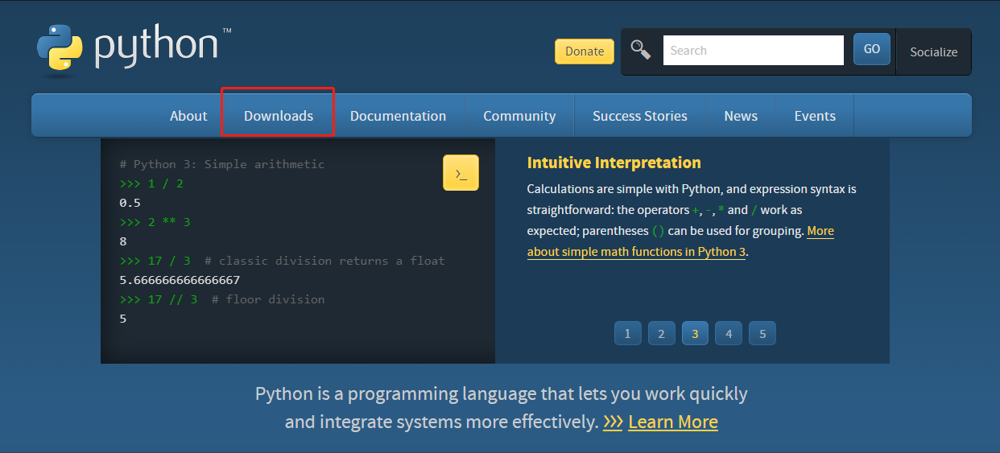
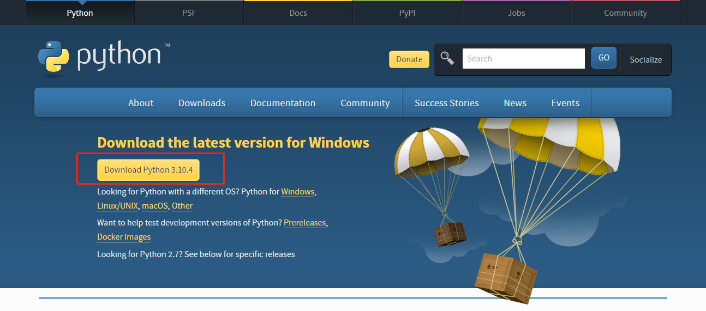
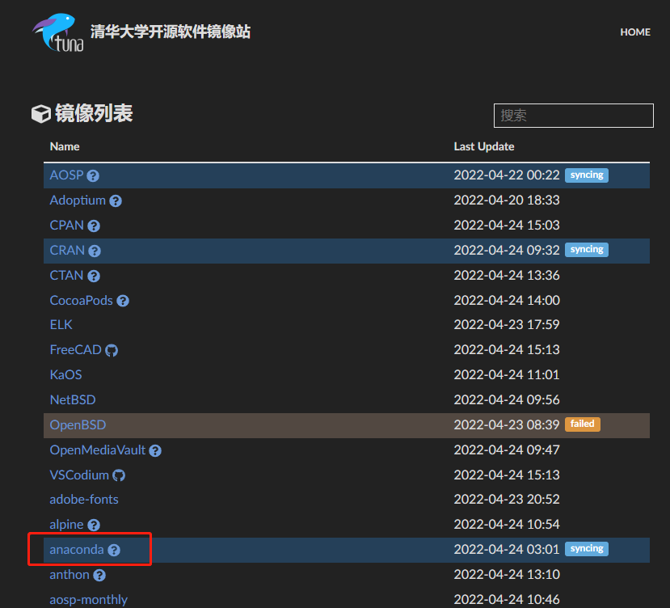
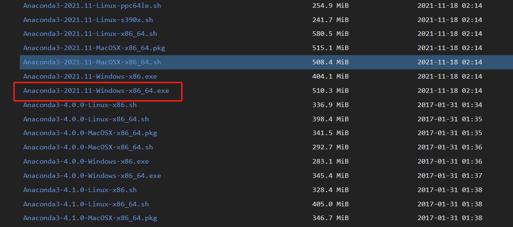
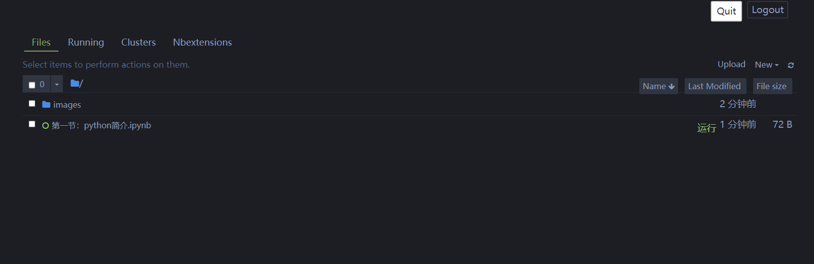
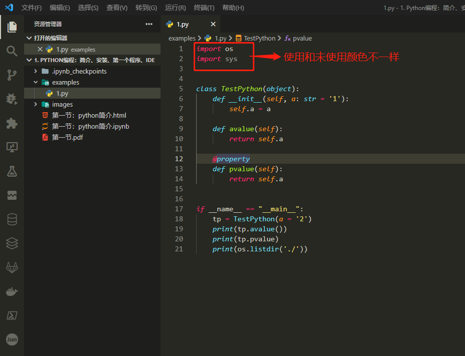

**摘要：简介、安装、IDE推荐**

<!-- more -->

::: warning 警告
**我年纪轻轻就学会了`Python`编程**

**来自：`HanamakiX`**
:::

## **本章目录**

 - **简介**
 - **安装**
 - **第一个`Python`程序**
 - **`Python`解释器**
 - **`IDE`推荐：`IDLE`、`jupyter`、`pycharm`、`VSCode`**


## **一、简介**

1989年圣诞节期间, “龟叔”`Guido van Rossum`为了打发无聊的圣诞节而编写的一个编程语言即为：`Python`。

不同于`C语言`、`java语言`等，`Python`是一门解释性语言、动态语言、脚本语言、胶水语言，提供友好的交互式界面，可直接运行不需要人为的编译。

目前全世界大概几百种编程语言，使用比较多的只有小几十种，`Python`就是其中使用最多的语言之一。

业内有个编程语言排行榜：`TIOBE`，可以充分说明`Python`的使用率，让我们来看看它的几张图片

### **1. 截止2022年4月-TIOBE-Python曲线图**


### **2. 截止2022年4月-TIOBE-Python曲线图**


### **3. 截止2022年4月-TIOBE-Python曲线图**


## **二、`Python`可以干什么**


**`Python`可以干几乎你知道的所有事情，有句话这么说的：**

> **只有你想不到，没有`Python`做不到。**

**我们来列举一些：**

  - **运维**
  - **自动化测试**
  - **科学计算：类似于`matlab`**
  - **数据分析**
  - **机器学习、深度学习、强化学习**
  - **人工智能：视觉，语音，自然语言处理**
  - **推荐系统**
  - **问答系统**
  - **知识图谱**
  - **`web`开发**
  - **`Restful API`**
  - **图形界面**
  - **网络爬虫**
  - **开发游戏**
  - **处理日常任务：文本、图片、语音、`excel`、`word`、`ppt`**
  - **等等数不胜数**
  
  
许多大型网站就是用`Python`开发的，例如国外的`YouTube`、`Instagram`，国内的`豆瓣`等。很多大公司，包括`Google`、`Yahoo`等都在使用`Python`。

`Python`是一门优雅、简单的语言，总体简单易学，并且像大家提供了很多开包即用的库以及很多第三方库，这会是你的代码非常简单。

如果你会`Python`，你可以尽情的嘲笑别人动辄就几千几万行代码，而`Python`可能只需要几十行甚至几行就解决了。


## **三、安装`Python`**


> **本教程全面基于`Python3.10`，此版本目前为最新版本相较于其他版本优势很多，如字典的运算，`zip`的运算，模式匹配等等**

### **1. 安装方式**

1. **`Python`官网**

2. **`Anaconda`（清华镜像源下载）**

3. **虚拟环境**

### **第一种：`Python`官网**

> **不推荐，下载速度慢到令人抓狂**

**1. 浏览器或者百度进入：`https://www.python.org/` ==> 选择 `downloads` ==> `all releases`**



**2. 选择合适版本：推荐`Python3.10` ==> `点击下载`**



**3. 下载，双击，一路默认安装到底**

**4. 配置系统路径**

- **桌面右击 此电脑**
- **选择属性**
- **选择高级系统设置**
- **选择环境变量**
- **选择系统变量中的 `Path`**
- **新增上述安装路径目录并保存**
- **打开`cmd`输入：`python`，若出现交互界面则安装配置成功**

### **第二种：`Anaconda`**

**主要针对于`Python`的科学计算，机器学习等高级封装工具，主要你安装了`Anaconda`，你就等同于安装了：`Python`以及很多第三方包，非常便利。**

> **`Anaconda`官网下载（不推荐，下载速度同样令人抓狂）**
> **清华镜像源（推荐，国内服务器下载速度快到令人抓狂）**


**1. 浏览器或者百度进入：https://mirrors.tuna.tsinghua.edu.cn/**

   - ==> **选择 `anaconda`** 
   - ==> **选择 `archive`**
   - ==> **下拉至下方最新版本点击下载**



**2. 双击安装，一路默认到底**



**3. 配置系统路径**

- **桌面右击 此电脑**
- **选择属性**
- **选择高级系统设置**
- **选择环境变量**
- **选择系统变量中的 `Path`**
- **新增上述安装路径目录并保存：这里需要注意的需要配置三个路径，例如我的是：（强调一下，一个也不能少）**
   - **`D:\anaconda`**
   - **`D:\anaconda\Scripts`**
   - **`D:\anaconda\Library\bin`**

- **打开`cmd`输入：`python` 或者 `pip` 或者 `conda`，若出现交互界面则安装配置成功**

### **第三种：虚拟环境**

`Anaconda`另一个优势就是提供了一个非常强大的管理工具：`conda`，可以通过这个工具直接安装包或者`Python`虚拟环境

`conda`安装`Python`虚拟环境命令：`conda create -n py310 python=3.10`

我们还可以通过`docker`安装一个`Python`环境

拉取：`docker pull python`

安装运行：`docker run -i -t python:latest /bin/bash`


## **四、第一个`Python`程序**


按照上述过程安装配置完`Python`之后，我们可以开始一个`Python`程序。

打开`cmd`，输入`python`，在交互式界面就可以编写`Python`程序，并回车直接运行得到结果


**`Python`代码注释：通过#+注释内容实现**

**例如：**

```python
# 这是一个python程序
print("hello world")
```

**`Python`代码通过缩进识别代码块，区别于一些语言使用大括号**

**例如：**

```python
for i in range(5)
    print("hello world")
```


## **五、`Python`解释器**


当我们安装好`Python`后我们就获得了一个`Python`的解释器：`CPython`，这个解释器是用`C语言`开发的，所以叫`CPython`。在命令行下运行`python`就是启动`CPython`解释器。

`CPython`是使用最广的`Python`解释器。

其他的`Python`解释器：

- **`IPython`：`IPython`是基于`CPython`之上的一个交互式解释器，也就是说，`IPython`只是在交互方式上有所增强，但是执行`Python`代码的功能和`CPython`是完全一样的。**

- **`PyPy`：基于`JIT`技术的解释器**

- **`Jython`：`Jython`是运行在`Java`平台上的`Python`解释器，可以直接把`Python`代码编译成`Java`字节码执行。**

- **`IronPython`：运行在微软`.Net`平台上的`Python`解释器，可以直接把`Python`代码编译成`.Net`的字节码。**


## **六、`IDE`推荐**


> **工欲善其事，必先利其器。**

### **1. `IDE`推荐**

**`Python IDE` 主要有以下几种：**

#### **1.1 `IDLE`**

**安装`Python`后自带的`IDE`，简单便利**


#### **1.2 `jupyter notebook`**

`Jupyter Notebook`（此前被称为 `IPython notebook`）是一个交互式笔记本，支持运行 `40` 多种编程语言。

`Jupyter Notebook` 的本质是一个 `Web` 应用程序，便于创建和共享程序文档，支持实时代码，数学方程，可视化和 `markdown`。 用途包括：数据清理和转换，数值模拟，统计建模，机器学习等等。

> **需要安装（`Anaconda`自带此工具），通过`pip`安装即可，打开`cmd`输入：`pip install jupyter -i https://pypi.tuna.tsinghua.edu.cn/simple`**

**使用非常简单，安装完毕后，进入某一个目录，此目录下打开`cmd`输入：`jupyter notebook` 即可**




**优势：变量复用，直接运行，可视化等**

**缺点：输入没有提示**

#### **1.3 `jupyter lab`**

**类似上述`jupyter notebook`，安装完`jupyter`后也就等于安装了`jupyter lab`**

**使用同样非常简单，安装完毕后，进入某一个目录，此目录下打开cmd输入：`jupyter lab` 即可**


**优势：变量复用，直接运行，可视化等**

**缺点：输入没有提示**

#### **1.4 `vscode`（强烈推荐）**

**百度搜索：`vscode`，进入官网，下载安装即可**

**使用还是非常简单进入某一个目录右击`此处打开code`即可，或者拖拽一个文件夹到`vscode`桌面图片即可**



**优势：编程提示，调试，美观，强大几乎可以打开你知道的所有文件类型**

**缺点：没有缺点**

#### **1.5 `pycharm`**

**省略说明**

**最终选择：<font color="#dd0000">jupyter lab + vscode 组合拳</font>**


### 通过 `shift+enter` 运行单元代码

```python
print("hello world")


output:

    hello world
```
    

### 通过列表打印

```python
[print("hello world") for x in range(3)]


output:

    hello world
    hello world
    hello world
```


### 绘制爱心

```python
print('\n'.join([''.join([('Love'[(x-y) % len('Love')] if ((x*0.05)**2+(y*0.1)**2-1)**3-(x*0.05)**2*(y*0.1)**3 <= 0 else ' ') for x in range(-30, 30)]) for y in range(30, -30, -1)]))


output:

                veLoveLov           veLoveLov
            eLoveLoveLoveLove   eLoveLoveLoveLove
          veLoveLoveLoveLoveLoveLoveLoveLoveLoveLov
         veLoveLoveLoveLoveLoveLoveLoveLoveLoveLoveL
        veLoveLoveLoveLoveLoveLoveLoveLoveLoveLoveLov
        eLoveLoveLoveLoveLoveLoveLoveLoveLoveLoveLove
        LoveLoveLoveLoveLoveLoveLoveLoveLoveLoveLoveL
        oveLoveLoveLoveLoveLoveLoveLoveLoveLoveLoveLo
        veLoveLoveLoveLoveLoveLoveLoveLoveLoveLoveLov
        eLoveLoveLoveLoveLoveLoveLoveLoveLoveLoveLove
         oveLoveLoveLoveLoveLoveLoveLoveLoveLoveLove
          eLoveLoveLoveLoveLoveLoveLoveLoveLoveLove
          LoveLoveLoveLoveLoveLoveLoveLoveLoveLoveL
            eLoveLoveLoveLoveLoveLoveLoveLoveLove
             oveLoveLoveLoveLoveLoveLoveLoveLove
              eLoveLoveLoveLoveLoveLoveLoveLove
                veLoveLoveLoveLoveLoveLoveLov
                  oveLoveLoveLoveLoveLoveLo
                    LoveLoveLoveLoveLoveL
                       LoveLoveLoveLov
                          LoveLoveL
                             Lov
                              v
```


### `jupyterlab`加载本地文件 

```python
%load ./examples/1.py


output:

import os
import sys


class TestPython(object):
    def __init__(self, a: str = '1'):
        self.a = a

    def avalue(self):
        return self.a

    @property
    def pvalue(self):
        return self.a


if __name__ == "__main__":
    tp = TestPython(a = '2')
    print(tp.avalue())
    print(tp.pvalue)
    print(os.listdir('./'))
```


### `jupyterlab`魔法命令集合

```python
%lsmagic


output:

    Available line magics:
    %alias  %alias_magic  %autoawait  %autocall  %automagic  %autosave  %bookmark  %cd  %clear  %cls  
    %colors  %conda  %config  %connect_info  %copy  %ddir  %debug  %dhist  %dirs  %doctest_mode  %echo  
    %ed  %edit  %env  %gui  %hist  %history  %killbgscripts  %ldir  %less  %load  %load_ext  %loadpy  
    %logoff  %logon  %logstart  %logstate  %logstop  %ls  %lsmagic  %macro  %magic  %matplotlib  %mkdir  
    %more  %notebook  %page  %pastebin  %pdb  %pdef  %pdoc  %pfile  %pinfo  %pinfo2  %pip  %popd  %pprint  
    %precision  %prun  %psearch  %psource  %pushd  %pwd  %pycat  %pylab  %qtconsole  %quickref  %recall  
    %rehashx  %reload_ext  %ren  %rep  %rerun  %reset  %reset_selective  %rmdir  %run  %save  %sc  %set_env  
    %store  %sx  %system  %tb  %time  %timeit  %unalias  %unload_ext  %who  %who_ls  %whos  %xdel  %xmode
    
    Available cell magics:
    %%!  %%HTML  %%SVG  %%bash  %%capture  %%cmd  %%debug  %%file  %%html  %%javascript  %%js  %%latex  %%markdown  
    %%perl  %%prun  %%pypy  %%python  %%python2  %%python3  %%ruby  %%script  %%sh  %%svg  %%sx  %%system  %%time  %%timeit  %%writefile
    
    Automagic is ON, % prefix IS NOT needed for line magics.
```


## 赞赏

::: tip

**读后若有收获，可以微信请作者喝咖啡：**


:::