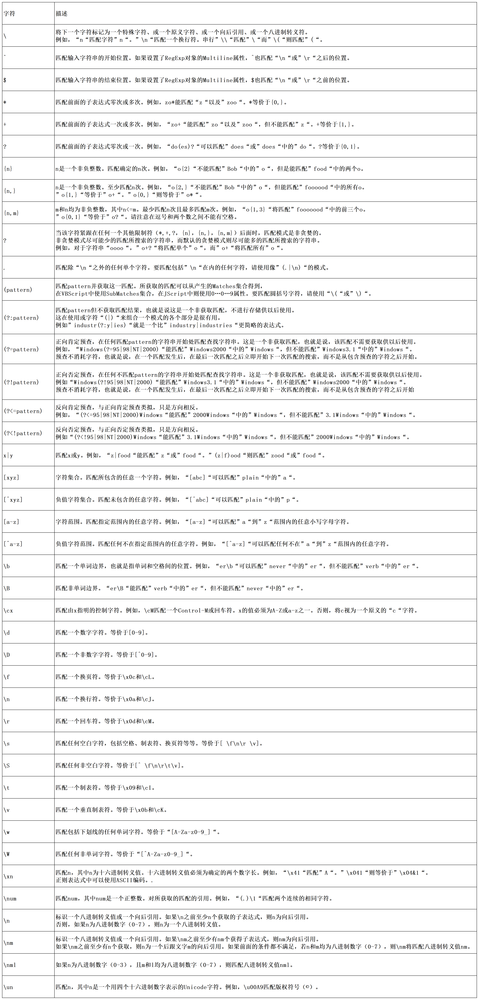
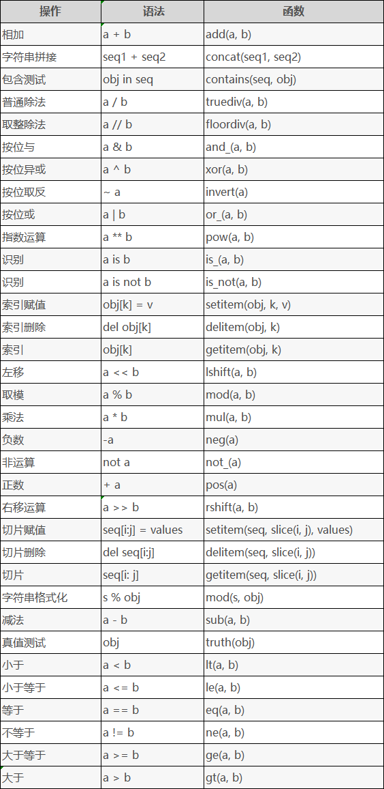

**摘要：常用内置模块**

<!-- more -->

::: warning 警告
**我年纪轻轻就学会了`Python`编程**

**来自：`HanamakiX`**
:::

## **本章目录**

   - **os**
   - **sys**
   - **pickle、json**
   - **time、datetime、calendar**
   - **logging**
   - **argparse**
   - **re正则表达式**
   - **base64**
   - **struct**
   - **hashlib**
   - **csv**
   - **wav**
   - **urllib**
   - **contextlib**
   - **operator**
   - **functools**
   - **itertools**
   - **collections**


## **一、os，sys，json，pickle**


这四个模块在之前的教程里都介绍过，这里回顾一下，做个总结


### **os**


os，语义操作系统，所以该模块就是操作系统相关的功能了，用于处理文件和目录这些我们日常手动需要做的操作，比如新建文件夹、获取文件列表、删除某个文件、获取文件大小、重命名文件、获取文件修改时间等，该模块就包含了大量的操作系统操作函数


|**方法**|**描述**|
|----|----|
|**os.name()**|**显示当前使用的平台，'nt'表示Windows，'posix' 表示Linux**|
|**os.getcwd()**|**返回当前进程的工作目录**|
|**os.chdir()**|**改变当前工作目录到指定的路径**|
|**os.makedirs()**|**方法用于递归创建目录**|
|**os.mkdir()**|**以数字权限模式创建目录。默认的模式为 0777 (八进制)**|
|**os.listdir()**|**列出目录下的所有文件和文件夹**|
|**os.remove()**|**用于删除指定路径的文件。如果指定的路径是一个目录，将抛出OSError**|
|**os.rename()**|**命名文件或目录,能对相应的文件进行重命名**|
|**os.renames()**|**用于递归重命名目录或文件。类似rename()。既可以重命名文件, 也可以重命名文件的上级目录名**|
|**os.linesep()**|**当前平台用于分隔（或终止）行的字符串。它可以是单个字符，如 POSIX 上是 '\n'，也可以是多个字符，如 Windows 上是 '\r\n'。在写入以文本模式（默认模式）打开的文件时，请不要使用 os.linesep 作为行终止符，请在所有平台上都使用一个 '\n' 代替**|
|**os.pathsep()**|**操作系统通常用于分隔搜索路径（如 PATH）中不同部分的字符，如 POSIX 上是 ':'，Windows 上是 ';'。在 os.path 中也可用**|
|**os.close()**|**关闭指定的文件描述符**|
|**os.stat()**|**获取文件或者目录信息**|
|**os.sep()**|**显示当前平台下路径分隔符,在 POSIX 上是 '/'，在 Windows 上是是 '\\'**|
|**os.walk()**|**遍历path，进入每个目录都调用visit函数，visit函数必须有3个参数(arg, dirname, names)，dirname表示当前目录的目录名，names代表当前目录下的所有文件名，args则为walk的第三个参数**|
|**os.environ**|**获取环境变量**|
|**os.path.abspath()**|**返回文件的绝对路径**|
|**os.path.basename()**|**返回文件名，纯粹字符串处理逻辑，路径错误也可以**|
|**os.path.commonprefix()**|**返回list(多个路径)中，所有path共有的最长的路径**|
|**os.path.dirname()**|**返回上层目录**|
|**os.path.exists()**|**如果路径 path 存在，返回 True；如果路径 path 不存在，返回 False**|
|**os.path.lexists()**|**路径存在则返回True，路径损坏也返回True， 不存在，返回 False**|
|**os.path.expanduser()**|**把path中包含的"~"和"~user"转换成用户目录**|
|**os.path.expandvars()**|**根据环境变量的值替换path中包含的"$name"和"${name}"**|
|**os.path.getatime()**|**返回最近访问时间（浮点型秒数），从新纪元到访问时的秒数**|
|**os.path.getmtime()**|**返回最近文件修改时间，从新纪元到访问时的秒数**|
|**os.path.getctime()**|**返回文件 path 创建时间，从新纪元到访问时的秒数**|
|**os.path.getsize()**|**返回文件大小，如果文件不存在就返回错误**|
|**os.path.isabs()**|**判断是否为绝对路径，也就是说在Windows系统下，如果输入的字符串以" / "开头，os.path.isabs()就会返回True**|
|**os.path.isfile()**|**判断路径是否为文件**|
|**os.path.isdir()**|**判断路径是否为目录**|
|**os.path.join()**|**把目录和文件名合成一个路径,1.如果各组件名首字母不包含’/’，则函数会自动加上,2.如果有一个组件是一个绝对路径，则在它之前的所有组件均会被舍弃,3.如果最后一个组件为空，则生成的路径以一个’/’分隔符结尾**|
|**os.path.normcase()**|**转换path的大小写和斜杠**|
|**os.path.normpath()**|**规范path字符串形式**|
|**os.path.realpath()**|**返回path的真实路径**|
|**os.path.relpath()**|**返回从当前目录或 start 目录（可选）到达 path 之间要经过的相对路径。这仅仅是对路径的计算，不会访问文件系统来确认 path 或 start 的存在性或属性**|
|**os.path.samefile()**|**判断目录或文件是否相同**|
|**os.path.split()**|**把路径分割成 dirname 和 basename，返回一个元组**|
|**os.path.splitdrive()**|**一般用在 windows 下，返回驱动器名和路径组成的元组**|
|**os.path.splitext()**|**分割路径，返回路径名和文件扩展名的元组**|


### **sys**

sys模块：该模块提供对解释器使用或维护的一些变量的访问，以及与解释器强烈交互的函数


|**方法**|**描述**|
|----|---------|
|**sys.argv**|**命令行参数List，第一个元素是程序本身路径**|
|**sys.modules.keys()**|**返回所有已经导入的模块列表**|
|**sys.exc_info()**|**获取当前正在处理的异常类,exc_type、exc_value、exc_traceback当前处理的异常详细信息**|
|**sys.exit(n)**|**程序，正常退出时exit(0)**|
|**sys.hexversion**|**获取Python解释程序的版本值，16进制格式如：0x020403F0**|
|**sys.version**|**获取Python解释程序的版本信息**|
|**sys.maxint**|**最大的Int值**|
|**sys.maxunicode**|**最大的Unicode值**|
|**sys.modules**|**返回系统导入的模块字段，key是模块名，value是模块**|
|**sys.path**|**返回模块的搜索路径，初始化时使用PYTHONPATH环境变量的值**|
|**sys.platform**|**返回操作系统平台名称**|
|**sys.stdout**|**标准输出**|
|**sys.stdin**|**标准输入**|
|**sys.stderr**|**错误输出**|
|**sys.exc_clear()**|**用来清除当前线程所出现的当前的或最近的错误信息**|
|**sys.exec_prefix**|**返回平台独立的python文件安装的位置**|
|**sys.byteorder**|**本地字节规则的指示器，big-endian平台的值是'big',little-endian平台的值是'little'**|
|**sys.copyright**|**记录python版权相关的东西**|
|**sys.api_version**|**解释器的C的API版本**|
|**sys.version_info**|**获取Python解释器的版本信息**|
|**sys.getwindowsversion**|**获取Windows的版本**|
|**sys.getdefaultencoding**|**返回当前你所用的默认的字符编码格式**|
|**sys.getfilesystemencoding**|**返回将Unicode文件名转换成系统文件名的编码的名字**|
|**sys.setdefaultencoding(name)**|**用来设置当前默认的字符编码**|
|**sys.builtin_module_names**|**Python解释器导入的模块列表**|
|**sys.executable**|**Python解释程序路径**|
|**sys.stdin.readline**|**从标准输入读一行，sys.stdout.write("a") 屏幕输出a**|


### **json和pickle**


|**方法**|**描述**|
|----|---------|
|**pickle.dump**|**对象序列化到文件**|
|**pickle.dumps**|**对象序列化**|
|**pickle.laod**|**对象从文件中发序列化**|
|**pickle.laods**|**对象发序列化**|
|**json.dump**|**对象json到文件**|
|**json.dumps**|**对象到json**|
|**json.laod**|**对象从文件中到json**|
|**json.laods**|**json到对象**|


## **二、时间操作：time，datetime，calendar**


几乎所有的正式代码中，我们都需要与时间打交道。在Python中，与时间处理有关的模块包括time，datetime以及calendar


### **time**

在 Python 中，用三种方式来表示时间，分别是时间戳、格式化时间字符串和结构化时间

- 时间戳（timestamp）：也就是 1970 年 1 月 1 日之后的秒，例如 1506388236.216345，可以通过time.time()获得。时间戳是一个浮点数，可以进行加减运算，但请注意不要让结果超出取值范围。

- 格式化的时间字符串（string_time）：也就是年月日时分秒这样的我们常见的时间字符串，例如2017-09-26 09:12:48，可以通过time.strftime('%Y-%m-%d')获得;

- 结构化时间（struct_time）：一个包含了年月日时分秒的多元元组，例如time.struct_time(tm_year=2017, tm_mon=9, tm_mday=26, tm_hour=9, tm_min=14, tm_sec=50, tm_wday=1, tm_yday=269, tm_isdst=0)，可以通过time.localtime()获得。


由于 Python 的 time 模块实现主要调用 C 库，所以各个平台可能有所不同。time 模块目前只支持到 2038 年前。如果需要处理范围之外的日期，请使用 datetime 模块。

- UTC（Coordinated Universal Time，世界协调时），亦即格林威治天文时间，世界标准时间。我们中国为东八区，比 UTC 早 8 个小时，也就是 UTC+8。关于 UTC 的缩写，有个故事，你可能已经注意到了，按英文的缩写，应该是 CUT，而不是 UTC。但是世界协调时在法文中的缩写是 TUC，两国互相不让，作为妥协，最后干脆简称 UTC。

- DST（Daylight Saving Time）即夏令时。


#### time.time()

```python
"""
time.time()

返回当前系统时间戳。时间戳可以做算术运算
"""
import time

t = time.time()
print(f'当前时间戳：{t}')


## 计算程序运行时间

t0 = time.time()

a = 1
for x in range(10000):
    a += 1

t1 = time.time()

t  = t1 - t0

print(f'当前程序运行时间：{round(t,8)}')


output:


    当前时间戳：1651806791.6454492
    当前程序运行时间：0.00099659
```
    
#### time.perf_counter()

```python
"""
time.perf_counter()

返回性能计数器的值（以分秒为单位），即具有最高可用分辨率的时钟，以测量短持续时间。
它包括在睡眠期间和系统范围内流逝的时间。
返回值的参考点未定义，因此只有连续调用结果之间的差异有效。

"""
import time

t = time.perf_counter()
print(f'计数器时间：{t}')


## 计算程序运行时间

t0 = time.perf_counter()

a = 1
for x in range(10000):
    a += 1

t1 = time.perf_counter()

t  = t1 - t0

print(f'当前程序运行时间：{round(t,8)}')


output:


    计数器时间：5341.7011456
    当前程序运行时间：0.0007618
```
    
#### time.sleep(t)

```python
"""
time.sleep(t)

用来睡眠或者暂停程序 t 秒，t 可以是浮点数或整数

"""
import time

t0 = time.time()

time.sleep(2)

t1 = time.time()

t  = t1 - t0

print(f'睡眠时间：{round(t,8)}')


output:


    睡眠时间：2.01212239
```
    
#### time.localtime([secs])

```python
"""
time.localtime([secs])

将一个时间戳转换为当前时区的结构化时间。
如果 secs 参数未提供，则以当前时间为准，即time.time()。

"""
import time

time.localtime()


output:


    time.struct_time(tm_year=2022, tm_mon=5, tm_mday=6, tm_hour=11, tm_min=18, tm_sec=16, tm_wday=4, tm_yday=126, tm_isdst=0)
```


#### time.struct_time()

```python
"""
time.struct_time()

结构化时间

参数：

tm_year：年，比如2022
tm_mon：月，1-12
tm_mday：日，1-31
tm_hour：时，0-23
tm_min：分，0-59
tm_sec：秒，0-61
tm_wday：周几，0-6（0表示周一）
tm_yday：一年中的第几天，1-366
tm_isdst：是否夏令时

"""
import time

time.struct_time(time.localtime())


output:


    time.struct_time(tm_year=2022, tm_mon=5, tm_mday=6, tm_hour=11, tm_min=28, tm_sec=50, tm_wday=4, tm_yday=126, tm_isdst=0)
```


#### time.gmtime([secs])

```python
"""
time.gmtime([secs])

将一个时间戳转换为 UTC 时区的结构化时间。可选参数 secs 的默认值为time.time()。

"""
import time

time.gmtime()


output:


    time.struct_time(tm_year=2022, tm_mon=5, tm_mday=6, tm_hour=3, tm_min=30, tm_sec=13, tm_wday=4, tm_yday=126, tm_isdst=0)
```


#### time.ctime([secs])

```python
"""
time.ctime([secs])

把一个时间戳转化为本地时间的格式化字符串。默认使用time.time()作为参数。

"""
import time

time.ctime()


output:


    'Fri May  6 11:30:54 2022'
```


#### time.asctime([t])

```python
"""
time.asctime([t])

把一个结构化时间转换为 Fri May  6 11:31:36 2022 这种形式的格式化时间字符串。
默认将time.localtime()作为参数。

"""
import time

time.asctime()


output:


    'Fri May  6 11:31:36 2022'
```


#### time.mktime(t)


```python
"""
time.mktime(t)

将一个结构化时间转化为时间戳。time.mktime()执行与gmtime(),localtime()相反的操作，
它接收struct_time对象作为参数,返回用秒数表示时间的浮点数。
如果输入的值不是一个合法的时间，将触发OverflowError或ValueError。

"""
import time

time.mktime(time.localtime())


output:


    1651807996.0
```

#### time.strftime(format [, t])


```python
"""
time.strftime(format [, t])

返回格式化字符串表示的当地时间。把一个struct_time（如time.localtime()和time.gmtime()的返回值）转化为格式化的时间字符串，
显示的格式由参数format决定。如果未指定 t，默认传入time.localtime()。
如果元组中任何一个元素越界，就会抛出ValueError的异常。

"""
import time

time.strftime("%Y-%m-%d %H:%M:%S", time.localtime())


output:


    '2022-05-06 11:40:30'
```


#### time.strptime(string[,format])

```python
"""
time.strptime(string[,format])

将格式化时间字符串转化成结构化时间。
该方法是time.strftime()方法的逆操作。time.strptime()方法根据指定的格式把一个时间字符串解析为时间元组。
要注意的是，你提供的字符串要和 format 参数的格式一一对应，如果 string 中日期间使用“-”分隔，format 中也必须使用“-”分隔，
时间中使用冒号“:”分隔，后面也必须使用冒号分隔，否则会报格式不匹配的错误。并且值也要在合法的区间范围内，
千万不要整出 14 个月来。

"""
import time

time.strptime('2022-05-06 11:37:22', "%Y-%m-%d %H:%M:%S")


output:


    time.struct_time(tm_year=2022, tm_mon=5, tm_mday=6, tm_hour=11, tm_min=37, tm_sec=22, tm_wday=4, tm_yday=126, tm_isdst=-1)
```


### **格式化时间字符串对照表**

|**格式**|**含义**|
|---|---|
|**%a**|**本地星期名称简写**|
|**%A**|**本地星期名称全称**|
|**%b**|**本地月份名称简写**|
|**%B**|**本地月份名称全称**|
|**%c**|**本地日期和时间字符串表示，如22/08/07 10:10:10**|
|**%d**|**一个月中的第几天**|
|**%f**|**微秒**|
|**%H**|**一天中的第几个小时**|
|**%I**|**第几个小时**|
|**%j**|**一年中的第几天**|
|**%m**|**月份**|
|**%M**|**分钟**|
|**%p**|**本地am或者pm标识**|
|**%S**|**秒**|
|**%U**|**一年中的星期数**|
|**%w**|**一个星期的第几天0-6（0是星期天）**|
|**%W**|**和%U基本相同，不同点这是以星期一为一个星期的开始**|
|**%x**|**本地时间字符串：/分割，如22/08/01**|
|**%X**|**本地时间字符串：:分割，如22:08:01**|
|**%y**|**去掉世纪的年份**|
|**%Y**|**完整年份**|
|**%z**|**与UTC时间的间隔**|
|**%Z**|**时区**|
|**%%**|**%字符**|


## **datetime**


该datetime模块提供用于操作日期和时间的类。

虽然支持日期和时间算术，但实现的重点是用于输出格式和操作的有效属性提取。


### **datetime模块中包含如下类：**


|**类名**|**功能说明**|
|---|---|
|**date**|**日期对象,常用的属性有year, month, day**|
|**time**|**时间对象**|
|**datetime**|**日期时间对象,常用的属性有hour, minute, second, microsecond**|
|**datetime_CAPI**|**日期时间对象C语言接口**|
|**timedelta**|**时间间隔，即两个时间点之间的长度**|
|**tzinfo**|**时区信息对象**|


### **datetime模块中包含的常量**


|**常量**|**功能说明**|**用法**|**返回值**|
|---|---|---|---|
|**MAXYEAR**|**返回能表示的最大年份**|**datetime.MAXYEAR**|**9999**|
|**MINYEAR**|**返回能表示的最小年份**|**datetime.MINYEAR**|**1**|

### **datetime.date类**


```python
import datetime

print(datetime.MINYEAR)
print(datetime.MAXYEAR)


output:

    1
    9999
```
    


```python
"""
date类：date对象由year年份、month月份及day日期三部分构成

datetime.date.today()

获取当前日期
"""
import datetime

a = datetime.date.today()
a


output:


    datetime.date(2022, 5, 6)
```


```python
print(a.year,a.month,a.day)


output:


    2022 5 6
```
    


```python
"""
datetime.date(year,month,day)

返回日期的date类
"""
import datetime

datetime.date(2022,12,10)


output:


    datetime.date(2022, 12, 10)
```


```python
"""
datetime.date(year,month,day) 

两个date可以直接相减得到相差的天数
"""
import datetime

a = datetime.date(2022,12,10)
b = datetime.date(1922,12,11)

b - a


output:


    datetime.timedelta(days=-36524)
```


```python
"""
ISO标准化日期
"""
import datetime
a = datetime.date(2022,12,10)

print(a.isocalendar())

### 格式化 YYYY-MM-DD
print(a.isoformat())

### 返回符合ISO标准的指定日期所在的星期数（周一为1…周日为7)
print(a.isoweekday())

### 返回的周一为 0, 周日为 6 
print(a.weekday())


### 返回一个类型为time.struct_time的数组，但有关时间的部分元素值为0
print(a.timetuple())


output:


    datetime.IsoCalendarDate(year=2022, week=49, weekday=6)
    2022-12-10
    6
    5
    time.struct_time(tm_year=2022, tm_mon=12, tm_mday=10, tm_hour=0, tm_min=0, tm_sec=0, tm_wday=5, tm_yday=344, tm_isdst=-1)
```
    


```python
### 返回公元公历开始到现在的天数。公元1年1月1日为1
a.toordinal()


output:


    738499
```


```python
### 返回一个替换指定日期字段的新date对象。参数3个可选参数，分别为year,month,day。注意替换是产生新对象，不影响原date对象。

b = a.replace(2021,2,28)
b


output:


    datetime.date(2021, 2, 28)
```


```python
### date对象表示日期的最小单位。这里是天。
a.resolution


output:


    datetime.timedelta(days=1)
```


```python
### 将Gregorian日历时间转换为date对象；Gregorian Calendar ：一种日历表示方法，类似于我国的农历，西方国家使用比较多。

datetime.date.fromordinal(a.toordinal())


output:


    datetime.date(2022, 12, 10)
```


```python
### 根据给定的时间戮，返回一个date对象

import time
datetime.date.fromtimestamp(time.time())


output:


    datetime.date(2022, 5, 6)
```


```python
### date类能表示的最大的年、月、日的数值
datetime.date.max


output:


    datetime.date(9999, 12, 31)
```


```python
### date类能表示的最小的年、月、日的数值
datetime.date.min


output:


    datetime.date(1, 1, 1)
```


```python
### 格式化date

a = datetime.date(2022,12,10)
print(a.strftime("%Y-%m-%d"))


output:


    2022-12-10
```
    


```python
### ctime样式的格式
a.ctime()


output:


    'Sat Dec 10 00:00:00 2022'
```


### **datetime.time类**

time类由hour小时、minute分钟、second秒、microsecond毫秒和tzinfo五部分组成


```python
import datetime

a = datetime.time(10,10,10,399)

a.hour          # 10

a.minute        # 10

a.second        # 10

a.microsecond   # 399

a.tzinfo
```


```python
### 格式化time类
a = datetime.time(10,10,10,399)

a.strftime('%H:%M:%S')


output:


    '10:10:10'
```


### **datetime.datetime类**

datetime类其实是可以看做是date类和time类的合体，其大部分的方法和属性都继承于这二个类，相关的操作方法请参阅，本文上面关于二个类的介绍。其数据构成也是由这二个类所有的属性所组成的。

```python
datetime(year, month, day[, hour[, minute[, second[,microsecond[,tzinfo]]]]])
```


```python
"""
当前具体时间信息
"""
import datetime

a = datetime.datetime.now()
a


output:


    datetime.datetime(2022, 5, 6, 14, 9, 35, 749729)
```


```python
### 返回datetime对象的日期部分

a.date()


output:


    datetime.date(2022, 5, 6)
```


```python
# 返回datetime对象的时间部分
a.time()


output:


    datetime.time(14, 9, 35, 749729)
```


```python
# 返回UTC时间元组
a.utctimetuple()


output:


    time.struct_time(tm_year=2022, tm_mon=5, tm_mday=6, tm_hour=14, tm_min=9, tm_sec=35, tm_wday=4, tm_yday=126, tm_isdst=0)
```


```python
# 将一个date对象和一个time对象合并生成一个datetime对象

datetime.datetime.combine(a.date(),a.time())


output:


    datetime.datetime(2022, 5, 6, 14, 9, 35, 749729)
```


```python
# 根据string, format 2个参数，返回一个对应的datetime对象

datetime.datetime.strptime('2022-05-06 15:25:35','%Y-%m-%d %H:%M:%S')


output:


    datetime.datetime(2022, 5, 6, 15, 25, 35)
```


### **datetime.timedelta类**

timedelta类是用来计算二个datetime对象的差值的。 
此类中包含如下属性：

- days:天数 
- microseconds：微秒数(>=0 并且 <1秒） 
- seconds：秒数(>=0 并且 <1天）


```python
a = datetime.datetime(2022,10,10,10,10,10)
b = datetime.datetime(2021,10,10,10,10,10)

b - a                                # datetime.timedelta(days=-365)

a + datetime.timedelta(days=-1)      # datetime.datetime(2022, 10, 9, 10, 10, 10)

a + datetime.timedelta(days=10)      # datetime.datetime(2022, 10, 20, 10, 10, 10)
```


### **拓展：时间格式的转化**


```python
class timeProcess(object):
    '''
    Description:
        时间操作集合
    Args:
        timeformat: str, '%Y-%m-%d %H:%M:%S'
    Example:
        >>> t = '2019-07-15 13:29:33'
        >>> tp=timeProcess()
        >>> tp.string2time(t)
        >>> tp.time2string(tp.string2time(t))
        >>> tp.string2datetime(t)
        >>> tp.datetime2string(tp.string2datetime(t))
        >>> tp.getBeforeDays(t,7)
        >>> tp.getAfterDays(t,7)
        >>> tp.stamp2string()
        >>> tss1 = '2013-10-10 23:40:00'
        >>> tp.string2stamp(tss1)
    '''
    __slots__ = ("timeformat")
    def __init__(self,timeformat='%Y-%m-%d %H:%M:%S'):
        self.timeformat = timeformat

    def time2string(self,timeStruct,timeformat='%Y-%m-%d %H:%M:%S'):
        now_time = time.strftime(timeformat,timeStruct)
        return now_time

    def string2time(self,timeString,timeformat='%Y-%m-%d %H:%M:%S'):
        now_time = time.strptime(timeString,timeformat)
        return now_time

    def datetime2string(self,timeStruct,timeformat='%Y-%m-%d %H:%M:%S'):
        now_time = datetime.datetime.strftime(timeStruct,timeformat)
        return now_time

    def string2datetime(self,timeString,timeformat='%Y-%m-%d %H:%M:%S'):
        now_time = datetime.datetime.strptime(timeString,timeformat)
        return now_time

    def stamp2string(self,timeStamp=1563773373.634,timeformat='%Y-%m-%d %H:%M:%S'):
        timeLocal = time.localtime(timeStamp)
        timeString = self.time2string(timeLocal,timeformat)
        return timeString
    
    def string2stamp(self,timeString,timeformat='%Y-%m-%d %H:%M:%S'):
        timestamp = self.string2time(timeString,timeformat)
        timestamp = time.mktime(timestamp)
        return timestamp

    def getBeforeDays(self,timeString,days):
        now_time = self.string2datetime(timeString,self.timeformat)
        delta = datetime.timedelta(days=days)
        now_time -= delta
        now_time = self.datetime2string(now_time,self.timeformat)
        return now_time

    def getBeforeHours(self,timeString,hours):
        now_time = self.string2datetime(timeString,self.timeformat)
        delta = datetime.timedelta(hours=hours)
        now_time -= delta
        now_time = self.datetime2string(now_time,self.timeformat)
        return now_time

    def getBeforeMinutes(self,timeString,minutes):
        now_time = self.string2datetime(timeString,self.timeformat)
        delta = datetime.timedelta(minutes=minutes)
        now_time -= delta
        now_time = self.datetime2string(now_time,self.timeformat)
        return now_time

    def getBeforeSeconds(self,timeString,seconds):
        now_time = self.string2datetime(timeString,self.timeformat)
        delta = datetime.timedelta(seconds=seconds)
        now_time -= delta
        now_time = self.datetime2string(now_time,self.timeformat)
        return now_time

    def getAfterDays(self,timeString,days):
        now_time = self.string2datetime(timeString,self.timeformat)
        delta = datetime.timedelta(days=days)
        now_time += delta
        now_time = self.datetime2string(now_time,self.timeformat)
        return now_time

    def getAfterHours(self,timeString,hours):
        now_time = self.string2datetime(timeString,self.timeformat)
        delta = datetime.timedelta(hours=hours)
        now_time += delta
        now_time = self.datetime2string(now_time,self.timeformat)
        return now_time

    def getAfterMinutes(self,timeString,minutes):
        now_time = self.string2datetime(timeString,self.timeformat)
        delta = datetime.timedelta(minutes=minutes)
        now_time += delta
        now_time = self.datetime2string(now_time,self.timeformat)
        return now_time

    def getAfterSeconds(self,timeString,seconds):
        now_time = self.string2datetime(timeString,self.timeformat)
        delta = datetime.timedelta(seconds=seconds)
        now_time += delta
        now_time = self.datetime2string(now_time,self.timeformat)
        return now_time
```

### **拓展：时间装饰器**


```python
import time
import datetime
import asyncio
from functools import wraps


class timeiter(object):
    """
    Description:
        同步，异步时间计数器
    Args:
        desc: (type,str), 描述信息
    Output:
        None, 上下文管理器和装饰器
    """
    __slots__ = ("desc","printer","start_time","end_time","total_time")

    def __init__(self,desc = "", printer = ""):
        self.desc = desc
        self.printer = print if not printer else printer

    def __enter__(self):
        self.start_time = time.time()

    # def __exit__(self,exc_type, exc_val, exc_tb):
    def __exit__(self, *args):
        self.end_time = time.time()
        self.total_time = self.end_time - self.start_time
        self.printer(f"{self.desc}: {self.total_time}")

    @staticmethod
    def timed_op(op = "time", printer = None):
        def wrapper(func):
            # 增加functools.wraps: help时可保留属性，否则不然
            # 可保持当前装饰器装饰的函数的__name__值不变
            @wraps(func)
            def sync_deco(*args,**kwargs):
                '''同步时间计数器'''
                if op == "time":
                    timer = time.time
                elif op == "perf_counter":
                    timer = time.perf_counter
                else:
                    raise Exception("time format is not allowed.")
                start = timer()
                result = func(*args,**kwargs)
                end = timer()
                time_info = f"Function( {func.__name__} ) elapsed time: {round(end - start, 8)} seconds."
                printers = printer.info if printer else print
                printers(time_info)
                return result
            
            @wraps(func)
            async def async_deco(*args,**kwargs):
                '''异步时间计数器'''
                if op == "time":
                    timer = time.time
                elif op == "perf_counter":
                    timer = time.perf_counter
                else:
                    raise Exception("time format is not allowed.")
                start = timer()
                result = await func(*args,**kwargs)
                end = timer()
                time_info = f"Function( {func.__name__} ) elapsed time: {round(end - start, 8)} seconds."
                printers = printer.info if printer else print
                printers(time_info)
                return result 

            return async_deco if asyncio.iscoroutinefunction(func) else sync_deco
        return wrapper


if __name__ == "__main__":
    with timeiter(desc = "process range time: "):
        s = [x for x in range(100)]
        with timeiter(desc = "one process time: "):
            b = [x for x in range(100)]

    @timeiter.timed_op(op = "perf_counter")
    def async_main(a):
        '''
        help me
        '''
        for x in range(a):
            time.sleep(1)
        return x

    async_main(2)

    help(async_main)


output:


    one process time: : 0.0
    process range time: : 0.0
    Function( async_main ) elapsed time: 2.008802 seconds.
    Help on function async_main in module __main__:
    
    async_main(a)
        help me
```
    
    

## **calendar**


calendar（日历）模块，默认每周第一天是星期一，最后一天是星期天。这也是python一个处理时间的模块。提供了对日期的一些操作方法，和生成日历的方法。


calendar模块中提供了三大类：

- calendar.Calendar(firstweekday=0)：该类提供了许多生成器，如星期的生成器，某月日历生成器

- calendar.TextCalendar(firstweekday=0)：该类提供了按月、按年生成日历字符串的方法。

- calendar.HTMLCalendar(firstweekday=0)：类似TextCalendar，不过生成的是HTML格式日历


一般常用第一类，其他都不怎么常用。


```python
"""
calendar.calendar()

用来获取某一年的日历
"""
import calendar

a = calendar.calendar(2022)
print(a)


output:


                                      2022
    
          January                   February                   March
    Mo Tu We Th Fr Sa Su      Mo Tu We Th Fr Sa Su      Mo Tu We Th Fr Sa Su
                    1  2          1  2  3  4  5  6          1  2  3  4  5  6
     3  4  5  6  7  8  9       7  8  9 10 11 12 13       7  8  9 10 11 12 13
    10 11 12 13 14 15 16      14 15 16 17 18 19 20      14 15 16 17 18 19 20
    17 18 19 20 21 22 23      21 22 23 24 25 26 27      21 22 23 24 25 26 27
    24 25 26 27 28 29 30      28                        28 29 30 31
    31
    
           April                      May                       June
    Mo Tu We Th Fr Sa Su      Mo Tu We Th Fr Sa Su      Mo Tu We Th Fr Sa Su
                 1  2  3                         1             1  2  3  4  5
     4  5  6  7  8  9 10       2  3  4  5  6  7  8       6  7  8  9 10 11 12
    11 12 13 14 15 16 17       9 10 11 12 13 14 15      13 14 15 16 17 18 19
    18 19 20 21 22 23 24      16 17 18 19 20 21 22      20 21 22 23 24 25 26
    25 26 27 28 29 30         23 24 25 26 27 28 29      27 28 29 30
                              30 31
    
            July                     August                  September
    Mo Tu We Th Fr Sa Su      Mo Tu We Th Fr Sa Su      Mo Tu We Th Fr Sa Su
                 1  2  3       1  2  3  4  5  6  7                1  2  3  4
     4  5  6  7  8  9 10       8  9 10 11 12 13 14       5  6  7  8  9 10 11
    11 12 13 14 15 16 17      15 16 17 18 19 20 21      12 13 14 15 16 17 18
    18 19 20 21 22 23 24      22 23 24 25 26 27 28      19 20 21 22 23 24 25
    25 26 27 28 29 30 31      29 30 31                  26 27 28 29 30
    
          October                   November                  December
    Mo Tu We Th Fr Sa Su      Mo Tu We Th Fr Sa Su      Mo Tu We Th Fr Sa Su
                    1  2          1  2  3  4  5  6                1  2  3  4
     3  4  5  6  7  8  9       7  8  9 10 11 12 13       5  6  7  8  9 10 11
    10 11 12 13 14 15 16      14 15 16 17 18 19 20      12 13 14 15 16 17 18
    17 18 19 20 21 22 23      21 22 23 24 25 26 27      19 20 21 22 23 24 25
    24 25 26 27 28 29 30      28 29 30                  26 27 28 29 30 31
    31
    
```


```python
"""
calendar.month(year, month)

用来获取某一个月的日历
"""
import calendar

a = calendar.month(2022, 10)
print(a)


output:


        October 2022
    Mo Tu We Th Fr Sa Su
                    1  2
     3  4  5  6  7  8  9
    10 11 12 13 14 15 16
    17 18 19 20 21 22 23
    24 25 26 27 28 29 30
    31
```
    
    


```python
"""
calendar.isleap(year)

判断是否是闰年
"""
import calendar

calendar.isleap(2022)


output:


    False
```


```python
"""
calendar.leapdays(year1,year2)

检测两个年份之间闰年的个数
"""
import calendar

calendar.leapdays(1922,2022)


output:


    25
```


```python
"""
calendar.firstweekday()

返回当前每周起始日期的设置。默认情况下，首次载入caendar模块时返回0，即星期一。
"""
import calendar

calendar.firstweekday()


output:


    0
```


```python
"""
calendar.setfirstweekday(calendar.SUNDAY)

默认每周的第一天是星期一，这里修改成星期天
"""
import calendar

calendar.setfirstweekday(calendar.SUNDAY)
calendar.firstweekday()


output:


    6
```


```python
"""
calendar.weekday(year,month,day)

返回给定日期的日期码。0（星期一）到6（星期日）。月份为 1（一月） 到 12（12月）。
"""
import calendar

calendar.weekday(2022,10,12)


output:


    2
```


## **三、日志操作：logging**


Python logging 模块定义了为应用程序和库实现灵活的事件日志记录的函数和类。

程序开发过程中，很多程序都有记录日志的需求，并且日志包含的信息有正常的程序访问日志还可能有错误、警告等信息输出，Python 的 logging 模块提供了标准的日志接口，可以通过它存储各种格式的日志,日志记录提供了一组便利功能，用于简单的日志记录用法。

- 使用 Python logging 模块的主要好处是所有 Python 模块都可以参与日志记录
- logging 模块提供了大量具有灵活性的功能

日志记录函数以它们用来跟踪的事件的级别或严重性命名。下面描述了标准级别及其适用性（从高到低的顺序）：


- 日志级别等级排序：critical > error > warning > info > debug


级别越高打印的日志越少，反之亦然，即

- debug : 打印全部的日志( notset 等同于 debug )
- info : 打印 info, warning, error, critical 级别的日志
- warning : 打印 warning, error, critical 级别的日志
- error : 打印 error, critical 级别的日志
- critical : 打印 critical 级别


```python
"""
一般使用方式
"""

import logging

logging.debug('Python debug')
logging.info('Python info')
logging.warning('Python warning')
logging.error('Python Error')
logging.critical('Python critical')


output:

    INFO: [2022-05-06 14:27:01,807] - [584422298.py / line: 8] - [Python info]
    WARNING: [2022-05-06 14:27:01,807] - [584422298.py / line: 9] - [Python warning]
    ERROR: [2022-05-06 14:27:01,822] - [584422298.py / line: 10] - [Python Error]
    CRITICAL: [2022-05-06 14:27:01,823] - [584422298.py / line: 11] - [Python critical]
```

    


```python
"""
设置日志级别
"""

import logging

logging.basicConfig(level=logging.INFO)
logging.debug('Python debug')
logging.info('Python info')
logging.warning('Python warning')
logging.error('Python Error')
logging.critical('Python critical')


output:


    INFO: [2022-05-06 14:27:54,709] - [2676761298.py / line: 9] - [Python info]
    WARNING: [2022-05-06 14:27:54,710] - [2676761298.py / line: 10] - [Python warning]
    ERROR: [2022-05-06 14:27:54,710] - [2676761298.py / line: 11] - [Python Error]
    CRITICAL: [2022-05-06 14:27:54,711] - [2676761298.py / line: 12] - [Python critical]
```

    


```python
"""
设置日志记录到文件
"""

import logging

logging.basicConfig(filename = './log.log', level=logging.INFO)
logger = logging.getLogger(__name__)

logger.debug('Python debug')
logger.info('Python info')
logger.warning('Python warning')
logger.error('Python Error')
logger.critical('Python critical')


output:


    INFO: [2022-05-06 14:30:04,167] - [3296713870.py / line: 11] - [Python info]
    WARNING: [2022-05-06 14:30:04,168] - [3296713870.py / line: 12] - [Python warning]
    ERROR: [2022-05-06 14:30:04,168] - [3296713870.py / line: 13] - [Python Error]
    CRITICAL: [2022-05-06 14:30:04,169] - [3296713870.py / line: 14] - [Python critical]
```

    


```python
"""
设置日志显示格式
"""

import logging

logging.basicConfig(
    filename = './log.log',
    level = logging.INFO,
    format = "%(levelname)s: [%(asctime)s] - [%(filename)s / line: %(lineno)d] - [%(message)s]"
)
logger = logging.getLogger(__name__)
logger.debug('Python debug')
logger.info('Python info')
logger.warning('Python warning')
logger.error('Python Error')
logger.critical('Python critical')


output:


    INFO: [2022-05-06 14:31:39,531] - [2688568788.py / line: 14] - [Python info]
    WARNING: [2022-05-06 14:31:39,532] - [2688568788.py / line: 15] - [Python warning]
    ERROR: [2022-05-06 14:31:39,533] - [2688568788.py / line: 16] - [Python Error]
    CRITICAL: [2022-05-06 14:31:39,534] - [2688568788.py / line: 17] - [Python critical]
```

    

### **format参数中可能用到的格式化信息：**

- **%(name)s：Logger的名字**

- **%(levelno)s：数字形式的日志级别**

- **%(levelname)s：文本形式的日志级别**

- **%(pathname)s：调用日志输出函数的模块的完整路径名，可能没有**

- **%(filename)s：调用日志输出函数的模块的文件名**

- **%(module)s：调用日志输出函数的模块名**

- **%(funcName)s：调用日志输出函数的函数名**

- **%(lineno)d：调用日志输出函数的语句所在的代码行**

- **%(created)f：当前时间，用UNIX标准的表示时间的浮 点数表示**

- **%(relativeCreated)d：输出日志信息时的，自Logger创建以 来的毫秒数**

- **%(asctime)s：字符串形式的当前时间。默认格式是 “2003-07-08 16:49:45,896”。逗号后面的是毫秒**

- **%(thread)d：线程ID。可能没有**

- **%(threadName)s：线程名。可能没有**

- **%(process)d：进程ID。可能没有**

- **%(message)s：日志信息**


```python
"""
设置日志回滚

有时候需要长时间保留日志，这样会导致日志很大，不方便查找具体某一时刻的日志
"""

import logging
from logging.handlers import TimedRotatingFileHandler


def logHandler(filename,level = "",fmt="",datefmt='',when="midnight",interval=1,backCount=30,suffix="%Y%m%d.back"):
    """
    Description:
        实例化日志回滚：TimedRotatingFileHandler
    Args:
        filename: (type,str), 日志输出文件
        level: (type,str), 日志输出登记
        when: (type,str), 日志时间设置单位
                S 秒
                M 分
                H 小时
                D 天
                W 星期 (interval == 0时代表周一)
                midnight 每天凌晨
        interval: (type,str), 时间间隔数
        backCoun: (type,str), 备份的日志文件个数
        suffix: (type,str), 设置后缀名称，跟strftime的格式一样
    Output:
        logger
    """        
    logger = logging.getLogger(filename)
    logger.setLevel(level)
    fmt = logging.Formatter(fmt,datefmt)
    # 文件写入以及指定间隔时间生成文件
    fileTimeHandler = TimedRotatingFileHandler(
        filename = filename,
        when = when,
        interval=interval,
        backupCount=backCount,
        encoding='utf-8'
    )
    fileTimeHandler.suffix = suffix
    fileTimeHandler.setFormatter(fmt)
    fileTimeHandler.setLevel(level)
    consoleHandler = logging.StreamHandler()                      # 往屏幕上输出
    consoleHandler.setFormatter(fmt)                       # 设置屏幕上显示的格式
    consoleHandler.setLevel(level)
    logger.addHandler(fileTimeHandler)
    logger.addHandler(consoleHandler) 
    return logger


logger = logHandler(
    filename = './1.log',
    level = logging.INFO,
    fmt = "%(levelname)s: [%(asctime)s] - [%(filename)s: %(lineno)d] - [%(message)s]",
    datefmt= "%Y/%m/%d %H:%M:%S",
    when = "midnight",
    interval=1,
    backCount=30,
    suffix="%Y%m%d.back"
)

logger.debug('Python debug')
logger.info('Python info')
logger.warning('Python warning')
logger.error('Python Error')
logger.critical('Python critical')


output:


    INFO: [2022/05/06 14:37:21] - [608606045.py: 65] - [Python info]
    INFO: [2022-05-06 14:37:21,637] - [608606045.py / line: 65] - [Python info]
    WARNING: [2022/05/06 14:37:21] - [608606045.py: 66] - [Python warning]
    WARNING: [2022-05-06 14:37:21,637] - [608606045.py / line: 66] - [Python warning]
    ERROR: [2022/05/06 14:37:21] - [608606045.py: 67] - [Python Error]
    ERROR: [2022-05-06 14:37:21,637] - [608606045.py / line: 67] - [Python Error]
    CRITICAL: [2022/05/06 14:37:21] - [608606045.py: 68] - [Python critical]
    CRITICAL: [2022-05-06 14:37:21,637] - [608606045.py / line: 68] - [Python critical]
```
    


## **四、命令行参数：argparse**


argparse是python标准库里面用来处理命令行参数的库

命令行参数分为位置参数和选项参数：

- 位置（必选）参数：前面不需要-或者–；

- 可选参数：通过一个-来指定的短参数，如-h；通过–来指定的长参数，如- -help

使用步骤：

1. import argparse 首先导入模块

2. parser = argparse.ArgumentParser（） 创建一个解析对象

3. parser.add_argument() 向该对象中添加你要关注的命令行参数和选项

4. args = parser.parse_args() 进行解析 或者 args，unparsed = parser.parse_known_args()

5. 索引参数args.pospath

6. 或者args = vars(parser.parse_args())将其变为一个字典

7. 索引参数 args[‘pospath’]


```python
# %load ./examples/args.py
import argparse

parser = argparse.ArgumentParser()
parser.add_argument("-f", "--input_file", help="input file path")
parser.add_argument("-o", "--output_file", help="output file path")
args = parser.parse_args()

print(f"-f或者--input_file的命令行参数是：{args.input_file}")
print(f"-o或者--output_file的命令行参数是：{args.output_file}")


%%cmd

python ./examples/args.py -f 1.txt -o 2.txt


output:


    -f或者--input_file的命令行参数是：1.txt
    -o或者--output_file的命令行参数是：2.txt
```


## **五、正则表达式：re**


### **正则表达式**

正则表达式是一个特殊的字符序列，用于判断一个字符串是否与我们所设定的字符序列是否匹配，也就是说检查一个字符串是否与某种模式匹配。

### **正则表达式速查表**



### **re模块**


```python
"""
re.match(正则表达式, 文本)

从开始的位置进行匹配。如果开始的位置没有匹配到。就直接失败了
"""

import re

text = 'hello world'

res = re.match('h',text)

res


output:


    <re.Match object; span=(0, 1), match='h'>
```


```python
# 输出匹配内容和内容对应的位置

res.group(), res.span()


output:


    ('h', (0, 1))
```


```python
# 只能匹配到一个

text = 'hello world hello world hello world'

res = re.match('h',text)

res


output:


    <re.Match object; span=(0, 1), match='h'>
```


```python
# 如果起始位置没有匹配到就直接返回：None

text = 'aaaahello world'

res = re.match('h',text)

print(res)


output:


    None
```
    


```python
"""
re.search(正则表达式, 文本)

在字符串中找满足条件的字符。如果找到，就返回。说白了，就是只会找到第一个满足条件的。
"""

import re

text = 'hello world'

res = re.search('h',text)

res


output:


    <re.Match object; span=(0, 1), match='h'>
```


```python
# 智能匹配到一个

text = 'hello world hello world hello world'

res = re.search('h',text)

res


output:


    <re.Match object; span=(0, 1), match='h'>
```


```python
# 可以匹配不是起始位置的，这是和match最大的区别

text = 'aaaahello world'

res = re.search('h',text)

res


output:


    <re.Match object; span=(4, 5), match='h'>
```


```python
"""
re.findall(正则表达式, 文本)

找出所有满足条件的，返回的是一个列表
"""

import re

text = 'aaaahello world hello world hello world'

res = re.findall('h',text)

res


output:


    ['h', 'h', 'h']
```


```python
"""
re.finditer(正则表达式, 文本)

找出所有满足条件的匹配和位置
"""

import re

text = 'aaaahello world hello world hello world'

res = re.finditer('h',text)

for x in res:
    print(f'匹配结果：{x}',f'匹配位置：{x.group()}',f'匹配信息：{x.span()}')


output:


    匹配结果：<re.Match object; span=(4, 5), match='h'> 匹配位置：h 匹配信息：(4, 5)
    匹配结果：<re.Match object; span=(16, 17), match='h'> 匹配位置：h 匹配信息：(16, 17)
    匹配结果：<re.Match object; span=(28, 29), match='h'> 匹配位置：h 匹配信息：(28, 29)
```

    


```python
"""
re.sub(正则表达式, 替换后的文本, 需要替换的文本)

用来替换字符串。将匹配到的字符串替换为其他字符串
"""

import re

text = 'hello world hello world hello world'

res = re.sub('hello','hi',text)

res


output:


    'hi world hi world hi world'
```


```python
"""
re.split(正则表达式, 文本)

使用正则表达式来分割字符串。
"""

import re

text = 'hello world'

res = re.split('hello', text)

res


output:


    ['', ' world']
```


```python
"""
re.compile(正则表达式)

对于一些经常要用到的正则表达式，可以使用compile进行编译，
后期再使用的时候可以直接拿过来用，执行效率会更快。
而且compile还可以指定flag=re.VERBOSE，在写正则表达式的时候可以做好注释
"""

import re


rep = re.compile('hello')

text = 'hello world'

res = re.split(rep, text)

res


output:


    ['', ' world']
```


### **常用的正则表达式**

#### **校验数字的表达式**

```
1、  数字：^[0-9]*$
2、  n位的数字：^\d{n}$
3、  至少n位的数字：^\d{n,}$
4、  m-n位的数字：^\d{m,n}$
5、  零和非零开头的数字：^(0|[1-9][0-9]*)$
6、  非零开头的最多带两位小数的数字：^([1-9][0-9]*)+(.[0-9]{1,2})?$
7、  带1-2位小数的正数或负数：^(\-)?\d+(\.\d{1,2})?$
8、  正数、负数、和小数：^(\-|\+)?\d+(\.\d+)?$
9、  有两位小数的正实数：^[0-9]+(.[0-9]{2})?$
10、 有1~3位小数的正实数：^[0-9]+(.[0-9]{1,3})?$
11、 非零的正整数：^[1-9]\d*$ 或 ^([1-9][0-9]*){1,3}$ 或 ^\+?[1-9][0-9]*$
12、 非零的负整数：^\-[1-9][]0-9"*$ 或 ^-[1-9]\d*$
13、 非负整数：^\d+$ 或 ^[1-9]\d*|0$
14、 非正整数：^-[1-9]\d*|0$ 或 ^((-\d+)|(0+))$
15、 非负浮点数：^\d+(\.\d+)?$ 或 ^[1-9]\d*\.\d*|0\.\d*[1-9]\d*|0?\.0+|0$
16、 非正浮点数：^((-\d+(\.\d+)?)|(0+(\.0+)?))$ 或 ^(-([1-9]\d*\.\d*|0\.\d*[1-9]\d*))|0?\.0+|0$
17、 正浮点数：^[1-9]\d*\.\d*|0\.\d*[1-9]\d*$ 或 ^(([0-9]+\.[0-9]*[1-9][0-9]*)|([0-9]*[1-9][0-9]*\.[0-9]+)|([0-9]*[1-9][0-9]*))$
18、 负浮点数：^-([1-9]\d*\.\d*|0\.\d*[1-9]\d*)$ 或 ^(-(([0-9]+\.[0-9]*[1-9][0-9]*)|([0-9]*[1-9][0-9]*\.[0-9]+)|([0-9]*[1-9][0-9]*)))$
19、 浮点数：^(-?\d+)(\.\d+)?$ 或 ^-?([1-9]\d*\.\d*|0\.\d*[1-9]\d*|0?\.0+|0)$
```

#### **校验字符的表达式**

```
1、  汉字：^[\u4e00-\u9fa5]{0,}$
2、  英文和数字：^[A-Za-z0-9]+$ 或 ^[A-Za-z0-9]{4,40}$
3、  长度为3-20的所有字符：^.{3,20}$
4、  由26个英文字母组成的字符串：^[A-Za-z]+$
5、  由26个大写英文字母组成的字符串：^[A-Z]+$
6、  由26个小写英文字母组成的字符串：^[a-z]+$
7、  由数字和26个英文字母组成的字符串：^[A-Za-z0-9]+$
8、  由数字、26个英文字母或者下划线组成的字符串：^\w+$ 或 ^\w{3,20}$
9、  中文、英文、数字包括下划线：^[\u4E00-\u9FA5A-Za-z0-9_]+$
10、 中文、英文、数字但不包括下划线等符号：^[\u4E00-\u9FA5A-Za-z0-9]+$ 或 ^[\u4E00-\u9FA5A-Za-z0-9]{2,20}$
11、 可以输入含有^%&',;=?$\"等字符：[^%&',;=?$\x22]+
12、 禁止输入含有~的字符：[^~\x22]+
```

#### **特殊需求表达式**

```
1、  Email地址：^\w+([-+.]\w+)*@\w+([-.]\w+)*\.\w+([-.]\w+)*$
2、  域名：[a-zA-Z0-9][-a-zA-Z0-9]{0,62}(/.[a-zA-Z0-9][-a-zA-Z0-9]{0,62})+/.?
3、  InternetURL：[a-zA-z]+://[^\s]* 或 ^http://([\w-]+\.)+[\w-]+(/[\w-./?%&=]*)?$
4、  手机号码：^(13[0-9]|14[0-9]|15[0-9]|166|17[0-9]|18[0-9]|19[8|9])\d{8}$
5、  电话号码("XXX-XXXXXXX"、"XXXX-XXXXXXXX"、"XXX-XXXXXXX"、"XXX-XXXXXXXX"、"XXXXXXX"和"XXXXXXXX)：^(\(\d{3,4}-)|\d{3.4}-)?\d{7,8}$
6、  国内电话号码(0511-4405222、021-87888822)：\d{3}-\d{8}|\d{4}-\d{7}
7、  18位身份证号码(数字、字母x结尾)：^((\d{18})|([0-9x]{18})|([0-9X]{18}))$
8、  帐号是否合法(字母开头，允许5-16字节，允许字母数字下划线)：^[a-zA-Z][a-zA-Z0-9_]{4,15}$
9、  密码(以字母开头，长度在6~18之间，只能包含字母、数字和下划线)：^[a-zA-Z]\w{5,17}$
10、 强密码(必须包含大小写字母和数字的组合，不能使用特殊字符，长度在8-10之间)：^(?=.*\d)(?=.*[a-z])(?=.*[A-Z]).{8,10}$  
11、 日期格式：^\d{4}-\d{1,2}-\d{1,2}
12、 一年的12个月(01～09和1～12)：^(0?[1-9]|1[0-2])$
13、 一个月的31天(01～09和1～31)：^((0?[1-9])|((1|2)[0-9])|30|31)$
14、 钱的输入格式：
      a.有四种钱的表示形式我们可以接受:"10000.00" 和 "10,000.00", 和没有 "分" 的 "10000" 和 "10,000"：^[1-9][0-9]*$
      b.这表示任意一个不以0开头的数字,但是,这也意味着一个字符"0"不通过,所以我们采用下面的形式：^(0|[1-9][0-9]*)$
      c.一个0或者一个不以0开头的数字.我们还可以允许开头有一个负号：^(0|-?[1-9][0-9]*)$
      d.这表示一个0或者一个可能为负的开头不为0的数字.让用户以0开头好了.把负号的也去掉,因为钱总不能是负的吧.下面我们要加的是说明可能的小数部分：^[0-9]+(.[0-9]+)?$
      e.必须说明的是,小数点后面至少应该有1位数,所以"10."是不通过的,但是 "10" 和 "10.2" 是通过的：^[0-9]+(.[0-9]{2})?$
      f.这样我们规定小数点后面必须有两位,如果你认为太苛刻了,可以这样：^[0-9]+(.[0-9]{1,2})?$
      g.这样就允许用户只写一位小数.下面我们该考虑数字中的逗号了,我们可以这样：^[0-9]{1,3}(,[0-9]{3})*(.[0-9]{1,2})?$
      h.1到3个数字,后面跟着任意个 逗号+3个数字,逗号成为可选,而不是必须：^([0-9]+|[0-9]{1,3}(,[0-9]{3})*)(.[0-9]{1,2})?$
15、 xml文件：^([a-zA-Z]+-?)+[a-zA-Z0-9]+\\.[x|X][m|M][l|L]$
16、 中文字符的正则表达式：[\u4e00-\u9fa5]
17、 双字节字符：[^\x00-\xff]    (包括汉字在内，可以用来计算字符串的长度(一个双字节字符长度计2，ASCII字符计1))
18、 空白行的正则表达式：\n\s*\r    (可以用来删除空白行)
19、 HTML标记的正则表达式：<(\S*?)[^>]*>.*?</\1>|<.*? />    (网上流传的版本太糟糕，上面这个也仅仅能部分，对于复杂的嵌套标记依旧无能为力)
20、 首尾空白字符的正则表达式：^\s*|\s*$或(^\s*)|(\s*$)    (可以用来删除行首行尾的空白字符(包括空格、制表符、换页符等等)，非常有用的表达式)
21、 腾讯QQ号：[1-9][0-9]{4,}    (腾讯QQ号从10000开始)
22、 中国邮政编码：[1-9]\d{5}(?!\d)    (中国邮政编码为6位数字)
23、 IP地址：\d+\.\d+\.\d+\.\d+    (提取IP地址时有用)
24、 IP地址：((?:(?:25[0-5]|2[0-4]\\d|[01]?\\d?\\d)\\.){3}(?:25[0-5]|2[0-4]\\d|[01]?\\d?\\d))  
25、PV6 地址： (([0-9a-fA-F]{1,4}:){7,7}[0-9a-fA-F]{1,4}|([0-9a-fA-F]{1,4}:){1,7}:|([0-9a-fA-F]{1,4}:){1,6}:[0-9a-fA-F]{1,4}|([0-9a-fA-F]{1,4}:){1,5}(:[0-9a-fA-F]{1,4}){1,2}|([0-9a-fA-F]{1,4}:){1,4}(:[0-9a-fA-F]{1,4}){1,3}|([0-9a-fA-F]{1,4}:){1,3}(:[0-9a-fA-F]{1,4}){1,4}|([0-9a-fA-F]{1,4}:){1,2}(:[0-9a-fA-F]{1,4}){1,5}|[0-9a-fA-F]{1,4}:((:[0-9a-fA-F]{1,4}){1,6})|:((:[0-9a-fA-F]{1,4}){1,7}|:)|fe80:(:[0-9a-fA-F]{0,4}){0,4}%[0-9a-zA-Z]{1,}|::(ffff(:0{1,4}){0,1}:){0,1}((25[0-5]|(2[0-4]|1{0,1}[0-9]){0,1}[0-9])\\.){3,3}(25[0-5]|(2[0-4]|1{0,1}[0-9]){0,1}[0-9])|([0-9a-fA-F]{1,4}:){1,4}:((25[0-5]|(2[0-4]|1{0,1}[0-9]){0,1}[0-9])\\.){3,3}(25[0-5]|(2[0-4]|1{0,1}[0-9]){0,1}[0-9]))
26、URL 链接： ((http|ftp|https)://)(([a-zA-Z0-9\._-]+\.[a-zA-Z]{2,6})|([0-9]{1,3}\.[0-9]{1,3}\.[0-9]{1,3}\.[0-9]{1,3}))(:[0-9]{1,4})*(/[a-zA-Z0-9\&%_\./-~-]*)?

```


## **六、数据编码：base64，struct，hashlib**


### **base64**

base64模块是用来做base64编码解码，常用于小型数据传输。编码后的数据是一个字符串，包括a-z，A-Z，/，+共64个字符，


```python
import base64

a = 'dasdsad'

base64.b64encode(a.encode('utf-8'))


output:


    b'ZGFzZHNhZA=='
```


```python
base64.b64decode(b'ZGFzZHNhZA==').decode('utf-8')


output:


    'dasdsad'
```


### **struct**

看到struct这么英文单词，大家应该并不陌生，因为c/c++中就有struct，在那里struct叫做结构体。在Python中也使用struct，

这充分说明了这个struct应该和c/c++中的struct有很深的渊源。Python正是使用struct模块执行Python值和C结构体之间的转换，

从而形成Python字节对象。它使用格式字符串作为底层C结构体的紧凑描述，进而根据这个格式字符串转换成Python值。


```python
# 变成二进制

import struct

a = 100.48

b = struct.pack('f',a)
b


output:


    b'\xc3\xf5\xc8B'
```


```python
# 二进制返回到python数据

struct.unpack('f',b)


output:


    (100.4800033569336,)
```


### **hashlib**

加密算法


```python
import hashlib

a = 'dasdas'

md5 = hashlib.md5()
md5.update(a.encode('utf-8'))
md5.hexdigest()


output:


    '89defae676abd3e3a42b41df17c40096'
```


```python
md5.digest()


output:


    b'\x89\xde\xfa\xe6v\xab\xd3\xe3\xa4+A\xdf\x17\xc4\x00\x96'
```


```python
import hashlib

a = 'dasdas'

sha256 = hashlib.sha256()
sha256.update(a.encode('utf-8'))
sha256.hexdigest()


output:


    '2ed46d7bedc17aba18343eac71e21648b1af50fff732af7e338075cd0ed1567a'
```


## **七、文件操作：csv，wav**


### **csv**

CSV(Comma Separated Values)是逗号分隔符文本格式，常用于Excel和数据库的导入和导出，

Python内置的CSV模块提供对CSV格式文件读取和写入的对象。


```python
"""
csv.reader

读取csv
"""

import csv

with open('./examples/stock.csv','r',encoding='utf-8') as f:
    f = csv.reader(f)
    for x in f:
        print(x)


output:


    ['index', 'secID', 'ticker', 'secShortName', 'exchangeCD', 'tradeDate', 'preClosePrice', 'openPrice', 'highestPrice', 'lowestPrice', 'closePrice', 'turnoverVol']
    ['0', '000001.XSHE', '1', '平安银行', 'XSHE', '2017-12-1', '13.38', '13.4', '13.48', '12.96', '13', '178493315']
    ['1', '000002.XSHE', '2', '万科A', 'XSHE', '2017-12-1', '31.22', '30.5', '32.03', '30.5', '30.73', '55743855']
    ['2', '000004.XSHE', '4', '国农科技', 'XSHE', '2017-12-1', '25.56', '25.41', '26.4', '25.18', '26.2', '2211059']
    ['3', '000005.XSHE', '5', '世纪星源', 'XSHE', '2017-12-1', '4.2', '4.2', '4.24', '4.2', '4.22', '2365348']
    ['4', '000006.XSHE', '6', '深振业A', 'XSHE', '2017-12-1', '9.85', '0', '0', '0', '9.85', '0']
    ['5', '000007.XSHE', '7', '全新好', 'XSHE', '2017-12-1', '16.66', '0', '0', '0', '16.66', '0']
    ['6', '000008.XSHE', '8', '神州高铁', 'XSHE', '2017-12-1', '8.48', '8.48', '8.74', '8.41', '8.59', '5689054']
    ['7', '000009.XSHE', '9', '中国宝安', 'XSHE', '2017-12-1', '7.6', '7.61', '7.63', '7.53', '7.58', '9149395']
    ['8', '000010.XSHE', '10', '美丽生态', 'XSHE', '2017-12-1', '5.13', '5.13', '5.23', '5.11', '5.21', '6765580']
    ['9', '000011.XSHE', '11', '深物业A', 'XSHE', '2017-12-1', '17.18', '17.08', '17.28', '17', '17.11', '2474700']
    ['10', '000012.XSHE', '12', '南玻A', 'XSHE', '2017-12-1', '9.19', '9.1', '9.28', '9.02', '9.11', '35308183']
    ['11', '000014.XSHE', '14', '沙河股份', 'XSHE', '2017-12-1', '12.6', '12.49', '12.73', '12.45', '12.64', '1236110']
    ['12', '000016.XSHE', '16', '深康佳A', 'XSHE', '2017-12-1', '6.2', '6.34', '6.54', '6.31', '6.43', '29434715']
    ['13', '000017.XSHE', '17', '深中华A', 'XSHE', '2017-12-1', '6.68', '6.63', '6.68', '6.6', '6.68', '1562976']
    ['14', '000018.XSHE', '18', '神州长城', 'XSHE', '2017-12-1', '7.16', '7.16', '7.21', '7.1', '7.15', '5792996']
    ['15', '000019.XSHE', '19', '深深宝A', 'XSHE', '2017-12-1', '12.15', '0', '0', '0', '12.15', '0']
    ['16', '000020.XSHE', '20', '深华发A', 'XSHE', '2017-12-1', '14.99', '15.28', '15.3', '14.75', '15', '3250307']
    ['17', '000021.XSHE', '21', '深科技', 'XSHE', '2017-12-1', '9.08', '9.07', '9.41', '9.05', '9.34', '19877164']
    ['18', '000022.XSHE', '22', '深赤湾A', 'XSHE', '2017-12-1', '24.14', '0', '0', '0', '24.14', '0']
    ['19', '000023.XSHE', '23', '深天地A', 'XSHE', '2017-12-1', '22.57', '22.41', '22.82', '22.41', '22.62', '318725']
    ['20', '000025.XSHE', '25', '特力A', 'XSHE', '2017-12-1', '40.56', '40.25', '40.67', '40.08', '40.17', '1584600']
    

```


```python
"""

csv.writer

写入csv
"""

import csv

with open('./examples/stock1.csv','w',encoding='utf-8') as f:
    f = csv.writer(f)
    # 写入一行
    f.writerow(['a','b'])
    # 写入多行
    f.writerows([(1,2),(3,4)])
```

### **wav**


```python
import wave

wavFile = "./examples/1.wav"
f = wave.open(wavFile)
# 音频头 参数
params = f.getparams()
Channels = f.getnchannels()
SampleRate = f.getframerate()
bit_type = f.getsampwidth() * 8
frames = f.getnframes()
# Duration 也就是音频时长 = 采样点数/采样率 
Duration = wav_time = frames / float(SampleRate)  # 单位为s

print("音频头参数：", params)
print("通道数(Channels)：", Channels)
print("采样率(SampleRate)：", SampleRate)
print("比特(Precision)：", bit_type)
print("采样点数(frames)：", frames)
print("帧数或者时间(Duration)：", Duration)
```

### **拓展：urllib操作网页**

urllib提供了一系列用于操作URL的功能


```python
from urllib import request

with request.urlopen('https://www.baidu.com/') as f:
    data = f.read()
    print('Status:', f.status, f.reason)
    for k, v in f.getheaders():
        print('%s: %s' % (k, v))
    print('Data:', data.decode('utf-8'))


output:


    Status: 200 OK
    Accept-Ranges: bytes
    Cache-Control: no-cache
    Content-Length: 227
    Content-Type: text/html
    Date: Fri, 06 May 2022 10:01:41 GMT
    P3p: CP=" OTI DSP COR IVA OUR IND COM "
    P3p: CP=" OTI DSP COR IVA OUR IND COM "
    Pragma: no-cache
    Server: BWS/1.1
    Set-Cookie: BD_NOT_HTTPS=1; path=/; Max-Age=300
    Set-Cookie: BIDUPSID=29D4EE91E7C8394B7EB09B702C8DDE98; expires=Thu, 31-Dec-37 23:55:55 GMT; max-age=2147483647; path=/; domain=.baidu.com
    Set-Cookie: PSTM=1651831301; expires=Thu, 31-Dec-37 23:55:55 GMT; max-age=2147483647; path=/; domain=.baidu.com
    Set-Cookie: BAIDUID=29D4EE91E7C8394BC97BDE6AF5BD89DC:FG=1; max-age=31536000; expires=Sat, 06-May-23 10:01:41 GMT; domain=.baidu.com; path=/; version=1; comment=bd
    Strict-Transport-Security: max-age=0
    Traceid: 1651831301055677338615388090866279863033
    X-Frame-Options: sameorigin
    X-Ua-Compatible: IE=Edge,chrome=1
    Connection: close
    Data: <html>
    <head>
        <script>
            location.replace(location.href.replace("https://","http://"));
        </script>
    </head>
    <body>
        <noscript><meta http-equiv="refresh" content="0;url=http://www.baidu.com/"></noscript>
    </body>
    </html>
```
    


## **八、上下文管理：contextlib**


在之前我们学习到：

```python

with open('1.txt','r',encoding='utf-8') as f:
    data = [x.strip() for x in f]

```

这样一个with...as语句，之前说过只要实现类的魔法方法：`__enter__`和`__exit__`，就可以使用这个语句，

编写enter和exit仍然很繁琐，因此Python的标准库contextlib提供了更简单的写法

### **用法一：@contextmanager**

可以让我们通过yield编写生成器来实现上下文管理


```python
from contextlib import contextmanager


@contextmanager
def readf(file):
    with open(file,'r',encoding='utf-8') as f:
        yield f
            

with readf('1.log') as ff:
    for x in ff:
        print(x)


output:


    INFO: [2022/05/06 14:37:21] - [608606045.py: 65] - [Python info]
    
    WARNING: [2022/05/06 14:37:21] - [608606045.py: 66] - [Python warning]
    
    ERROR: [2022/05/06 14:37:21] - [608606045.py: 67] - [Python Error]
    
    CRITICAL: [2022/05/06 14:37:21] - [608606045.py: 68] - [Python critical]
```
    
    

### **用法二：closing()**

如果一个对象没有实现上下文，我们就不能把它用于with语句。这个时候，可以用closing()来把该对象变为上下文对象


```python
from contextlib import closing


def readf(file):
    with open(file,'r',encoding='utf-8') as f:
        for x in f:
            yield x
            

with readf('1.log') as ff:
    for x in ff:
        print(x)


output:


    ---------------------------------------------------------------------------

    AttributeError                            Traceback (most recent call last)

    ~\AppData\Local\Temp/ipykernel_16492/350106258.py in <module>
          8 
          9 
    ---> 10 with readf('1.log') as ff:
         11     for x in ff:
         12         print(x)
    

    AttributeError: __enter__
```


```python
from contextlib import closing


def readf(file):
    with open(file,'r',encoding='utf-8') as f:
        for x in f:
            yield x
            

with closing(readf('1.log')) as ff:
    for x in ff:
        print(x)


output:


    INFO: [2022/05/06 14:37:21] - [608606045.py: 65] - [Python info]
    
    WARNING: [2022/05/06 14:37:21] - [608606045.py: 66] - [Python warning]
    
    ERROR: [2022/05/06 14:37:21] - [608606045.py: 67] - [Python Error]
    
    CRITICAL: [2022/05/06 14:37:21] - [608606045.py: 68] - [Python critical]
```
    
    

## **九、运算符：operator**


Python函数式编程的体现，本质上就是把之前的运算符编程函数的形式

### **operator方法和运算符的对应表**




```python
import operator

operator.or_(1,0)     # 1

operator.add(10,11)   # 21
```


## **十、高阶函数：functools**


functools模块是Python的标准库的一部分，它是为高阶函数而实现的。高阶函数是作用于或返回另一个函数或多个函数的函数。一般来说，对这个模块而言，任何可调用的对象都可以作为一个函数来处理


### **常用方法：**


- **functools.reduce：基于多个值计算单个值**
- **functools.partial：它基于一个函数创建一个可调用对象，把原函数的某些参数固定，调用时只需要传递未固定的参数即可**
- **functools.wraps：使用了@functools.wraps的函数，它能够帮助你在装饰器@保存被装饰的函数的函数内部签名等信息。**
- **functools.lru_cache：通过缓存增加代码性能**


```python
import functools

functools.reduce(lambda x, y: x+y, [1,2,3,4,5])


output:


    15
```


```python
import functools

def add(a, b):
    return a + b

plus = functools.partial(add, 4)
plus(3)


output:


    7
```


```python
import time
import functools


def timed_op(op = "time", printer = None):
    def wrapper(func):
        # 增加functools.wraps: help时可保留属性，否则不然
        # 可保持当前装饰器装饰的函数的__name__值不变
        @wraps(func)
        def sync_deco(*args,**kwargs):
            '''同步时间计数器'''
            if op == "time":
                timer = time.time
            elif op == "perf_counter":
                timer = time.perf_counter
            else:
                raise Exception("time format is not allowed.")
            start = timer()
            result = func(*args,**kwargs)
            end = timer()
            time_info = f"Function( {func.__name__} ) elapsed time: {round(end - start, 8)} seconds."
            printers = printer.info if printer else print
            printers(time_info)
            return result

        return sync_deco
    return wrapper
```


```python
def factorial(n):
    print(f"计算 {n} 的阶乘")
    return 1 if n <= 1 else n * factorial(n - 1)
 
a = factorial(5)
print(f'5! = {a}')
b = factorial(3)
print(f'3! = {b}')


output:


    计算 5 的阶乘
    计算 4 的阶乘
    计算 3 的阶乘
    计算 2 的阶乘
    计算 1 的阶乘
    5! = 120
    计算 3 的阶乘
    计算 2 的阶乘
    计算 1 的阶乘
    3! = 6

```


可以看到， factorial(3) 的结果在计算 factorial(5) 的时候已经被计算过了，但是后面又被重复计算了。为了避免这种重复计算，我们可以在定义函数 factorial 的时候加上 lru_cache 装饰器，如下所示


```python
import functools


@functools.lru_cache()
def factorial(n):
    print(f"计算 {n} 的阶乘")
    return 1 if n <= 1 else n * factorial(n - 1)
 
a = factorial(5)
print(f'5! = {a}')
b = factorial(3)
print(f'3! = {b}')


output:


    计算 5 的阶乘
    计算 4 的阶乘
    计算 3 的阶乘
    计算 2 的阶乘
    计算 1 的阶乘
    5! = 120
    3! = 6
```


## **十一、迭代操作：itertools**


Python是一门非常强大的语言，开发效率极高，但是执行效率可能有点低，今天我们来说一下提高Python的开发和运行效率，迭代器是Python中非常常见的数据结构，比起list，最大优势就是延迟计算，提高开发和执行效率，所以今天的主角：itertools内置库就登场了。

itertools中的函数大部分都是返回各种迭代器，正常的Python代码也能实现，但是往往执行效率低，代码量大，书写丑陋，所以合理的使用这个库有着很多的好处。


```python
"""
itertools.accumulate

累加
"""

import itertools

x = itertools.accumulate(range(5))
print(list(x))


output:


    [0, 1, 3, 6, 10]
```
    


```python
"""
itertools.chain

连接多个列表
"""

import itertools

x = itertools.chain(range(4),[1,2],[3,4])
print(list(x))


output:


    [0, 1, 2, 3, 1, 2, 3, 4]
```

    


```python
"""
itertools.groupby

按照某个函数分组：功能非常强大，类似于pandas的groupby

需要注意：最好先sorted排序一下在使用否则会有问题
"""

import itertools

x = [{"a":1},{"a":2},{"a":3}]
x = itertools.groupby(x,lambda y: y['a']<=2)
for name,group in x:
    print(name,list(group))


output:


    True [{'a': 1}, {'a': 2}]
    False [{'a': 3}]
```
    


```python
"""
itertools.permutations

排列，与下文的组合形成数学中的排列组合
"""

import itertools

x = itertools.permutations(range(3),2)
print(list(x))


output:


    [(0, 1), (0, 2), (1, 0), (1, 2), (2, 0), (2, 1)]
```
    


```python
"""
itertools.combinations

组合：元素不重复
"""

import itertools

x = itertools.combinations(range(3),2)
print(list(x))


output:


    [(0, 1), (0, 2), (1, 2)]
```
    


```python
"""
itertools.combinations_with_replacement

组合：允许元素重复
"""

import itertools

x = itertools.combinations_with_replacement(range(3),2)
print(list(x))


output:


    [(0, 0), (0, 1), (0, 2), (1, 1), (1, 2), (2, 2)]
```
    


```python
"""
itertools.compress

按照真值筛选，类似于压缩
"""

import itertools

x = itertools.compress(range(3),(True,False,False))
print(list(x))


output:


    [0]
```

    


```python
"""
itertools.islice

迭代器切片：参数分别是，迭代器，起始，终止，步长
"""

import itertools

x = itertools.islice(range(20),0,11,3)
print(list(x))


output:


    [0, 3, 6, 9]
```

    


```python
"""
itertools.count

计数器：指定起始和步长

需要注意：搭配islice使用，千万不要直接使用 `list(x)`否则内存很可能炸了
"""

import itertools

x = itertools.count(start=10,step=2)
print(list(itertools.islice(x,0,5,1)))


output:


    [10, 12, 14, 16, 18]
```

    


```python
"""
itertools.filterfalse

保留：`false`对应的值，相对的是 `filter`
"""

import itertools

x = itertools.filterfalse(lambda x: x > 5, range(10))
print(list(x))


output:


    [0, 1, 2, 3, 4, 5]
```

    


```python
"""
itertools.dropwhile

按照真值丢弃迭代器元素
"""

import itertools

x = itertools.dropwhile(lambda x: x > 5, [8,6,4,2])
print(list(x))


output:


    [4, 2]
```

    


```python
"""
itertools.takewhile

简单来说：与itertools.dropwhile相反
"""

import itertools

x = itertools.takewhile(lambda x: x > 5, [8,6,4,2])
print(list(x))


output:


    [8, 6]
```

    


```python
"""
itertools.cycle

迭代器循环
"""

import itertools

x = itertools.cycle([0,1,2])
print(list(itertools.islice(x,0,5,2)))


output:


    [0, 2, 1]
```

    


```python
"""
itertools.product

以元组的形式，根据输入的可遍历对象生成笛卡尔积，与嵌套的 `for`循环类似。

`repeat`是一个关键字参数，指定重复生成序列的次数
"""

import itertools

a = (1,2,3)
b = ('a','b')
x = itertools.product(a,b)
print(list(x))


output:


    [(1, 'a'), (1, 'b'), (2, 'a'), (2, 'b'), (3, 'a'), (3, 'b')]
```

    


```python
"""
itertools.repeat

重复元素一定次数
"""

import itertools

x = itertools.repeat(1,4)
print(list(x))


output:


    [1, 1, 1, 1]
```
    


```python
"""
itertools.starmap

map：作用于迭代器的每一个元素

starmap：除了map功能，还可以作用于迭代器的不同元素

简单来说就是对于一个迭代器支持多元函数，map需要两个迭代器
"""

import itertools

li =[(2, 3), (3, 1), (4, 6), (5, 3), (6, 5), (7, 2)]

list(itertools.starmap(lambda x,y: x+y, li))


output:


    [5, 4, 10, 8, 11, 9]
```


```python
"""
itertools.tee

让一个迭代器被多次且完整的遍历

**这是一个爆炸内存的神奇QAQ**
"""

import itertools

x = itertools.tee(range(5),2)
print([list(x) for x in x])


output:


    [[0, 1, 2, 3, 4], [0, 1, 2, 3, 4]]
```


    


```python
"""
itertools.zip_longest

类似于zip，以长一点的迭代器为准
"""

import itertools

x = itertools.zip_longest(range(3),range(5))
print(list(x))


output:


    [(0, 0), (1, 1), (2, 2), (None, 3), (None, 4)]
```

    


```python
x = zip(range(3),range(5))
print(list(x))


output:


    [(0, 0), (1, 1), (2, 2)]
```

    

## **十二：容器操作：collections**


collections是Python内建的一个集合模块，提供了许多有用的集合类。


```python
"""
collections.Counter

是一个简单的计数器，例如，统计字符出现的个数
"""

from collections import Counter

a = [1,2,3,4,4,4,5,6]

Counter(a)


output:


Counter({1: 1, 2: 1, 3: 1, 4: 3, 5: 1, 6: 1})
```


```python
"""
collections.namedtuple

创建简单的类
"""

from collections import namedtuple

Point = namedtuple('Point', ['x', 'y'])

p = Point(1, 2)

p.x


output:


    1
```


```python
"""
collections.deque

使用list存储数据时，按索引访问元素很快，但是插入和删除元素就很慢了，因为list是线性存储，数据量大的时候，插入和删除效率很低。

deque是为了高效实现插入和删除操作的双向列表，适合用于队列和栈
"""

from collections import deque

q = deque(['a', 'b', 'c'])
q.append('x')
q.appendleft('y')
q


output:


    deque(['y', 'a', 'b', 'c', 'x'])
```


```python
"""
collections.defaultdict

使用dict时，如果引用的Key不存在，就会抛出KeyError。
如果希望key不存在时，返回一个默认值，就可以用defaultdict：
"""

from collections import defaultdict

dd = defaultdict(lambda: '我不存在')
dd['key1']


output:


    '我不存在'
```


```python
"""
collections.OrderedDict

使用dict时，Key是无序的。在对dict做迭代时，我们无法确定Key的顺序。

如果要保持Key的顺序，可以用OrderedDict
"""

from collections import OrderedDict

d = dict([('a', 1), ('b', 2), ('c', 3)])

print(d)

od = OrderedDict([('a', 1), ('b', 2), ('c', 3)])

print(od)


output:


    {'a': 1, 'b': 2, 'c': 3}
    OrderedDict([('a', 1), ('b', 2), ('c', 3)])
```
    


```python
"""
collections.ChainMap

ChainMap可以把一组dict串起来并组成一个逻辑上的dict。ChainMap本身也是一个dict，但是查找的时候，会按照顺序在内部的dict依次查找。

类似于字典的update，只不过这不用创建新的字典
"""

from collections import ChainMap

a = {'x': 1, 'z': 2}
b = {'y': 2, 'z': 3}

c = ChainMap(a,b)


output:


c['x']   # 1

c['y']   # 2

c['z']   # 3
```


## 赞赏

::: tip

**读后若有收获，可以微信请作者喝咖啡：**


:::