**摘要：常用第三方模块**

<!-- more -->

::: warning 警告
**我年纪轻轻就学会了`Python`编程**

**来自：`HanamakiX`**
:::

## **本章目录**

   - **psutil**
   - **prettytable**
   - **requests**
   - **beautifulsoup**
   - **数据分析三剑客：numpy、matplotlib、pandas**
   - **jieba**
   - **pillow**
   - **opencv**


Python拥有强大的第三方模块库，可以让你做任何事情，和内置模块最大区别在于，第三方模块要想使用必须先：pip install安装一下。

基本上，所有的第三方模块都会在PyPI - the Python Package Index上注册，只要找到对应的模块名字，即可用pip安装。

**强烈推荐安装Anaconda，安装后，数十个常用的第三方模块就已经就绪，不用pip手动安装。**


## **一、pstuil和prettytable**


### **安装**

- **`pip install pstuil`**
- **`pip install prettytable`**

### **用途**

- **pstuil：运维可以获取系统信息：内存，cpu，网速等等**
- **prettytable：可用来生成美观的ASCII格式的表格**

### **psutil**


```python
import psutil

#cpu模块
def cpu_info():
    cpu = '%.2f%%' % psutil.cpu_percent(1)  #把cpu的值改成百分比的形式
    return cpu


#内存模块
def mem_info():
    mem = psutil.virtual_memory()
    mem_per = '%.2f%%' % mem[2]  #同上
    mem_total = str(int(mem[0] / 1024 / 1024)) + 'M'
    mem_used = str(int(mem[3] / 1024 / 1024)) + 'M'
    info = {'mem_per': mem_per, 'mem_total': mem_total, 'mem_used': mem_used}
    return info


#磁盘分区模块
def disk_info():
    data_per = '%.2f%%' % psutil.disk_usage('C://')[3]
    info = {
        'data_per': data_per,
    }
    return info


#网卡模块
def network_info():
    network = psutil.net_io_counters()
    network_sent = str(int(network[0] / 8 / 1024 / 1024)) + 'M'
    network_recv = str(int(network[1] / 8 / 1024 / 1024)) + 'M'
    info = {'network_sent': network_sent, 'network_recv': network_recv}
    return info


output:


cpu_info()       # '3.80%'

mem_info()       # {'mem_per': '45.10%', 'mem_total': '16130M', 'mem_used': '7274M'}

disk_info()      # {'data_per': '62.20%'}

network_info()   # {'network_sent': '4M', 'network_recv': '19M'}
```


### **prettytable**

```python

import prettytable

# 创建表

tb = prettytable.PrettyTable()

# 增加列名

tb.field_names = [name1,name2,...]

# 按行增加数据

tb.add_row(list)

# 按列增加数据

tb.add_column(列名,list)

```


```python
import prettytable

tb = prettytable.PrettyTable()
tb.field_names = ['c1','c2','c3']
tb.add_row(['name1',10,11])
tb.add_row(['name2',100,110])
tb.add_row(['name3',1000,1100])

print(tb)


output:


    +-------+------+------+
    |   c1  |  c2  |  c3  |
    +-------+------+------+
    | name1 |  10  |  11  |
    | name2 | 100  | 110  |
    | name3 | 1000 | 1100 |
    +-------+------+------+
```
    

### **我们把上面运维的数值转化成表格**


```python
import psutil
import prettytable

cpu = '%.2f%%' % psutil.cpu_percent(1)
mem = psutil.virtual_memory()
mem_per = '%.2f%%' % mem[2]  #同上
mem_total = str(int(mem[0] / 1024 / 1024)) + 'M'
mem_used = str(int(mem[3] / 1024 / 1024)) + 'M'
data_per = '%.2f%%' % psutil.disk_usage('C://')[3]
network = psutil.net_io_counters()
network_sent = str(int(network[0] / 8 / 1024 / 1024)) + 'M'
network_recv = str(int(network[1] / 8 / 1024 / 1024)) + 'M'

tb = prettytable.PrettyTable()
tb.field_names = ['名称','数值']
tb.add_row(['cpu',cpu])
tb.add_row(['mem_per',mem_per])
tb.add_row(['mem_total',mem_total])
tb.add_row(['mem_used',mem_used])
tb.add_row(['data_per',data_per])
tb.add_row(['network_sent',network_sent])
tb.add_row(['network_recv',network_recv])

print(tb)


output:


    +--------------+--------+
    |     名称     |  数值  |
    +--------------+--------+
    |     cpu      | 3.30%  |
    |   mem_per    | 44.90% |
    |  mem_total   | 16130M |
    |   mem_used   | 7236M  |
    |   data_per   | 62.20% |
    | network_sent |   4M   |
    | network_recv |  19M   |
    +--------------+--------+
```
    


```python
# 转换成html代码

print(tb.get_html_string())


output:


    <table>
        <thead>
            <tr>
                <th>名称</th>
                <th>数值</th>
            </tr>
        </thead>
        <tbody>
            <tr>
                <td>cpu</td>
                <td>3.30%</td>
            </tr>
            <tr>
                <td>mem_per</td>
                <td>44.90%</td>
            </tr>
            <tr>
                <td>mem_total</td>
                <td>16130M</td>
            </tr>
            <tr>
                <td>mem_used</td>
                <td>7236M</td>
            </tr>
            <tr>
                <td>data_per</td>
                <td>62.20%</td>
            </tr>
            <tr>
                <td>network_sent</td>
                <td>4M</td>
            </tr>
            <tr>
                <td>network_recv</td>
                <td>19M</td>
            </tr>
        </tbody>
    </table>
```
    


## **二、requests**


### **安装**

- **`pip install requests`**


一般而言，网页是先请求后响应，使用 HTTP 协议或 HTTPS 协议，使用的请求方式 GET 方式和 POST 方式。

- GET 方式： 访问某个网页前不需要在浏览器里输入链接之外的东西，因为我们只是想向服务器获取一些资源，可能就是一个网页。
- POST 方式：访问某个网页前需要在浏览器里输入链接之外的东西，因为这些信息是服务器需要的。

**比如在浏览器打开百度网页==> 按下：F12 ==> 刷新 ==> 就可以看到请求**


```python
import requests as rq

url = 'https://www.baidu.com/'

res = rq.get(url)


output:


res.status_code

    200


res.cookies

    <RequestsCookieJar[Cookie(version=0, name='BDORZ', value='27315', port=None, port_specified=False, domain='.baidu.com', domain_specified=True, domain_initial_dot=True, path='/', path_specified=True, secure=False, expires=1651976186, discard=False, comment=None, comment_url=None, rest={}, rfc2109=False)]>


res.headers

    {'Cache-Control': 'private, no-cache, no-store, proxy-revalidate, no-transform', 'Connection': 'keep-alive', 'Content-Encoding': 'gzip', 'Content-Type': 'text/html', 'Date': 'Sat, 07 May 2022 02:16:26 GMT', 'Last-Modified': 'Mon, 23 Jan 2017 13:23:55 GMT', 'Pragma': 'no-cache', 'Server': 'bfe/1.0.8.18', 'Set-Cookie': 'BDORZ=27315; max-age=86400; domain=.baidu.com; path=/', 'Transfer-Encoding': 'chunked'}


res.content

    b'<!DOCTYPE html>\r\n<!--STATUS OK--><html> <head><meta http-equiv=content-type content=text/html;charset=utf-8><meta http-equiv=X-UA-Compatible content=IE=Edge><meta content=always name=referrer><link rel=stylesheet type=text/css href=https://ss1.bdstatic.com/5eN1bjq8AAUYm2zgoY3K/r/www/cache/bdorz/baidu.min.css><title>\xe7\x99\xbe\xe5\xba\xa6\xe4\xb8\x80\xe4\xb8\x8b\xef\xbc\x8c\xe4\xbd\xa0\xe5\xb0\xb1\xe7\x9f\xa5\xe9\x81\x93</title></head> <body link=#0000cc> <div id=wrapper> <div id=head> <div class=head_wrapper> <div class=s_form> <div class=s_form_wrapper> <div id=lg>  </div> <form id=form name=f action=//www.baidu.com/s class=fm> <input type=hidden name=bdorz_come value=1> <input type=hidden name=ie value=utf-8> <input type=hidden name=f value=8> <input type=hidden name=rsv_bp value=1> <input type=hidden name=rsv_idx value=1> <input type=hidden name=tn value=baidu><span class="bg s_ipt_wr"><input id=kw name=wd class=s_ipt value maxlength=255 autocomplete=off autofocus=autofocus></span><span class="bg s_btn_wr"><input type=submit id=su value=\xe7\x99\xbe\xe5\xba\xa6\xe4\xb8\x80\xe4\xb8\x8b class="bg s_btn" autofocus></span> </form> </div> </div> <div id=u1> <a href=http://news.baidu.com name=tj_trnews class=mnav>\xe6\x96\xb0\xe9\x97\xbb</a> <a href=https://www.hao123.com name=tj_trhao123 class=mnav>hao123</a> <a href=http://map.baidu.com name=tj_trmap class=mnav>\xe5\x9c\xb0\xe5\x9b\xbe</a> <a href=http://v.baidu.com name=tj_trvideo class=mnav>\xe8\xa7\x86\xe9\xa2\x91</a> <a href=http://tieba.baidu.com name=tj_trtieba class=mnav>\xe8\xb4\xb4\xe5\x90\xa7</a> <noscript> <a href=http://www.baidu.com/bdorz/login.gif?login&amp;tpl=mn&amp;u=http%3A%2F%2Fwww.baidu.com%2f%3fbdorz_come%3d1 name=tj_login class=lb>\xe7\x99\xbb\xe5\xbd\x95</a> </noscript> <script>document.write(\'<a href="http://www.baidu.com/bdorz/login.gif?login&tpl=mn&u=\'+ encodeURIComponent(window.location.href+ (window.location.search === "" ? "?" : "&")+ "bdorz_come=1")+ \'" name="tj_login" class="lb">\xe7\x99\xbb\xe5\xbd\x95</a>\');\r\n                </script> <a href=//www.baidu.com/more/ name=tj_briicon class=bri style="display: block;">\xe6\x9b\xb4\xe5\xa4\x9a\xe4\xba\xa7\xe5\x93\x81</a> </div> </div> </div> <div id=ftCon> <div id=ftConw> <p id=lh> <a href=http://home.baidu.com>\xe5\x85\xb3\xe4\xba\x8e\xe7\x99\xbe\xe5\xba\xa6</a> <a href=http://ir.baidu.com>About Baidu</a> </p> <p id=cp>&copy;2017&nbsp;Baidu&nbsp;<a href=http://www.baidu.com/duty/>\xe4\xbd\xbf\xe7\x94\xa8\xe7\x99\xbe\xe5\xba\xa6\xe5\x89\x8d\xe5\xbf\x85\xe8\xaf\xbb</a>&nbsp; <a href=http://jianyi.baidu.com/ class=cp-feedback>\xe6\x84\x8f\xe8\xa7\x81\xe5\x8f\x8d\xe9\xa6\x88</a>&nbsp;\xe4\xba\xacICP\xe8\xaf\x81030173\xe5\x8f\xb7&nbsp;  </p> </div> </div> </div> </body> </html>\r\n'
```


### **POST请求百度翻译**


```python
trans_url = "https://fanyi.baidu.com/v2transapi?from=zh&to=en"

headers = {
    "User-Agent": "Mozilla/5.0 (Windows NT 10.0; Win64; x64) AppleWebKit/537.36 (KHTML, like Gecko) Chrome/100.0.4896.60 Safari/537.36"
}

trans_data = {"q": "模块", "from": "zh", "to": "en"}

res = rq.post(trans_url, data=trans_data,headers = headers)

print(res.json())
```


## **三、beautifulsoup**


Beautiful Soup 是一个可以从HTML或XML文件中提取数据的Python库


### **安装**

- **pip install beautifulsoup4**


```python
### 搭配requests使用

import requests as rq
from bs4 import BeautifulSoup

url = 'https://www.baidu.com/'

res = rq.get(url)

bs = BeautifulSoup(res.content,'lxml')
bs


output:


    <!DOCTYPE html>
    <!--STATUS OK--><html> <head><meta content="text/html;charset=utf-8" http-equiv="content-type"/><meta content="IE=Edge" http-equiv="X-UA-Compatible"/><meta content="always" name="referrer"/><link href="https://ss1.bdstatic.com/5eN1bjq8AAUYm2zgoY3K/r/www/cache/bdorz/baidu.min.css" rel="stylesheet" type="text/css"/><title>百度一下，你就知道</title></head> <body link="#0000cc"> <div id="wrapper"> <div id="head"> <div class="head_wrapper"> <div class="s_form"> <div class="s_form_wrapper"> <div id="lg">  </div> <form action="//www.baidu.com/s" class="fm" id="form" name="f"> <input name="bdorz_come" type="hidden" value="1"/> <input name="ie" type="hidden" value="utf-8"/> <input name="f" type="hidden" value="8"/> <input name="rsv_bp" type="hidden" value="1"/> <input name="rsv_idx" type="hidden" value="1"/> <input name="tn" type="hidden" value="baidu"/><span class="bg s_ipt_wr"><input autocomplete="off" autofocus="autofocus" class="s_ipt" id="kw" maxlength="255" name="wd" value=""/></span><span class="bg s_btn_wr"><input autofocus="" class="bg s_btn" id="su" type="submit" value="百度一下"/></span> </form> </div> </div> <div id="u1"> <a class="mnav" href="http://news.baidu.com" name="tj_trnews">新闻</a> <a class="mnav" href="https://www.hao123.com" name="tj_trhao123">hao123</a> <a class="mnav" href="http://map.baidu.com" name="tj_trmap">地图</a> <a class="mnav" href="http://v.baidu.com" name="tj_trvideo">视频</a> <a class="mnav" href="http://tieba.baidu.com" name="tj_trtieba">贴吧</a> <noscript> <a class="lb" href="http://www.baidu.com/bdorz/login.gif?login&amp;tpl=mn&amp;u=http%3A%2F%2Fwww.baidu.com%2f%3fbdorz_come%3d1" name="tj_login">登录</a> </noscript> <script>document.write('<a href="http://www.baidu.com/bdorz/login.gif?login&tpl=mn&u='+ encodeURIComponent(window.location.href+ (window.location.search === "" ? "?" : "&")+ "bdorz_come=1")+ '" name="tj_login" class="lb">登录</a>');
                    </script> <a class="bri" href="//www.baidu.com/more/" name="tj_briicon" style="display: block;">更多产品</a> </div> </div> </div> <div id="ftCon"> <div id="ftConw"> <p id="lh"> <a href="http://home.baidu.com">关于百度</a> <a href="http://ir.baidu.com">About Baidu</a> </p> <p id="cp">©2017 Baidu <a href="http://www.baidu.com/duty/">使用百度前必读</a>  <a class="cp-feedback" href="http://jianyi.baidu.com/">意见反馈</a> 京ICP证030173号   </p> </div> </div> </div> </body> </html>
```


```python
rs = bs.find_all('div',class_='s_form_wrapper')[0].img

rs = rs.get('src')
rs


output:


'//www.baidu.com/img/bd_logo1.png'
```


## **四、数据分析三剑客：numpy、matplotlib、pandas**


数据分析：是把隐藏在一些看似杂乱无章的数据背后的信息提炼出来，总结出所研究对象的内在规律

- **numpy：可以让Python像matlab一样处理矩阵**
- **matplotlib：强大的画图展示工具**
- **pandas：处理表格等**

### **numpy常用操作**

#### **创建和生成**


```python
import numpy as np

a = [[1,2,3],[4,5,6],[7,8,9]]

a = np.array(a)

a


output:


    array([[1, 2, 3],
           [4, 5, 6],
           [7, 8, 9]])
```


|功能|函数|结果|
|---|---|---|
|索引取值|a[0,0]|1|
|索引取行|a[0,:]|array([1, 2, 3])|
|索引取列|a[:,0]|array([1, 4, 7])|
|创建多维空数组|np.empty([2,2])|array([[ 19.825, 130.46071044],[ 26.075, 140.46071044]])|
|创建多维0矩阵|np.zeros((3,3))|array([[0., 0., 0.],[0., 0., 0.],[0., 0., 0.]])|
|创建多维1矩阵|np.ones((3,3))|array([[1., 1., 1.],[1., 1., 1.],[1., 1., 1.]])|
|创建多维单位矩阵|np.eye(3)|array([[1., 0., 0.],[0., 1., 0.],[0., 0., 1.]])|
|保存矩阵至txt|np.savetxt('./1.txt',a)||
|从txt加载矩阵|np.loadtxt('./1.txt')|array([[1., 2., 3.],[4., 5., 6.],[7., 8., 9.]])|
|输出矩阵维度|a.shape|(3, 3)|
|重置矩阵维度|np.resize(a,(1,9))|array([[1, 2, 3, 4, 5, 6, 7, 8, 9]])|
|按索引赋值|a[1,1] = 10|array([[ 1,  2,  3],[ 4, 10,  6],[ 7,  8,  9]])|
|按行插入|np.insert(a,1,[11,11,11],axis=0)|array([[ 1,  2,  3],[11, 11, 11],[ 4, 10,  6],[ 7,  8,  9]])|
|按列插入|np.insert(a,1,[11,11,11],axis=1)|array([[ 1, 11,  2,  3],[ 4, 11, 10,  6],[ 7, 11,  8,  9]])|
|按行追加|np.append(a,[[12,12,12]],axis=0)|array([[ 1,  2,  3],[ 4, 10,  6],[ 7,  8,  9],[12, 12, 12]])|
|按列追加|np.append(a,[[12],[12],[12]],axis=1)|array([[ 1,  2,  3, 12],[ 4, 10,  6, 12],[ 7,  8,  9, 12]])|
|删除一行|np.delete(a,0,axis=0)|array([[ 4, 10,  6],[ 7,  8,  9]])|
|删除一列|np.delete(a,0,axis=1)|array([[ 2,  3],[10,  6],[ 8,  9]])|
|随机0-1分布矩阵|np.random.rand(3,3)|array([[0.11404778, 0.3857193 , 0.37717423],[0.85087474, 0.33183366, 0.03005075],[0.67393788, 0.1346539 , 0.98018173]])|
|随机正态分布矩阵|np.random.randn(3,3)|array([[-0.73732261,  0.26014111, -0.77188079],[ 1.19316875,  0.39605021, -0.0516067 ],[ 0.03144827,  0.80342163,  0.99175647]])|
|随机固定范围的多维整数|np.random.randint(1,10,size=(3,3))|array([[6, 1, 3],[8, 7, 1],[4, 3, 1]])|


#### **数字特征**


```python
import numpy as np

a = [[1,2,3],[4,5,6],[7,8,9]]

a = np.array(a)

a          array([[1, 2, 3],
           [4, 5, 6],
           [7, 8, 9]])
```


|功能|函数|结果|
|---|---|---|
|按行取均值|a.mean(axis=0)|array([4., 5., 6.])|
|按列取均值|a.mean(axis=1)|array([2., 5., 8.])|
|按行取加权均值|np.average(a,axis=0,weights=[0.1,0.2,0.3])|array([5., 6., 7.])|
|标准差|np.std(a,axis=1)|array([0.81649658, 0.81649658, 0.81649658])|
|方差|np.var(a,axis=1)|array([0.66666667, 0.66666667, 0.66666667])|
|取和|np.sum(a,axis=1)|array([ 6, 15, 24])|
|取最小|np.min(a,axis=1)|array([1, 4, 7])|
|取最大值|np.max(a,axis=1)|array([3, 6, 9])|
|取log|np.log(a)|array([[0. , 0.69314718, 1.09861229],[1.38629436, 1.60943791, 1.79175947],[1.94591015, 2.07944154, 2.19722458]])|
|按列排序|np.sort(a,axis=1)|array([[1, 2, 3],[4, 5, 6],[7, 8, 9]])|
|按列排序在提取索引|np.argsort(a,axis=1)|array([[0, 1, 2],[0, 1, 2],[0, 1, 2]], dtype=int64)|
|按列取最大值对应的索引|np.argmax(a,axis=1)|array([2, 2, 2], dtype=int64)|
|按列取最小值对应的索引|np.argmin(a,axis=1)|array([0, 0, 0], dtype=int64)|


#### **运算**


```python
import numpy as np

a = [[1,2,3],[4,5,6],[7,8,9]]

a = np.array(a)

b = [[10,20,30],[40,50,60],[70,80,90]]

b  =np.array(b)
```

|功能|函数|结果|
|---|---|---|
|加法|a + b|array([[11, 22, 33],[44, 55, 66],[77, 88, 99]])|
|点积|np.dot(a,b)|array([[ 300,  360,  420],[ 660,  810,  960],[1020, 1260, 1500]])|
|拉直|a.flatten()|array([1, 2, 3, 4, 5, 6, 7, 8, 9])|
|按列拼接|np.concatenate((a,b),axis=1)|array([[ 1,  2,  3, 10, 20, 30],[ 4,  5,  6, 40, 50, 60],[ 7,  8,  9, 70, 80, 90]])|
|按行拼接|np.concatenate((a,b),axis=0)|array([[ 1,  2,  3],[ 4,  5,  6],[ 7,  8,  9],[10, 20, 30],[40, 50, 60],[70, 80, 90]])|
|按水平方向进行叠加|np.hstack(a)|array([1, 2, 3, 4, 5, 6, 7, 8, 9])|
|按垂直方向进行叠加|np.vstack(a)|array([[1, 2, 3],[4, 5, 6],[7, 8, 9]])|
|转置|a.T|array([[1, 4, 7],[2, 5, 8],[3, 6, 9]])|
|傅里叶变换|np.fft.fft(a)|array([[ 6. +0.j, -1.5+0.8660254j, -1.5-0.8660254j],[15. +0.j, -1.5+0.8660254j, -1.5-0.8660254j],[24. +0.j, -1.5+0.8660254j, -1.5-0.8660254j]])
|直接改变数据类型|a.dtype = 'float16'|array([[6.0e-08, 0.0e+00, 1.2e-07, 0.0e+00, 1.8e-07, 0.0e+00],[2.4e-07, 0.0e+00, 3.0e-07, 0.0e+00, 3.6e-07, 0.0e+00],[4.2e-07, 0.0e+00, 4.8e-07, 0.0e+00, 5.4e-07, 0.0e+00]],dtype=float16)|
|函数转化数据类型|a.astype(np.float16)|array([[6.0e-08, 0.0e+00, 1.2e-07, 0.0e+00, 1.8e-07, 0.0e+00],[2.4e-07, 0.0e+00, 3.0e-07, 0.0e+00, 3.6e-07, 0.0e+00],[4.2e-07, 0.0e+00, 4.8e-07, 0.0e+00, 5.4e-07, 0.0e+00]],dtype=float16)|


### **matplotlib常用操作**


#### **线状图**

```python
import numpy as np
import matplotlib.pyplot as plt


x1 = np.linspace(-np.pi,np.pi,1000)
y1 = np.sin(x1)

x2 = np.linspace(-np.pi,np.pi,1000)
y2 = np.cos(x2)

plt.figure()
plt.plot(x1,y1,'b',label='sinx')
plt.plot(x2,y2,'g',label='cosx')
plt.savefig('sin.jpg')
plt.show()
```


    
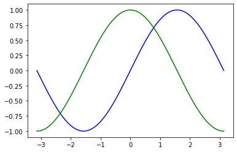
    

#### **标题、刻度、坐标轴、图例**

```python
import numpy as np
import matplotlib.pyplot as plt


x1 = np.linspace(-np.pi,np.pi,1000)
y1 = np.sin(x1)

x2 = np.linspace(-np.pi,np.pi,1000)
y2 = np.cos(x2)

plt.figure()
plt.plot(x1,y1,'b',label='sinx')
plt.plot(x2,y2,'g',label='cosx')

# 标题
plt.title('f(x) = sin(x) / cos(x)')

# 图例
plt.legend()

# 坐标轴
plt.xlabel('xx')
plt.ylabel('yy')

# 刻度
plt.xlim(-2,2)
plt.ylim(-0.75,0.75)
plt.savefig('sin1.jpg')
plt.show()
```


    
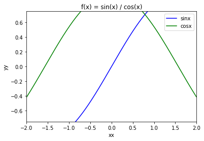
    

#### **柱状图**

```python
import numpy as np
import matplotlib.pyplot as plt


x = [1,2,3,4]
y = [10,40,12,100]


plt.figure()
plt.bar(x,y)
plt.show()
```


    
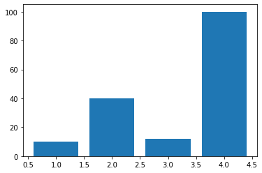
    

#### **横向柱状图**

```python
import numpy as np
import matplotlib.pyplot as plt


x = [1,2,3,4]
y = [10,40,12,100]


plt.figure()
plt.barh(x,y)
plt.show()
```


    
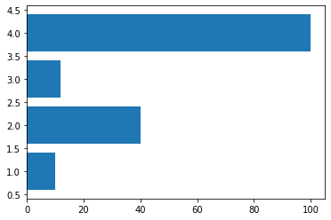
    
#### **直方图**


```python
import numpy as np
import matplotlib.pyplot as plt

y = [10,40,12,100]


plt.figure()
plt.hist(y)
plt.show()
```


    
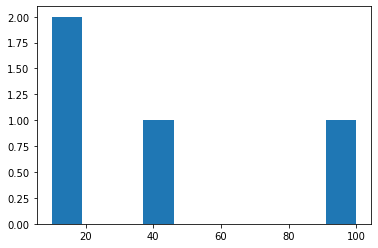
    

#### **饼图**

```python
import numpy as np
import matplotlib.pyplot as plt

y = [10,40,12,100]


plt.figure()
plt.pie(y)
plt.show()
```


    

    

#### **极坐标图**

```python
import numpy as np
import matplotlib.pyplot as plt

y = [10,40,12,100]


plt.figure()
plt.polar(y)
plt.show()
```


    
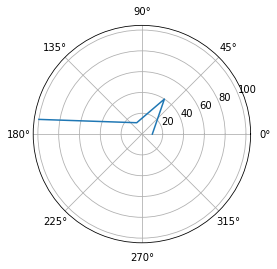
    

#### **散点图**

```python
import numpy as np
import matplotlib.pyplot as plt


x = [1,2,3,4]
y = [10,40,12,100]


plt.figure()
plt.scatter(x,y)
plt.show()
```


    
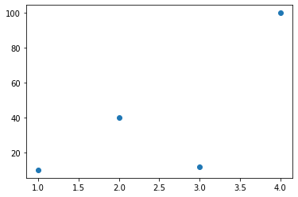
    

#### **棉棒图**

```python
import numpy as np
import matplotlib.pyplot as plt


x = [1,2,3,4]
y = [10,40,12,100]


plt.figure()
plt.stem(x,y)
plt.show()
```


    
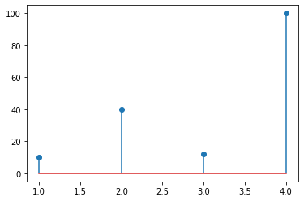
    

#### **箱型图**

```python
import numpy as np
import matplotlib.pyplot as plt


y = [10,40,12,100]


plt.figure()
plt.boxplot(y)
plt.show()
```


    

    

#### **子图**

```python
# 画第1个图：折线图
x=np.arange(1,100)
plt.subplot(221)
plt.plot(x,x*x)
 
# 画第2个图：散点图
plt.subplot(222)
plt.scatter(np.arange(0,10), np.random.rand(10))
 
# 画第3个图：饼图
plt.subplot(223)
plt.pie(x=[15,30,45,10],labels=list('ABCD'),autopct='%.0f',explode=[0,0.05,0,0])
 
# 画第4个图：条形图
plt.subplot(224)
plt.bar([20,10,30,25,15],[25,15,35,30,20],color='b')
plt.show()
```


    
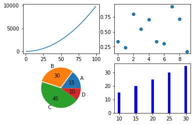
    

#### **绘制多个图**

```python
import warnings
warnings.filterwarnings("ignore")
import numpy as np
import matplotlib.pyplot as plt


x1 = np.linspace(-np.pi,np.pi,1000)
y1 = np.sin(x1)

x2 = np.linspace(-np.pi,np.pi,1000)
y2 = np.cos(x2)

plt.figure()
plt.plot(x1,y1,'b',label='正弦函数')
plt.plot(x2,y2,'g',label='余弦函数')
plt.title('三角函数')
plt.legend()
plt.xlabel('x轴')
plt.ylabel('y轴')
plt.xlim(-2,2)
plt.ylim(-0.75,0.75)
plt.show()
```


    
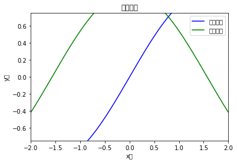
    

#### **解决中文显示问题**

```python
import warnings
warnings.filterwarnings("ignore")
import numpy as np
import matplotlib.pyplot as plt
#指定默认字体
plt.rcParams['font.sans-serif'] = ['SimHei'] 
plt.rcParams['font.family']='sans-serif'
#解决负号'-'显示为方块的问题
plt.rcParams['axes.unicode_minus'] = False

x1 = np.linspace(-np.pi,np.pi,1000)
y1 = np.sin(x1)

x2 = np.linspace(-np.pi,np.pi,1000)
y2 = np.cos(x2)

plt.figure()
plt.plot(x1,y1,'b',label='正弦函数')
plt.plot(x2,y2,'g',label='余弦函数')
plt.title('三角函数')
plt.legend()
plt.xlabel('x轴')
plt.ylabel('y轴')
plt.show()
```


    
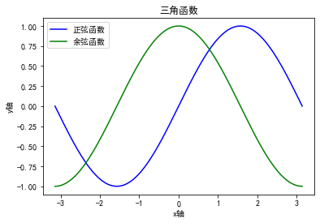
    


### **pandas常用操作**


#### **创建数据表**

```python
import pandas as pd

df = pd.DataFrame([['nanjing',1],['beijing',2],['shanghai',3]],columns=['name','value'])
df
```


<div>
<table border="1" class="dataframe">
  <thead>
    <tr style="text-align: right;">
      <th></th>
      <th>name</th>
      <th>value</th>
    </tr>
  </thead>
  <tbody>
    <tr>
      <th>0</th>
      <td>nanjing</td>
      <td>1</td>
    </tr>
    <tr>
      <th>1</th>
      <td>beijing</td>
      <td>2</td>
    </tr>
    <tr>
      <th>2</th>
      <td>shanghai</td>
      <td>3</td>
    </tr>
  </tbody>
</table>
</div>


#### **读取excel**


```python
df = pd.read_excel('./examples/example1.xlsx')
df
```


<div>
<table border="1" class="dataframe">
  <thead>
    <tr style="text-align: right;">
      <th></th>
      <th>name</th>
      <th>value</th>
    </tr>
  </thead>
  <tbody>
    <tr>
      <th>0</th>
      <td>nanjing</td>
      <td>1</td>
    </tr>
    <tr>
      <th>1</th>
      <td>beijing</td>
      <td>2</td>
    </tr>
    <tr>
      <th>2</th>
      <td>shanghai</td>
      <td>3</td>
    </tr>
  </tbody>
</table>
</div>


#### **读取csv**

```python
df = pd.read_csv('./examples/example2.csv')
df
```


<div>
<table border="1" class="dataframe">
  <thead>
    <tr style="text-align: right;">
      <th></th>
      <th>name</th>
      <th>value</th>
    </tr>
  </thead>
  <tbody>
    <tr>
      <th>0</th>
      <td>nanjing</td>
      <td>1</td>
    </tr>
    <tr>
      <th>1</th>
      <td>beijing</td>
      <td>2</td>
    </tr>
    <tr>
      <th>2</th>
      <td>shanghai</td>
      <td>3</td>
    </tr>
  </tbody>
</table>
</div>


#### **读取txt**

```python
df = pd.read_csv('./examples/example3.txt',sep='\t')
df
```


<div>
<table border="1" class="dataframe">
  <thead>
    <tr style="text-align: right;">
      <th></th>
      <th>name</th>
      <th>value</th>
    </tr>
  </thead>
  <tbody>
    <tr>
      <th>0</th>
      <td>nanjing</td>
      <td>1</td>
    </tr>
    <tr>
      <th>1</th>
      <td>beijing</td>
      <td>2</td>
    </tr>
    <tr>
      <th>2</th>
      <td>shanghai</td>
      <td>3</td>
    </tr>
  </tbody>
</table>
</div>


#### **按分隔符读取txt**

```python
df = pd.read_csv('./examples/example3.txt',sep='\t',header=None)
df
```


<div>
<table border="1" class="dataframe">
  <thead>
    <tr style="text-align: right;">
      <th></th>
      <th>0</th>
      <th>1</th>
    </tr>
  </thead>
  <tbody>
    <tr>
      <th>0</th>
      <td>name</td>
      <td>value</td>
    </tr>
    <tr>
      <th>1</th>
      <td>nanjing</td>
      <td>1</td>
    </tr>
    <tr>
      <th>2</th>
      <td>beijing</td>
      <td>2</td>
    </tr>
    <tr>
      <th>3</th>
      <td>shanghai</td>
      <td>3</td>
    </tr>
  </tbody>
</table>
</div>


#### **指定标题行**

```python
df = pd.read_csv('./examples/example3.txt',sep='\t',header=0)
df
```


<div>
<table border="1" class="dataframe">
  <thead>
    <tr style="text-align: right;">
      <th></th>
      <th>name</th>
      <th>value</th>
    </tr>
  </thead>
  <tbody>
    <tr>
      <th>0</th>
      <td>nanjing</td>
      <td>1</td>
    </tr>
    <tr>
      <th>1</th>
      <td>beijing</td>
      <td>2</td>
    </tr>
    <tr>
      <th>2</th>
      <td>shanghai</td>
      <td>3</td>
    </tr>
  </tbody>
</table>
</div>


#### **自定义标题**

```python
df = pd.read_csv('./examples/example3.txt',sep='\t',names=['name1','value1'])
df
```


<div>
<table border="1" class="dataframe">
  <thead>
    <tr style="text-align: right;">
      <th></th>
      <th>name1</th>
      <th>value1</th>
    </tr>
  </thead>
  <tbody>
    <tr>
      <th>0</th>
      <td>name</td>
      <td>value</td>
    </tr>
    <tr>
      <th>1</th>
      <td>nanjing</td>
      <td>1</td>
    </tr>
    <tr>
      <th>2</th>
      <td>beijing</td>
      <td>2</td>
    </tr>
    <tr>
      <th>3</th>
      <td>shanghai</td>
      <td>3</td>
    </tr>
  </tbody>
</table>
</div>


#### **跳过数据行**

```python
df = pd.read_csv('./examples/example3.txt',sep='\t',names=['name1','value1'],skiprows=2)
df
```


<div>
<table border="1" class="dataframe">
  <thead>
    <tr style="text-align: right;">
      <th></th>
      <th>name1</th>
      <th>value1</th>
    </tr>
  </thead>
  <tbody>
    <tr>
      <th>0</th>
      <td>beijing</td>
      <td>2</td>
    </tr>
    <tr>
      <th>1</th>
      <td>shanghai</td>
      <td>3</td>
    </tr>
  </tbody>
</table>
</div>


#### **读取前几行**

```python
df = pd.read_csv('./examples/example3.txt',sep='\t',names=['name1','value1'],nrows=2)
df
```


<div>
<table border="1" class="dataframe">
  <thead>
    <tr style="text-align: right;">
      <th></th>
      <th>name1</th>
      <th>value1</th>
    </tr>
  </thead>
  <tbody>
    <tr>
      <th>0</th>
      <td>name</td>
      <td>value</td>
    </tr>
    <tr>
      <th>1</th>
      <td>nanjing</td>
      <td>1</td>
    </tr>
  </tbody>
</table>
</div>


#### **常用方法**

```python
df = pd.read_excel('./examples/example1.xlsx')
df
```


<div>
<table border="1" class="dataframe">
  <thead>
    <tr style="text-align: right;">
      <th></th>
      <th>name</th>
      <th>value</th>
    </tr>
  </thead>
  <tbody>
    <tr>
      <th>0</th>
      <td>nanjing</td>
      <td>1</td>
    </tr>
    <tr>
      <th>1</th>
      <td>beijing</td>
      <td>2</td>
    </tr>
    <tr>
      <th>2</th>
      <td>shanghai</td>
      <td>3</td>
    </tr>
  </tbody>
</table>
</div>


##### **取指定列**

```python
df['name']


output:


    0     nanjing
    1     beijing
    2    shanghai
    Name: name, dtype: object
```


##### **取指定多列**

```python
df[['value','name']]
```


<div>
<table border="1" class="dataframe">
  <thead>
    <tr style="text-align: right;">
      <th></th>
      <th>value</th>
      <th>name</th>
    </tr>
  </thead>
  <tbody>
    <tr>
      <th>0</th>
      <td>1</td>
      <td>nanjing</td>
    </tr>
    <tr>
      <th>1</th>
      <td>2</td>
      <td>beijing</td>
    </tr>
    <tr>
      <th>2</th>
      <td>3</td>
      <td>shanghai</td>
    </tr>
  </tbody>
</table>
</div>


##### **列数值加法**

```python
df['value'] + 10


output:


    0    11
    1    12
    2    13
    Name: value, dtype: int64
```


##### **列字符串拼接**

```python
df['name'] + 'hello'


output：


    0     nanjinghello
    1     beijinghello
    2    shanghaihello
    Name: name, dtype: object
```


##### **替换列值**

```python
df['name'] = df['name'] + 'hello'
df
```


<div>
<table border="1" class="dataframe">
  <thead>
    <tr style="text-align: right;">
      <th></th>
      <th>name</th>
      <th>value</th>
    </tr>
  </thead>
  <tbody>
    <tr>
      <th>0</th>
      <td>nanjinghello</td>
      <td>1</td>
    </tr>
    <tr>
      <th>1</th>
      <td>beijinghello</td>
      <td>2</td>
    </tr>
    <tr>
      <th>2</th>
      <td>shanghaihello</td>
      <td>3</td>
    </tr>
  </tbody>
</table>
</div>


##### **新增列**

```python
df['loc'] = ['zh','zh','zh']
df
```


<div>
<table border="1" class="dataframe">
  <thead>
    <tr style="text-align: right;">
      <th></th>
      <th>name</th>
      <th>value</th>
      <th>loc</th>
    </tr>
  </thead>
  <tbody>
    <tr>
      <th>0</th>
      <td>nanjinghello</td>
      <td>1</td>
      <td>zh</td>
    </tr>
    <tr>
      <th>1</th>
      <td>beijinghello</td>
      <td>2</td>
      <td>zh</td>
    </tr>
    <tr>
      <th>2</th>
      <td>shanghaihello</td>
      <td>3</td>
      <td>zh</td>
    </tr>
  </tbody>
</table>
</div>


##### **转化为np数组**

```python
df.values


output:


    array([['nanjinghello', 1],
           ['beijinghello', 2],
           ['shanghaihello', 3]], dtype=object)
```


##### **转化为list**

```python
df.values.tolist()


output:


    [['nanjinghello', 1], ['beijinghello', 2], ['shanghaihello', 3]]
```


##### **转置**


```python
df.T
```


<div>
<table border="1" class="dataframe">
  <thead>
    <tr style="text-align: right;">
      <th></th>
      <th>0</th>
      <th>1</th>
      <th>2</th>
    </tr>
  </thead>
  <tbody>
    <tr>
      <th>name</th>
      <td>nanjing</td>
      <td>beijing</td>
      <td>shanghai</td>
    </tr>
    <tr>
      <th>value</th>
      <td>1</td>
      <td>2</td>
      <td>3</td>
    </tr>
  </tbody>
</table>
</div>


##### **线状图**

```python
df.plot()
```

    

    

##### **柱状图**


```python
df.plot.bar()
```

    
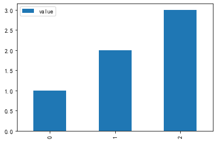
    

##### **横向柱状图**


```python
df.plot.barh()
```
    
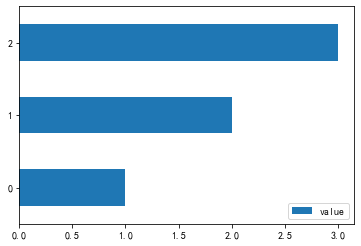
    


##### **箱型图**

```python
df.plot.box()
```
    
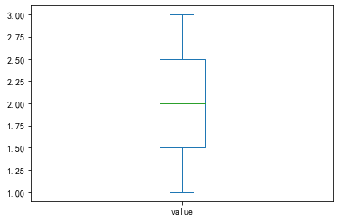
    


##### **饼状图**

```python
df.plot.pie(y='value')
```
    
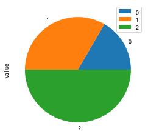
    


##### **遍历**

```python

df = pd.read_excel('./examples/example1.xlsx')

for x in df.values.tolist():
    print(x)


output:


    ['nanjinghello', 1]
    ['beijinghello', 2]
    ['shanghaihello', 3]
```
    

##### **iterrows遍历1**

```python
for x in df.iterrows():
    print(x[1]['name'],x[1]['value'])


output:


    nanjinghello 1
    beijinghello 2
    shanghaihello 3
```
    

##### **iterrows遍历2**

```python
for idx,(name,value) in df.iterrows():
    print(idx,name,value)


output:


    0 nanjinghello 1
    1 beijinghello 2
    2 shanghaihello 3
```

    


##### **均值**

```python
df = pd.read_excel('./examples/example1.xlsx')

df['value'].mean()


output:


    2.0
```


##### **标准差**

```python
df['value'].std()


output:


    1.0
```


##### **apply作用函数**

```python
df = pd.read_excel('./examples/example1.xlsx')
df
```


<div>
<table border="1" class="dataframe">
  <thead>
    <tr style="text-align: right;">
      <th></th>
      <th>name</th>
      <th>value</th>
    </tr>
  </thead>
  <tbody>
    <tr>
      <th>0</th>
      <td>nanjing</td>
      <td>1</td>
    </tr>
    <tr>
      <th>1</th>
      <td>beijing</td>
      <td>2</td>
    </tr>
    <tr>
      <th>2</th>
      <td>shanghai</td>
      <td>3</td>
    </tr>
  </tbody>
</table>
</div>


```python
def process(x):
    return x * x


df['value'] = df['value'].apply(lambda x: process(x))
df
```


<div>
<table border="1" class="dataframe">
  <thead>
    <tr style="text-align: right;">
      <th></th>
      <th>name</th>
      <th>value</th>
    </tr>
  </thead>
  <tbody>
    <tr>
      <th>0</th>
      <td>nanjing</td>
      <td>1</td>
    </tr>
    <tr>
      <th>1</th>
      <td>beijing</td>
      <td>4</td>
    </tr>
    <tr>
      <th>2</th>
      <td>shanghai</td>
      <td>9</td>
    </tr>
  </tbody>
</table>
</div>


##### **多列同时apply**

```python
def process(x):
    return f"{x['name'] + 'world'} - {x['value'] ** 2}"


df['new'] = df.apply(lambda x: process(x), axis=1)
df
```


<div>
<table border="1" class="dataframe">
  <thead>
    <tr style="text-align: right;">
      <th></th>
      <th>name</th>
      <th>value</th>
      <th>new</th>
    </tr>
  </thead>
  <tbody>
    <tr>
      <th>0</th>
      <td>nanjing</td>
      <td>1</td>
      <td>nanjingworld - 1</td>
    </tr>
    <tr>
      <th>1</th>
      <td>beijing</td>
      <td>4</td>
      <td>beijingworld - 16</td>
    </tr>
    <tr>
      <th>2</th>
      <td>shanghai</td>
      <td>9</td>
      <td>shanghaiworld - 81</td>
    </tr>
  </tbody>
</table>
</div>


## **五、jieba分词**


对于中文来说经常需要对一个句子进行词语的切分，而jieba库就是干这个事情

### **安装**

- **`pip install jieba`**

### **分词**


```python
import jieba

text = '我爱北京天安门'

list(jieba.cut(text))


output:


    ['我', '爱', '北京', '天安门']
```


```python
jieba.lcut(text)


output:


    ['我', '爱', '北京', '天安门']
```


```python
# 过滤一定长度

res = jieba.lcut(text)
res = [x for x in res if len(x) >= 2]
res


output:


    ['北京', '天安门']
```


### **词性标注**


```python
import jieba.posseg as pseg

text = '我爱北京天安门'

res = pseg.cut(text)

for word,flag in res:
    print(word,flag)


output:


    我 r
    爱 v
    北京 ns
    天安门 ns

```


    

### **jieba词性表**


```python
# %load ./examples/jieba词性表.txt
1. 名词 (1个一类，7个二类，5个三类)
　　名词分为以下子类：
　　　　n 名词
　　　　nr 人名
　　　　nr1 汉语姓氏
　　　　nr2 汉语名字
　　　　nrj 日语人名
　　　　nrf 音译人名
　　　　ns 地名
　　　　nsf 音译地名
　　　　nt 机构团体名
　　　　nz 其它专名
　　　　nl 名词性惯用语
　　　　ng 名词性语素
2. 时间词(1个一类，1个二类)
　　　　t 时间词
　　　　tg 时间词性语素
3. 处所词(1个一类)
　　　　s 处所词
4. 方位词(1个一类)
　　　　f 方位词
5. 动词(1个一类，9个二类)
　　　　v 动词
　　　　vd 副动词
　　　　vn 名动词
　　　　vshi 动词“是”
　　　　vyou 动词“有”
　　　　vf 趋向动词
　　　　vx 形式动词
　　　　vi 不及物动词（内动词）
　　　　vl 动词性惯用语
　　　　vg 动词性语素
6. 形容词(1个一类，4个二类)
　　　　a 形容词
　　　　ad 副形词
　　　　an 名形词
　　　　ag 形容词性语素
　　　　al 形容词性惯用语
7. 区别词(1个一类，2个二类)
　　　　b 区别词
　　　　bl 区别词性惯用语
8. 状态词(1个一类)
　　　　z 状态词
9. 代词(1个一类，4个二类，6个三类)
　　　　r 代词
　　　　rr 人称代词
　　　　rz 指示代词
　　　　rzt 时间指示代词
　　　　rzs 处所指示代词
　　　　rzv 谓词性指示代词
　　　　ry 疑问代词
　　　　ryt 时间疑问代词
　　　　rys 处所疑问代词
　　　　ryv 谓词性疑问代词
　　　　rg 代词性语素
10. 数词(1个一类，1个二类)
　　　　m 数词
　　　　mq 数量词
11. 量词(1个一类，2个二类)
　　　　q 量词
　　　　qv 动量词
　　　　qt 时量词
12. 副词(1个一类)
　　　　d 副词
13. 介词(1个一类，2个二类)
　　　　p 介词
　　　　pba 介词“把”
　　　　pbei 介词“被”
14. 连词(1个一类，1个二类)
　　　　c 连词
　　　　cc 并列连词
15. 助词(1个一类，15个二类)
　　　　u 助词
　　　　uzhe 着
　　　　ule 了 喽
　　　　uguo 过
　　　　ude1 的 底
　　　　ude2 地
　　　　ude3 得
　　　　usuo 所
　　　　udeng 等 等等 云云
　　　　uyy 一样 一般 似的 般
　　　　udh 的话
　　　　uls 来讲 来说 而言 说来
　　　　uzhi 之
　　　　ulian 连 （“连小学生都会”）
16. 叹词(1个一类)
　　　　e 叹词
17. 语气词(1个一类)
　　　　y 语气词(delete yg)
18. 拟声词(1个一类)
　　　　o 拟声词
19. 前缀(1个一类)
　　　　h 前缀
20. 后缀(1个一类)
　　　　k 后缀
21. 字符串(1个一类，2个二类)
　　　　x 字符串
　　　　xx 非语素字
　　　　xu 网址URL
22. 标点符号(1个一类，16个二类)
　　　　w 标点符号
　　　　wkz 左括号，全角：（ 〔 ［ ｛ 《 【 〖 〈 半角：( [ { <
　　　　wky 右括号，全角：） 〕 ］ ｝ 》 】 〗 〉 半角： ) ] { >
　　　　wyz 左引号，全角：“ ‘ 『
　　　　wyy 右引号，全角：” ’ 』
　　　　wj 句号，全角：。
　　　　ww 问号，全角：？ 半角：?
　　　　wt 叹号，全角：！ 半角：!
　　　　wd 逗号，全角：， 半角：,
　　　　wf 分号，全角：； 半角： ;
　　　　wn 顿号，全角：、
　　　　wm 冒号，全角：： 半角： :
　　　　ws 省略号，全角：…… …
　　　　wp 破折号，全角：—— －－ ——－ 半角：--- ----
　　　　wb 百分号千分号，全角：％ ‰ 半角：%
　　　　wh 单位符号，全角：￥ ＄ ￡ ° ℃ 半角：$
```

### **加载用户词典和停用词**

- **停用词：过滤掉一些分词的结果**
- **用户词典：通过自己的意愿分词**


### **加载停用词**

```python
# 停用词

import jieba

stopwords = ['我']

text = '我爱北京天安门'

res = [x for x in jieba.cut(text) if x not in stopwords]
res


output:


    ['爱', '北京', '天安门']
```


### **增加用户词**

```python
# 增加用户词

import jieba
jieba.add_word('北京天安门')

text = '我爱北京天安门'

res = [x for x in jieba.cut(text)]
res


output:


    ['我', '爱', '北京天安门']
```


### **删除用户词**

```python
# 删除用户词

import jieba
jieba.del_word('北京天安门')

text = '我爱北京天安门'

res = [x for x in jieba.cut(text)]
res


output:


    ['我', '爱', '北京', '天安门']
```


### **加载用户词文件**

```python
# 用户词很多，可以存到一个文件加载

import jieba

jieba.load_userdict("./examples/userdict.txt")

text = '我爱北京天安门'

res = [x for x in jieba.cut(text)]
res


output:


    ['我', '爱', '北京天安门']
```


## **六、pillow**


是一个非常好用的图像处理库


### **安装**

- **`pip install pillow`**

### **读取和创建图像**


```python
import PIL
from PIL import Image
```


```python
# 打开图片

image = Image.open("./images/requests1.png")
image.show()
```

    

    


```python
# 创建一个新的图片

from PIL import Image
 
image = Image.new('RGB', (160, 90), (0, 0, 255))
image
```

    

    


```python
# 常用属性

from PIL import Image
 
image = Image.open("./images/requests1.png")
print('width: ', image.width)
print('height: ', image.height)
print('size: ', image.size)
print('mode: ', image.mode)
print('format: ', image.format)
print('category: ', image.category)
print('readonly: ', image.readonly)
print('info: ', image.info)


output:


    width:  929
    height:  312
    size:  (929, 312)
    mode:  RGBA
    format:  PNG
    category:  0
    readonly:  1
    info:  {'srgb': 0, 'gamma': 0.45455, 'dpi': (96, 96)}
```
    

### **图片的模式和模式转换**


|**mode**|**描述**|
|---|---|
|**1**|**1位像素，黑白，每字节存储一个像素**|
|**L**|**8位像素，黑白**|
|**P**|**8位像素，使用调色板映射到任何其他模式**|
|**RGB**|**3x8位像素，真彩**|
|**RGBA**|**4x8位像素，带透明蒙版的真彩**|
|**CMYK**|**4x8位像素，分色**|
|**YCbCr**|**3x8位像素，彩色视频格式**|
|**LAB**|**3x8位像素，[L,a,b]颜色空间**|
|**HSV**|**3x8位像素，色相，饱和度，值颜色空间**|
|**I**|**32位有符号整数像素**|
|**F**|**2位浮点像素**|


#### **图片模式**


```python
from PIL import Image
 
image = Image.open("./images/requests1.png")

print(image.mode)     #     RGBA

image
```

    
    

    

#### **模式转化**


```python
image1 = image.convert('1')

print(image1.mode)       #     1

image1
```

    

    


```python
image2 = image.convert('L')
print(image2.mode)          #     L
image2
```
    
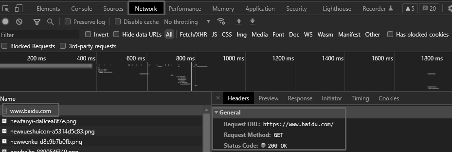
    


```python
image3 = image.convert('P')     #     P
print(image3.mode)
image3
```

    

    


### **图片拷贝粘贴和保存**


```python
## 拷贝

from PIL import Image
 
image = Image.open("./images/requests1.png")


image_copy = image.copy()
image_copy
```

    

    


```python
## 粘贴

image_new = Image.new('RGB', (160, 90), (0, 0, 255))
image_new2 = Image.new('L', (160, 90), '#646464')
image_copy.paste(image_new, (100, 100, 260, 190), mask=image_new2)
image_copy
```

    

    


```python
## 保存

image_copy.save('./images/new.png')

image = Image.open("./images/new.png")
image
```


    

    


### **图片的裁剪、缩放、旋转**


```python
## 图片尺寸

from PIL import Image
 
image = Image.open("./images/new.png")
image.size


output:


    (929, 312)
```

#### **缩放**


```python
## 缩放

image1 = image.resize((300,300))
image1
```

    

    

#### **裁剪**


```python
## 裁剪：box表示裁剪的区域，传入长度为4的元组(x0, y0, x1, y1)，不传默认为拷贝原图

image.crop(box=(0, 0, 100, 100))
```


    

#### **旋转**


```python
## 旋转45度

image.rotate(45)
```

    
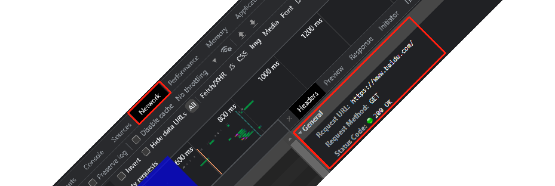
    


```python
image.rotate(270)
```


    

    

#### **对换**


```python
image.transpose(Image.FLIP_LEFT_RIGHT)       #左右对换。
```


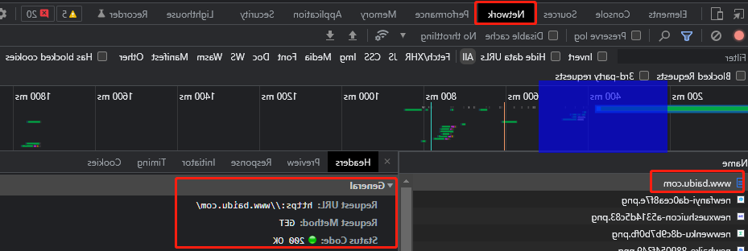
    


```python
image.transpose(Image.FLIP_TOP_BOTTOM)       #上下对换。
```
    
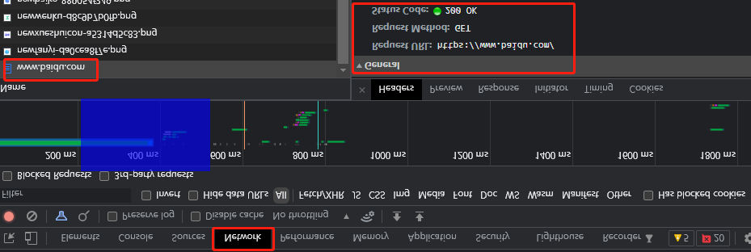
    


### **Filter**


```python
from PIL import Image, ImageFilter 
im = Image.open('./images/new.png') 

# 高斯模糊 
im.filter(ImageFilter.GaussianBlur) 
```
    

    


```python
# 普通模糊 

im.filter(ImageFilter.BLUR) 
```
    

    

```python
# 边缘增强 

im.filter(ImageFilter.EDGE_ENHANCE) 
```


    


```python
# 找到边缘 

im.filter(ImageFilter.FIND_EDGES) 
```

    
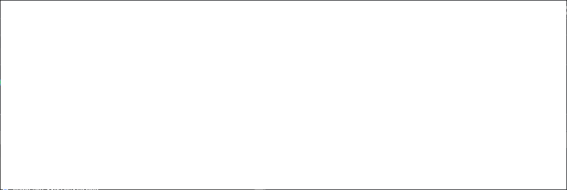
    


```python
# 浮雕 

im.filter(ImageFilter.EMBOSS) 
```
  

    


```python
# 轮廓 

im.filter(ImageFilter.CONTOUR) 
```

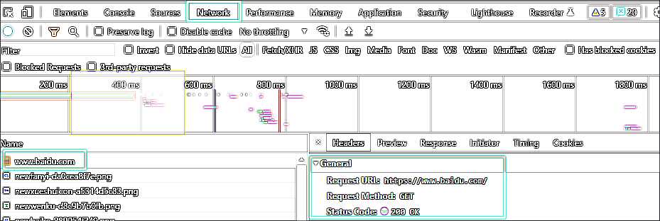
    


```python
# 锐化

im.filter(ImageFilter.SHARPEN) 
```

    
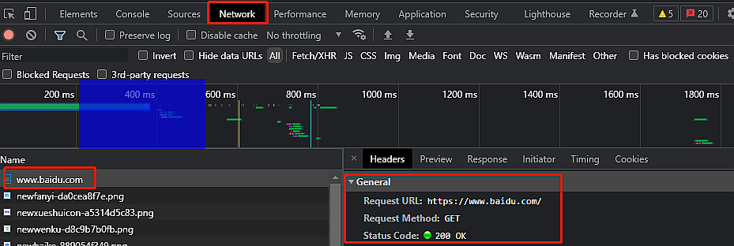
    


```python
# 平滑 

im.filter(ImageFilter.SMOOTH) 
```

    

    


```python
# 细节 

im.filter(ImageFilter.DETAIL)
```

 

    


### **对比度**


```python
from PIL import Image  
from PIL import ImageEnhance 

image = Image.open('./images/new.png') 
image
```


    


```python
#亮度增强  

enh_bri = ImageEnhance.Brightness(image)  
brightness = 1.5  
image_brightened = enh_bri.enhance(brightness) 
image_brightened 
```

    

    


```python
#色度增强 

enh_col = ImageEnhance.Color(image)  
color = 1.5  
image_colored = enh_col.enhance(color) 
image_colored
```


    


```python
#对比度增强 

enh_con = ImageEnhance.Contrast(image)  
contrast = 1.5  
image_contrasted = enh_con.enhance(contrast) 
image_contrasted
```

    

    


```python
#锐度增强 

enh_sha = ImageEnhance.Sharpness(image)  
sharpness = 3.0  
image_sharped = enh_sha.enhance(sharpness) 
image_sharped
```


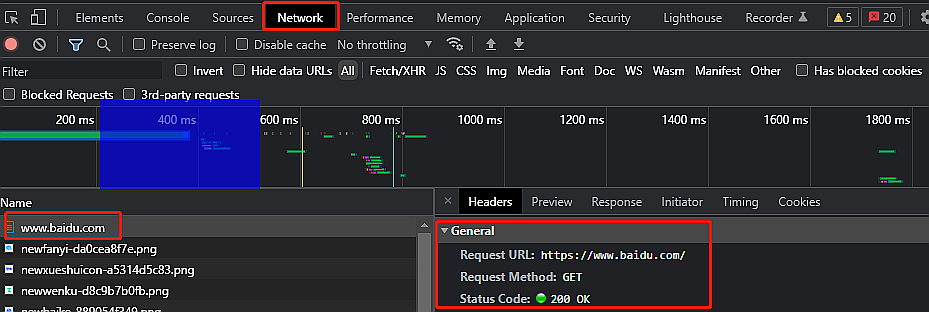
    


## **七、opencv**


opencv是一个计算机视觉处理库，里面除了包含图片处理之外还有很多视觉算法，非常强大

### **安装**

- **`pip install opencv-python`**
- **`pip install opencv-contrib-python`**

### **导入**

- **`import cv2`**


### **图像读取和显示**


```python
import cv2

image = cv2.imread('./images/new.png')
image


output:


    array([[[36, 33, 32],
            [36, 33, 32],
            [36, 33, 32],
            ...,
            [36, 33, 32],
            [36, 33, 32],
            [36, 33, 32]],
    
           [[36, 33, 32],
            [36, 33, 32],
            [36, 33, 32],
            ...,
            [36, 33, 32],
            [36, 33, 32],
            [36, 33, 32]],
    
           [[36, 33, 32],
            [36, 33, 32],
            [36, 33, 32],
            ...,
            [36, 33, 32],
            [36, 33, 32],
            [36, 33, 32]],
    
           ...,
    
           [[41, 41, 41],
            [41, 41, 41],
            [41, 41, 41],
            ...,
            [36, 33, 32],
            [36, 33, 32],
            [36, 33, 32]],
    
           [[41, 41, 41],
            [41, 41, 41],
            [41, 41, 41],
            ...,
            [36, 33, 32],
            [36, 33, 32],
            [36, 33, 32]],
    
           [[41, 41, 41],
            [41, 41, 41],
            [41, 41, 41],
            ...,
            [36, 33, 32],
            [36, 33, 32],
            [36, 33, 32]]], dtype=uint8)

```


```python
cv2.imshow('image',image)
```


```python
image.shape


output:


    (312, 929, 3)
```


### **保存图像**


```python
cv2.imwrite('./images/new1.png',image)
```


### **绘制几何图像**


```python
import numpy as np
import cv2
import matplotlib.pyplot as plt

# 1 创建一个空白的图像
img = np.zeros((512,512,3), np.uint8)

# 2 绘制图形
cv2.line(img,(0,0),(511,511),(255,0,0),5)
cv2.rectangle(img,(384,0),(510,128),(0,255,0),3)
cv2.circle(img,(447,63), 63, (0,0,255), -1)
font = cv2.FONT_HERSHEY_SIMPLEX
cv2.putText(img,'OpenCV',(10,500), font, 4,(255,255,255),2,cv2.LINE_AA)

# 3 图像展示
plt.imshow(img[:,:,::-1])
plt.show()
```


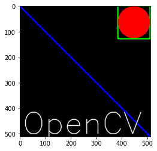
    


### **色彩空间的改变**


```python
import numpy as np
import cv2
import matplotlib.pyplot as plt

image = cv2.imread('./images/new.png')
image1 = cv2.cvtColor(image,cv2.COLOR_BGR2GRAY)

plt.imshow(image1)
plt.show()
```


    
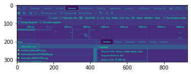
    


### **人脸识别**


```python
import cv2
import numpy as np

# 加载OpenCV人脸检测分类器Haar
face_cascade = cv2.CascadeClassifier("D:/anaconda/Lib/site-packages/cv2/data/haarcascade_frontalface_default.xml")

# # 准备好识别方法LBPH方法
# recognizer = cv2.face.LBPHFaceRecognizer_create()


img = cv2.imread('./images/face.jpg')

gray = cv2.cvtColor(img, cv2.COLOR_BGR2GRAY)


# 检测人脸，将每一帧摄像头记录的数据带入OpenCv中，让Classifier判断人脸
# 其中gray为要检测的灰度图像，1.3为每次图像尺寸减小的比例，5为minNeighbors
faces = face_cascade.detectMultiScale(gray,1.3,6)

# 框选人脸，for循环保证一个能检测的实时动态视频流
for idx,(x, y, w, h) in enumerate(faces):
    # xy为左上角的坐标,w为宽，h为高，用rectangle为人脸标记画框
    cv2.rectangle(img, (x, y), (x + w, y + w), (255, 0, 0))
    # 保存图像，把灰度图片看成二维数组来检测人脸区域，这里是保存在data缓冲文件夹内
    cv2.imwrite(f"./images/{idx}.jpg", gray[y:y + h, x:x + w])

```

### **打开视频和调用摄像头**


```python
# %load readvideo.py
import cv2 as cv

if __name__ == '__main__':
    video = cv.VideoCapture()
    video.open('./examples/1.mp4')
    #判断是否成功创建视频流
    while video.isOpened():
        ret,frame = video.read()
        print(ret)
        if ret is True:
            cv.imshow('video: ./examples/1.mp4',frame)
            #设置播放速速
            cv.waitKey(int(1000 / video.get(cv.CAP_PROP_FPS)))
            #按下q键退出
            if cv.waitKey(1) & 0xFF == ord('q'):
                break
                    #输出相关参数信息
    print('视频中的图像宽度{}'.format(video.get(cv.CAP_PROP_FRAME_WIDTH))) 
    print('视频中的图像高度{}'.format(video.get(cv.CAP_PROP_FRAME_HEIGHT))) 
    print('视频帧率{}'.format(video.get(cv.CAP_PROP_FPS))) 
    print('视频帧数{}'.format(video.get(cv.CAP_PROP_FRAME_COUNT))) 
    #释放资源并关闭窗口
    video.release()
    cv.destroyAllWindows()
```


## 赞赏

::: tip

**读后若有收获，可以微信请作者喝咖啡：**


:::