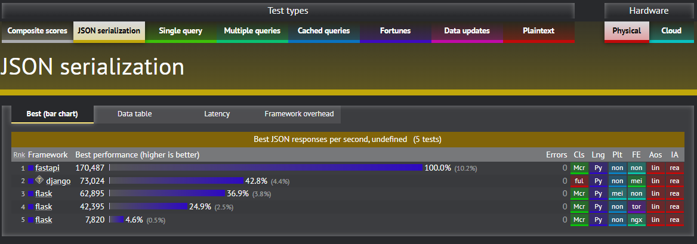

**摘要：PythonWeb开发：FastAPI**

<!-- more -->

::: warning 警告
**我年纪轻轻就学会了`Python`编程**

**来自：`HanamakiX`**
:::

## **本章目录**

   - **FastAPI**


## **一、FastAPI**


和Flask类似，FastAPI也是一个web框架，对于实现Restful API非常简单友好，那么就会有人问了，既然都有了Flask为什么还需要使用FastAPI呢？

首先，我们来了解一下什么是FastAPI：


FastAPI 是一个现代、快速（高性能）的 Web 框架，用于基于标准 Python 类型提示使用 Python 3.6+ 构建 API。

主要特点是：

- 快速：非常高的性能，与NodeJS和Go相当（感谢 Starlette 和 Pydantic）。可用的最快的 Python 框架之一。

- 快速编码：将开发功能的速度提高约 200% 到 300%。*

- 更少的错误：减少约 40% 的人为（开发人员）导致的错误。*

- 直观：出色的编辑器支持。到处完成。更少的调试时间。

- 简单：旨在易于使用和学习。减少阅读文档的时间。

- Short : 尽量减少代码重复。每个参数声明的多个功能。更少的错误。

- 健壮：获取生产就绪的代码。具有自动交互式文档。

- 基于标准：基于（并完全兼容）API 的开放标准：OpenAPI（以前称为 Swagger）和JSON Schema。

### **Web框架性能对比：源自https://www.techempower.com/**




### **安装**

- **`pip install fastapi`**
- **`pip install uvicorn`**
- **可选：`pip install uvicorn[standard]`**
- **可选：`pip install python-multipart`，支持form-data**


### **FastAPI：GET**


```python
# %load ./examples/app1.py
import uvicorn
from fastapi import FastAPI,Request


app = FastAPI()


@app.get('/test')
async def test1():
    return {'result': '这是一个GET'}


@app.post('/test/{apiname}')
async def test2(apiname):
    """
    /test/<apiname>：后面的apiname表示任意名字
    """
    return {'result': f'这是一个GET，您请求的是：{apiname}'}


if __name__ == '__main__':
    uvicorn.run(
        app = app,
        host = "0.0.0.0",
        port = 5678
    )
```


```python
import requests as rq

url = 'http://localhost:5678/test'

rq.get(url).json()


output:


    {'result': '这是一个GET'}
```


```python
import requests as rq

url = 'http://localhost:5678/test/heiheihei'

rq.get(url).json()


output:


    {'result': '这是一个GET，您请求的是：heiheihei'}
```


### **FastAPI：自动生成API文档**

**直接在启动的接口地址后面写`/docs`访问即可**

- **比如上文接口：http://localhost:5678/docs**

### **FastAPI：POST**


```python
# %load ./examples/app2.py
import uvicorn
from fastapi import FastAPI,Request


app = FastAPI()


@app.post('/test')
async def test1():
    return {'result': '这是一个POST'}


@app.post('/test/{apiname}')
async def test2(apiname, request: Request):
    """
    /test/<apiname>：后面的apiname表示任意名字
    """

    args = await request.json()

    return {'result': f'这是一个POST，您请求的是：{apiname}，您的参数是：{args}'}


if __name__ == '__main__':
    uvicorn.run(
        app = app,
        host = "0.0.0.0",
        port = 5678
    )
```


```python
import requests as rq

url = 'http://localhost:5678/test'

rq.post(url).json()


output:


    {'result': '这是一个POST'}
```


```python
import requests as rq

url = 'http://localhost:5678/test/heihei'


args = {"name": "test", "passwd": "123456"}

rq.post(url,json = args).json()


output:


    {'result': "这是一个POST，您请求的是：heihei，您的参数是：{'name': 'test', 'passwd': '123456'}"}
```


### **FastAPI：蓝图**

蓝图的功能和其它框架很类似，便于管理：

当我们项目非常大，接口非常多的时候，直接书写接口会很难管理，这时就可以使用蓝图功能对此进行分类管理。


```python
# %load ./examples/app3.py
import uvicorn
from fastapi import FastAPI,Request,APIRouter


router = APIRouter(prefix='/bp',tags = ['bp'])


# @router.get('/test')
# @router.post("/test")
@router.api_route("/test",methods=['GET','POST'])
async def test1():
    return {'result': '这是一个GET或者POST'}


@router.post('/test/{apiname}')
# @router.get('/test/{apiname}')
# @router.api_route('/test/{apiname}',methods=['POST'])
async def test2(apiname, request: Request):
    """
    /test/<apiname>：后面的apiname表示任意名字
    """

    args = await request.json()

    return {'result': f'这是一个GET，您请求的是：{apiname}，您的参数是：{args}'}


app = FastAPI()
app.include_router(router)


if __name__ == '__main__':
    uvicorn.run(
        app = app,
        host = "0.0.0.0",
        port = 5678
    )
```


```python
import requests as rq

url = 'http://localhost:5678/bp/test'

rq.get(url).json()


output:


    {'result': '这是一个GET或者POST'}
```


```python
import requests as rq

url = 'http://localhost:5678/bp/test'

rq.post(url).json()


output:


    {'result': '这是一个GET或者POST'}
```


```python
import requests as rq

url = 'http://localhost:5678/bp/test/heihei'


args = {"name": "test", "passwd": "123456"}

rq.post(url,json = args).json()


output:


    {'result': "这是一个GET，您请求的是：heihei，您的参数是：{'name': 'test', 'passwd': '123456'}"}
```


### **FastAPI：渲染HTNL**


```python
# %load ./examples/app4.py
import uvicorn
from fastapi import FastAPI
from fastapi.responses import HTMLResponse

app = FastAPI()


@app.get("/index")
async def read_items():
    html_content = """
    <html>
        <head>
            <title>index</title>
        </head>
        <body>
            <h1>花卷老师真帅!</h1>
        </body>
    </html>
    """
    return HTMLResponse(content=html_content, status_code=200)


if __name__ == '__main__':
    uvicorn.run(
        app = app,
        host = "0.0.0.0",
        port = 5678
    )
```

#### **渲染本地HTML文件**


```python
# %load ./examples/app5.py

import uvicorn
from fastapi import FastAPI


# 导入Request上下文对象，用来在前后台之间传递参数
from starlette.requests import Request

from starlette.staticfiles import StaticFiles
# 导入jinja2模板引擎对象，用于后续使用
from starlette.templating import Jinja2Templates


app = FastAPI()


app.mount("/static", StaticFiles(directory="static"), name="static")
# 实例化一个模板引擎对象，指定模板所在路径
templates=Jinja2Templates(directory='templates')

@app.get("/sign")
async def read_items(request: Request):
    # 返回一个模板对象，同时使用上下文中的数据对模板进行渲染
    return templates.TemplateResponse(name='sign.html',context = {'request':request})


@app.post("/sign")
async def read_sign(request: Request):
    args = await request.form()
    username = args['username']
    passwd = args['password']
    print(username,passwd)
    # 返回一个模板对象，同时使用上下文中的数据对模板进行渲染

    if username == 'test' and passwd == '123456':
        return templates.TemplateResponse(name='success.html',context = {'request':request,'username':username})
    return templates.TemplateResponse(name='bad.html',context = {'request':request})


if __name__ == '__main__':
    uvicorn.run(
        app = app,
        host = "0.0.0.0",
        port = 5678
    )
```

::: tip 提示
**更多教程访问官网：https://fastapi.tiangolo.com**
:::


## **小结**

- **Flask：轻量型网站**
- **FastAPI：更适用于实现API**
- **Django：大型网站**


## 赞赏

::: tip

**读后若有收获，可以微信请作者喝咖啡：**


:::