**摘要：Python人工智能开发导读**

<!-- more -->

::: warning 警告
**我年纪轻轻就学会了`Python`编程**

**来自：`HanamakiX`**
:::

## **本章目录**

   - **人工智能**
   - **机器学习**
   - **深度学习**
   - **自然语言处理：NLP**
   - **计算机视觉：CV**
   - **语音处理：Speech**


## **一、人工智能**


人工智能（Artificial Intelligence），英文缩写为AI。它是研究、开发用于模拟、延伸和扩展人的智能的理论、方法、技术及应用系统的一门新的技术科学。

人工智能是计算机科学的一个分支，它企图了解智能的实质，并生产出一种新的能以人类智能相似的方式做出反应的智能机器，该领域的研究包括机器人、语言识别、图像识别、自然语言处理和专家系统等。人工智能从诞生以来，理论和技术日益成熟，应用领域也不断扩大，可以设想，未来人工智能带来的科技产品，将会是人类智慧的“容器”。人工智能可以对人的意识、思维的信息过程的模拟。人工智能不是人的智能，但能像人那样思考、也可能超过人的智能。

人工智能是一门极富挑战性的科学，从事这项工作的人必须懂得计算机知识，心理学和哲学。人工智能是包括十分广泛的科学，它由不同的领域组成，如机器学习，计算机视觉等等，总的说来，人工智能研究的一个主要目标是使机器能够胜任一些通常需要人类智能才能完成的复杂工作。但不同的时代、不同的人对这种“复杂工作”的理解是不同的。2017年12月，人工智能入选“2017年度中国媒体十大流行语”。2021年9月25日，为促进人工智能健康发展，《新一代人工智能伦理规范》发布。

### **科学介绍**


#### **实际应用**

机器视觉，指纹识别，人脸识别，视网膜识别，虹膜识别，掌纹识别，专家系统，自动规划，智能搜索，定理证明，博弈，自动程序设计，智能控制，机器人学，语言和图像理解，遗传编程等。

#### **学科范畴**

人工智能是一门边缘学科，属于自然科学和社会科学的交叉。

#### **涉及学科**

哲学和认知科学，数学，神经生理学，心理学，计算机科学，信息论，控制论，不定性论

#### **研究范畴**

自然语言处理，知识表现，智能搜索，推理，规划，机器学习，知识获取，组合调度问题，感知问题，模式识别，逻辑程序设计软计算，不精确和不确定的管理，人工生命，神经网络，复杂系统，遗传算法

#### **意识和人工智能**

人工智能就其本质而言，是对人的思维的信息过程的模拟。


对于人的思维模拟可以从两条道路进行，一是结构模拟，仿照人脑的结构机制，制造出“类人脑”的机器；二是功能模拟，暂时撇开人脑的内部结构，而从其功能过程进行模拟。现代电子计算机的产生便是对人脑思维功能的模拟，是对人脑思维的信息过程的模拟。

弱人工智能如今不断地迅猛发展，尤其是2008年经济危机后，美日欧希望借机器人等实现再工业化，工业机器人以比以往任何时候更快的速度发展，更加带动了弱人工智能和相关领域产业的不断突破，很多必须用人来做的工作如今已经能用机器人实现。

而强人工智能则暂时处于瓶颈，还需要科学家们和人类的努力。


### **常用领域**

- 视觉
- 自然语言
- 语音
- 推荐系统
- 知识图谱
- 博弈与控制
- 等等

### **常用方法**

- 机器学习
- 深度学习
- 对比学习
- 强化学习
- 连邦学习


## **二、机器学习**


机器学习是一门多领域交叉学科，涉及概率论、统计学、逼近论、凸分析、算法复杂度理论等多门学科。专门研究计算机怎样模拟或实现人类的学习行为，以获取新的知识或技能，重新组织已有的知识结构使之不断改善自身的性能。

它是人工智能核心，是使计算机具有智能的根本途径。

### **常用方法：对输入做出预测**

- 分类：输出类别，是离散的
- 回归：输出值，是连续的

### **常见场景**

- 有监督学习： 有标签
- 无监督学习：无标签

### **常见算法**

- 支持向量机：SVM
- 逻辑回归
- 最近邻：knn
- 决策树
- 贝叶斯
- 聚类：KMeans
- 集成学习

### **常见结果**

- 过拟合
- 欠拟合

### **常见指标**

- AUC
- ROC
- 困惑矩阵
- 准确率
- 精度
- 召回
- F1-score

### **Python常用机器学习包**

- numpy
- scikit-learn


### **机器学习：scikit-learn**

scikit-learn（以前称为scikits.learn，也称为sklearn）是针对Python 编程语言的免费软件机器学习库。它具有各种分类，回归和聚类算法，包括支持向量机，随机森林，梯度提升，k均值和DBSCAN，并且旨在与Python数值科学库NumPy和SciPy联合使用。

Scikit-learn主要是用Python编写的，并且广泛使用numpy进行高性能的线性代数和数组运算。此外，用Cython编写了一些核心算法来提高性能。支持向量机由围绕LIBSVM的Cython包装器实现 ; 逻辑回归和线性支持向量机的相似包装围绕LIBLINEAR。在这种情况下，可能无法使用Python扩展这些方法。

Scikit-learn与许多其他Python库很好地集成在一起，例如matplotlib和plotly用于绘图，numpy用于数组矢量化，pandas数据帧，scipy等。

#### **安装**

- **`pip install scikit-learn`**

#### **导入**

- **`from sklearn import ...`**

#### **支持向量机：SVM**


Svm（support Vector Mac）又称为支持向量机，是一种二分类的模型。当然如果进行修改之后也是可以用于多类别问题的分类。支持向量机可以分为线性核非线性两大类。其主要思想为找到空间中的一个更够将所有数据样本划开的超平面，并且使得本本集中所有数据到这个超平面的距离最短。


#### **SVM分类算法**


##### **加载数据集**

```python
import numpy as np
import matplotlib.pyplot as plt
from sklearn import svm, datasets

iris = datasets.load_iris()
X = iris.data[:, :2]
y = iris.target

print(X[:10],y)


output:


    [[5.1 3.5]
     [4.9 3. ]
     [4.7 3.2]
     [4.6 3.1]
     [5.  3.6]
     [5.4 3.9]
     [4.6 3.4]
     [5.  3.4]
     [4.4 2.9]
     [4.9 3.1]] [0 0 0 0 0 0 0 0 0 0 0 0 0 0 0 0 0 0 0 0 0 0 0 0 0 0 0 0 0 0 0 0 0 0 0 0 0
     0 0 0 0 0 0 0 0 0 0 0 0 0 1 1 1 1 1 1 1 1 1 1 1 1 1 1 1 1 1 1 1 1 1 1 1 1
     1 1 1 1 1 1 1 1 1 1 1 1 1 1 1 1 1 1 1 1 1 1 1 1 1 1 2 2 2 2 2 2 2 2 2 2 2
     2 2 2 2 2 2 2 2 2 2 2 2 2 2 2 2 2 2 2 2 2 2 2 2 2 2 2 2 2 2 2 2 2 2 2 2 2
     2 2]

```

##### **训练**

```python
model = svm.SVC()
model.fit(X, y)
```

##### **评估**

```python
model.score(X,y)


output:


    0.82
```


##### **预测**

```python
model.predict([X[0]])
# X[0]


output:


    array([0])
```


##### **案例1**

```python
import numpy as np
import matplotlib.pyplot as plt
from sklearn import svm, datasets


def make_meshgrid(x, y, h=0.02):
    x_min, x_max = x.min() - 1, x.max() + 1
    y_min, y_max = y.min() - 1, y.max() + 1
    xx, yy = np.meshgrid(np.arange(x_min, x_max, h), np.arange(y_min, y_max, h))
    return xx, yy


def plot_contours(ax, clf, xx, yy, **params):
    Z = clf.predict(np.c_[xx.ravel(), yy.ravel()])
    Z = Z.reshape(xx.shape)
    out = ax.contourf(xx, yy, Z, **params)
    return out


iris = datasets.load_iris()
X = iris.data[:, :2]
y = iris.target

C = 1.0  # SVM regularization parameter
models = (
    svm.SVC(kernel="linear", C=C),
    svm.LinearSVC(C=C, max_iter=10000),
    svm.SVC(kernel="rbf", gamma=0.7, C=C),
    svm.SVC(kernel="poly", degree=3, gamma="auto", C=C),
)
models = (clf.fit(X, y) for clf in models)

titles = (
    "SVC with linear kernel",
    "LinearSVC (linear kernel)",
    "SVC with RBF kernel",
    "SVC with polynomial (degree 3) kernel",
)

fig, sub = plt.subplots(2, 2)
plt.subplots_adjust(wspace=0.4, hspace=0.4)

X0, X1 = X[:, 0], X[:, 1]
xx, yy = make_meshgrid(X0, X1)

for clf, title, ax in zip(models, titles, sub.flatten()):
    plot_contours(ax, clf, xx, yy, cmap=plt.cm.coolwarm, alpha=0.8)
    ax.scatter(X0, X1, c=y, cmap=plt.cm.coolwarm, s=20, edgecolors="k")
    ax.set_xlim(xx.min(), xx.max())
    ax.set_ylim(yy.min(), yy.max())
    ax.set_xlabel("Sepal length")
    ax.set_ylabel("Sepal width")
    ax.set_xticks(())
    ax.set_yticks(())
    ax.set_title(title)

plt.show()
```


    
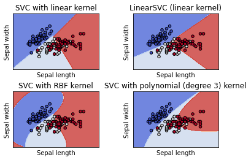
    

##### **案例2**

```python
import numpy as np
import matplotlib.pyplot as plt

from sklearn import svm, datasets
from sklearn.metrics import auc
from sklearn.metrics import RocCurveDisplay
from sklearn.model_selection import StratifiedKFold

# #############################################################################
# Data IO and generation

# Import some data to play with
iris = datasets.load_iris()
X = iris.data
y = iris.target
X, y = X[y != 2], y[y != 2]
n_samples, n_features = X.shape

# Add noisy features
random_state = np.random.RandomState(0)
X = np.c_[X, random_state.randn(n_samples, 200 * n_features)]

# #############################################################################
# Classification and ROC analysis

# Run classifier with cross-validation and plot ROC curves
cv = StratifiedKFold(n_splits=6)
classifier = svm.SVC(kernel="linear", probability=True, random_state=random_state)

tprs = []
aucs = []
mean_fpr = np.linspace(0, 1, 100)

fig, ax = plt.subplots()
for i, (train, test) in enumerate(cv.split(X, y)):
    classifier.fit(X[train], y[train])
    viz = RocCurveDisplay.from_estimator(
        classifier,
        X[test],
        y[test],
        name="ROC fold {}".format(i),
        alpha=0.3,
        lw=1,
        ax=ax,
    )
    interp_tpr = np.interp(mean_fpr, viz.fpr, viz.tpr)
    interp_tpr[0] = 0.0
    tprs.append(interp_tpr)
    aucs.append(viz.roc_auc)

ax.plot([0, 1], [0, 1], linestyle="--", lw=2, color="r", label="Chance", alpha=0.8)

mean_tpr = np.mean(tprs, axis=0)
mean_tpr[-1] = 1.0
mean_auc = auc(mean_fpr, mean_tpr)
std_auc = np.std(aucs)
ax.plot(
    mean_fpr,
    mean_tpr,
    color="b",
    label=r"Mean ROC (AUC = %0.2f $\pm$ %0.2f)" % (mean_auc, std_auc),
    lw=2,
    alpha=0.8,
)

std_tpr = np.std(tprs, axis=0)
tprs_upper = np.minimum(mean_tpr + std_tpr, 1)
tprs_lower = np.maximum(mean_tpr - std_tpr, 0)
ax.fill_between(
    mean_fpr,
    tprs_lower,
    tprs_upper,
    color="grey",
    alpha=0.2,
    label=r"$\pm$ 1 std. dev.",
)

ax.set(
    xlim=[-0.05, 1.05],
    ylim=[-0.05, 1.05],
    title="Receiver operating characteristic example",
)
ax.legend(loc="lower right")
plt.show()
```


    
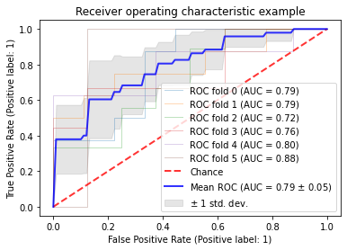
    


#### **svm回归算法**


```python
import numpy as np
from sklearn.svm import SVR
import matplotlib.pyplot as plt

# #############################################################################
# Generate sample data
X = np.sort(5 * np.random.rand(40, 1), axis=0)
y = np.sin(X).ravel()

# #############################################################################
# Add noise to targets
y[::5] += 3 * (0.5 - np.random.rand(8))

# #############################################################################
# Fit regression model
svr_rbf = SVR(kernel="rbf", C=100, gamma=0.1, epsilon=0.1)
svr_lin = SVR(kernel="linear", C=100, gamma="auto")
svr_poly = SVR(kernel="poly", C=100, gamma="auto", degree=3, epsilon=0.1, coef0=1)

# #############################################################################
# Look at the results
lw = 2

svrs = [svr_rbf, svr_lin, svr_poly]
kernel_label = ["RBF", "Linear", "Polynomial"]
model_color = ["m", "c", "g"]

fig, axes = plt.subplots(nrows=1, ncols=3, figsize=(15, 10), sharey=True)
for ix, svr in enumerate(svrs):
    axes[ix].plot(
        X,
        svr.fit(X, y).predict(X),
        color=model_color[ix],
        lw=lw,
        label="{} model".format(kernel_label[ix]),
    )
    axes[ix].scatter(
        X[svr.support_],
        y[svr.support_],
        facecolor="none",
        edgecolor=model_color[ix],
        s=50,
        label="{} support vectors".format(kernel_label[ix]),
    )
    axes[ix].scatter(
        X[np.setdiff1d(np.arange(len(X)), svr.support_)],
        y[np.setdiff1d(np.arange(len(X)), svr.support_)],
        facecolor="none",
        edgecolor="k",
        s=50,
        label="other training data",
    )
    axes[ix].legend(
        loc="upper center",
        bbox_to_anchor=(0.5, 1.1),
        ncol=1,
        fancybox=True,
        shadow=True,
    )

fig.text(0.5, 0.04, "data", ha="center", va="center")
fig.text(0.06, 0.5, "target", ha="center", va="center", rotation="vertical")
fig.suptitle("Support Vector Regression", fontsize=14)
plt.show()
```


    
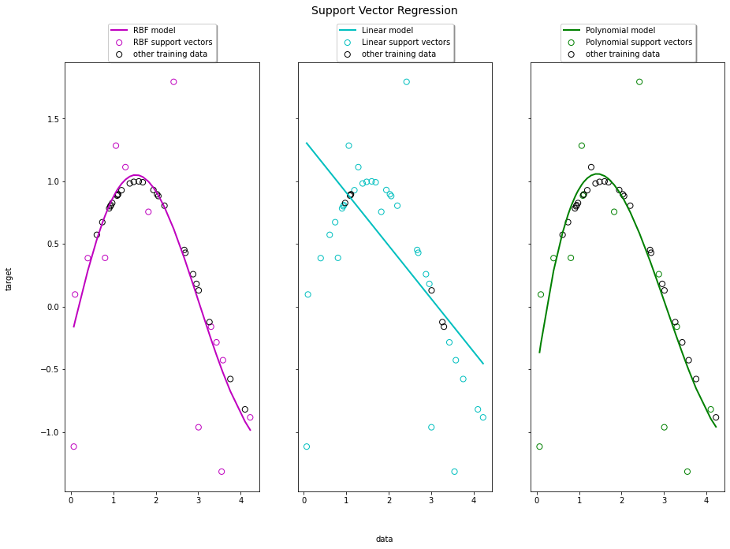
    


#### **决策树**

决策树是一种监督学习算法。它适用于类别和连续输入（特征）和输出（预测）变量。基于树的方法把特征空间划分成一系列矩形，然后给每一个矩形安置一个简单的模型（像一个常数）。从概念上来讲，它们是简单且有效的。


#### **决策树分类算法**


```python
import numpy as np
from matplotlib import pyplot as plt

from sklearn.model_selection import train_test_split
from sklearn.datasets import load_iris
from sklearn.tree import DecisionTreeClassifier
from sklearn import tree


iris = load_iris()
X = iris.data
y = iris.target
X_train, X_test, y_train, y_test = train_test_split(X, y, random_state=0)

clf = DecisionTreeClassifier(max_leaf_nodes=3, random_state=0)
clf.fit(X_train, y_train)


output:


    DecisionTreeClassifier(max_leaf_nodes=3, random_state=0)
```


```python
n_nodes = clf.tree_.node_count
children_left = clf.tree_.children_left
children_right = clf.tree_.children_right
feature = clf.tree_.feature
threshold = clf.tree_.threshold

node_depth = np.zeros(shape=n_nodes, dtype=np.int64)
is_leaves = np.zeros(shape=n_nodes, dtype=bool)
stack = [(0, 0)]  # start with the root node id (0) and its depth (0)
while len(stack) > 0:
    # `pop` ensures each node is only visited once
    node_id, depth = stack.pop()
    node_depth[node_id] = depth

    # If the left and right child of a node is not the same we have a split
    # node
    is_split_node = children_left[node_id] != children_right[node_id]
    # If a split node, append left and right children and depth to `stack`
    # so we can loop through them
    if is_split_node:
        stack.append((children_left[node_id], depth + 1))
        stack.append((children_right[node_id], depth + 1))
    else:
        is_leaves[node_id] = True

print(
    "The binary tree structure has {n} nodes and has "
    "the following tree structure:\n".format(n=n_nodes)
)
for i in range(n_nodes):
    if is_leaves[i]:
        print(
            "{space}node={node} is a leaf node.".format(
                space=node_depth[i] * "\t", node=i
            )
        )
    else:
        print(
            "{space}node={node} is a split node: "
            "go to node {left} if X[:, {feature}] <= {threshold} "
            "else to node {right}.".format(
                space=node_depth[i] * "\t",
                node=i,
                left=children_left[i],
                feature=feature[i],
                threshold=threshold[i],
                right=children_right[i],
            )
        )
tree.plot_tree(clf)
plt.show()


output:


    The binary tree structure has 5 nodes and has the following tree structure:
    
    node=0 is a split node: go to node 1 if X[:, 3] <= 0.800000011920929 else to node 2.
        node=1 is a leaf node.
        node=2 is a split node: go to node 3 if X[:, 2] <= 4.950000047683716 else to node 4.
            node=3 is a leaf node.
            node=4 is a leaf node.
```
    


    
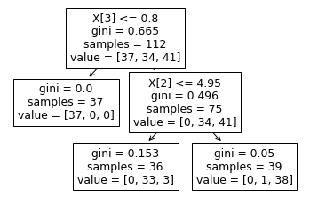
    


#### **决策树回归算法**


```python
import numpy as np
from sklearn.tree import DecisionTreeRegressor
import matplotlib.pyplot as plt

# Create a random dataset
rng = np.random.RandomState(1)
X = np.sort(5 * rng.rand(80, 1), axis=0)
y = np.sin(X).ravel()
y[::5] += 3 * (0.5 - rng.rand(16))

# Fit regression model
regr_1 = DecisionTreeRegressor(max_depth=2)
regr_2 = DecisionTreeRegressor(max_depth=5)
regr_1.fit(X, y)
regr_2.fit(X, y)

# Predict
X_test = np.arange(0.0, 5.0, 0.01)[:, np.newaxis]
y_1 = regr_1.predict(X_test)
y_2 = regr_2.predict(X_test)

# Plot the results
plt.figure()
plt.scatter(X, y, s=20, edgecolor="black", c="darkorange", label="data")
plt.plot(X_test, y_1, color="cornflowerblue", label="max_depth=2", linewidth=2)
plt.plot(X_test, y_2, color="yellowgreen", label="max_depth=5", linewidth=2)
plt.xlabel("data")
plt.ylabel("target")
plt.title("Decision Tree Regression")
plt.legend()
plt.show()
```

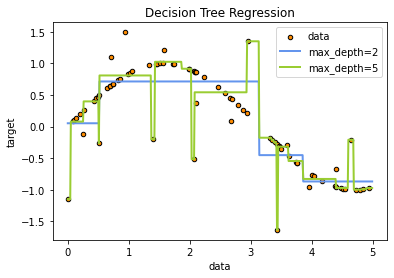
    


#### **贝叶斯**

朴素贝叶斯(Native Bayes)算法是基于贝叶斯定理和特征条件独立假设的分类算法。

#### **贝叶斯分类算法**


```python
import numpy as np
import matplotlib.pyplot as plt
from matplotlib import cm

from sklearn.datasets import make_blobs
from sklearn.naive_bayes import GaussianNB
from sklearn.metrics import brier_score_loss
from sklearn.calibration import CalibratedClassifierCV
from sklearn.model_selection import train_test_split


n_samples = 50000
n_bins = 3  # use 3 bins for calibration_curve as we have 3 clusters here

# Generate 3 blobs with 2 classes where the second blob contains
# half positive samples and half negative samples. Probability in this
# blob is therefore 0.5.
centers = [(-5, -5), (0, 0), (5, 5)]
X, y = make_blobs(n_samples=n_samples, centers=centers, shuffle=False, random_state=42)

y[: n_samples // 2] = 0
y[n_samples // 2 :] = 1
sample_weight = np.random.RandomState(42).rand(y.shape[0])

# split train, test for calibration
X_train, X_test, y_train, y_test, sw_train, sw_test = train_test_split(
    X, y, sample_weight, test_size=0.9, random_state=42
)

# Gaussian Naive-Bayes with no calibration
clf = GaussianNB()
clf.fit(X_train, y_train)  # GaussianNB itself does not support sample-weights
prob_pos_clf = clf.predict_proba(X_test)[:, 1]

# Gaussian Naive-Bayes with isotonic calibration
clf_isotonic = CalibratedClassifierCV(clf, cv=2, method="isotonic")
clf_isotonic.fit(X_train, y_train, sample_weight=sw_train)
prob_pos_isotonic = clf_isotonic.predict_proba(X_test)[:, 1]

# Gaussian Naive-Bayes with sigmoid calibration
clf_sigmoid = CalibratedClassifierCV(clf, cv=2, method="sigmoid")
clf_sigmoid.fit(X_train, y_train, sample_weight=sw_train)
prob_pos_sigmoid = clf_sigmoid.predict_proba(X_test)[:, 1]

print("Brier score losses: (the smaller the better)")

clf_score = brier_score_loss(y_test, prob_pos_clf, sample_weight=sw_test)
print("No calibration: %1.3f" % clf_score)

clf_isotonic_score = brier_score_loss(y_test, prob_pos_isotonic, sample_weight=sw_test)
print("With isotonic calibration: %1.3f" % clf_isotonic_score)

clf_sigmoid_score = brier_score_loss(y_test, prob_pos_sigmoid, sample_weight=sw_test)
print("With sigmoid calibration: %1.3f" % clf_sigmoid_score)

# #############################################################################
# Plot the data and the predicted probabilities
plt.figure()
y_unique = np.unique(y)
colors = cm.rainbow(np.linspace(0.0, 1.0, y_unique.size))
for this_y, color in zip(y_unique, colors):
    this_X = X_train[y_train == this_y]
    this_sw = sw_train[y_train == this_y]
    plt.scatter(
        this_X[:, 0],
        this_X[:, 1],
        s=this_sw * 50,
        c=color[np.newaxis, :],
        alpha=0.5,
        edgecolor="k",
        label="Class %s" % this_y,
    )
plt.legend(loc="best")
plt.title("Data")

plt.figure()
order = np.lexsort((prob_pos_clf,))
plt.plot(prob_pos_clf[order], "r", label="No calibration (%1.3f)" % clf_score)
plt.plot(
    prob_pos_isotonic[order],
    "g",
    linewidth=3,
    label="Isotonic calibration (%1.3f)" % clf_isotonic_score,
)
plt.plot(
    prob_pos_sigmoid[order],
    "b",
    linewidth=3,
    label="Sigmoid calibration (%1.3f)" % clf_sigmoid_score,
)
plt.plot(
    np.linspace(0, y_test.size, 51)[1::2],
    y_test[order].reshape(25, -1).mean(1),
    "k",
    linewidth=3,
    label=r"Empirical",
)
plt.ylim([-0.05, 1.05])
plt.xlabel("Instances sorted according to predicted probability (uncalibrated GNB)")
plt.ylabel("P(y=1)")
plt.legend(loc="upper left")
plt.title("Gaussian naive Bayes probabilities")

plt.show()


output:


    Brier score losses: (the smaller the better)
    No calibration: 0.104
    With isotonic calibration: 0.084
    With sigmoid calibration: 0.109
```
    
    
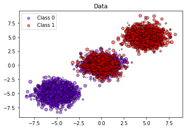
    

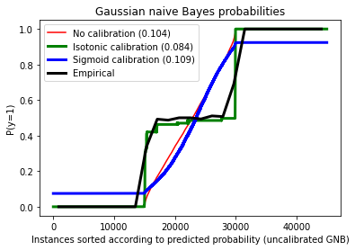
    


#### **贝叶斯回归算法**


```python
import numpy as np
import matplotlib.pyplot as plt

from sklearn.linear_model import BayesianRidge


def func(x):
    return np.sin(2 * np.pi * x)


# #############################################################################
# Generate sinusoidal data with noise
size = 25
rng = np.random.RandomState(1234)
x_train = rng.uniform(0.0, 1.0, size)
y_train = func(x_train) + rng.normal(scale=0.1, size=size)
x_test = np.linspace(0.0, 1.0, 100)


# #############################################################################
# Fit by cubic polynomial
n_order = 3
X_train = np.vander(x_train, n_order + 1, increasing=True)
X_test = np.vander(x_test, n_order + 1, increasing=True)

# #############################################################################
# Plot the true and predicted curves with log marginal likelihood (L)
reg = BayesianRidge(tol=1e-6, fit_intercept=False, compute_score=True)
fig, axes = plt.subplots(1, 2, figsize=(8, 4))
for i, ax in enumerate(axes):
    # Bayesian ridge regression with different initial value pairs
    if i == 0:
        init = [1 / np.var(y_train), 1.0]  # Default values
    elif i == 1:
        init = [1.0, 1e-3]
        reg.set_params(alpha_init=init[0], lambda_init=init[1])
    reg.fit(X_train, y_train)
    ymean, ystd = reg.predict(X_test, return_std=True)

    ax.plot(x_test, func(x_test), color="blue", label="sin($2\\pi x$)")
    ax.scatter(x_train, y_train, s=50, alpha=0.5, label="observation")
    ax.plot(x_test, ymean, color="red", label="predict mean")
    ax.fill_between(
        x_test, ymean - ystd, ymean + ystd, color="pink", alpha=0.5, label="predict std"
    )
    ax.set_ylim(-1.3, 1.3)
    ax.legend()
    title = "$\\alpha$_init$={:.2f},\\ \\lambda$_init$={}$".format(init[0], init[1])
    if i == 0:
        title += " (Default)"
    ax.set_title(title, fontsize=12)
    text = "$\\alpha={:.1f}$\n$\\lambda={:.3f}$\n$L={:.1f}$".format(
        reg.alpha_, reg.lambda_, reg.scores_[-1]
    )
    ax.text(0.05, -1.0, text, fontsize=12)

plt.tight_layout()
plt.show()
```

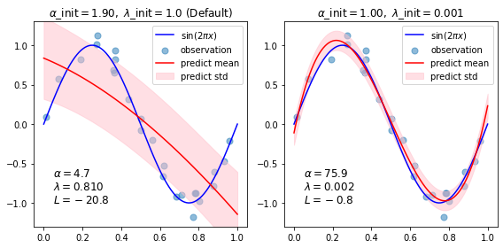
    


#### **聚类：KMeans**

KMeans算法是典型的基于距离的聚类算法，采用距离作为相似性的评价指标，即认为两个对象的距离越近，其相似度就越大。该算法认为簇是由距离靠近的对象组成的，因此把得到紧凑且独立的簇作为最终目标。

#### **KMeans分类算法**


```python
import numpy as np
import matplotlib.pyplot as plt

from sklearn.cluster import KMeans
from sklearn.datasets import make_blobs

plt.figure(figsize=(12, 12))

n_samples = 1500
random_state = 170
X, y = make_blobs(n_samples=n_samples, random_state=random_state)

# Incorrect number of clusters
y_pred = KMeans(n_clusters=2, random_state=random_state).fit_predict(X)

plt.subplot(221)
plt.scatter(X[:, 0], X[:, 1], c=y_pred)
plt.title("Incorrect Number of Blobs")

# Anisotropicly distributed data
transformation = [[0.60834549, -0.63667341], [-0.40887718, 0.85253229]]
X_aniso = np.dot(X, transformation)
y_pred = KMeans(n_clusters=3, random_state=random_state).fit_predict(X_aniso)

plt.subplot(222)
plt.scatter(X_aniso[:, 0], X_aniso[:, 1], c=y_pred)
plt.title("Anisotropicly Distributed Blobs")

# Different variance
X_varied, y_varied = make_blobs(
    n_samples=n_samples, cluster_std=[1.0, 2.5, 0.5], random_state=random_state
)
y_pred = KMeans(n_clusters=3, random_state=random_state).fit_predict(X_varied)

plt.subplot(223)
plt.scatter(X_varied[:, 0], X_varied[:, 1], c=y_pred)
plt.title("Unequal Variance")

# Unevenly sized blobs
X_filtered = np.vstack((X[y == 0][:500], X[y == 1][:100], X[y == 2][:10]))
y_pred = KMeans(n_clusters=3, random_state=random_state).fit_predict(X_filtered)

plt.subplot(224)
plt.scatter(X_filtered[:, 0], X_filtered[:, 1], c=y_pred)
plt.title("Unevenly Sized Blobs")

plt.show()
```
    
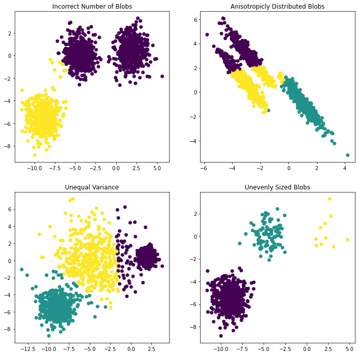
    


#### **集成学习**

把之前介绍过的逻辑回归、决策树、支持向量机、贝叶斯分类等算法称之为弱分类器。将多个这样的弱分类器算法融合起来，变成一个强分类器，这就是集成学习算法。

根据个体学习器生成生成方式的不同，目前的集成学习算法主要有两大派别，一个是以Boosting中的AdaBoost为代表的强依赖关系个体学习器，该方法是必需串行化生成序列化方法；另一种是以Bagging中的"随机森林"为代表的算法，其个体学习器之间不存在强依赖关系，能够并行化生成。

##### **boosting算法**

- AdaBoost
- GBDT
- XGBoost（需要独立安装：`pip install xgboost`）

##### **bagging算法**

- 随机森林（一枝独秀）


#### **集成学习分类算法**


```python
import numpy as np
import matplotlib.pyplot as plt

from sklearn import datasets
from sklearn.tree import DecisionTreeClassifier
from sklearn.metrics import zero_one_loss
from sklearn.ensemble import AdaBoostClassifier


n_estimators = 400
# A learning rate of 1. may not be optimal for both SAMME and SAMME.R
learning_rate = 1.0

X, y = datasets.make_hastie_10_2(n_samples=12000, random_state=1)

X_test, y_test = X[2000:], y[2000:]
X_train, y_train = X[:2000], y[:2000]

dt_stump = DecisionTreeClassifier(max_depth=1, min_samples_leaf=1)
dt_stump.fit(X_train, y_train)
dt_stump_err = 1.0 - dt_stump.score(X_test, y_test)

dt = DecisionTreeClassifier(max_depth=9, min_samples_leaf=1)
dt.fit(X_train, y_train)
dt_err = 1.0 - dt.score(X_test, y_test)

ada_discrete = AdaBoostClassifier(
    base_estimator=dt_stump,
    learning_rate=learning_rate,
    n_estimators=n_estimators,
    algorithm="SAMME",
)
ada_discrete.fit(X_train, y_train)

ada_real = AdaBoostClassifier(
    base_estimator=dt_stump,
    learning_rate=learning_rate,
    n_estimators=n_estimators,
    algorithm="SAMME.R",
)
ada_real.fit(X_train, y_train)

fig = plt.figure()
ax = fig.add_subplot(111)

ax.plot([1, n_estimators], [dt_stump_err] * 2, "k-", label="Decision Stump Error")
ax.plot([1, n_estimators], [dt_err] * 2, "k--", label="Decision Tree Error")

ada_discrete_err = np.zeros((n_estimators,))
for i, y_pred in enumerate(ada_discrete.staged_predict(X_test)):
    ada_discrete_err[i] = zero_one_loss(y_pred, y_test)

ada_discrete_err_train = np.zeros((n_estimators,))
for i, y_pred in enumerate(ada_discrete.staged_predict(X_train)):
    ada_discrete_err_train[i] = zero_one_loss(y_pred, y_train)

ada_real_err = np.zeros((n_estimators,))
for i, y_pred in enumerate(ada_real.staged_predict(X_test)):
    ada_real_err[i] = zero_one_loss(y_pred, y_test)

ada_real_err_train = np.zeros((n_estimators,))
for i, y_pred in enumerate(ada_real.staged_predict(X_train)):
    ada_real_err_train[i] = zero_one_loss(y_pred, y_train)

ax.plot(
    np.arange(n_estimators) + 1,
    ada_discrete_err,
    label="Discrete AdaBoost Test Error",
    color="red",
)
ax.plot(
    np.arange(n_estimators) + 1,
    ada_discrete_err_train,
    label="Discrete AdaBoost Train Error",
    color="blue",
)
ax.plot(
    np.arange(n_estimators) + 1,
    ada_real_err,
    label="Real AdaBoost Test Error",
    color="orange",
)
ax.plot(
    np.arange(n_estimators) + 1,
    ada_real_err_train,
    label="Real AdaBoost Train Error",
    color="green",
)

ax.set_ylim((0.0, 0.5))
ax.set_xlabel("n_estimators")
ax.set_ylabel("error rate")

leg = ax.legend(loc="upper right", fancybox=True)
leg.get_frame().set_alpha(0.7)

plt.show()
```


    
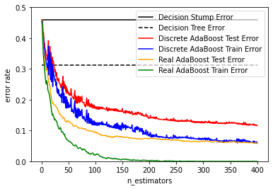
    


```python
import numpy as np
import matplotlib.pyplot as plt

from sklearn import ensemble
from sklearn import datasets

from sklearn.model_selection import train_test_split

X, y = datasets.make_hastie_10_2(n_samples=4000, random_state=1)

# map labels from {-1, 1} to {0, 1}
labels, y = np.unique(y, return_inverse=True)

X_train, X_test, y_train, y_test = train_test_split(X, y, test_size=0.8, random_state=0)

original_params = {
    "n_estimators": 400,
    "max_leaf_nodes": 4,
    "max_depth": None,
    "random_state": 2,
    "min_samples_split": 5,
}

plt.figure()

for label, color, setting in [
    ("No shrinkage", "orange", {"learning_rate": 1.0, "subsample": 1.0}),
    ("learning_rate=0.2", "turquoise", {"learning_rate": 0.2, "subsample": 1.0}),
    ("subsample=0.5", "blue", {"learning_rate": 1.0, "subsample": 0.5}),
    (
        "learning_rate=0.2, subsample=0.5",
        "gray",
        {"learning_rate": 0.2, "subsample": 0.5},
    ),
    (
        "learning_rate=0.2, max_features=2",
        "magenta",
        {"learning_rate": 0.2, "max_features": 2},
    ),
]:
    params = dict(original_params)
    params.update(setting)

    clf = ensemble.GradientBoostingClassifier(**params)
    clf.fit(X_train, y_train)

    # compute test set deviance
    test_deviance = np.zeros((params["n_estimators"],), dtype=np.float64)

    for i, y_pred in enumerate(clf.staged_decision_function(X_test)):
        # clf.loss_ assumes that y_test[i] in {0, 1}
        test_deviance[i] = clf.loss_(y_test, y_pred)

    plt.plot(
        (np.arange(test_deviance.shape[0]) + 1)[::5],
        test_deviance[::5],
        "-",
        color=color,
        label=label,
    )

plt.legend(loc="upper left")
plt.xlabel("Boosting Iterations")
plt.ylabel("Test Set Deviance")

plt.show()
```


    
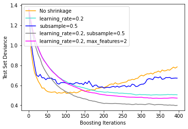
    


```python
import matplotlib.pyplot as plt
import numpy as np

from sklearn.datasets import fetch_openml
from sklearn.ensemble import RandomForestClassifier
from sklearn.impute import SimpleImputer
from sklearn.inspection import permutation_importance
from sklearn.compose import ColumnTransformer
from sklearn.model_selection import train_test_split
from sklearn.pipeline import Pipeline
from sklearn.preprocessing import OneHotEncoder

X, y = fetch_openml("titanic", version=1, as_frame=True, return_X_y=True)
rng = np.random.RandomState(seed=42)
X["random_cat"] = rng.randint(3, size=X.shape[0])
X["random_num"] = rng.randn(X.shape[0])

categorical_columns = ["pclass", "sex", "embarked", "random_cat"]
numerical_columns = ["age", "sibsp", "parch", "fare", "random_num"]

X = X[categorical_columns + numerical_columns]

X_train, X_test, y_train, y_test = train_test_split(X, y, stratify=y, random_state=42)

categorical_encoder = OneHotEncoder(handle_unknown="ignore")
numerical_pipe = Pipeline([("imputer", SimpleImputer(strategy="mean"))])

preprocessing = ColumnTransformer(
    [
        ("cat", categorical_encoder, categorical_columns),
        ("num", numerical_pipe, numerical_columns),
    ]
)

rf = Pipeline(
    [
        ("preprocess", preprocessing),
        ("classifier", RandomForestClassifier(random_state=42)),
    ]
)
rf.fit(X_train, y_train)
print("RF train accuracy: %0.3f" % rf.score(X_train, y_train))
print("RF test accuracy: %0.3f" % rf.score(X_test, y_test))

ohe = rf.named_steps["preprocess"].named_transformers_["cat"]
feature_names = ohe.get_feature_names_out(categorical_columns)
feature_names = np.r_[feature_names, numerical_columns]

tree_feature_importances = rf.named_steps["classifier"].feature_importances_
sorted_idx = tree_feature_importances.argsort()

y_ticks = np.arange(0, len(feature_names))
fig, ax = plt.subplots()
ax.barh(y_ticks, tree_feature_importances[sorted_idx])
ax.set_yticks(y_ticks)
ax.set_yticklabels(feature_names[sorted_idx])
ax.set_title("Random Forest Feature Importances (MDI)")
fig.tight_layout()
plt.show()


output:


    RF train accuracy: 1.000
    RF test accuracy: 0.817
```


    
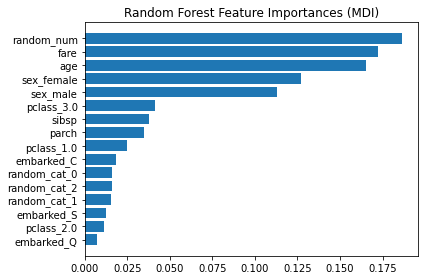
    


#### **集成学习回归算法**


```python
import numpy as np
import matplotlib.pyplot as plt
from sklearn.tree import DecisionTreeRegressor
from sklearn.ensemble import AdaBoostRegressor

# Create the dataset
rng = np.random.RandomState(1)
X = np.linspace(0, 6, 100)[:, np.newaxis]
y = np.sin(X).ravel() + np.sin(6 * X).ravel() + rng.normal(0, 0.1, X.shape[0])

# Fit regression model
regr_1 = DecisionTreeRegressor(max_depth=4)

regr_2 = AdaBoostRegressor(
    DecisionTreeRegressor(max_depth=4), n_estimators=300, random_state=rng
)

regr_1.fit(X, y)
regr_2.fit(X, y)

# Predict
y_1 = regr_1.predict(X)
y_2 = regr_2.predict(X)

# Plot the results
plt.figure()
plt.scatter(X, y, c="k", label="training samples")
plt.plot(X, y_1, c="g", label="n_estimators=1", linewidth=2)
plt.plot(X, y_2, c="r", label="n_estimators=300", linewidth=2)
plt.xlabel("data")
plt.ylabel("target")
plt.title("Boosted Decision Tree Regression")
plt.legend()
plt.show()
```


    
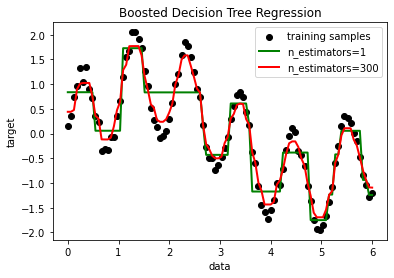
    


```python
import numpy as np
import matplotlib.pyplot as plt
from sklearn.ensemble import RandomForestRegressor
from sklearn.model_selection import train_test_split
from sklearn.multioutput import MultiOutputRegressor


# Create a random dataset
rng = np.random.RandomState(1)
X = np.sort(200 * rng.rand(600, 1) - 100, axis=0)
y = np.array([np.pi * np.sin(X).ravel(), np.pi * np.cos(X).ravel()]).T
y += 0.5 - rng.rand(*y.shape)

X_train, X_test, y_train, y_test = train_test_split(
    X, y, train_size=400, test_size=200, random_state=4
)

max_depth = 30
regr_multirf = MultiOutputRegressor(
    RandomForestRegressor(n_estimators=100, max_depth=max_depth, random_state=0)
)
regr_multirf.fit(X_train, y_train)

regr_rf = RandomForestRegressor(n_estimators=100, max_depth=max_depth, random_state=2)
regr_rf.fit(X_train, y_train)

# Predict on new data
y_multirf = regr_multirf.predict(X_test)
y_rf = regr_rf.predict(X_test)

# Plot the results
plt.figure()
s = 50
a = 0.4
plt.scatter(
    y_test[:, 0],
    y_test[:, 1],
    edgecolor="k",
    c="navy",
    s=s,
    marker="s",
    alpha=a,
    label="Data",
)
plt.scatter(
    y_multirf[:, 0],
    y_multirf[:, 1],
    edgecolor="k",
    c="cornflowerblue",
    s=s,
    alpha=a,
    label="Multi RF score=%.2f" % regr_multirf.score(X_test, y_test),
)
plt.scatter(
    y_rf[:, 0],
    y_rf[:, 1],
    edgecolor="k",
    c="c",
    s=s,
    marker="^",
    alpha=a,
    label="RF score=%.2f" % regr_rf.score(X_test, y_test),
)
plt.xlim([-6, 6])
plt.ylim([-6, 6])
plt.xlabel("target 1")
plt.ylabel("target 2")
plt.title("Comparing random forests and the multi-output meta estimator")
plt.legend()
plt.show()
```


    
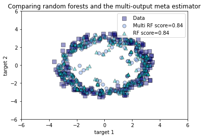
    


## **三、深度学习**


### **机器学习的痛点**

- 机器学习方法的重点往往是仅仅学习一两层的数据表示，因此有时也被称为浅层学习。

- 泛化能力差，原因之一是它使用手工特征，靠设计者的经验得到，并无法掌握数据中的非线性变化，每种特征只能对特定的场景或特定的任务才有效。由于泛化能力差，在实际落地的时候，鲁棒性也会差，导致每次训练好的模型在换场景时，全部都需要重新搜集数据训练，落地的成本非常高，用户的满意程度也很差。。


### **深度学习简介**

深度学习(DL, Deep Learning)是机器学习(ML, Machine Learning)领域中一个新的研究方向，它被引入机器学习使其更接近于最初的目标——人工智能(AI, Artificial Intelligence)。

深度学习是学习样本数据的内在规律和表示层次，这些学习过程中获得的信息对诸如文字，图像和声音等数据的解释有很大的帮助。它的最终目标是让机器能够像人一样具有分析学习能力，能够识别文字、图像和声音等数据。 深度学习是一个复杂的机器学习算法，在语音和图像识别方面取得的效果，远远超过先前相关技术。

深度学习在搜索技术，数据挖掘，机器学习，机器翻译，自然语言处理，多媒体学习，语音，推荐和个性化技术，以及其他相关领域都取得了很多成果。深度学习使机器模仿视听和思考等人类的活动，解决了很多复杂的模式识别难题，使得人工智能相关技术取得了很大进步。

### **神经网络**

神经网络是将模仿被称为神经元的脑神经的单位进行链接，形成的网络状的图。输入的信号实现传播。神经网络在20世纪80年代出反向传播算法以来一个较大变革，是在2006年杰佛里·辛顿等人提出的一种被称为自动编码器的新的学习方法。该方法的特征之一是，可以让神经网络的各层进行阶段性学习。比如：让第一层学习将输入的信息原样输出，让第二层学习在第一层的基础上按照同样的方法再现输入，第三层以后同样操作。这样分阶段使之学习的神经网络，即使层数不断递进，仍然拥有强大的学习能力。

深度学习的概念源于人工神经网络的研究。

Deep Learning（深度学习）是神经网络技术的一种。其最具变革性的一点是，只要有足够的学习数据，神经网络自身就可以将数据群的特征自动提取出来。在此之前的图像和数据的解析，需根据各个数据和问题进行析取算法的操作。但是，深度学习则不需要人为操作，而是自动提取特征。稍微粗略的说，就是这样的意思：只要向神经网络注入数据，就可以任意提取特征。

### **神经网络分类**

- 前馈型网络（也称为多层感知机网络）
- 反馈型网络
- 图网络：在拓扑空间内按图结构推理

### **神经网络常用结构**

- 感知器
- 前馈网络
- 残差网络：ResNet
- 循环网络：RNN
- 长短时忆网络：LSTM
- 卷积网络：CNN
- 生成对抗网络：GAN
- 图神经网络：GNN
- Transformer


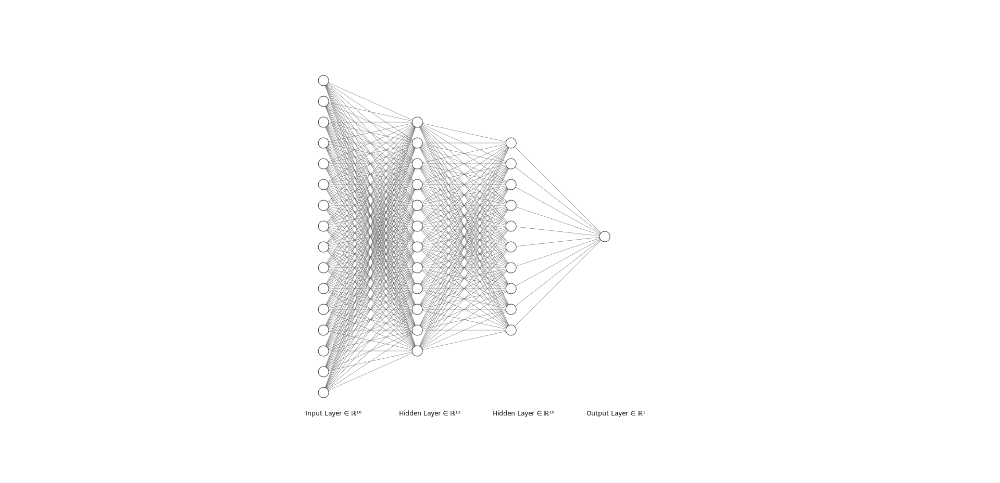


### **神经网络常用激活函数**

激活函数（Activation Function），就是在人工神经网络的神经元上运行的函数，负责将神经元的输入映射到输出端。

- relu
- sigmoid
- softmax
- tanh

### **神经网络常用优化器**

用来更新和计算影响模型训练和模型输出的网络参数，使其逼近或达到最优值，从而最小化(或最大化)损失函数E(x)

- SGD
- Adam

### **深度学习常用框架**

- tensorflow（谷歌）
- keras（keras之父是谷歌研究员，现已被tensorflow2.x中包含）
- pytorch（Facebook）
- paddlepaddle（百度）


```python
import numpy as np
import keras
from keras import layers
from keras.utils import np_utils
from keras.datasets import mnist
from keras.utils.vis_utils import plot_model


# 先读入数据

(x_train, y_train), (x_test, y_test) = mnist.load_data()

#数据预处理

# Scale images to the [0, 1] range
x_train = x_train.astype("float32") / 255
x_test = x_test.astype("float32") / 255
# Make sure images have shape (28, 28, 1)
x_train = np.expand_dims(x_train, -1)
x_test = np.expand_dims(x_test, -1)
print("x_train shape:", x_train.shape)

num_classes = 10
y_train = np_utils.to_categorical(y_train, num_classes)
y_test = np_utils.to_categorical(y_test, num_classes)

#构建模型

input_shape = (28, 28, 1)
model = keras.Sequential(
    [
        keras.Input(shape=input_shape),
        layers.Conv2D(32, kernel_size=(3, 3), activation="relu"),
        layers.MaxPooling2D(pool_size=(2, 2)),
        layers.Conv2D(64, kernel_size=(3, 3), activation="relu"),
        layers.MaxPooling2D(pool_size=(2, 2)),
        layers.Flatten(),
        layers.Dropout(0.5),
        layers.Dense(num_classes, activation="softmax"),
    ]
)


## 模型结构图

model.summary()
plot_model(model,'./images/model.png')


output:


    x_train shape: (60000, 28, 28, 1)
    Model: "sequential_4"
    _________________________________________________________________
     Layer (type)                Output Shape              Param #   
    =================================================================
     conv2d_10 (Conv2D)          (None, 26, 26, 32)        320       
                                                                     
     max_pooling2d_10 (MaxPoolin  (None, 13, 13, 32)       0         
     g2D)                                                            
                                                                     
     conv2d_11 (Conv2D)          (None, 11, 11, 64)        18496     
                                                                     
     max_pooling2d_11 (MaxPoolin  (None, 5, 5, 64)         0         
     g2D)                                                            
                                                                     
     flatten_4 (Flatten)         (None, 1600)              0         
                                                                     
     dropout_8 (Dropout)         (None, 1600)              0         
                                                                     
     dense_10 (Dense)            (None, 10)                16010     
                                                                     
    =================================================================
    Total params: 34,826
    Trainable params: 34,826
    Non-trainable params: 0
    _________________________________________________________________
```
    

    

    


```python
#训练

epochs = 5
batch_size = 128
model.compile(loss="categorical_crossentropy", optimizer="adam", metrics=["accuracy"])
model.fit(x_train, y_train, batch_size=batch_size, epochs=epochs, validation_split=0.1)

#测试

score = model.evaluate(x_test, y_test, verbose=0)
print("Test loss:", score[0])
print("Test accuracy:", score[1])


output:


    Epoch 1/5
    422/422 [==============================] - 17s 40ms/step - loss: 0.3689 - accuracy: 0.8874 - val_loss: 0.0812 - val_accuracy: 0.9777
    Epoch 2/5
    422/422 [==============================] - 17s 40ms/step - loss: 0.1126 - accuracy: 0.9647 - val_loss: 0.0546 - val_accuracy: 0.9848
    Epoch 3/5
    422/422 [==============================] - 19s 45ms/step - loss: 0.0839 - accuracy: 0.9746 - val_loss: 0.0472 - val_accuracy: 0.9872
    Epoch 4/5
    422/422 [==============================] - 17s 40ms/step - loss: 0.0716 - accuracy: 0.9783 - val_loss: 0.0434 - val_accuracy: 0.9882
    Epoch 5/5
    422/422 [==============================] - 16s 39ms/step - loss: 0.0616 - accuracy: 0.9815 - val_loss: 0.0388 - val_accuracy: 0.9890
    Test loss: 0.03777240589261055
    Test accuracy: 0.9872999787330627
```
    

## **四、自然语言处理：NLP**


自然语言处理( Natural Language Processing, NLP)是计算机科学领域与人工智能领域中的一个重要方向。它研究能实现人与计算机之间用自然语言进行有效通信的各种理论和方法。自然语言处理是一门融语言学、计算机科学、数学于一体的科学。因此，这一领域的研究将涉及自然语言，即人们日常使用的语言，所以它与语言学的研究有着密切的联系，但又有重要的区别。自然语言处理并不是一般地研究自然语言，而在于研制能有效地实现自然语言通信的计算机系统，特别是其中的软件系统。因而它是计算机科学的一部分。

自然语言处理主要应用于机器翻译、舆情监测、自动摘要、观点提取、文本分类、问题回答、文本语义对比、语音识别、中文OCR等方面。

### **常见领域**

- 分词
- 词性标注
- 实体识别
- 文本分类
- 情感分析
- 文本生成
- 对话系统
- 机器翻译


```python
import paddlehub as hub

senta = hub.Module(name="senta_bilstm")

text = ['这家餐厅口味一般']

results = senta.sentiment_classify(texts=text, use_gpu=False, batch_size=1)

results[0]


output:


    {'text': '这家餐厅口味一般',
     'sentiment_label': 0,
     'sentiment_key': 'negative',
     'positive_probs': 0.0989,
     'negative_probs': 0.9011}
```


```python
import paddle
paddle.disable_static()
import paddlehub as hub

num = 0
model = hub.Module(name='plato-mini')
with model.interactive_mode(max_turn=3):
    while num < 3:
        human_utterance = input("[Human]: ").strip()
        robot_utterance = model.predict(human_utterance)[0]
        print("[Bot]: %s"%robot_utterance)
        num += 1


output:


    [Human]:  奥巴马是谁
    

    [Bot]: 是一个美国总统,他是美国的一个英雄。
    

    [Human]:  你叫什么名字
    

    [Bot]: 我叫王海。
    

    [Human]:  百度和你什么关系
    

    [Bot]: 我的朋友们都叫我王海。
    

    [Human]:  are you ok
    

    [Bot]: 你是干什么的呀?
    

    [Human]:  111
    

    [Bot]: 你是一个人吗?

```
    


## **五、计算机视觉：CV**


计算机视觉是一门研究如何使机器“看”的科学，更进一步的说，就是是指用摄影机和电脑代替人眼对目标进行识别、跟踪和测量等机器视觉，并进一步做图形处理，使电脑处理成为更适合人眼观察或传送给仪器检测的图像。

### **常见领域**

- 人脸识别
- 目标检测
- 图像分类
- OCR
- 图像生成


```python
import IPython

IPython.display.Image('./examples/ocr.png')
```


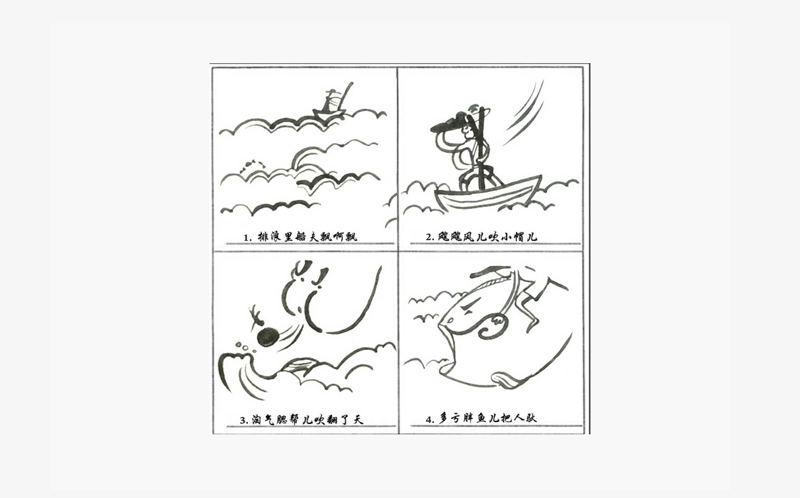
    


```python
import paddlehub as hub
import cv2
from PIL import Image

ocr = hub.Module(name="chinese_ocr_db_crnn_mobile")

image = cv2.imread('./examples/ocr.png')

res = ocr.recognize_text(images=[image],visualization=True,output_dir='./output')
print(res[0])

image = Image.open(res[0]['save_path'])
image


output:


    {
        'save_path': './output\\ndarray_1652169882.6559045.jpg', 
        'data': [
            {'text': '1.排浪里船大飘飘', 'confidence': 0.851468563079834, 'text_box_position': [[509, 481], [752, 481], [752, 512], [509, 512]]}, 
            {'text': '2.處處风儿吹小帽儿', 'confidence': 0.8173243403434753, 'text_box_position': [[889, 481], [1130, 481], [1130, 512], [889, 512]]}, 
            {'text': '3.演气服帮儿吹翻了天', 'confidence': 0.8700150847434998, 'text_box_position': [[497, 866], [764, 864], [764, 897], [497, 899]]}, 
            {'text': '4.多亏胖鱼儿把人款', 'confidence': 0.9091594815254211, 'text_box_position': [[890, 863], [1128, 861], [1128, 893], [890, 895]]}
        ]
    }
```

    
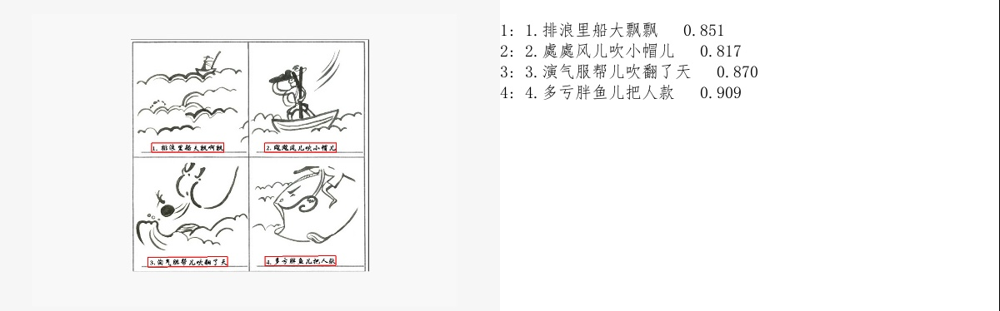
    


```python
import IPython

IPython.display.Image('./examples/1.jpg')
```


    


```python
import paddlehub as hub
import cv2

object_detector = hub.Module(name="yolov3_mobilenet_v1_coco2017")

image = cv2.imread('./examples/1.jpg')

res = object_detector.object_detection(images=[image],visualization=True,output_dir='./output')

print(res)

image = Image.open(res[0]['save_path'])
image


output:


    [
        {
           'data': [
               {'label': 'person', 'confidence': 0.9848234057426453, 'left': 155.05906677246094, 'top': 122.50823211669922, 'right': 231.92762756347656, 'bottom': 314.44976806640625}, 
               {'label': 'person', 'confidence': 0.9430921673774719, 'left': 356.2107238769531, 'top': 131.04718017578125, 'right': 417.8138122558594, 'bottom': 326.3804016113281}, 
               {'label': 'person', 'confidence': 0.9076431393623352, 'left': 38.31671905517578, 'top': 163.21209716796875, 'right': 101.54631805419922, 'bottom': 309.7256164550781}, 
               {'label': 'person', 'confidence': 0.8078500628471375, 'left': 108.36770629882812, 'top': 190.21131896972656, 'right': 160.23040771484375, 'bottom': 304.90692138671875}, 
               {'label': 'handbag', 'confidence': 0.5926159024238586, 'left': 89.64710998535156, 'top': 224.17578125, 'right': 107.70553588867188, 'bottom': 251.55755615234375}
            ], 
           'save_path': './output\\image_numpy_0.jpg'
        }
    ]
```


    
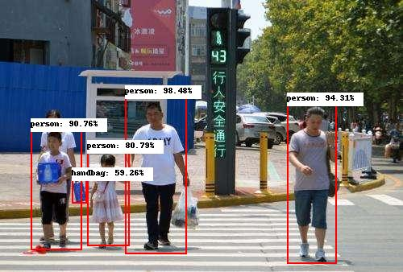
    


```python
import IPython

IPython.display.Image('./examples/2.jpg')
```

    

    

```python
import paddlehub as hub
import cv2

face_detector = hub.Module(name="pyramidbox_lite_mobile")

image = cv2.imread('./examples/2.jpg')

res = face_detector.face_detection(images=[image],visualization=True,output_dir='./output')

print(res)

image = Image.open('./output/' + res[0]['path'].split('.')[0]+'.jpg')
image


output:


    [
       {
           'data': [
               {'confidence': 0.9999496936798096, 'left': 26, 'top': 314, 'right': 89, 'bottom': 392}, 
               {'confidence': 0.999924898147583, 'left': 27, 'top': 437, 'right': 90, 'bottom': 508}, 
               {'confidence': 0.9998680353164673, 'left': 633, 'top': 430, 'right': 700, 'bottom': 513}, 
               {'confidence': 0.9998594522476196, 'left': 397, 'top': 72, 'right': 458, 'bottom': 144}, 
               {'confidence': 0.9998328685760498, 'left': 634, 'top': 68, 'right': 701, 'bottom': 155}, 
               {'confidence': 0.9998192191123962, 'left': 154, 'top': 311, 'right': 220, 'bottom': 396}, 
               {'confidence': 0.9998061060905457, 'left': 518, 'top': 71, 'right': 586, 'bottom': 154}, 
               {'confidence': 0.999804675579071, 'left': 280, 'top': 433, 'right': 335, 'bottom': 508}, 
               {'confidence': 0.9997876286506653, 'left': 632, 'top': 308, 'right': 702, 'bottom': 400}, 
               {'confidence': 0.999782383441925, 'left': 153, 'top': 431, 'right': 218, 'bottom': 512}, 
               {'confidence': 0.9997724890708923, 'left': 519, 'top': 202, 'right': 585, 'bottom': 279}, 
               {'confidence': 0.9997386336326599, 'left': 395, 'top': 315, 'right': 457, 'bottom': 392}, 
               {'confidence': 0.9997257590293884, 'left': 283, 'top': 74, 'right': 336, 'bottom': 146}, 
               {'confidence': 0.9997065663337708, 'left': 398, 'top': 438, 'right': 456, 'bottom': 507}, 
               {'confidence': 0.9996867179870605, 'left': 278, 'top': 311, 'right': 337, 'bottom': 394}, 
               {'confidence': 0.9996200799942017, 'left': 154, 'top': 195, 'right': 216, 'bottom': 277}, 
               {'confidence': 0.9996185302734375, 'left': 281, 'top': 198, 'right': 334, 'bottom': 270}, 
               {'confidence': 0.9995993971824646, 'left': 154, 'top': 74, 'right': 220, 'bottom': 150}, 
               {'confidence': 0.9995670914649963, 'left': 399, 'top': 204, 'right': 452, 'bottom': 269}, 
               {'confidence': 0.9994865655899048, 'left': 635, 'top': 193, 'right': 696, 'bottom': 280}, 
               {'confidence': 0.9994115829467773, 'left': 31, 'top': 186, 'right': 93, 'bottom': 279}, 
               {'confidence': 0.9993962049484253, 'left': 519, 'top': 433, 'right': 586, 'bottom': 513}, 
               {'confidence': 0.999319314956665, 'left': 518, 'top': 309, 'right': 591, 'bottom': 402}, 
               {'confidence': 0.6634197235107422, 'left': 595, 'top': 269, 'right': 647, 'bottom': 341}
            ], 
            'path': 'ndarray_time=1652170259378489.0'
        }
    ]
```

    
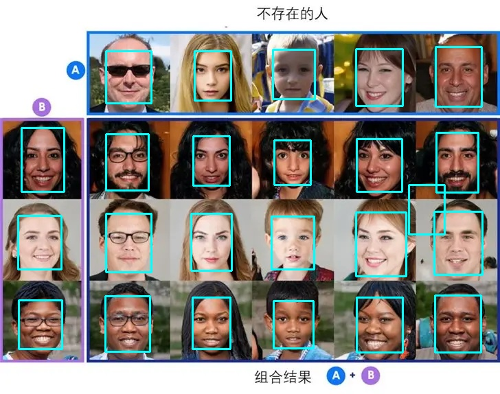
    


## **六、语音处理：Speech**


语音处理(speech signal processing)用以研究语音发声过程、语音信号的统计特性、语音的自动识别、机器合成以及语音感知等各种处理技术的总称。由于现代的进音处理技术都以数字计算为基础，并借助微处理器、信号处理器或通用计算机加以实现，因此也称数字语音信号处理。

### **常见领域**

- 语音识别
- 语音合成
- 语音唤醒
- 语音克隆


```python
import IPython

IPython.display.Audio('./examples/BAC009S0150W0039.wav')
```


<audio  controls="controls" >
    <source src="data:audio/wav;base64,UklGRqTfAQBXQVZFZm10IBAAAAABAAEAgD4AAAB9AAACABAAZGF0YYDfAQARACIAIAAVAA8ACgADAA0ADQAUABgAGAAWABEAEAAXABoAHQAXABEAEAALABMAFQAcABwAEQAMABEAHwAaABQADQATABMADgAXABIAIAAhAB4AIAAgACUAIQAkABgAGQAcABEAEwAWABIAEQATABkAGwAVABEACgARAA0AEAAVABMAHAAYABIADgANAAkACwAMAAoACAAIAA0ACQAMABEAHgAfABUAIAAhACEAJAAdACMAJQAkACMAIQAxADsAOwA6ADcANwBAAEAAQQBFADcAOgA3ADwAPQBBAEwASgBKAD0ASwBPAFYAWQBMAFcATwBKAEoAPgA9AEUAPQA8AD0AMwAsACEAJQApACgALAAwAC0ALgAwACUAJgAxADEAKgAfABsAIwAqACoALQAuADIANgAzAC8AJQArADQAMwA2AC4AMQAwADIAOwA6AD0AOABAADkAOgA7ADMANgArAC4AKwAyAC4ALAAxACsALAApAC0AKQAoABsAHgAiAB8AHgAXAB4AEQAQAAcACQAIAAIABQD+/wIAAQACAAEA///9//n//P/1//H/8f/x/+b/4//c/9f/5P/Z/9j/1//b/+D/2//W/9f/2f/a/9j/z//I/8T/x//O/9L/yv/O/8n/w//H/8b/zP/M/8z/xf/E/8n/xv/M/8//zf/S/9j/3f/U/87/0P/Y/9P/zf/W/9b/3P/g/+D/4f/b/+D/6//z/+r/5//j/+v/5P/k/+v/5v/n/9X/7f/z/+z/6P/g/9r/1f/h/9n/0v/O/8//zf/G/8n/yv/N/9P/zv/S/9P/1P/a/9b/1v/d/9P/0P/V/9f/3v/h/+r/5P/s//P//P8CAAcACAD5//D/8f8AAPz//f8AAAEABAAHAAEACwASAAoABwABAAAA+v/6//b/9v/x/+r/4v/o/+3/6//t/+7/6P/p/+n/4//j/9v/4//b/9v/2P/d/9n/1f/W/9j/1P/R/+X/2v/g/93/4//j/9T/2//d/9X/2P/b/9f/1v/c/+H/4v/o/+b/4P/g/9n/2f/m/+j/5f/h/+n/5P/n/+n/7f/w//D/8f/t//H/5//q/+T/4//i/+T/5P/d/9//4//i/+L/4f/a/9r/1P/f/9b/2P/f/9f/3P/X/9r/1v/Q/8//0//T/9f/1v/S/83/yP/Q/8v/zv/S/9P/0v/N/87/0//a/9f/zf/O/8z/x//M/8r/0v/O/83/0v/K/9L/z//P/9X/2P/U/9T/1v/S/9T/1P/I/9L/0f/W/9z/4//q/9n/5f/Z/+D/4P/R/+H/4//o/+v/5v/o/+b/7f/t/+v/6f/r/+f/6//p/+D/5f/g/+//6P/q/+f/5//x/+v/7P/i/+L/4P/T/83/1P/T/9b/z//O/9X/zf/O/8r/zf/H/9X/1v/O/9f/yP/L/77/uf+7/7f/t/+7/7T/wP++/8D/yP/G/9T/xP/M/8z/wP/B/8H/uv+7/7n/vf/F/8X/xf/J/9H/1f/e/9H/yf/D/7z/v//B/8f/wf+//8b/yf/D/8T/yf/E/8H/uP+6/7j/sv+x/6n/n/+h/6L/rP+v/6P/pf+l/6b/pv+u/6n/q/+w/6n/pP+n/6P/nv+j/5z/p/+f/5v/sP+x/7P/uv+3/7n/u/+4/7f/r/+x/7v/uf/G/8n/y//W/9f/2f/k/+j/2f/Z/9v/3f/h/+L/3//h/9//5//z//f/9f/s//T/9//1//T/8//2//X/7v/p/+n/5//z//D/9v///+//+P/6//v/AAD8//r/+f/0/+z/6//n/+P/8P/x//P/9v/6//X/9f/2//P/7v/2//f/7v/y/+3/9f/x/wEA+//2//f/8f/1//n/+v/6//T/7//8//j/+f/v/+7/8f/5////+v/z//f/8//u//P/7v/t/+j/9P/6//X/7v/w//L/9P/u//D/9f/1/+//5//y//r//P/2//D/9v/9//n/8v/9/wAA8f/z/+n/8P/q/+3/7v/m//L/7v/y/+n/8f/3//f/8v/t/+z/7f/x//D/9f/1//H/8//r/+//8//v//P/9P/9//D/7v/2/+7/8v/0/wAAAQD+/wcACQAJAA4AFwAQAAkABAAQABQAFQAUABQAFQAQABEAEgAfABcAIAAZABwAJQAZABwAHgAhAB8AJQAiAB0AFAALAAoACgAVABMAGQASABoAHgAdAB8AHgAoACMAJgAqACsAIwAgAB8AIAAgACAAHwAbACEAJwAkACgAJwAoACMAJQArACkAKQAoADAALgAkACkALgAkACgAKAAgABwAHwAhACIAJwAlACQAHwAdACYAIgAcABwAFgAWAB4AHgAQABQADwATABYAFQASAAoADwAQABIAFQAUAA4AEwAcABwADwALABEAGAAaABkAFAANAA0ADQALAA8AEAAOABYAHQAeABwAFwAYABoADAASABsAIAAXABwAHQAYABwADwAVAB8AIQAfAB4AGAAUABYAGgAUABoAFAAUABIABQAHAAYAAQAKAAQA/P8EAPz/AQD9////AgAEAAIAAAADAPT/8P/4//T/8v/w/+j/9f/w/+r/9f/+/////P/9/wAA+//6//n/8//6//f/9v/7//j/9v8GAAMABgAFAAAAAQALAAkABgARABIAHwAQABYAFgAVABQAEwAXABsAIQAhACYAKAApACUALwArACkALAAnACYAKQAiACUAJQAqACsALwAzACwALAAkACEAHgAVABkAHQAhACQAIQAuAC0AKgAqACwAKgAkABkAHgAqAC4AKwAgACYAKQAoACYAKAAuADIANAAzADAAKAAlACYAIQAxACwAJgAgABwAFwAWACIAIgAjABwAGAAdAB0AHgAaACMAKAAmACAAHAAcAA4ADQARAAkABgAJAAsADQATABoAGgAdAA8ABwAGAAgAAQAAAAIA///+//7/AgD7/wAACQAIAAEABAD2/+3/7f/v//P/7f/n/+v/5P/q//f/9//3/wIAAgD+//v/7v/z//D/8v/6//T/7v/z//L/+f8AAAoABwAGAAoAAQAAAPz//f////3/+v/9//r/+v/6/wEA//8HAAwADQAOAAUABAD+/wUABgADAAcABgAFAAQAAwAHAAMA/f/7//P/7//r//r/AAD5//v/+f8HAPr/9//8//r/8//2/wQA/f////b//v///wEABAAFABQADgAPAAYA/P8FAAcADAAKABAACwAJAAcACAARABMAGAATABgADwAKAAgACAALAAoACgAKABMADwAGAAoADgAQAAsABAD+//T/8v/6//z//f//////AQD//wUAAQD9//P/9f/w//f/9v/1//v/6P/o/+z/8//u/+v/7f/l/+H/4f/k/9//5//1//L/8P/n/+//6f/y//T/+v8BAPb/+//2/wgACQAKAAcADAAHAAEAAQD+/wYACQADAAMADAAGABEAEAAMABUAFwAbABcAEAAPAAsAFAAYABUAEQARAAcABQASABIADQAHAAMABQAGAPv/+f/1//X/8v/z//D/+P/4//L/9v/0/+//8P/3//T//P/4//P/8v/0//D/7f/w//T/9P/2/wAACQAMAAUABQACAAQABQARACIAHgAVABMAEQAfACMAIwAgACQAKAAhACcAIgAfABsAIQAdACUAJQAdABsAHAAmACMAHwAjACMAJQAkAB4AIAAmACUAJQApACEAKQAoACsAJgAiAC0AKQAmAC4AJwApACkAIgAjACMAHAAmACkAMgBCADkAOgAzADgANgA2ADgAQABAAD8APQBCAEEASQBIAEwATgBIAFEAUQBSAEoASQBFAEgAQABOAEAARABHADoAPAA0ADIAOAAzADEANgAvAB0AFwAoACQAIgAjACAAIQAkABkAFQASABMACwADAAUA/P/7//r/+f/6//j/AwAHAAkAAQACAP7/9//3//r////3//z/9v/y//T/9P/1//L/7//u/+z/8v/3////9//y/+7/8f/2//D/8f/1//3//P/8//z/AAD7/wEAAAD9//z//v8IAAYAAgAEAAkACAAPAA4ABwAKABIAGAAPAAMAEAAZAA8AEAASABEAFQAOABIADQAPABQACAAOAP7//P/+/wIAAAAHAAsADAAMAAMAAgD///r/8v/x//T//P/8/wIA8f/9//r/8f/+//b/9f/z//H/7f/x//T/9v/4/wAABgAJAP7/AAAAAPj/+P/t//P/+P/1//b/9P/0//P/+v8AAP7/7f/3//r/8P/0/+n/4P/k//L/8v/y/+//8v/0//D/8f/3//b/7//z/+z/6P/r/+f/5//w//T/+P/0//T/8v/o/+j/5v/x/+n/6f/w//D/8//u/+7/7v/y//f/9//4//X/7v/s/+7/9f/1//7/+v/s//b//v/1//H/8//+/wYAAwD7//b/AwACAP//+//+/wMAAwD///v/BQABAPf/+v8BAPb/9v/1//j/+//8/wAA/v8BAAIAAwD3//H/7f/t/+//9/////j/7f/v//j///////b/7//t/+j/5//s/+r/7P/o/+P/8v/3/+7/8v/o/+r/4//q/+3/5//w/+T/6f/u/+v/7v/w/+3/6f/l/+P/5//o/+//7P/q/+r/6P/v/+7/9v/1//7//P/z//P/8v/t/+v/8v/5//f/8P/2//H/+P/4/////f8CAAgAAQD///b/AQD+//z/AQD//wEA+/8GAA4AAwAFAAUAAAD5//v////8/wkAAgACAAEA/P/5//T/AgD7/wEAAgACABAACQAIABAABwAFAAgADAAMAAkAEAAMAA0ACQACAAQABwD+//n/AAAAAAYACQAKAAkACwAKAP//BAAFAAUAAQD7//r/9v/z//P/+v/4//f//v/+//n/+f/2//n/9P/v/+3/6f/r/+T/5v/q/+//8v/0//z/9v/z//r/9f/4//T/7P/s/+z/9f/0/+z/9f/8/wIAAAD+/wEA+//+//7/BgD9//P////4//r/BAAEAAIA/P8DAAcAAwAHAAcADwAKAAgAAgD5//z/+v/9//7//v/7/wcACAAIAAQA/P/8/wAA/v/1//j/9v/1//X/+//8/wMACQAJAAoAAwADAAcACQAEAP//BwAEAA8ADgAMAAsADAAPAAYACAACAAgADQAJAAMACAAKABIAFwAVABMAEgAPAAsADQAPAA4ABgANAAgACwAOAA4ADAALAA8ACwASABEAEwAMAAcADQAKAAgACAAJAAAA//8FAAIACgASAAkACAACAAAACAABAAIAAAD4//7/AAABAAEAAAADAAIABQD6//v/9//0//z/8//1//T//P/4//L/9P/0//z/+f8AAPv/AAD9/////f/7//r/+v8FAP7/AgAAAAMAAgAMAAwADQASAA0ACgAFABcAFQASAAsABgALAAwADgAUABQADwAWABkAEAAJAAoACQAGAAMAAwAAAAUABwAAAPv/9v/6//X/8v/1/+3/7P/n/+f/7f/t/+7/8v/2//H/9P/z//f/9v/u/+//8v/z//T/9v/2//r/9//0//T/9P/u//P/8//u//H/8//v/+//9v/z//f/9v/w/+7/7f/k/+T/6P/o/+7/8P/n/+X/6f/k/+P/4f/k/+f/8v/w/+v/8P/q/+r/6P/k/9j/2v/f/9r/0v/T/9T/0f/U/+D/4//Y/9b/2//e/9D/0P/P/9P/0v/O/9n/0//U/9v/2v/h/97/1P/U/83/1//a/9n/2//W/9j/3v/h/+H/4//d/+L/4v/n/93/3P/f/+D/4P/Z/9P/zP/K/8n/yv/F/8f/wv/R/8v/xv/E/8v/0P/M/8z/x/+9/7X/rf+x/7L/rP+3/7P/t/+3/8D/wv/G/7//uP+4/7f/v/+7/7v/tP+3/8D/wf/F/8L/yv/V/9j/3f/Y/9//3P/a/9X/z//V/8//0v/R/9f/4f/t/+v/7P/y//f/+v/1//b/7v/t/+3/8//y//X/9f/u//D/+/8EAAEA/f/6/wQABQABAAAA/////wQA///5/wMABgAAAAIAAwAFAAMABwANAAkAFAALAAsAAwD+/wMA/f/+//T/9v8CAPz/BAADAP//BwAFAAUA9/8SAAEAAwAEAPz/AAD7//7/+f8IAAoADgAQAA0ACAARABUAHAAYACIAFQAVABAACgAaAB8AHwAeABoAGAAeAB8AIQAcABcADgAWABIADwAKAAcABwAJAAgABgAFAAIAAgD+//z/AQD2//L/9//s/+f/5v/q/+L/5f/p/+z/4//f/93/3//r/+D/1v/a/9//4//d/9z/3f/a/9z/3f/o/+z/5//p/+7/6P/t//X/7v/x//b/9//y//H//v8CAAQABAACAAkABwAMAA8AGAAdABoAIwAhAB4AGgAYABIADQAUABsAHQAaABgAFgARABkAHAAVAA8AEAATABEAFAAWABIAFQAWAA4AFgARAA0AEQANAAUAAwACAAoAEgAQABQAEQAUAAwACwASAA8ADAAJAP///P8AAAQABQAJAA4ADQAMAA4ADAAMAAcAAgAFAAMA+//6/wAAAgAFAPr///8FAAcACQADAP//AgACAP3////+/wMAAwD///7//f8DAPv///8PAAYABgD+/wIABwADAAQA+//7//v////9/////f/5//n/9v/y//P/+v/8/wAA/P/7//j/9//2//r/9//s//T/+P/2//P/8P/1//j/+f/1//n/AgD+//r/+f/8//z/+//4//r/9//2//X/9f8BAPr/+P/3/+//9f/1//z/+//6//z/+f/0/+//9v/1//r/9f/4//r/8//y//L/+v/2//L/7f/x//L/8//1//L/+P/1//P/9//4//b/+//5//P/9P/x//T/+//7//f/+P/5//r/9f/4//X/8f/y//T/+v/+/wAA/v8DAAYACwAGAPv/+f/2//f//P/2//n/AAAIAA8ADwAVABcAFQAPAA0ABgAGAAIA+v/6//f//f8BAAMADgAOAA0ADwAEAP//BwAQAAgAAgAJAAkAAgAFAA0AEQAUABEAEAAMAAgABwAMAAYAAQABAAIABwAVABMADgATABUAEgAKAA4AEwAaAA8ADgANAAYAAwABAAcACAALAAcAAgD//wQABAAGAAEAAQAFAP7/+//9//v/9v/y//f/8P/m/+f/5f/p/+H/4f/e/9n/2v/d/9//3f/R/9L/z//N/9H/xv/H/8X/yP/I/8H/v//B/8//zf/K/73/uP/B/7j/xP+//77/x//D/83/1v/Y/9T/0//Q/9H/zf/N/9L/1//a/93/4v/j/+T/6//1//X/8P/y//T/8v/1//f/AAAHAAQABwAHAAcABwANAAwACgALAAkADwAQAA4AEQAPAA4ADAAVABgAFwAZABsAHgASAA4AEQAUABwAGQAWAB4AFwATABEAEQAZABgAFQALAAEACQAJAAYACAD+/wAACQAHAAYABAAJAAoABAAEAAsABwAJAAQA/v8HAAsAFAAPAA0ADAAMAA4ACAAIABAAGAAdACEAGgAaAB4AFwAZABYAGgAhABgAGgAYABYAGQAaABgAGwAdABcAGwAeABgAGwAaABYAEAAQAAUAAgAIAAIA///8/wAABAD8//z/AwD///7/AAAGAAYAAAD8//T/7P/x//L/+f8CAP3/BAAAAAEAAwADAAQAAQD//wgADQANABIABQAHAAcACgAOAAwADwAMAA4ADwAUABsAGgAYABwAIwAkABoAGAAjACsAKQAjACAAIwAnACUAKgApAC4ANQAzACoALAAwACwALAAoADEANAAzADIALwA3ADkAMgAxADAALwAtAC0AKAAlACYAKAAzADQANQA3ADQANAAzADIAMwAvACkALQArACkAKQAfABsAIwAwADcANgA3AD0ARwBJAEIAPQA8AEEAPwBBAEQAPwBEAEIARwBQAFUAVQBWAFcAVgBUAFMAUwBOAE4ARQBDAEUAUABRAE8AVgBWAFoAVwBiAGAAXwBaAFYAVwBYAFYAVQBbAFgAWgBXAFcAUwBTAFQAVwBYAFkAVQBSAFMATABPAEsATABUAFAAVwBZAFcAWgBMAEwATgBMAEgARAA9AD0APQA6ADIAMwA5ADgANwAtADIAJAAuACwAJQAoABYAIgAgAB0AHAAcACUAIQAgABkADwASABIAEAAPAA8ACQALABQAEQAJAAwAEwAEAAsADwAPABAAAQAGAA0ABwAFAAMABwAHAAMA///2////AgD9//3//v8AAAAA+//+//3//v8CAAMAAQD8/wYABgAIAA4ABgAWAAwABAAOAAQABwACAAcACwAKAAoABgALAAcACAAGAAkAAwD7/wYAAAAEAAcABQD+//z/9P/6//r/+P/1/+z/9//v//L/9/8BAPX//f/0//X/9v/y/wIA/v8BAPL/+P/x//X/9v/7/wIA+v/4//X/9f/3//j/8f/1//T/9f/6//H/6v/j/+j/8P/n/+X/7f/p/+b/5//l/+T/4f/g/9X/2v/e/9z/3//a/9r/4P/j/+D/2//e/97/3P/b/9r/2P/T/97/2P/T/9D/0//Y/9z/2P/Y/9P/0P/Z/9z/6P/m/+f/5//j/+H/1v/N/9T/3f/m/+j/4//j/+X/6//s/+3/7//x//D/5f/d/9z/1v/X/9T/zP/W/97/4P/d/9T/1v/S/9b/0f/V/97/1P/V/9b/1v/X/9r/2v/i/+b/5v/l/+f/6P/j/+n/5//l/+b/3f/e/9r/3//2//z//P/4//j//f/y//L/7//q/+f/5v/f/93/4//p/+//7//w/+z/6v/o/+v/6//0//f/9f/z//H/9f/5//f/9P/y//D/9P/u/+v/7v/1//7/BgAKAAgABwAAAPz/+v/1//z//f/+/wMACAAKAAYABgAIAAsA///9/wkACAAHAAQA+f/4//b/+v8AAP///v////v//f/5//L/+f/8/wEA///9//z/9v/4//P/8//u/+7/6//j/+n/8//0//b/9//8/wMA9v/7//X/9v/1//j/+//2/wAA/f8AAPj/+v/5//H/9v/z//7/+//x//L/5//k/+T/4P/i/97/3v/k/93/2v/c/9//3f/a/9f/1f/h/+D/4//j/93/3v/e/97/3//e/9//3//e/9j/2P/b/9j/4P/a/9P/0//Q/9b/2v/e/9//2f/U/9H/0v/T/9f/3P/Z/9f/3P/g/+X/5v/j/+D/5v/q/+X/4v/k/+3/7P/v//f/+f/0//H/7f/v//X/8//x/+7/7//w/+7/8P/8/wAA9v/x//X/+v/4//f/9f/0//P/9//+/wQABAD9/////v8AAPv/9f/4//3/+//8/wAABwAJAAUACQAGAAwACgAGAAEA+//6////AwABAAMABAACAP//AQAEAAQA/f/5//T/7//s/+v/5//k/+L/5P/g/9j/3v/a/9f/2P/T/9H/yv/O/8n/v//C/73/vP+8/73/xv/A/7r/v/+7/7n/u/+y/7b/s/+u/7P/sf+8/7j/tv+5/7v/xf/E/8n/0//O/8r/z//U/9T/2f/a/9n/4v/f/+H/2v/X/9L/0//V/87/1v/V/9L/1//X/9n/2P/h/+T/4P/c/97/3f/S/9X/2f/f/9//4//q/+f/6f/y/+3/6//q/+f/6v/v/+//7P/r/+3/9/8BAAQABgAOABMACgALAA8AEwAMAAoACgAAAAYADQAUABgAHAAcAB8AHAAcABUAGQAYABUAHwAdACAAIQApACoAKAAhACAAIwAgACMAHQAfACAAIQAhABkAHgAmACIAIgAjACAAJwAiACUAJwAoACgAHQARAAoADQAOAAsADAAOABQAEQARABYAEQAXABAADgAKAAgA/P/9/wEA9//3//H/8//0//7/9f/8//z/9//4//X/9f/t//H/8f/y/+r/9f/s//H/9//0//P/7//2//H/9v/x//L/7v/p/+j/5f/i/+H/3f/i/+j/5f/c/93/4P/g/+H/2P/X/87/yf/J/8v/zv/N/8v/zP/I/8j/xf/B/8H/xP/H/8j/zf/J/8L/wP/D/7//vP+8/77/w//A/7z/vf+//8T/wf/E/8f/x//K/8L/xP/A/8L/w/++/8v/zv/U/9f/z//T/9v/4P/d/9f/2f/W/9H/0f/K/9P/1P/V/9b/2//d/9j/4v/l/+X/5f/h/+L/4//f/+b/6P/s/+n/8f/4//f/7//1//n/8P/x/+//+v8GAAsAEQAWABkAHwAbACMAIgAgACAAIQAfABkAHAAlACgAJwAsADUANQA2ADQAMwA5ADQAMgAsAC4AMgA1ADQALgAsADIANgA1ADUAOgA6ADAAMgA2ADoAOQA2ADsAOAA7ADkAMgA0AC4ALgA3ADAAMQA0ADUAPwA8ADYAKgArACoAKwAuACcAKgAvAC0ALwAvACoALQA1ADUAMwAzACsAKQApACwAKQAqAC0AKQAxAC0ALQAzADQANQAsACwAKgAmACgAJQAiACkAJwAsACwAKAAlAB4AIwAoACMAGQAYABQAFAAUABsAGQAiACEAHQAgABwAGwATAAwADgAXABYAEwARABoAGgAiACsAKwAsACkAJQAlABwAIAAnACsAMAArACsAMQA5AD4APwA6AD0APgBAADwAOAAxAC8AOgA+AEEARQBMAEwATwBMAEoATwBOAEsASQBIAEMARABFAEAARQBGAEAARgBGAEQAPwA9ADoAOAA3ADUAPQA3ADoALwArACoAJAAzADQAMQAmAC8ALQAxADgAMQAyADEANwA1ADIAKgAqACoAKAAnACoAMwAoACYAKwAsACwALAAwAC4ALAApACcAJQAlACYAKgApAC0ALgAsADUAOwA6ADwAOQA4ADAALQAwACwAMQAyAC0AJwApACgAKAAmACUAIgAmACYAHgAcABYAFwAXABYADwAKAAoADwAFAAIA/v///wIA/v8CAAIAAwAFAAAA//////j/+//x//D/7P/q/+//7f/s//b/+//9//r/9//y//f/+v/w//X/3//q//j/8P/0/+//7v/2//T/+v/u/+j/6f/p/+n/3//o/+j/4v/n/+r/8P/w/+//9P/o/+3/8v/w//T/9v/y//D/7f/y//X/8P/w/+z/9P/6//z//P/6//n/AgAFAAEAAQAAAP7//f/8//j/+f/1//3/BgABAPv//f8IAA0ACQACAAUACAAEAP//AgADAP7/+//6////BQACAAMABAAKAA4ADAAIAAkAAwD+//z/+P8DAAAABQAHAAYAAwD///3/AAADAAcABwD8//r/AgADAAIAAgAFAAkADgAPAAwACwAFAAcACwALAAUADAAOAAwACAAMAAsABQAQAAkACAAHAAMAAwD7/wIACgAGAAsABADy//f/BAAKAAcA///4//b/9//2/wQA/P/5//r/+P/7//r//f/6//z/+v/8//T/7f/t/+//7//w/+3/8P/w//H/8f/u//b/7P/m/+r/8v/3//v/9P/p/+n/7P/w//X/7v/u//T//f/+////AAAFAAsA+f/6/woAEgAOAAoACAAIAAMACAARAAgACQAMAAsACwACAAoADwALAAoA/v8CAP7/+f8CAAkACgABAAAA+v8CAAQABQADAPf/+v/8/wIADAAFAAEABwAJAAwADAAPAAMAAgAEAPf/+f/+////BwAOAA0ABgANABsAFQAOAAoAAgABAPr/8//6//3/BgD//wAABQAMAAkACgAJAAEAAwD4//f/9f/0//n/7//t//n//v/4//j//f///wgACgAGAAUAAQD3/+z/6//p/+f/6//x//z/+//+//f/8f/x//T/9f/s/+f/3v/f/9j/2f/a/9n/3v/T/9T/1P/V/9b/0P/U/87/yv/L/8j/xP/D/8P/y//J/8b/yP/G/8//zf/P/8v/zf/Q/9X/2P/V/9L/0v/Y/9b/4//q/+r/6//n/+n/7f/q//D/8//y//b/AQABAP3/+f/2//r//f/8//X/9f/1//7//////wMABQADAP3/+v8EAAQA+P/6//n/9v/4/wAAAAD//wkACAAEAAQAAAAHAP7/BgAJAAgACQD//wQAAgACAP3/BQAKAA0ADQALABQAFwASAA4AEwAQAA4AEwAQABQADwASABsAFwAXABoAIQAcABIAFQAYABoAHQAhACEAEwAbABgAFAAUABsAGAAcABwAGAAhABQAHwAYABkAFgASABQACwATABEADwAIAAUADgARAAsACQAKAAcAAQD///3/+P/1//j/+f/0//b/9f/0/+7/8f/2//L/8P/p/+r/5//e/9//5//i/+D/3//Z/9v/3//i/9n/2//b/9P/0//P/83/yP/M/9H/yf/I/77/vP/E/8f/wf/A/8v/wf+6/7f/uf+5/7z/uf+v/6r/qv+s/7L/uf+s/7D/rv+v/7X/rP+s/63/sv+4/7L/tP+5/7r/u/+7/7v/vv++/77/u/+8/77/v//A/7//vP/C/8X/xP/P/8n/xv/E/8f/z//H/8v/z//S/9T/z//W/9T/y//A/7z/vf/C/8v/0f/N/8b/xP/B/8j/xf/H/8n/xv/C/8P/w//F/87/0f/Z/9j/1v/c/9X/1//e/+D/4P/d/+P/4v/h/+f/8P/u//H/8/8AAPv/+f/5//n/AgABAAIA+f/1//T/AQAIAAcABwAQABQADQAJAAUABwADAPz/BAAGAAMABAAEAAgACwAHAAAA/v8AAPr/+f/5//n/9v/1//X/9P/z//L/9v/x/+z/7f/s//D/8f/l/+v/6v/v/+//8P/u/+n/6v/g/+P/4P/i/97/3P/k/+v/5f/m/+7/7f/l/+j/7P/t/+v/8//w/+b/6v/l/+v/8P/w/+r/8//1//D/8f/1//f/+//7//b/+P/z//b/8P/l/+n/5//r//H/7//x//L/8//3//n/+//9//T/8P/p/+j/5f/m/+n/6v/t/+v/6P/i/+f/5v/k/+P/6v/o/+b/7//t/+j/6//s//H/7v/u//L/9P/v//D//P/1//H/6//u//b/9//5//j/+f/5//r/+v8BAAcACQAFAAcABQAGAAUAAAAEAAAAAgD8////AQD+////AAAKAAkACQAHAAwABAAFAAgAAwD///7//v/z//P/+v8BAAEAAgABAAAABAD7//j/+P/w/+r/5P/p/+v/6P/m/+b/7P/q/+7/7f/p/+X/4f/g/93/4P/X/9j/2P/e/9v/0f/T/9T/0P/R/9f/1P/h/9n/2//U/9H/3P/V/9T/z//S/9D/zf/V/9b/1v/T/9D/0v/G/8//0P/S/9D/0f/Q/8z/2P/Q/9L/0f/J/8r/zP/D/8j/zP/Y/9b/z//W/9D/0f/T/9P/zP/H/8b/0v/P/87/0v/O/9X/zv/U/9r/2v/W/9z/3P/b/93/2P/h/9v/4f/g/93/3//h/+P/7P/2//b/+v/3//f/9f/6//f/7//z/+//6//v//X//P/7/wUACgAIAAUAAAABAAYABgADAP7/9/8AAAwAFAAOAAkAEQAPAAgABgAFAAwADQASABcAFgATAA8AEgASABMAEgASAA0ACgAQAA8AEQAUABUAHgAeABsAGQAcACAAGAAWABoAGAAdABkAGAAWABgAGgAaACIAIgAkAB4AIwApACkAKAApACcALwAyADQANwAzADUAMQApACoALAArADMANwA8ADwAPAA8AD0APgA5ADUANAAzACsALQAvAC8ANQA1ADoANgA2ADUAMgA2ADIAMQA2ADUAMAAxADIAMgAwADgAOABAAD4ANQA1ADQAOAAwADQANgA3ADUAMQApACwANQAuAC4ALwAwADEALgApACkAJQAiACEAHQAgACAAHwAjAB0AGwAbAB0AHgAXAB0AGgAYAA0AEAARAAwAFAAWABgAGQAXABMAGAAZAB8AKwAhAB0AHAAiACAAGgAgACMAJwAnACoAKQAvADIAMAA4AEAAOwA6AD0APQA/ADsAPgA7AD8ARgBGAEgARQBGAEcASABMAEoATwBOAE4AUABGAEMARgBPAFQAUABOAE4ATgBWAFYAVABVAFMATwBJAFIATwBKAEMASQBRAFEAUABGAEoATwBSAFEATQBIAEIAPwA/AD8AOQA7ADoANwA1ADIAMwAuADAAMgAkAB4AGgAgABwAFgAYABUAFwAOAA8AFgATABAAEAAOAAoABwAEAAMABwAEAAIACgAMAAcABwAFAAMABwAFAAQA///+/wAA+/8LAA0AAQAEAA0AEwAUABcACwAHAAMAAQADAPz/+v/2//P/9v/2//n//P/7/////v///wAA+f/x/+7/5//m/+b/6P/p/+L/6f/p/+v/5v/e/+T/3//g/9//1//O/9D/2//b/8//zf/Z/97/3f/V/9D/zv/P/9H/zv/T/9b/2P/f/9v/2//g/+j/5//j/+z/4//p/+X/5P/0/+z/9//2//L/+P/9/wAA9//8//r/+f8CAAMA/v8FAAoADwAPAAoAEQAUABQADgANABIAFAAaACIAIAAnACYAJAAnACcAJgAmACUAJAAlACQAJAApAC0ALQA0ADIANAAwAC8AMgAyADUAMQAxADIAMwA0ADcANQA2ADQANQA+AEAARQA7ADUANQA4AD0APQBBAEEARwBFAEYAQwBDAD4AQABCAEkATQBJAEYASgBVAE8AWABXAFYATgBLAEwAUQBPAEYATwBTAFoAUABOAFMATQBMAEsASwBIAEoATwBWAFAATQBPAEgARAA7AEEATABKAEMAQgA4ADIAMgAwADUAMgAxADIANgA5ADgAOAAzACoAIwAfACEAGwAcAB8AGwAcAB8AIAAkACQAJQAfAB4AJwAbAB0AHAAbABsAHgAmACsALAArAC4AMAAvACoAJAAhACQAJgAeABkAHwAkADAAMgArACYAKQArACoAKgAkAB4AHgAgACcAJgAbACEAHwAgAB0AGQAhACAAGAAXABUACQAIAAoACgAMAAgADQANAAUABAAJAAwABQD8//n//P/8//r/+v/2//D/8P/3//T/7//x//X/8v/1//b/8f/u/+f/5//m/+r/6v/j/+T/6f/s/+j/3//Z/+H/5P/g/9v/1//g/+D/3v/Y/83/z//R/83/xv/J/8r/xf/K/8r/x//H/8b/yf/O/9H/zf/N/83/z//N/8f/0v/W/9X/1v/S/9X/2v/X/9b/2v/d/9//4v/c/9z/3//a/93/3P/a/9X/1P/T/9b/1v/S/9T/2P/V/8//zv/O/87/yv/J/9H/0f/N/8r/zf/Q/8n/zP/M/8v/y//M/8b/xv/G/8X/w//G/8n/xf/M/8P/xP/D/77/xf/G/8X/yv/M/8f/x//G/8P/yv/L/8//yv/E/8X/zf/O/8z/0//Q/87/zv/Y/9X/zv/L/9D/0f/Q/9X/1P/W/93/3P/c/93/3v/k/9//4P/m/+P/4P/i/+f/7//s//D/8f/u//D/8f/r/+n/7P/q/+z/6P/k/+P/6f/k/+D/4v/Z/9b/0//P/83/zP/N/8//0P/Q/9H/1//b/9H/z//R/87/x//F/8b/vv+9/7//xP/F/7//wf/F/8T/x//D/7z/t/+6/7v/tv+4/7T/t/+2/7j/vv/A/77/vP+9/73/wP+7/7X/sv+0/7f/sf+0/7f/sv+1/7P/tv+0/6n/qv+u/7X/s/+r/63/qv+m/6X/qv+t/67/sP+t/6//qP+k/6T/qf+r/6b/oP+f/6L/nv+j/6j/o/+k/6T/o/+j/6L/m/+a/6D/ov+m/6j/rv+q/6z/tv+3/7b/tP+6/7f/tv+6/7n/vf+9/7//wP/E/8f/zf/O/9X/1//T/9j/1//S/8//0v/P/9v/3v/g/+H/5P/m/+L/5f/h/+f/5v/o/+P/5f/n/+X/5v/k/+X/6P/y/+3/7P/m/+b/4v/p/+X/4P/f/9z/3//b/9//3v/k/93/3v/g/97/3f/a/9z/3v/k/+z/7f/s/+b/7v/v//L/7f/p/+z/5P/q/+z/8P/z//f/8v/7/wAA/P/3//j/8v/w//H/7v/t/+z/8//x//X/8v/1//L/+v////b/8//z//b/9v/v/+7/6f/m/+v/5//t//L/9//w/+z/7P/w//X/9f/x/+7/8P/r//P/7v/q/+z/8//2//L/+P/x//b/9v/3//f/8v/w/+7/7f/t/+r/6P/p/+n/6P/s/+n/5f/l/+X/4//e/+X/4v/m/+P/5f/w//P/9v/2//P/8//7//v/+v/3//f//f8CAAkADgATABIAFAAVABUAEgAUABYAEAATABMAFQAWAB4AJQAqACkALAArACgALQArACoAKQAnACcAJQAkADAANwA3ADkAOAA3AD0AOwA8ADwAPgA/AEMAQwBFAEcAQABIAEIAQgBKAE0ATgBMAE0ATgBUAFIAUgBZAF0AVwBSAE8ASQBJAEoASQBMAEoATABNAEoARQBJAEsASABDADoAOwA5ADcAOgA6ADsAPgA9ADYAMwA4ADUANAA1ADQAMgAzADIALAAxADEAMQArACUAIgAhACMAHgAhACEAHwAfAB8AFwAVABUAFwAWABwAGAAOABQAEwASABAAEgAPAAwADQAUAA0ACAAJAAYADgANAAwADwAMAAoACAAIAAoADAAMAAwADAAMAA8ACgADAAcADAAOAAwABgAIAAYAAQD8//7/+//7////+//9//v/+//+//z/9v/8//n/9//1/+//8//0//P/7//t/+//8P/x//P/7v/r/+3/7v/v/+3/7P/s/+7/7f/w/+7/5f/r//b/9v/1//D/9f/2//3//v///wEA//8GAAkACgAEAAoABwAIAAsACQAMAA8ACwAGAAgACQAMAAgACQANABEACgAHAAwACwAJAAsACAAFAAUABAACAAAA/v/4//7/+v/5//j/+f/3//P/8//x//b/9P/2//T/+P/7//r//P/5/+z/7P/x//P/AAABAAAABgAPAA8ADgALAAwADAALAAkACAASABYAEgAVACUAJAAfACMAJgAoACoAJgAsAC4AKgApACkALQAuADYANAA5ADwAPgA4ADkANwAuADAAKAArACoALQAyACsALQA0ADAAMwAvAC8ALgAoAC0AMQAoACIAKgAqACoALgAuAC8ANAAxADMALwA0ADgANQAzADQAOgA0ADIALgA7AD8AOgBCAEMAQQBBAEkASgBJAE4ATgBKAEwATwBRAFIATwBPAFIAXQBmAGcAYwBtAHMAdQBzAHAAbgBpAGwAaABtAG4AcQBuAGsAbgByAHcAdgB4AHgAegB/AH0AcgBwAHMAeAB1AHgAgQCFAIAAggCBAIAAgAB4AHkAeQBxAHUAeQB7AHsAdQB9AH0AegB7AHwAewBzAGoAbABuAGkAZgBoAGcAZABhAGMAXwBhAF4AWgBiAF4AZABeAFUAVABYAFgAVABTAFIAVABUAFUAVwBUAFQAVQBRAFAAUwBUAEsATABLAEkASgBOAFAASgBJAEoARQBDAD8AOgA0AC0ALQArAC4AMAAxACoAKwAqACoAKgAkACEAHgAbABcAGAAVABQAEgAaABMADAAPAAgADAAKAAwADwALAAwACwAPAAoACgALAAEAAAD5//f//f8FAAEA/v8DAPz/9//8//j/9//3//D/7f/u/+7/7v/u//H/+P/0/+7/7P/u/+z/5v/h/9v/4f/d/9v/2v/b/+L/3v/c/+D/4P/f/93/1//Y/9v/3P/c/9v/1P/Z/9f/3f/g/+P/4P/d/9v/0//f/97/3P/c/9j/1//U/9f/2P/Q/87/x//J/8v/xv/I/8L/w//D/8L/wP+8/8H/uv+1/7X/sv+1/7P/tf+v/6b/qP+s/6z/p/+w/7L/rv+r/6//sP+u/7f/tf+0/7b/tv+x/67/q/+m/6v/sP+t/6v/rf+z/7z/vP+3/7v/vf++/8D/vf+6/7//tP+4/7b/tv/C/73/vP+5/7//v/+//7X/s/+z/7r/tv+6/7r/uv/B/7j/v//E/8r/xf/G/77/uP+8/8D/u/+3/73/wf+//8X/xv+9/8T/xP+//8H/wf/B/8H/xf/J/8j/yP++/8D/xf/F/8f/xv/H/8H/yf/L/8r/yf/F/8j/yf/I/8L/xf/O/9X/0P/P/87/0//W/9b/1//V/9f/1f/V/9X/2//Y/93/2v/Y/+L/4v/h/+X/5//k/+j/6P/p/+f/5v/o/+v/6//s/+r/9P/x/+j/8P/s/+7/7f/y//D/7//u/+H/6f/l/+D/3//b/+H/4v/h/+L/2//W/9n/1P/V/9T/0P/V/9X/0//T/9P/1P/d/9n/1P/S/8//zf/K/83/zf/T/9P/1f/U/9b/1P/Y/9j/1f/V/9D/0f/P/9L/zv/L/87/z//V/9L/0f/O/8//zf/O/9L/yP/O/9D/z//O/8r/0P/O/8v/zf/L/8P/wP/D/8P/xP/C/8X/xv/H/8b/xv/A/7v/vP+4/7f/uP+2/7b/uP+7/7z/vv/D/8P/yf/J/8X/wv/D/8D/v/+8/7j/w//F/8n/yP/I/8//0v/a/9T/y//Q/87/zP/O/8v/zf/W/9P/1v/d/9//6f/o/+n/4//d/+P/3v/e/9z/3v/c/9X/2v/e/9//4f/l/+b/5f/o/+X/5f/e/9r/4//m/+H/6P/p/+n/7f/z//X/+f/2//P/9v/z//f/8v/3//P/+//4//7/AQD//wIABwALAAcABgADAAsABQAKAAgACwAOABIAEgAPAA8AEwAWABgAGAATAA4ADgAQABIAEAAIAAwACgAQABIADQAQABMADwATABIAEwAUAA4ABQAIAAgAAwAGAAgABwAIABMABgARAA4ABgANAAsACQACAAgAAwABAAIAAAAFAAQACwAOAAgABwAKAAoAAQD+//r/+f/4//r/+//+//7/AwAHAP//BAD//wEAAQD//wAA/P8CAAIA/v/3//n/9P/x//X/8v/4//L/8v/w/+//+P/3/+//8v/0//L/8P/v/+3/6P/t/+z/9f/t/+3/7f/v//H/6//p/+n/8//s/+v/5f/o/+r/5v/q/+X/6f/r/+f/5//m/+X/5//q/+z/8f/w//X/8//y//T/9P/0//H/7//s/+7/9v///wEA/P/7//v//P/+//3/+//9//z/AwD+//3/BgAFAAkABgAHAAkACwAEAAQABQACAP/////9//7/AAD//wMABgAEAAQAAwAEAAgAAQD///r/9v/5//3/+P/6////BQALAA4ACQAJAA0ADwAJAAoADQADAAgACwAQABEADwAMAAkACAALABIAEQAVABQAEAAUAA4AEwAZAB0AJwAfAB0AHwAhACIAIQAjACAAIgAeACMAJQAlACoAKQAlACgALQAqACUAIAAhABYAFwAVAA8AEQAOABQAGgATABMAGQARABEACgAJAAQA/f/8//r//f/6////+v/8/wIA///8//r/+P/0//L/7//u/+7/8P/w//H/7//y//b/9v/0//H/9P/y//P/8//2//v/+v/3//j///8EAP//+//8//z/+//5//v/+f/7////AwAHAAMABQALAA0ADgALAAgAEgAKAAkADgAMABIAFAAXABgAGgAbACAAIwAsAC4ALwA0ADMAMwAzADgANgA8AEMAQwBHAEMAQwBOAFgAWQBVAFYAUABTAFkAYQBiAGEAYQBkAGYAZQBkAGAAYgBnAG4AbgByAG8AcABnAGYAZgBvAGwAZQBlAGkAbwBrAGoAYwBuAGUAZgBjAF4AWgBVAFEAUgBRAFEAVwBRAFAATwBPAEcASwBJAEUAQgA+ADwANQA1ADYANwA0ADMANAA6ADgAMgA0ADQAMwAyADAALgAyADEAKgAsAC8AKwAvAC0AKgAoACMAJAAjACYAKQAlACcAJwAlACYAJAApACQAKwAuACkAKgAnACYAKQAsACsALQApACIAJQAkACEAJgAkACAAIgAmABkAFQATAA8AEQALAAgACwALAAkACAAMABIADwAOAAYABwACAAIAAQD9//3/AQAFAAEADQAPABAAEQAQAA4ADAAKAA4AEQAMAA8AEQAQABAADwAPAAwACwAJAAsADwALAAwACQAMABAACgAHAA8AEwAWABcAGAAUABMAFwAUAA4ADQANAA4ADQARABEADgARABIAEwAQABUAFQAVABgAFAAVABYAGAAaABsAFwAUABYAFwAXABkAFQANABEADwAWABMAFQAYABUAFQAJAAoACwASABQADwAKAAsACgAIAAgACgALAAgACgALAAsADAALAAQABQADAAYABwAGAAcAAwAHAAcABgAEAAcABAABAAEAAQABAP7////4//7/9//6//v/8//1//H/7//p/+j/6P/o/+H/5P/m/+X/4//i/+X/3//g/9f/1//X/9b/2//b/9n/0P/R/9f/1v/Q/87/zf/O/87/y//H/8f/xf/F/8X/xf/F/8r/zf/L/8//0P/N/83/0//W/9X/0v/T/9P/0//Q/87/yv/M/8z/0v/X/9b/1v/Z/97/3//i/9//4v/i/+L/4f/f/+P/5f/j/+T/4v/g/+T/4v/i/+P/6v/k/+T/5f/l/+n/5v/s/+r/6v/v//D/7v/w//D/8f/w//L/9//2//j/+f/5//v/+/8AAAAA/v8DAPv/AwAGAAMABQAKAAkACgALAAgACAANABUAEQAZABYAFQAaABkAHgAcABoAHAAhAB8AFgAgACEAHwAlACAAIAAfACMAKQAfABwAHgAbABUAFwAdAB4AGAAjACEAHAAnACYALQAlAB0AHwAcAB8AJgAkACcAIQAbABsAHQAfAB0AHQAXAA8ACQAUAB0AGgAYABkAEgAcAB4AHAAdABoAFwARABQACwAKABMACAAQAA4AAgAIAAAABgALAAUAAQAEAPn/9//4//7/+//7//3/+f8DAPv/DAADAPz/AQD3//n/9//0//X/9f/6/wAAAgD///j//f/y////9P/t//f/6//v/+X/6P/s//X/5P/u//b/6f/z/9v/4f/k/9H/4v/a/93/AADn/+n/5P/e/+z/5f/f/9P/7P/e/+T/5//S//P/4f/X/+P/zP/v/+3/yf/3/9j/0v/v/9//5v/6/+7/1//l//L/AQD5/+D/4f///97/+//k/9j//f/w//n/7//5/wIA+f/c//r/8P/y//v/5f/0/+P//f/m/9r/7f/5//3/3P/1/+b/6P/m/+H/6f/t/9v/4f/P/7z/4//T/7T/5//l/83/CAC0/9P/2f+2/+f/x//L/+D/7f/W//r/8f/l/xMA7//0/wYA7v/i/wEAyP/0/wcAw/8PAP//9v8NAPH/8/8JAPT/CwD2/+D/EADp/wQA+v/u/xQAyv/t//r/6v/h/wYA3v/U/xsAuf8SAPL/2f8ZALj/zP/9/9L/6v/g/67/DwCw/9//+v+U/xcA2f/B/+b/0v/b/+b/2P/S/9n/4//d/+n/3v/K/xsAxv/d//j/4v8ZAOX/+P/a/+z/CQDT/ykA4f/y/y8Asf8EADgA2f8nAAQA+v8sAAUAMgDz/yAAGQAcAD4ABAA/AEMA/P9NAA4APgBBACMAYQDr/2sALAADAFsAMABIAEoAFgAqAFEAIQAzAGMA9/8eAFYA8v8pAGQA9/9GAAUA8/94ANz/PQAqANH/JwAuAAoAMQAVAPn/MAAPAPb/PQAvAL//XwD1/+D/owCv/y4AWgCq/3sAGwDK/3oA1//+/1MA6/8TAEUA0f87AC4A9/9jAPH/UwALAFoAAQAfAAwAIQAKABkAOADl/54Ar/+dALD/TgBNAKn/tQCz/2AA8v88AO//QwAsAOX/bADM/ycARgAnAMP/jgCV/14AKACN/+8AVv9EAEMAqP94ANr/YQAjANj/gACi/zwAKQDw/zAA0f8+APj/5P9tAJb/RwBCAFX/6ABL/zwAagBg/3IAz/+9/z8Ay//N/0YA3v/N/1AAqv8EAKsACP+eAMv/qP9NANv/4f8XABIAj/+LAGL/WABAAEP/4ACD/7P/rQAG/7IAjv/P/4AAOv9nAKr/JwDY/8D/WABK/20An//C/1IAJv/IAGr/r/9xACL/NQD9/1n/IAC5/47/igBd/3f/kQDH/pYAmf+F/yoAaP9nABj/LwCp/6//7/+q/7r/CwB7/+v/z//R/6X/EQB8/6n/MwBc/woAhP8KAHL/jgAJ/4EAf/+Z/+oAe/4WAdT+egACADT/mgAz/2gAZf81ADz/nwBr/87/iQCr/vcAPf8FAA4Acf/y/yUArP+j/1cAB//HAEj/4/9QAFz/tAAQ/9QA9f6dAKr/hf+4ANT+wgAr/14Aqv8GAGz/dwCl/7n/OwBw/7QAgv6MAVj+AAGc/2//5QDe/scAJf8hAcL+1AA3/4gAjP8oAK7/zv97AOH+RAGH/kYB1v62ALj/GACV/zUALABA/84ALP+oAH3/WQAw/0UBuP47AR7/QgDeAFb+EQIr/lUBiv/N/6UAV/+OABQA2/+ZACL/BAHT////mQD0/q0B3P7sAMr/+P+VAOr/MwBMANL/zgCs/5oA8f/J/4gByf5eASj/gAEp/0ABYP9tANIAYf8oATb/aQHU/t4Bpf4lAc3/UACfAKn/owApAJYA1P/IAEX/sgHm/gMBp/9yAJIAf//7AFD/MwFS/xsBeP+UAKQAbf9MAR//zAA4ACMAIQAGAFgALgBCAB0A4P9XAe/++ABkAP3+ywHW/vsA5//H/+QAuf/s/4kA1v9vAN//RAB0AH//WwHW/s8AuQBX/pYCZ/41AGEB/v6KACEAnwAB/54BNv86AIgAQ/86AR7/VQBnAKL/MwCZAL7/8v/jAFT/PgDXAOb+KgF//zsAbgBE/0YBxf6JAQT/XwBVAOv/OgDk//gAs/5jAbj/7P8bAJgAVf9xAbr++QBpAC//NwEu/0QBzv5jAf/+BgHH/w8ArgBy/5wAKgA1ALf/1AC8/+P/SQB9APf+NwF5/0wA7f/m/74ANf96AOX/SQCo/+r/lQCO/1f/QQG7/mcAzP+y/4AA5v7DAKP/6/9R/ycBZf5pAMsAY/5fAdv+ogC7/8j/KgBi/xABTv47Ab7/uv57AQj/LwCu/yoAIQCe/4D/EgEM/3z/fgHX/cUANADX/uoATv+F/6cAdP8n/zMB6f6//7MAqP7XAOn+WADY/0H/IACp/97/Z/9GABn/JQCj/1H/dwDy/ggAiP+m/9v/7/62AKz+SwAt/0gA7P4NAM7/B/+BAPf99wHF/PEBav5//78AF/7lAJP+2wAy/vwAs/78//T/Bv9CAF//9f9W/0gA8v4QADQAPP7PAXv9KgG3/1X+BAJK/YYB4P4sAIn/JQAA/3AA0P/s/iYB9v2bAT3+AgH8/k0AAwAF/ykB6P0QAjn+dAAeADj/eQDh/0D/kgDu/9D+3AGH/eMBFv9//0cBQf4qAar/9/9m/9oAcP+2/+AABf+LAK7/SADT/53/4gAx/60ApP81ABUA+P8WANj/gQD//ogB4P5OAAAAOQBFABr/IQHH/6//YgCjAI3+4AHX/oIATgD8/qMBZf58ARD/LQDzAH7+tAGe/ugAjf/V/3oA4P6kAVf+3gCU/5v/iwDh/7v+uwFW/h4AIgHw/YgBq/6HAIX/2/9j/9UAif6gAJD/1v6wAXz9wgGg/s7/TgD7/soAbP4GAez+IgCP/5v/IgCT/6D/qv8pAOH+lgAv/04A4v5oAK7/4/6QAPT/Ef8PACQAOv/q/1MAmP8F/4MBzv0mAZ3/Qv+hAA//cABA/1QApP8kAAv/agHH/XQBo/+d/ucBg/1/An/9TwG2//j+AAH6/ooA4f77AOz+XgB0/4gAu/41Aff+HwBXANP+dgH6/QYCyf0xAb3/NP8OAJkA1P4nANQAJP7IAW7+NwHY/qEAbP8nACgAev9OAE7/NAFB/hQByP8w/4UAoP+h/0IAzf/Z/8MA0P4HAdT/+P4hAv39OgEhAA7/FAE7/6cAk/96AET/YADI/30Ahf8JAJIAuv73AQf+WAHr/6L+sAIr/aoBvv/9/7f/PAE8/gMB6QDS/coCBf2fAl7+RwHw/o4AAgCZ/ycBgv4pAQ7/GQEx/zYA4v+QAFn+zgHN/pr/BgEJ/5IAPf8lACQAaQBe/qQByv6oAKP/zP9IAe391QHa/jMAz//q/zEASv9sAOP/3v/F/yAA2v93/4kANgCn/g0Bqv+A/3QAUv8nAIkAxP51AL3/kv9VALj+hAHr/bAAfwAI/pMBx/4PANH/SwBE/osBy/7a/3AAV/7TAan9JAH6/nQAZv/h/0sA8/7gAFX/8//l/7H/CQC8/0AATv9vAC0Agf9RAIn/fACH/9MAu/6/ANz/HgCD/40AWABa/iMCsf4fABEBKv8ZAL8AXf+/AFMA8f6tAMn/+P9pAOH/8/+YANL/9P8YAPb/2QCP/77/5ACF/2EAZQCG/70AJ/9DARj/mgCQAEv/IwHA/sUA/v/L/9YA5P4CAV8AIP+xAS/+8gEi/60ATgD0/uQBgf6mAV7/8//3AIr/yP+JAb39uwKv/tL/MALb/TcCfv7fAYn+gAHo/0H/2QGd/oUBaf/h/8oAB/9eAVb/HwDEAGP/3ADQ/47/1gBBAMz+mgGJ/sEBYv8HAHEAsf8rAHAAkQA1/rgClv3WAbb/5/4EAtv+awAeAHj/tgAIAaz+AwEXAIn/eAG1/6//7wCE/1YArgCq/04AzQCI/zsAggBDAEUA+/9XAAwAxQCbAEAAsv+2ACkAnADr/6QA3v9bAMAAAACOAK//YAGN/54ASgB8AOsAKQARAOkArP9fABEBrv8KAcn/uADa/9wAlgAuAIYA6v/qAAoAqgCeADgAIwCtAC8AGQAGATUAYgApACUAUwAXAYb/ggDJAGf/RQEAADgA4wCkAMX/pwAuAMgAIQElAAAAYQAFAcj/OwERAOf/3gDmAOv/ggDbAHYA0ADn/7EAPQAiAfEAOAAaAK4AyACwAGIAXgDNAPv/uQCGADUAFgFyAO3/PwBbAPcArwBRAOr/9gBQAPL/BQE6AOD/WgF8/+f//wBRAOUAcv9rAMr/mwCZAGMAZQDx/4sAfQDV/1kA1AAPAKQAz/+ZACEAdABwABwABwBWAL0A1v9BAF0AwAAVAF8ABgCsAPv/lQCPAHz/8wBIAGUAWwBFALkAfQDs/8UAIQBkAIMAIgBKAAkAjwA+AEoA8P+EAGkA9/9MAEMAPgBEACkATgBHACAAlADj/xAAcABrAE8ANABPAPP/ZgBUAEYAAwDv/0kAJwAMABQAXADp/xUAHwDp/2UAIgAeAD4AqP8wAHsA7/9IAB8A8P8TADUAAQANADwAGQAIANL/HQBXAOj/AAD//9v/GgAPABYAEQAOAPf/KgDh/xEAcgAQAOz/9f8CABYAOwArAPb/vP8/ADAA9f8dAAwAKgArAAYA6f8PABsAGgDg/9j/AwAcAAAAvP/p/wwADgD4/9D/5//+/wwA/v/V/+z////v//T/6P/q/zEARQDu/wEAFQAVABYA9f8JAOn/+v/0/wwA5v/x/zsAEADn/wUABgD4/yYAAgA2AAMA//9dAB4AGABMACcADwAyADgALwAeABwAKADv/wQAUwARAAIA5/8GACUAFABDABMAEwAvAD0AUwA6AEQAcgA8ADIAaQA+AG0AcAAHADcALQA1AJoAJAA4AFUANgBgAEsAXgBRAE4AZwBIAEcAZABoAG0AMAA6ADIAWQB4AEoAPAAtACEAOQAtAAYAKAAgAOL/1P8UAAUAAgAJAN7/xf/h/+z/5//r/77/1f/T/6j/7f/y/73/8v/C/9n/CQDq/yUAGgAoACsAUwBTAHIAvgCdAJoAwgCvAMYABgH2AOwA5gACAf8A+QDwAAIB/wDBAOYA5QDPAB4B1gDEAMIAhAC1AIYAXQA0AOz/4f+h/2L/Sv/8/rL+mP5v/kv+P/74/an9qP19/YX93f0D/qX+E/9o/43/nf///w8AbgCMAD4ATgCAAGIAPQAcAKv/tv9j/2L/n/+o/+P/zf/D/7P/FgBbAI8AsQAPAeoACgFYAT4BiQFJAlgCfQFsAQgBMwEsAkoBfACRAPD/MQCXAPD/Pv+6/3L/9v58/7r/jP/b/+H/Uf9t/wgAPwDY/wUAv/9n/3X/G/+//mH+D/7H/W79Sv2+/IP8fvxE/Db8jPwz/V7+dv+5/2z/KP+6/2sAuQBtACYA6v8dAEAAov/P/nT+e/5K/jz+YP6W/vP+K////uf+Xv8eALEADQEzAUkBYgGdAdcB3AHZAc4BZAHYALsAnACrAHYB4QAdAPb/GP8VAOQASQBLABIA5f9yAPMAhwBpAIwAWQCiAJkAVgCAAJoAVgCD/xT/Ev/i/uf+yv7q/Vb9+/xK/F78ovym/Jn8Tvy3+9r7SfyY/AD9Wv1u/hwAiQBSAPP///7D/zQAV/8H/7z+l/6x/mT+hf3T/P38ZP37/Zr+Xv/2/4gA3gD5AFkBEwK4AkgDnwM3A+YChgJDAuQBhgFfAQcBYwAVAP//wwCnAKMAfwDP/xcBlQEkAZkBtgGUAd4BhwHWAM8AAgGIAAoAff8Q/+/+9f52/ur9tf0H/lj9af1M/Rf9xP3O/Pj8UPyy+6H8r/yl/L78zPua++D7ofv7+7L8Uf1h/3MAYAD9/+P+I/+a/5b/T/+s/2P/bP+c/4b+yP0o/qn+Z/9OAMYAdQEZAhsCDQISAk4C6wJ3A48DWwOyAtgBgAEvAUsBNwEnAfMA0wASAd4B3wEOAnUC1QHsAjUDWwJbAloCKgLvAXwBSgDA/9D/Hf+u/mX+A/4p/n/+Qv7n/SX+Yv5C/kT+VP5c/qz+qP78/Rr9ZvxB/NH8xvxA/Lr7MPs3+yP78Pol+xP8V/7WADMBGQEbACL/SgBMANL/FgA7AEQAUABT/+/9q/0D/ur+4/+aAJIBFQJ+ArMCQgJKAgoDiAP/A1EEhwOaAr8BCQG7AM0AFQFFATwBIwH0AP0BdgKaAjsDagL4AnQDZwIbAvkBXAEWAdkAu/+q/qn+Rf6+/ab9jf3S/V/+s/59/jH+ev5V/kD+2/7b/v7+tv7A/Y78iPs4+2r7oPuT+yr7TvrB+cL5hvkF+oj77fz2/9cB0QHLASIAmv8cAKn/hP+7/+//7v9D/wj++/zW/M39Nv9NAHsBmgJiA7kDUgPFAhsD+wOCBCkFywSNA28CowEgAfIAVgHLARgCJwJeAjYCOAPfA9kDfgSKA6YDBASxAuIBIgF2ACwACgAj/+L9nP0C/QT9Qv1g/Sv+x/5h/0D/j/52/lD+Zv4M//7+o/7s/QX9Evzo+l/6TvpU+q36gPq8+W35mfnn+a76OPxR/Q0A5gIuA28DHwJvANYASgBp/8X/4P/0/wIA9P6I/UL91v0P/1sAvQGDA8gEVQX8BOkDhgMFBGkEuQSnBDcEZQORAqMBvADrAFwBDAK2AhYDMwP5A6IE5QMABC4D/gKRAz0CUwGKAOT/pf8q/4j+uP2r/dn9H/5s/pn+Zf8PAJoAbwCr/3T/cv9U/07/2P6O/uj96PwX/Hz6zfnu+V/6ofqn+mb69/lu+sT6FPt7/Pv9mP8IA+8DiAOBAyUBYgAMAE3+NP7f/tn+G//c/sv9ef3+/aj+3f9eAYwDlwV3Bo8GrAWqBHoEPQT0AzgETwQ8BJcDtQK/AQkBXgHwAesCyANeBFgEAwUrBesDHwTRAlUCyQJcAZAA/f9l/yD/8v6f/g/+U/6E/ob+6v4F/4n/GQBHANv/G/+h/kb+mf2G/VL9If3N/CD8l/uB+gb6xPlD+hv7o/sc/Mf7wfsQ/CT84fzc/Qf/lgHpA0cEaQQbA+8ANADz/r79+f2//lf/9P/M/yb/M/94/x0AhgFmA5gFXAfYB0EH1AWBBKMD1ALqAnYDuAPbA1sDbwKKASYBNAHeAasCnwNiBI4FOwXhA8wD6gFfATsB/P+w/83/9P91/0T/yf4v/oX+Mf40/n7+9f4mAFMAMgCk/8n+Jf6L/fP8DP1u/Zj9H/2t/A386/pk+gT6W/oz+wn8qPyE/GL8qPyo/Kn8Ff1X/hcA2gKZBIIEOgRJAkYALf/A/UX9Zv5Z/zcADgEKAccAsQCVADoB+wLXBOwGIAj8BxkHdwXOA7ICDwIoAgQDrwPEA3QDzAL0AbMBwwH0Aa0CogPoAwQFxwSOA1UDLwFgABoAPf9Y/7r/SwAPAO7/SP9B/iD+m/2a/eb9hP6D/5X/pP/v/tv9eP33/Nn8Qf2z/T7+3P2V/QH9Dfyh+1z7zvtj/DP9qf2L/aP9mv1C/Tj9qf1q/vP/hQLvAz4EhgSaAukA9//7/aD9Z/4j/2QAUAGpAcMBUQE8AaEBPgLSA3YFfQboBnAG9gSBA1sCLgFgAQkCowJKA1kDSwPwAnUCRwIZAmoC+AJaA4gEHgTbAzQDWQEMAQsAcP+4/y4AcQAiADQAbP+//jL+Jf0z/Wj9Q/4C/yv/Ov/n/mT+zP1B/f78hv32/fP9i/1p/dv8CfyR+9b6Avu5+3b8C/3v/Of8/vze/OD8RP0U/jr/agFHA44DJATuAvYARQDT/uH9h/4b//v/ZAHSAbAB1QHQAd8BwAJoA7kEDQZ/Bn8GngU+BF0DewL0AUECoAI0A7MDyQOIAxUDxAJVAksCWQJyAo0DTwOZA0gD9QHrAfsANADn//L/7P+j/+v/Vv/p/n3+ff03/Qb9m/07/qH+9f7U/p3+Qv64/Vz9Vf18/X79Xf1//Qv9kPz/+0H7Wfvg+4X8C/0J/TD9V/04/Q39Ev3X/eP+RwHeAmoDGATNAoABRQBz/qD97v3Y/un/AwGSAacBlwFSAV8BwgERA3gEZQXSBaMFCQXuA+8C3QGAAQgCgQLfAtgC1wLBAn0CEAKpAcAB9wESArQCNAP/Ap8D1AIFAgEC7QBlAOn/rv9R/+D+uf7V/av9V/3x/P78C/0X/lX+rf7E/h/+Jv7z/Zv9if2a/aX9bf07/f38ufxR/N/7G/xh/On8Sv37/OH80vy9/Mr8Of0T/lP/kgH4ArEDKgQkA94BlAD2/gH+e/4s//n/7AA0AUgBSgFEAWMB7wEfA0oEFgWQBUsFggSdA6cCrwFxAa4B+QFPAlUCTAJTAikC9QHeAdQBAwIXAjMChwJ+A4sDVgPoApcBVgF3AGb/uv4+/uX9Lf0D/bv8+fyA/VL9q/3T/W7+1P6v/sH+bv55/nr+Pv4D/u797P2I/QX96fyg/Fv8Rvw2/Hf8rPzm/Ov82vwM/dT8yfwZ/dz98/4GAcwCagMWBPMCeQEkAF3+i/2m/Wz+Kv/g/3YAnQC7AJUAyQBmAV8CfgMhBGsELwStA9oC2AFAAT8BdgH3AQ8C4wEmAgACvwHSAeEBOAJnAngCkwK6Ah0DGwOcAusBJwF5AMD/9v4I/m/9ZP0R/eH89fxj/e79Y/6r/p/+1v4U/8/+iP4z/v79B/7a/bH9kP2+/YH97fxD/Mz7lvtl+5L7AvxU/Pz86fxe/FD8Mfxt/M/8uv3//m8BGAOAA4kDMALJAGn/jP2+/Ef9Dv7n/nz/xP8mALcA6QA5AZkBnAKqA0EEbQRGBNcDKAOWArMBmwEcAmACcgJDAjUCHAIaAj8CJAKDAs0C1ALgAq0CiQL3AnIC8gF1ASoAHgBm/13+3/2f/ZT9Q/2X/aD9If7f/pP+wf5c/lH+YP7S/e/9z/37/Rv+wf2f/bX9iP3Y/BT82Puq+5b7lfuJ+wr8Xfyw/GT8HPx3/KP84fxW/Sj+BAAZAuMCNQN+Ai4BEQA7/tv87PyG/aH+d/8jALgAKgF2ATQBTgHTAewC0QNMBIEEEASkAxkDNgIVAlsCmgKvAm0CQQImAh8COwI1AnsC2AL9AuICnwJUAmMCZgKSATABXwDf/5D/lP4F/qL9s/2E/T/9if2k/Ub+jf5M/hX+2/0b/t395/3Y/b79Dv7r/av9n/1y/Sj9sPwg/NP7mfuB+6L7+/s9/Jr8uvyZ/LX8xvzm/Gb9Hf4k/xsBZAL4Ag4DzgGlAHj/Mv6y/Q7+5f6k/2EA+QBEAX4BVgFEAV8BBgITA6ADLQRYBPkDogMqA7sC3QIRAwsDwQJ3AkoCKgIUAhoCXwK0AgcDHQPdAqcCMAICAuIBEgESAbQASAAdAEn/mf4e/gH+qv2R/fn9Of7a/vD+lf4s/tX9DP7L/dX9E/4x/mb+YP4w/tT9pP1O/aX8UPwn/PH7wvvH+977B/x8/Kr8mfzZ/Pv8Df1W/Rb++/6ZACcChgLMAu0BygD1/7P+Of6e/jb/EgCxAA0BGAEaAeUAnADoAHMBgQKUAyYEbQR1BDkExQM2AxEDFgMcAwADrQJeAkgCOQJMAk4CZQKTAosCaQIBApEBkwHjAXQBbgHxAEEALwBf/5/+Dv74/er9sf3n/cf9Ev4n/oP9SP3r/FL9ef2E/eX9u/0i/gz+kv1F/QP90fxD/NL7mvtU+2T7YfuF++v7OfyJ/JH8yfz3/Cn9oP0G/p7+PQBdAfwBcQKbAfQAMgBE//v+Mf/j/4IA/gAZAeIA7QCeAHIAjwBBAYMClwOQBNYEwQSkBA8EjANiA18DpAOcAz4D8QKsAokCbQJaAmsChAKEAlQCEgIbAk0CCwLhAV0B7gDtAEcAlv/n/pT+TP7x/db9Wf2h/cz9Yf0w/eH8Q/12/Zr9sf15/eb97/2u/XP9K/0X/dH8kPwa/N/7Dvzd+9X7Cvxr/An9W/2k/cb91P0b/jf+kv5O/68AuQFdAqUCAwKUARMBbABLALsAXwHpAUwCOgLSAbABQAH4ADgB/wEiAyIEzgTVBLwEgQQMBMkDyQMFBEcEZQQ6BMIDkQM4A8YCeQJZAm4CVwJAAvwBDAIiAs0BqwEoAdcAqQAoAKT/HP/t/pD+Jf7O/VL9Vv0+/fr80/yw/Aj9OP1O/Uf9SP1//X/9Wv08/TX9KP30/K78c/xo/HL8fPyW/Mn8VP23/eD98v3+/Qn+H/5v/tj+1v/YAHgB5AGhAVABAAG0ANIAMwESArEC/QIZA7ACYgLoAYwBcwHGAZ4CVwPbAxIE8wPHA48DYgN/A8ADMAR1BIIEWwQaBNYDfQMDA6ECdQJOAjICCQLjAdABhQFJAckAUAAqAMT/cv/t/sX+gP4m/vP9Xf1E/Rj96fza/J38yPzP/OX8z/y0/PL8//wW/QT9Bv0B/fv8/vzY/Mv83vzp/Af9NP1w/b/91/3V/eL9//0//oz+4/5N/9b/PwB2AIgATQAsAC4AWQDQAG0BAwJYAoACTQLcAbgBkwGWAcUBGAKQAvcCMgMqAwoD2gLRAuECIANgA6kD7wPoA7oDhwM/A+kCqQJ8AlACUAJKAjUCHgLRAY0BHwG1AGsAKgDj/3j/MP/Z/nj+Jf63/X79NP0L/e38sPys/J78mvxo/Er8Yvxq/I/8tPzH/Mj80fzb/Nj88PwI/Tz9V/1T/Vn9Y/1k/U79c/2d/dH9Nv6X/v/+av+z/9X/2f/X/+3/IQCHAPoAlwEYAmQCpAKrAp4CjgKGAo4CngLbAi0DVQN2A3cDYwNvA28DkgPOA9ID8gMFBA0EDATmA84DigNQAy4D8wLZAroCkwJfAgECzwGIAVgBBwGYAEQAt/9Y//T+lf5k/hL+5/2M/VD9J/3O/JP8Jfz5++H7zPvi+/D7DPwr/Dj8KvwX/C78T/yC/Mv8Ef1h/Y39mv13/Uv9PP1P/Yb91P05/rr+MP9r/5P/kv+c/7///f9kAMsAWQHdAUQCnQLLAvICEQMRAy0DSANpA4MDigOJA4gDpAPAA9YD+gMUBB0EIgT/A90DywPPA9MDxAOoA3oDQwP3ApgCUwInAiACCgLrAdEBjAE3AcIAPQCx/0b/6/6j/mn+Lf73/az9TP3f/HT8Ifzw+9v7y/u6+777uvvC+9P75fv1+wD8D/xA/If8zPwU/UT9UP1N/Vj9V/1g/X79qP3l/Tn+ov4U/3D/q//Z/wkANgCCANIAIwGLAe0BSwKhAvICLwNdA34DiAORA6ADpgO1A8wD5gMGBCYEOAQ7BDMEHwT4A9EDvAOtA7IDrgOOA1gDAgOmAkwCDALrAd8B1AG3AYoBTAEFAa8ARwDg/3D/Bf+r/kz+9v2d/Un99/yq/F78C/zF+4b7S/ss+xr7Dvsf+zH7P/ta+3L7fPud+8/7CPxH/IT8wvz4/Cb9Pf1N/Wb9d/2i/dn9I/55/tP+Tv+t/wAAYgCiAOcAMwF0AdMBIwJ+AuYCPwOEA6sDvwPJA9YD0wPVA+YD8gP6AwQEBwQDBOkDxgOtA5kDhQNqA08DLQMBA9ECqQJ/AkgCAAKwAWEBGAHiAK4AfgBBAPX/n/8u/8j+Vf7w/Zn9R/0O/c/8p/x7/EX8EvzS+5j7YftK+yn7EvsM+/z6Hfss+0z7ffuo+9z7C/wu/GP8pfzr/Dn9ef3C/fP9FP4y/l3+jf7D/hb/e//S/zgAkQDiAC4BaAGuAdcBEAJXAqQCAwNFA4ADtgPFA80D0wPSA9MDygPLA94D5wPsA9oDuwOWA2UDLgMGA/QC5QLUArwClQJgAioC6QGmAVwBDgG8AHoANwD0/6//Vf/+/pv+L/7W/ZT9V/0c/db8r/yM/HH8Xfwt/Pv7xfuc+3H7XftD+0v7VvtM+2r7iPuv+9L7BvxC/Hz8xvwS/WL9sv3+/Uz+kP7S/iL/Vf+K/7X/9v9MAIkA5wAqAXIBxwH2ATACXAKCAq0C3QIKA0YDcgOOA58DkQOaA4YDfwOBA3YDaANXA0cDGgP4AscCogJmAi4C8AHJAaYBbwFWARwB8QCyAGYAHgDM/4D/Pf/+/sT+i/5g/i7+7f2a/Ub99vzS/Lr8ivyL/Gb8XvxL/CH8N/wh/BX8/fvw+wP8C/wh/C/8U/x0/LP84Pwd/V/9jv3f/RH+Wv6p/vv+Y/+8/wUAUQCFAMwAAwEtAXgBrAHzATECXgKkAs4C9QIHA/4CFAMmAz8DaAN5A4gDgQNyA3UDUANLAzYDDAP0AskCrgJ9AlcCJgLdAaUBYAElAf0AvwChAHQASAA2AOr/uP9u/yT/5v6S/nb+U/4+/iv+/f3Z/bL9dP09/Sn9Ff0Q/f389/wJ/f78Bf0G/Qb9Bf0C/Rn9Kf1I/Vb9bP18/Zn9zv36/Tn+bP6f/r/+7/4j/1r/lf/W/ykAdwDCAAMBMwFbAXYBjAGtAc8BCAIyAmACfgJ8AooCfgJ0An4CgQKRAq0CqwKoApkCfgJuAkUCHwITAvUB5QHBAYIBaQE7AfwAuQB7AEkAGwDs/9P/vf+z/5f/ZP9D/wz/4f6y/pL+g/5v/nD+av5Z/k/+Ov4r/hD+8v3c/eL98v0A/h7+Ov5g/mX+cP6I/pT+pf6z/r3+4/4N/zf/aP+H/7L/uf/M//v/BAAfAEwAcgCiAMQA3wD6ABQBIgFJAW8BmAG9Ab0B1wHpAfAB8gH9AQUCEwIhAhgCGQIUAvcB6wHYAdUB2AHSAdAByQGtAZEBiAFvAWABRAEpARcB7ADMALgAjQCAAFUAOQAaAPj/6/+7/7n/nv+M/3n/W/9S/0H/Pf8y/x7/Hf8Z/wv/Df/0/ub+3/7D/r/+tP7F/tr++f4E/w7/K/8s/0f/V/9n/5X/sP/Q/woAKgBNAFgAawBoAGgAdwCAALQAuwDUAOYA/QAQASMBLgFBAVcBQgFjAVwBcwF4AWUBcQFdAWQBYgFEAUEBMQENARABBgHwAOwA3QDQAMoArgChAJEAfABeAFgAUQBNAEUAHwAWAAMA5v/B/6j/n/+F/6L/kP+l/5//dP+R/4X/pf+f/6P/pv+0/6z/uv+k/+v/h/9X/23/6f5y/0D/Rf9b/3b/j/+W/7v/mf+c/4b/sP/F/+3/+/8XABIAHQAeAPL//////y4AZQBaAD0ALAAHAFEAZABWAEkAQwB7AIYAvQCrAKQAjgB2AH4AjAChAK0AfgBYAE0ATAByAGoAaQBQAEoAQAA+AEYATwA9AD4AGwAaACEAJwArABIADQD3//H/3P/f/+v/8//r//P/3f8EABQAJwATAB4A7/8NANz/8f/Z/3AAWQCR/+f/Z/8OAMz/AwDq/pj/WwCn/y4Azv/t/4z/qv/i/6b/IgAsAAoAJQAmAIMAzP8WAPD///82AAIAAAD7/yYATwDi//L/IAABAG4A//95ACoAQwAkAO7///9v/zMAuP/b/1QApP9jAN7/GgDr/yAAPwAGAA0A4P+QANv/SQC8/9v/t/8AALj/DwDb/5z/BwBc/0YAtf/1/5r/4//l/wwAKADV/xwAAAAMABYACADU/zcA3f8GAAUAJwDK/wIAOQC//3QAGAAqAGsALABbAH0ATABGAG0ANwBRAJkAhAB/AIgAeABrADcAawBgAEMAXgBwAAwAVwA9AE8AQABIALMA9f+5ACwAlQBvAGsAZQD2/6IAIgCAACcAZABLAC8AcQBSAHkAywCDAFoA0gCnAB8BswCnALoAugAGAW4AMgGdALQA/QCQAN4ADwG0ANsA8QDWAJoBaQAYAQMBzgBsAcQA8gDcAMsA7AB5AL8ArwBDAO0AvP+hAO4A9v/iAEYAVAC6ACcAmQAfACsAyAB+/28AEACUAPT/yv9nAJz/6gD1/6AA1f8XAHAAj//A/yAAp/85/+n/J/+O/1T/ev9X/zT/x//9/z3/lv/A/0P/BwCg/2P/3P/h/9j/FgCt/8T/GwDB/+r/ZADu/xIAHQABAB4AVgDw/6P/DADb/1cAAADG/1cANwAXAJgALADq//QAaf/S/1YBZf+fAFMAK/+rACUAyP+E/6H/tv/l/4v/lP/d/1j/6/9Y/17/uf9BAHH/7v4yAHr/qP8jAGP/Ff/j/5n/rf/k/y3/hf9r/6z/bv/w/6j+4P/R/47+owDb/s7/BgAN/7z/HgB+/w0AiP9k/+j/6v/f/0T/4f+z/97/nv9+/zkALQCZ/wwADQAiAPD/YQB8/5gAbQB0/8n/GQCnAN7/4f9s/wYAhQB/AL3/kP8WADgAKACc/8b/0gBE/3T////6/1oAff9F/wL/QgCSANf+oP6a/5j/X/8y/w//uP61/yz/JP61/r3/sv+e/mj+sv6M/5f/4f6b/pz/3v7e/zn/jP4MAFj/MP9l/nb/6f9Y/wD/JP8Z/3X/8/+u/0b/DgBlAN7+1v/0/1QA6f9M/wIAFQDAAC0Amf+7/zkAwgAgAN//XwDi/0oABgD2/7wAsv9J/6H/7/9dADgAef/t/nj/dwCt/9L/R/8q/yIAdv/I/63/iv/y/4L/av+b//z/JACF/4v/Vf8AAOn/Rf9b/3b/yf89/zn/Z/92/+D/AP+e/or/9v8tAEb/2v6k/xkA7v/M/5b/hP/d/2n/dv9FABUAzP8F/1v/fwA7AFAAkf99/1gAuQAsAO3/PQAUAHUANQDU/2QATADT/04A6v8UAFEAAQD7/yoAXwALABMA6P9EACgAIgAVAJb/5/8tAOD/pP+s/+L/VwCb/73/lf9w/7z/pv+5/1f/m/8W/0r/0f/P/7X/6f7z/pb/qv+d/zf/4/41/3H/fv8d/03/Rv/2/kv//v6g/3D//v6T/2X/wP+U/17/0P+p/+3/t/9s/wAA6/9LALT/sf8qAKv///8UAEMAIQAGAC4ADQBIAF0AHgACAN7//v9GAOf/MwAwAMH/vf/Z/wMArf/G/+r/w//3/8L/cv/j/6r/1P+j/3//7/+1/27/cP+7/wIAnf8i/0X/h//k/zD/U/8s/zz/v/81/1X/bP+I/zP/Uf+6/4j/p/9i//X+x/+F/yT/V/80/5P/h/9K/wP/g/9p/2P/t/9z/6L/yf9z/7f/GwC3/+z/6f/A/y8ASgAcAB4AZABsAHkAmgBXAHoAeACRAKMAhwBqAIAAdAByAKgAdQA/AGgAjQAsAFcASAB6AHsAOwAbAB0AYQA0ADIAQAA8AC8A9f8CAEAALgAMAKr/of/+/xsA8v/C/57/6v/8/8n/zv/4/87/pf/T/6//8P/n/7//k/+U/wcA3P+W/5j/lf/G/9r/kP8+/2//rv+1/67/Mv9h/7P/rP+N/4L/av+R/9X/rf+9/6P/u//2//7/0v8OAAUAHQCTAIAAWwBFAFsApgDVALYAxAB9AOkAFwHCABUB4QDZABQBJAEYATIB8ADxAC0B7AAjASIBwwC9AO8A1gDBAJYAcQChAH4ANQA0AD8ALgA2AOH/gf/N/6r/aP9q/yv/Ov/6/qX+v/7Y/oT+OP7X/fL9T/4z/gD+q/3J/R7+gv5U/vb9S/5o/pX+Ef/9/jL/hv88/8P/VgA9AKgAeADCAIABigGVAYoBjgEXAoECYgIkAoUCxQLFAhsDvQLcAgkD8wLvAs8CuQL/AqECbAKUAnoCWALRAcEBjQF7AWgBvABmAP3/AQBMAHL/wP5A/kL+e/5l/qH9qPyR/Pz8VP0U/Vb8+vuN/Nz8RP0o/YX87fxQ/aX9F/4c/lH+X/5t/gP/n/+Y/3r/gP/O/5sAtACbAFYAIADWACUB9QDdAKcARQGpAW0BbAE/Ac8BMQICAvwB1AGUApMCLgJoAg0CqgKGAg4CLALQAS4CPAK1AWABMQFUAR0BvwBkAPz/8f+c/67/kf/4/tb+aP4w/pb+P/7F/Tv9Vv3z/RX+1v1H/V39ov0s/jj+rv3h/UP+Wv69/oD+oP77/s/+Rv9u/07/if+d/8D///8GADsAIAA2AGUAtADbAIAA4AAjAYsB5QFKAZABvQFzAtUCKQL/ASUC+gJDA90CXwI2AmwCCQPdAmwCEALmAUIC8AHGAcMBVQH/AMoA4wDaAEoAy//h/xgAm/+K/8X+gP5E/wD/fv7o/d/9tP4R/6f+Ff6w/Vj+9f48/7r+Ef6p/kH/P/9p/xv/zf4u/zD/p//l/03/Yf+F/2n/BAApANf/lf+v/x4AiwCCAFoATgD/AGUBwQGsAVoBJgJPAuUCiQKGAvkCBgM4AyQDvwKgAuUCwgJ9AkACJQIdAv8BXQFAAVMB2gDnAFUApv/M/5j/wv+G/9/+df5A/nr+vP5M/rz9LP3Y/bv+Pv+k/vT9i/0j/rL/fP+n/kX+l/5J/1IAhP81/6D+x/7f//7/uP+B/3D/m/8TAF8AfAAxAFcAMgCiAA8BTQGBAUQBpQE0ApECoAJrAsMC7wJNAz8DIAMTA3wDZQMSA5sCHwJ9AkcCJQKOAWMBNgEmAfQAtQBoAPX/5//J/47/Kf/l/v7+7/7T/kP+dv2X/fv97v0k/dX8bv2u/m7+SP67/UD99P5A/8f+Pv4f/iP/xf9D/yL/vv68/n7/zP+t/1X/pf8DADgAiAB4ALUA7AD9AJsBZwHAATQCfwJ7ArsCNQNtA6UDPAOBA3gD5wPkA3ADEgPUAhwD7gJrArkBSgFNAVYBCAG5AEAAAAAQANv/Y/9Q/wL/2P61/i/+4P1E/hX+lf1D/RT8bPzt/GH8XfwR/Eb8W/1G/X/9CP3f/Kz9//1R/vn9Bv6L/sL+y/4P/zL+bP7//l3/mf9j/5X/7v91AHoA0QDxACgB3AEUAtkBIwKFAkADOgPPAkIDZQPNA0EEbgNJA6IDogPdA/UCIwKCApQCMQLvARkBcwD4ACwBmQBMALv/6/9ZAL7/iP+g/0X/NP8Y/2X+0f1G/mj+mP0r/eb76/u//H/8cvwN/CD88PzG/cv9Qf1H/bb9/f2N/n7+IP7g/q7+3/6u/tj9VP7Q/vn+5v4A//P+c//y/zMATQByANwAUwGHAYIB+wFwApYCugKjAqICaAOeA6cDOgO8AhwDzgNrA+ICfwIDApICjgIeArABRgEsAcoBnQEXAVgBQgEkAVIB4wCGALkAqgA1AHb/cP5g/gL/Qf61/WP8evvz+2r8Wvyx+xL8mPwH/Y798vzF/H39jv3N/dL9Kv21/Tf+pv3K/fH8p/xH/cv99v0F/i7+R/4X/2v//v9hAI4A+QBbAZgBDAKWAvsC6wLoAt4CaQOoA5oD2gMlA2wDmQOOAycD5AKzAsICowJCAmgCCwL7Ae8BRALVAa4BswFjAXgBNAH9AN0ARgCp/yr/nP7B/a/9wP2X/GP8Wvvx+kb7B/sQ+1r79vt6/D399PwQ/Vv9xP3r/fL98/2a/S7+8/3p/ZD9C/0c/XD9xf3c/WP+oP7n/ob/8/9nAN0APAG1AQUCLAKCAvYC8wIPAx0D1AL+AkIDVAM3A68CrAL8AuYCcwIMAqsB2QExAvcBnQF0AYUBsgGZAR0BTgFYAQ4B+ACuAGoAcQADAIL/vf4P/n79Uf10/bf8a/yn+9b6TvuX+2H73/u1/Hn9b/5c/v/9Tf58/gb/Ff9L/sX9Mv5T/kP+vf3Z/Mb88PyZ/cH95/1w/v3+mf8TADMAdwA2AcgBVQKYAoACfwKuAscC8gLXApsCyAKWAnsCSgIMAhwCQQIhAt4BrwGWAdQB5QG0AYEBdAF7AeMB1AGZAV0BCwHdAMwAjAA9APb/b//u/ln+if3n/FH97vzc/Ir8UftX+5r75/td/Cr93/2X/vX+xv6a/n7+hv6o/qf+GP4l/kr+7v0F/uP9eP1J/WX9pP1+/ov/SQARAUABUgHFAS0CjAL8AjMDUwM4A0QDVgM8A9kCXAL1AcMB9wEtAlsCBwLcAUIB/ADaAAwBvAHgAcABcgEIAccAIQEzASoBGAHYAJsAZwAKAL//fv8O/8X+gP50/Qf9EP24/LX8XPzC++/7P/yQ/PT8gP0y/h//0f+U/1b/Av8R/wf/GP+W/rX+uf6R/lH+jv1Q/Wn9K/66/oj/7P9yANEANwGWAZQB+gFiAuACKwMOA5gC+QG6AZ8BAwLkAbIBiQElAQMB1gDMAJkA3gAMASIBHgEuASYBQAEkAS0BbwFdAWkBVwH+ALQAdwA8ACgA6P+3/yT/xv7l/Xb9nf2E/YX9R/2h/GH8nvx0/Pb8if2Y/ln/wv+d/yL/z/62/tj+f/6D/nH+jf46/rT9Lf3q/Ov8gf09/qX+ef8YAIEAowDXAAMBOQHQATgCowKvAmACLgLZATwBWQGyAaAB8AHSAakBaAE8ARUBNQGRAdsBNwImAgcC+gHaAcEBBwL/AfkBDwL7AaUBJgGvAFoAQwAVAMP/Y//J/hj+Cv5+/Sv9L/3w/Ov8DP3h/Mz8P/0S/gb/Z/+k/zT/7v7N/nX+Q/4S/gH+Zv5E/pX9YP3h/Mv8O/2b/TL+K//a/1sAlAB7ALcAHwFoAdcBPgJIAnACPgLIAV8BcAGdAfYB/gHPAfIBwQHkAdwBswHbAUUCawKeAoYCaQJpAlgCbAI/AioCAwIhAvwBcQEKAaoAXAA/AMP/Rf/E/kv+N/7f/Z39b/0f/Qf9DP3w/O78Pv0H/sn+L/8s/+H+rv5m/hr+yP2Q/cH9Fv4B/qX9G/2s/If8uPw3/eH9w/6v/0YAMQARACUAegDbAEMBpQHsARUC+wGaASIBMQGFAd8B5QHmAesB7gEiAgsCBgI1AnACtALoAuEC4wLTArgCtQKtApYCiQKMAkcC8wGMAREBxQCNAEUA3v80/6r+mP5f/jD+8/1o/VP9bv1h/Vz9wP18/uf+Lv8x/8f+lf42/s/9p/1g/Yz91v2H/TL92fyK/G38q/wy/dj9zv6Z/xcAPQAdADIAgQDKAD4BsQHzAQIC/AHHAbEByAH9ATMCSgKQArwC4QLwAuMC8AIBAxYDSANTA2wDZgNOAzkDAAP3AvAC0wK0AmQC4wGYATwB9gCgAEUAoP8T/9n+Yf4x/vH9cf1F/Tz9Dv0e/Ur93P1k/p/+lv5Z/iD+1f2d/U39IP06/Vj9O/0L/bz8evxl/F/8sfxP/S7+A/+B/9D/3v/z/yAAaADRADgBhgHBAbsBjAGIAasB3gEYAl0ClwLGAuwCHwMXAwoDAwP9AhYDJwNDA2IDNQMIA8YCgQKKAoYChQJTAuYBdAEYAboAawAfALz/Hv/D/ln+8/3M/XL9KP3k/LD8n/zC/BP9if3+/T7+Ev7W/a79ZP0s/RT9CP0c/Sj9K/37/LX8fPxi/KD8D/3U/cL+eP/c/wIA8/8aAHAAyQBHAaAB6gENAuQBxAHKAQsCTgKPAt0C/wIfA1sDbwNsA2EDTgMxA0YDXwNSA1UDIAPuAsECngKSAogCUgISArgBTgH+AK4ATwDY/1f/vv53/if+1v2B/fL8o/x6/H/8lPzR/Dn9gP22/cv9p/2V/Xr9Pv0v/Sb9OP0//UH9H/30/Nz8wvzz/HP9Hf7//rb/FABfAHgAlwDwAGUBzwE7AoUCtwKzAo8CegKqAuUCJANhA30DsgPgA+UDzgPJA60DrgOuA6QDigNzAz8DAAPBAo4ClAKEAjkC3gFqAfEApQBJAPP/f/8E/3j+Av6P/UH99fx5/Bz86vvN+9f7OPyZ/N38Fv0T/fP8Df0T/Rb9G/0c/Sr9Tf1K/TX9KP0C/e78Gf1u/SH+CP+r/y8AcwCbANAAIQF2AdgBOAKXAsYC2wK+Aq4C5ALxAiMDTANpA5QD4APzA+AD0AOWA24DZQNWA18DUQP7AscCegI2Ai8CFQLbAaMBQgHNAGkAEACu/1b/8/5i/vv9lf1L/e78cfwI/Nn72vvV+x38bvzT/Dn9UP00/SH9Of1p/Yv9g/2N/bn91P3O/ar9cf1Z/Yb95P1k/iH/1v9TAJsAvwDxAEUBmwHtAUICjQLOAt8C0ALCAusCGAM9A14DYgN/A7UDygPJA7sDlQNqA0IDMgMPA/YCvwKGAlQCFQL9AdUBjgFVAQkBuABWAOv/hv81/9n+Rv7G/Xr9Lv3n/HD82fuP+437qvvv+1T8k/zm/PD85fz1/BH9N/1s/Xz9iP2n/bv9z/25/ZL9af16/cH9XP4U/6r/CwBWAHoAnQDpAFQBvgEgAmECgAKUApACoQLIAtwC/QIVAzIDVgN1A20DWANGAycDAwPZAr4CrQKdAlECFALQAbIBtgGOAUcBBgG7AIMASADm/5n/Q//Y/lb+0v1h/Sn99PyE/A38pvuC+4j7r/sL/Hj80fz2/P/8Cv1C/Wf9gf2I/bP91/36/Q3+9/3z/dz94v0W/oP+Rv/g/z8AmQDHAA0BSwGUAfYBPgKHAsAC1QLXAt0CAQMKAxUDCgNAA5QDtAO8A4UDSAMqA/kCuwKeAogChwJ6AkgC8gG4AYUBRwEHAcsApwB+AFoAIwDM/27/7v5h/uH9df0j/ez8o/xW/Az84fvF+7779vs4/JD84/wU/UH9dv2a/bb9wf3Y/ez9Ef4i/jj+QP4w/hr+NP6T/iX/wP8jAHQAowDQAAsBaQGyARoCcQKVApMChAKQAsAC7AL+Av0C/wIgA0wDZgNQA0kDGQPtAskCjQJ1AlECGgLqAaEBigF4AVMBIgHPAJQAYAA5ABEA0/+V/zX/sv5E/tn9o/1i/Qj9pfw8/A/88Pvv+xP8WPyy/PP8D/1A/WD9iv2b/a/94/0S/kP+Uf5B/jb+Mf4f/jr+YP7l/nz/8/8yAGcAmgDbAC4BdAHWASoCdQKJAn0ChAKvAsgC8ALlAucC9AIgAz4DMAMzAwkD8ALCApUCegJKAhMC3AGQAXMBVQEtAfoAsQCSAGQALgDw/7L/gv9C//D+ev4a/t39lv1G/eD8c/w5/BP8A/wG/Cr8Yvyk/N/8BP00/XP9pP2h/bn94v0u/k3+ZP5j/l3+bP5y/oz+0P5K/8P/JABNAHQArwD8AEgBnwHcATMCZAJpAnECgQKhAr4CtQKZAo8CsALhAuMC3wKrAoQCZQI+Ah4CDQLcAaYBXwEXAQcB7QDQAKEAbgA9ABcA3v+u/4D/Wv8K/5b+Tv4E/ur9ov1N/eL8l/xr/Ej8Q/xX/Ir8sfzz/PT8Jf1G/Xz9lf2j/dv9Iv5l/nn+b/5Z/lj+S/5r/pL+9/5e/7n//v8eAE8AlwDhAB4BawG/AQUCJgIyAkgCZgKNApMChgKQAsAC8wIPAw8D+gLQArcClAJoAlYCOQISAt0BvQGSAX0BUQEdAfMAzgCqAIIAUwAlAP3/v/98/yD/5f64/oL+If63/XX9Q/0m/Rj9H/1A/Wf9hf2P/Zf9v/3u/Q/+KP5R/n7+tf7Q/tL+zv7H/tL+4/79/lH/t////y4APABeAJoA2gAaAVcBnAHcAf8BGAIkAkICZgJ/AoUCiQKfAsEC4wLiAr8CqwKZAnICYQI9Aj8CGwLWAZ4BcgFlAUsBIAH2ANgAtgCiAH8AXgArAAYAtP9l/zD//f7p/p3+N/7M/X/9Uf0o/R39Nf1X/Yb9k/2a/bv94P37/RT+Jf5H/oD+pf7K/sr+xP7D/sz+4/4g/3H/x/8HADEASABnAJkAwgAJAUcBgwG5AeIB+wENAjcCVQJnAn4CmQK1AtgC8ALkAtECvQKoApACgwJxAlcCIALjAagBgQF1AVMBIAHuANIAtQCgAG4ARwAnAPT/qP9e/yv/C//n/pb+N/7U/Zb9Zf09/TD9NP1S/XT9eP1//Yr9nP2w/br92f0I/kL+df6N/pL+oP6Y/qP+u/78/lv/qf/p/w8ANQBkAJgAwgDxACIBawGmAc4B6AHyAQQCIAI9AmICdQKNAqsCvALEArECmAKBAnsCXQJCAhwC/gHLAX4BQgEVAQEB2gC0AJEAdQBVADwAGgAGAOv/tP9//zf/Af/I/o3+S/4D/r79gP1S/SH9FP0V/S/9R/1W/Vj9YP1p/W/9h/2l/d/9EP4+/kz+Xf5z/n7+mP7V/hL/Yf+w/+r/KABbAIAAowDSABABPAFmAZwBrQHFAdEB3AH7ARkCLwJNAmwCfgKQApkChwJ8Am4CVwJCAiMC/gHWAa4BggFIARsB+gDhAMAAhwBoAEsARAAxABsA9//T/6T/bf8s//j+3v64/o7+RP4F/tL9sP2T/ZX9of26/cL9tf2r/ar9wf3a/f39Df40/mP+lf65/tf+4P4D/zf/Xv+o/+n/NwB1AKEAvwDmABIBOQFiAX8BqQHFAdUB4gHwAQMCHgI3AlUCZQJpAoECegKGAoICggJ2AmMCQwIhAg0C6QHPAZ0BeQFIASUB/ADbALgAqACTAHwAZgBSADIAAwDe/6b/cv9D/x3/6f67/oX+Yf4y/g/+5P29/bX9rP2v/ab9sP2s/bD9t/2q/bL9w/3P/fL9I/5H/nb+m/67/tr+DP83/2v/sv/n/xkAQwBjAH4AlgCwANIA8AD+AA8BMwFLAV8BfAGcAcIB6AHuAfsBDAIYAiICKAIuAiECDAL6AeoB2gG8AYwBawFIASoBFAH6ANwAvACXAHIARAAmAAUA5f/C/4f/R/8Z/+/+y/6q/nb+TP4O/uz9v/2i/Zj9iP1+/Wb9Z/1j/Wn9W/1H/UP9Tv13/Y39sP3o/Q7+Mv5R/nH+o/7Y/hH/S/90/5X/u//f//z/FwAvAE8AcACSALsA5gAKASoBPQFaAYABlgGnAawBtgHAAckB0gHVAcgBwgGzAaMBmQGAAXEBaAFQAToBIgH9AN0AtACaAHUAVAAnAPn/4f/D/5b/a/9G/xb/+f7J/q/+kP5u/kf+IP4A/tv9x/2f/Zj9lP2A/YH9gf2L/Yn9jf2k/br92P3z/Qz+KP5U/nP+k/69/tL+9v4g/z7/Zv+K/6L/x//n/wUAKwBbAIgArADUAPMADgEpAUEBVAFsAYYBnAGkAbABsgG0AbUBtAGrAZ4BpQGbAYEBeAFoAUYBNwEKAfQA1QC9AKsAhQBwAFcAOQAZAO3/x/+z/5j/iP9g/0b/I/8F/+L+wP6r/pH+fP5Z/kf+Kf4c/iz+K/4x/jP+O/5A/kL+Tf5Z/mr+cv6G/pn+r/7B/sr+2/73/hz/P/9X/3r/pP/Y/wIAMABcAHoAngC8AOAAAgEkAT4BVQFvAX8BiwGlAbUBvgHKAd4B5gHdAdwB0gHGAbUBjQFrAVUBNQEbAQkB9ADeAMUApQCKAGcAUgA5ABwA/P/f/87/s/+h/4L/bP9F/yP/Hf8T/wv/9/7k/tv+0v7O/tD+y/7M/sH+vv7E/sn+4/7p/vf+//7//g7/FP8l/zn/Tf9l/3r/k/+s/87/2v/r//7/FgAtAEsAaABvAIMAiwCiAK4AvgDJAN4A7gD4AP4AEgEZARYBFAEAAQAB4wDkANEAzgDUAMkAxwC6AKgAmACMAIMAgAB6AG8AaABlAEcAPwAhABUA/v/t/9r/xv++/6L/of+I/4H/Zf9L/zf/Kv8o/xT///7o/tz+yP6//rf+qP6c/pj+mv6V/pz+rf62/sD+zP7W/uH+9v4B/xT/FP8l/zX/Of9a/2X/c/9//4r/o/+3/9P/+f8HACQAQgBVAG8AhgCUAJ8AoQChAK4AswC8AMkAxwDBAL4AvQCvAKsAswCwAKkAogCXAI0AjAB+AHkAaABjAFYAOQA1ACIAEQD8/+7/5v/a/8r/rP+V/3//a/9W/0j/OP8j/w3//P7y/vT+6v7h/ur+6v7y/gD/Dv8b/yP/Jv80/z7/Nv9G/1v/XP9r/3L/ef+G/5b/nP+m/7b/y//a/+r/9P8EABsAIQAuAC8AOgA7AFAAVQBeAGYAagByAG4AdwBwAHMAegCEAIMAgQCCAHUAYwBpAGoAaQBnAFAARQBFAEQAPABBAD4ANAA3ACwAIgAPAAcA+v/q/+X/0P/F/6//n/+V/47/gf97/3j/bP9u/2v/d/+B/4L/if+M/4//jf+Q/5n/m/+p/63/rf+0/7b/wv/K/8//3//q//f/BQASABwAGgAWABsAHgAdACgALQAuADMAOAA2AEAAPABBAEwAUwBiAG0AeAB+AIgAiwCPAJoAnQCiAKUAmwCmAKoAqwCtALYAugC6ALkAqwCfAJoAjwCLAIwAggCDAGYAWABIAD4AOAAyACoAFgAVAA0ADwASAA4ACAANAAgABwD8//X/6//l/+r/5f/v//n//v8PABgAIgAkAC4ALgA2AD4APgBOAE8AXQBSAEYAMwApACAADQABAB4AIAA9AH0ASQBJACIAkv+l/1T/L/+Z/7v/LwCVAOMAzQDEAHwADgD8/9D/6v80AJIA3QAmASEB5wClAEYA///c/wIADABZAI8AfwCHAEEAEgDj/8j/2f/e/wkABQAKAA8A8P/k/8D/xv/h/wYAEQAfAAUA5/++/4j/fP+X/7r/0v8jAB4AFwAGANH/lv99/2//ef+4/93/JQBJAGIAUwAvAOr/v//O/7z/7v9DAI4A3QAaASUB9gDtAKAAZgB5AH8ArQDbACoBJQFAATAB8QDcALsAqQCKAL8AxgDxABgBHwESAfAA2ACRAJMAgACCALAAyQDgAPYA8QDHAK8AewBHADYAKgA4AFEAZwBdAH0AbwBDADYAJgAeAAUALQAVAC8ASQBIAFoARAA+ABcAGwD2//7/AwDz/xAA/v8MAAUAFAD///b/7f/U//D/6v8aACcAPwBVAGAAgwCEAJ8AmgCwAKMArwCyAJ0AvgCpALwAoQCxAKMArgDDAKYAowCXAK4AnQC+AKgAowCkAJYAkgCSAJMAjwCbAIAAbwBiAEwATABDACMAKwAMAPv/+//r/9b/0f/N/7H/tv+1/6T/nf+t/57/iP+d/5b/h/+W/4L/dv9//4T/kv+o/7D/uf/Z/87/5//j/+n/AgD//xIAHwA6AEcAcwB/AJEAngCkAK4AogC3AKEAuQDCAMQA5ADuAP8A+wDyAMgAwAC0AKsArAChALEAqQCmAKQAkwBzAFoALwAKABcA9v/1//n/4//P/7X/mf9q/1X/Uv8//0n/Z/9V/2H/af9P/0X/P/8n/zH/TP9N/2D/hf9v/4H/d/9n/3H/bf+B/4f/rv/B/9n/7P///w8AIgAvADYASgBEAF4AYwBxAH8AhwCsAJYApgCUAJQAjwB3AHQAYgBoAFkAZABXAFIAPAAkABoA+P/7/+T/8v/l/9v/4v/U/8//wP/Y/8T/3f/v/+L/8f/2/+3/4v/m/+H/9f8ZACIARwBLAFYAVABLAC8AHwAjAAQAEgAEABsAIQAhAA8A+//c/8P/uf+m/6f/nv+9/7T/qP+T/3//Yf89/z3/Fv8i/zf/Rf9C/0j/Lf8O/xL/5v7j/un+Ff9I/4b/zf8HACQARwBIADYATQBiAHAAnwDWANwABQERAQkB8wDqAMoApQCnAJ4AogCZAK0AnwC9AMIArgC0AI0AgQB3AHsATwBvAHYAbAB2AGwAXQBQAFUAJAAPAOr/0/+v/4P/VP8u//X+uP6a/nP+Y/5M/i/+Fv4E/vn92P3m/f79PP6A/uz+WP+S//T/CAAVABwANQAbAFAAgQCpAOoACgEhAeQA2gCRAGcAQAAyADUANQB4AGoAdABrAEgAFgDw/+v/0f/z/wEANQBYAKYA1wDsAPsABwETAfYADQHHALkAsgCwAJcAnQCMAGoASwAiAOj/rv+a/3X/S/8l/yb/GP/9/tD+rf5p/mL+SP4x/hH+Ev4S/hn+IP4x/nj+wf4E/1n/dP+C/7T/m/9x/2f/fv9y/6f/uv/V/8D/zf+u/3z/X/9i/4L/kf/S/+b/+v/t//j/2P/D/83/2f/R//T/IwA7AGEAkADCAOYAEQEnAUMBbAFpAV4BLwEHAQcB9QDcANYAzgC8ALAAhQBaACIALAADANT/r/+M/2//PP/1/qP+X/5N/i/++P3c/Zz9qf21/aP9rf0j/nL+/P5n/4f/pv/s/+7/kv+Z/3z/qv+//+f/5v/m/9L/uf95/zf/SP9D/2j/i/+5/7//z//t/+b//v8SAC8ARwBwAK0A5gAhAVEB0gHsAS4CSwJKAjYCNwIEAqMBkwFaAVwBIgEhAeMAuwCSAE4A8f+//8b/lf+G/2X/U/8f//P+v/5P/hT++v3L/aH9gf1V/UL9T/0Z/S79g/3Y/V/+3P4N/1T/i/9L/xj/1P7N/sj+5f4l/xL/Mf81/wb/yP6l/qH+uv7N/ib/cP+X/+r/BQARAB0AQgBRAHUAoQDsADQBbwHiAU4CagKEAp4CUgI1AjsCywF/AXUBQgENAfcA2QCFAFoAPgAEAMH/yP/9/+r/2v/1/9P/if91/xz/mv5s/kT+8v3K/ZL9WP1b/WD9Nf18/fT9Hv7T/iH/Rf90/5j/MP/x/sX+rv7g/uH+Q/8g/1D/O/8f/+L+4f4C/w//Xf+a/w8AJgByAJ0ApADNAO0AGwEzAXsBnQHoARgCcgLHAswC/QKsAqECVgItArcBcwFKAQcB0QCSAIEAMgAuAO7/v/97/6P/tv+Y/7L/rf+c/1//Nf/O/lX+Rf7q/cH9gP05/Rr9KP0m/Sz91P0D/rf+S/+M/7H/BwDb/3P/fP80/1z/d//Q/77/3v/Z/4j/Zf8H/yX/Kf9b/6X/+f8/AHsAtACyAMoA2QD8APYANQFtAZsB7AEiAowCmAKtAngCMwLyAZ8BTQHYAKoApAB4AEUAOwD2/9f/zf+n/33/jv/l/wYALQBjAGoAQwD5/6T/Iv/A/pT+cf4i/vv9w/2N/Zf9gP2N/SD+cf7+/q7/0f80AGkAOgDO/6z/cP9l/1H/if+T/4D/gv8x/93+l/7U/tT+AP9Z/8j/9f8cAHAAfACVANYA+wANAVoBlwEBAjYCggLwAgwDLgMGA7cCewI6AskBkAFEAUoBMgELAdoAsgCmAH0AeABBAHIArwDMANUA+wDpALQAbgDw/17/x/6i/jv+4f2p/TD9D/3+/Pj85vx3/eX9iv4T/3v/y/8AANz/af9K/+3+IP8G/0z/XP9i/0//Hv/J/pb+yv7T/hb/cv/z/zAAmADkABIBVQGUAcIBygEMAk4CnQLeAkoDpAPIA9EDfgMuA9YCiALkAaMBZgFkAU8BHwHsAL0AmQBoAEcAAwBBAIAAogCzAOEAsgB1AB8Ahv/c/ir+1v2W/Tf9Nv3P/Jv8n/yJ/HX85fyH/Sz+Hv+R/0AAfwB8ACwA2P+I/4f/h/+b/97/uv/J/4n/QP/1/vb+Lf9H/9L/NgB7ANIAMwFoAa0B1gEAAjoCXQK0At8CKgNZA8gD6wO0A34DLAPQAmcC3AFvASYBBwH4ALcAjQBuAFMAOwAVABkAPwCBALQAwgDdALUAcgALAKD/IP+G/sz9uP1A/fP8w/w6/DH8UPwt/FL8Uv3S/er+uv80AJgAxACRAAkAtv9z/3f/iP/g/7b/mP9y/w7/yP54/qD+3f4z/8j/MgCPAOIAUwGhAeEBHgJVAo4C3wIYA0sDhAOBAywEBgSMA4QDygKLAjACewEEAbsAygC/AG0AVQBIACkAKgAbACkANwDYACkBBAEaAbgAegAGAF3/tv7i/Yn9XP0P/b/8RfwN/PP74/vD+zL8Mf39/Rn/AQB4ANkA6QBEAMD/S/9M/z7/Rf+s/4P/cv9J//v+k/6Y/uH+RP+j/zEAxQAuAakBAAJRAowCuQLvAioDTwN5A6ADygMnBAYE4gNzA8UCdgLwATABqwBrAEsAZwBNAEsANQA/ADYAVgBDAGMA3wAqAUYBSgElAagAOQC+/xv/T/6q/Tn9E/2d/FD88vu7+8r70/vm+9j80v3v/lAAvgBWAawBVwGrACMArP+g/5j/4//s/53/ov9A/8T+Z/5//u3+Rf/K/3EA2wBMAdUBDwJXAoMCrALmAvoCHQNHA1ADOgPYA1ID8QKTAq4BeAH4ADAA0//G/7P/4P+7/83/1P/y/wMAHwBEAJwAYwGGAYYBkwERAa4APwCH/7z+HP59/UD97fx2/CL8wPul+5j7k/vQ+x39H/6M/6YADQGpAb4BKwFEALD/av9S/2v/sP93/1T/Hf+j/jf+6f0l/of+E//C/0YA6ABUAb8BGAJFAmoCkgLQAvUCDQMjA/4CRANDA/gCkQLyAY8BJQGEANP/fv9d/6b/mP/X//b/PwBiAJoA1wDTAEMBlQHMAZ4BgQEgAaUACAB2/6D+2f0k/c38cPzf+7/7Vvsr+0v7Zvu8+w39Sv6z/9cAaQH5AQ4CiQGIAOf/d/9T/zr/bf87//f+1f5h/vH9nv3a/Vj+5v58/0kA6QB4AQsCVQKaArIC5AL4AhYDCgP8AvUCwgIxA5gCRwLLAeYAsQAfAEP/+/78/j3/i/+f/xYAHQCFAKIA4AD1ACcBzwHoAcIBgwEFAYUA2v8W/1f+eP25/EP8D/yG+zX77/rM+vz6PPu1+zX9Uv4KAEsBqAFkAkkCngGaAND/cP87/w7/cv8Q/8P+fv4J/qT9Nv2X/TP+sP5+/14ABQGMAR4CbQKmAsoC8wIIA/cC0ALJApwCogK6AvkB1AHvAE4ACQBA/53+nP6//iv/k//c/ycAXwCnANIAIQEaAaIBFgL0AboBYwGxACgAV/+P/sT9Lf1P/P/7sPsX+/r6rPqP+tf6SPvd+639+v5uAJEB2AFCAgcCEAELAG//8/7i/t/+A/+7/jX+3f0p/dT8kfwE/c/9kf6c/4MAMQGnARgCSAJoAn0CogKtAu4C4gKvApICLgJqAhICQgH9ACIA1P+//wP/0P4k/7L/MgCDAN8AMwGHAb8B7QEnAiACkgL7AmYCDQJxAbYAGQAa/03+bv3G/Dz8EvyQ+xf76/rb+tn6XvvO+yz98P4zAL4BKAJ/AnYChQFQAJ3/0v6Z/nP+kP5w/tT9bf3W/Hr8K/xm/E/9Pf4p/2MAMwHMATsCfQK4ArwCugL/AhQDCQPeAscCgAJeAhgChQHpAHAAEwDR/5b/U/+V/xYAnADrAEwBgAHJAR0CZAJ/AqECxwL/AqUCAQJIAXAArP/1/jP+Zv2u/Of71Pto+yf71/pu+m/6FfuH+1D8Iv6S/0sBOwJPAlkCxQFzAGj/iv70/fH9I/5a/vL9a/0J/Yb8BvzZ+5P8n/3G/vL/FAHmAUoCtgK9AroCrwLKAv0CNAPdAt4CrAK1AmwCegEZATMA6v/p/4b/Xf/x/24AIAFkAcAB/wFJAmQCjgIMA+4CTQOIAw8DZgK7AbsA6f8G/03+jP3Y/DP8/Pul+0T79vrC+s76afsF/C39J/+xACICkgK1AmsCnAEsAAz/Zv4f/iL+Tv5c/q79Jv1y/O77ofvB++f8P/6V/9EAzwFWApoCtALAAswCpwL0AkIDhAM2AxMDqwKfAvMBOwHIAO3/GQAeABIA+/9MAK0ARAFPAY4BxQEuAosC6AJKAyADaQNJA6QC2gH4AC4Aif/s/mD+sP3q/AP8yfs0+676bvpO+o76VPvn++v8yP4VAJgBSwI5AhYCqgFeAG3/o/40/jz+J/5U/sX9//xO/On7t/vi+9H8Tf6X/7cArgExAlYCgAKhAs0C7wIiA5UDwgN7AzYDpgIPAvgBHwHvAJYATQC3AL8AaABbAJsA+wBaAZUBBAJnAvsCMwOaA3kDMwM+A7wC/QFVAYoA8/9x/7f+/P0y/UX8Y/sr+8f6w/rf+tL6Xvso/Lv85P2c/8AAEQJfAmUCOwJvARcAIv+b/hX+G/4i/uj9KP27/Db8APzf+3f83v0//18AWgEgAnwCxALSAuoCEgMsA6gD2AOaAy0DwgJPAlQCyQE6AToBkQDfAAYBdgBuAM8AGwG1AQMCWQLEAjkDdwO0A8gDegOKA0YDXQKsAdkAEQCY//v+QP54/Xj80/ub+yL7Ffvr+jv71fuM/Cv9rf4lAH8BgAJvAmMCEwIAAdr/Cv9l/nv+ZP6C/g7+Of2N/Ab83fsP/Ov8gf7r/xABBQJlAoYCeQKiAsMCGANeA8ADKwTrA2UD+wKoAgwCjAECAb4AzwD5APgAyAC+AOAAKwF6AcQBEwKeAgoDcAO8A7MDkQNHA8gC/wErAWQAwf9//wL/bP6k/W78ufty++76wPqq+vb6xfug/Cr9af7q/yABHgJFAhcC+AF1AYEAt/8w//r+uf7J/jr+cv2s/B78N/yM/DD9p/4RABEBvQENAjECLQKBAu0CcwPRAyMEZgQoBF4DvQLCAk4C2QGcATIBTAFMAdgAcgA8AGIA7wBbAcsBIgKeAs8CEgMlAw4DIAP2ApYC9AE8AXsA4f9m/9T+Ev5G/W78KfzX+zH7GfsS+5L7U/zR/Hj98/59AKQBmwJmAjsCAQJMAVYAr/9V/23/d/9M/5r+nP3z/F/8evzU/LT9Jf9YABkBkgF7AXsBqgHpAY0CHwOMAwQEAAS1A+UCPgIuAtwByQGyAXcBcQFGAbsADgCw/8P/MgDjAFoB1wFeAqsC7AK7AmsCYQJUAhYCkwEcAZAAAwCN/9f+J/5D/UT8ovtw+yn7SPti+2D7+vuO/P38/v1R/1wAoAHYAdQBwgE0AWwArP9C/y3/If8Q/9X+Bf5Y/b/8sPzs/H/9nf7l/6sAFAFaAWsBdAG4ASUCyAJUA5MDzwOcA+cCnQLCAnECVgIHAsUB0QGLAd0APwAGACgAigDmAE0BowHmAQACMgIyAhkCMQIkAtwBTQGnAPf/bv8F/4r+E/5L/Xz8QPzU+3L7Nvsi+6D7QPzA/GH9qf4QACgBkwFaASUBKQHMAEMAyf+r/+3/+P+S/7T+vv0n/e38Hf2g/Wb+j/99AOMA3gCuAKEAAgFjARQCtgJKA58DagPlAicCngEPAjICHQJSAuwB+wG1AcYA7f94/5n/HwCjACwBeQHAAekB5QG7AWoBjgHUAccBZwHlAG4A1/9l/9b+Rv7B/eT8aPxT/P/70/vG+6f7IPyQ/N78w/37/ur/ywAfAekA5QClACsAu/+G/4j/fP9i/wb/Q/6n/UH9NP2R/Q7+DP/T/yQAPwAVAAcAMwCNADUB3wFtAqsCnQJfAtgB/gFDAl4ChgJVAkgCHgKsARIBWwA0AFsAjADVAAABLQFAAUQBUgFBAVwBfwGDAUABwwBTAOP/rP9x/wn/jP7d/TL95vx//Cr8+vvW+xL8cfyS/Pr8Av7o/sH/HwAKACIAGADd/5b/Sf9e/4z/hf9f/9H+K/7A/Zf91v1E/t7+qv8NAA8A4f+Z/6n//P9zAC0BmgHWAe8B1QGEAUABhgEOAmoChQJoAj4CJwK4AQ0BdwBbAJIA3AAPARkBDAH9AP4A9gDXAOwAHgEnAfUAhQAXAK//M//w/rT+Z/7h/U/9Bf2k/Fj86vvA++v7SPx7/OP8sP12/vH+L//5/hj/Rf/7/v7+xP4A/yb/+v7Y/nj+Av7b/a794P1I/sv+cf+l/5j/e/9X/2n/p//q/2oAzAATARsBBQHjAOUAgQHdAfIB+AHeARwCDQKrASABwgDsAPQAzwDEAMAA4gDhAOUAwgCYAM8A0wB2AAkAr/96/zb/9f7D/pX+P/63/Vz9EP3H/JX8Qfww/Ij8tfz3/F/98v1p/rf+o/7E/ur+4/7r/sf+xf7w/uf+1P6X/jH+Kv4O/jj+g/7w/mX/iv+m/7b/lv+v/+v/PwCKAK4AzwDQAMYA1QDiAGYBvwHfAQcCzQEIAigCCwLCAU0BQwFmATcBMAEnAU0BWAFAAR8B2gAOAf8AqABWAAUA3P+Q/zX///6+/rv+Yv71/bH9cv1+/S391fz9/DD9av2J/bn9NP53/rr+j/6M/sv+0v4I/+b+vv70/uL+3v64/of+zv7d/gf/X/+G/87/+P8LAAkA9f87AG0AigCuAKsAswC7AJkAjQCpACcBhwGjAZUBgwG5AdEBrwFuATABNgE7ASUBEQEQAUIBSQE0AQQB4QDkANsAiQBFAA4A6v/O/63/ef+F/xv/Hf/5/iP+yP54/gD+p/4w/vz9yP4y/iD+h/59/q/+i/6k/nb+b/5x/k7+OP4q/kD+Rv4T/hz+Rv5o/rX+6v4q/1H/iv/D/8v/AgA3AHAAjgBzAH8AhQB3AHEAbACaAL0AEQFQAUwBXAFXAWMBbgFvAWUBdQGJAaQBvQG2AdYB4QHTAfUB0QHQAcgBkAFJAe0AxgCWAH0APQARACoAzf+e/3b/CP8F/yT/Ov8f/0T/Rf8c/y7/F//d/uD+5P7Z/sP+mf6Z/nH+W/49/vr94/3o/fT9+/0b/lj+i/7F/t3+7/4f/3z/sv/O//v/EQA8AFUAZgBoAHYAigCkAL0AzAD9AEABYwFtAXcBXwFRAV0BYQFtAYwBtwHmAfoB8wEeAg8CIQIQAqwByAFoAToBIQHgALEAtQCRAEkASgDg/8j/g/+C/2v/Zf+K/3H/kf9E/xn/BP/9/uv+y/7u/tD+w/6k/lr+TP4b/ur95v3R/eT9IP4q/kv+Wf6A/or+lv7d/vr+S/99/4j/nf+z/73/tv/G/9L/7v8rAFEAkgDSAO8AIAEiASABRwFaAXQBmAG7AdkBAwIeAkUCSwJSAmECXQJrAj0CDgLZAcIBiQFiAVQBKwEhARIB+QClAIAAfgBWAEYAZwBYAEoAaQA7ABMAFwAFAOb/zf/E/7j/hP+C/1j/Af/x/t/+qf6g/sH+vP7H/ub+3P7P/vr+Af8n/1//ff+h/63/u//K/+H/5/////v/GABFAFQAiwC6AOQABgEzARoBLgFrAWABfwG0AacB1AHtAfIBGgIVAjUCFwIHAv8B1QGtAawBfwFXAYABRAEfATkB7ADEANAAkACyAMQAwADyAN0A0wDRALQAqgDFALAAqQC6AKEAjQB8AFMAGQD8/8b/jv+K/3z/WP9H/0D/FP/v/ib/Ev8L/1z/Yf9X/13/cv9d/1n/Yv83/0n/Zv9y/4z/mP+9//P/BQD+/xQAJQA/AFkAXABrAJoAngCyAOcA2wAaATQBKwFAATABMwErASIBCwE2AS4B/AA2ARMB3AD0AOEAywD0AAIBAQEZASQBOQEVAS4BKAEaAUYBNQE+ASsBQQEGAfUA8wCUAHgAfQBNABQAQADp/8v/rf+J/4H/S/+V/4X/hP+W/4r/gP+D/3D/RP9f/0f/PP9w/33/fv+s/9X/r//V//7/7P/u/xgANAD3/0oATwA8AHAAqQCeAJ4AxACrAMUAugDhALwA6gAEAbgA/ADlAM0A1wDaAMQArQDqAOcAAgH8APQAHgHyAAABFgH9ACsBQwEUASQBQQHoAAcB+ACcAMAAmQBiAIEAYwAlADEA8v8DANn/z//Z/+X/vP/J/+n/d/+u/6L/af9C/4D/W/9R/6X/e/90/5z/nf+L/4T/n/+P/3X/mv+N/27/h/+6/6D/sf/R/9T/tv/X/7z/rv/c/67/3//q/87/y//2/8T/wP/+/9H/6f8zABsAHQBhAGMAQABiALQAbgCgAPUAxADlACgB7gDSAEUB8wDQABAB2wCtANoAwQBpAJEAdQBxADkAawBNABkAaQAhABgA8f/z/+H/nP+8/6X/fP+t/6D/jf+i/6v/oP+//7//m//R/7f/lv/J/5P/t//B/9T/zv+3////x//E/9X/2/+9/8H//v++/5n/CACy/5L/7/+m/5n/6f/8/9v/1f9UAN7/+v+TAPD/XAChAFUAwACjALsAEwGSAMoABQG0ALUA5QCXAI4AqwBrAG0AKABHADYA0v8+APX/3/8vAML/tP8BAI7/j/+N/3P/af+J/6f/K/+2/5n/hf+M/9P/iv9k/+H/iP+B/5v/o/+m/6v/xf+1/1r/CwC2/1z/CwCO/6L/tv/a/4j/Y//j/23/af+d/5//X/+y/5//gv+k/63/0P+M/+f/7f/U/w0AKwAvABUAegBBAFEAdABYAKgANgCOAHwAKgBaAGwA4/8AAHkAtv/r/zwA0//b//n/uv+S/6//nf91/2H/qf+u/1P/zP+G/4j/1/+2/6L/mP/g/3H/tP/j/2b/zP/Z/4r/x/+Y/8n/sf95//r/of+1/9T/of+o/4r/j//Q/13/fv/z/xv/0/+K/0b/u/+B/5L/lP+q/2P/+v+D/4r/aQBb/8L/pQBx/93/cgDY/+3/WQAhALL/WQBaALn/JgDx/8H//v/u/x4Aqv8iAPX/pP8KAIX/zv/p/5v/xP/7//X/JQDd/zMAXwDG/2IA4/8lABIA0P9oAOb/xP81ABUAq/8BAAsAwP/A/1kAff/k/0YAJf8VAHz/fP+m/z7/h/8E/+T/tv5S/4P/1P5J/9X+u/+x/hv/Xv93/6z+fP/J/47+xP9h/yj/ov+8/+3+AgB9/1H/5v9U/7X/Iv/s/0f/+P4NAFH/B//j/7v/hf4xAKn/a/7P/6j/+v5L/93/Af9t/9T/J/9j/7L/H/9m/zv/Ef/A/6r+nP8t/7H+oP/q/in//v5s/+7+Of9O/8b+Jv8j/1f/uP79/p//Q/4t/yEA6f1//7D/jv5e/1b/aP/w/tH/Tf9h/x0AR/9kAKv/RwBDAEIAeQCBAIoAgwBUAUAAsgAgAQAB8//uAT0ASgD5AR8ANQHBAFIBRwDEADoBMQCpALIAHAEJAO0AxQCCAGgA7gCTAN7/JgEjAGMALwBvACUAwv+3AF//DQC8ABH/jgB//+7/CgBf/yYA6P7V/4X/V/9i/3P/Lf9N//7+Q/9j/3/+6f/A/hP/SP/i/n3/tf7g/6/+iv9y///+IAAu/9v/AQB5/6P/PQBR/3gALQAF/4cAEQCL/4X/dgCK/73/IgDD/9z/6/8ZAI3/9P8f/1EAev9z/7//7P+u/yz/MgB+/1n/j//d/xP/a/9A/+b/3v4e/83/7f4R/wD/CQBA/iD/7P+o/qv+OP8h/zX+o/8x/sX+bf/z/fX+5P7R/sr9Nv/L/lD+3/7Y/gL/Ov6C/8/+Gf8T/yX/mf9E/1T/PgCv/xj/zQBS/+//ogCu/wYAJABVACIAAwCCABEAawBuADIAmgD4/yoByv+qAJIA3f8LAVQAfQBqAI0AhgB+AA0AnAABABgBev9eANoAk//cAKr/4AC4/4kAZwAAAG4ABwD7AJ//LQC6ANP/EQBnABAAnf9HANP/PAD//5v/ygBF////JADq/yIAzP+aAAYAKwCaAE0AkgAuABYB3P99ANkB5P8bAeUAiACoAC8BmQBpAO0AdgDZANEAKwEzAA0BEAH+/woB/gBNAFUAZwHi//0AJAHK/8wAKQAVAQEALADtAMH/xwABABEAVgDw/zcA8f81ANv/6/9TAEAAR/+AAIsAbP8EAGEAif+K/zsAs/+Q/2n/bACo/17+dAAIAI/+JQBo/x//dQAm/7v/qP9r/24AM//O/woArABU/zAALACJ/1cBEf92APIA3f5LACUBIf9xADoAzQBHACL/1QGY/3EAzAD4/wUBYQCOAEMAwAFsAAkAfQH+/6EBLwC5AHoB6v7rAW4Bdv/8AFUBMABZANgBcQBGAIUBYwGHANr/UALpAAwABwHjAK0BxP+nAbsA4QBaARYAlAEFAP0ARgG5AAQAUwFRAW4A0QATAb4AVwFJAW0ApQF6AM0BSAHBAJgAsgE4AaYAyADuAPEBnv95AYMA3wBbAXQAIwGYAK8A+wA/ARIAEAHiABABXAC0ACYB/v9gAT0AQgALAEgBXQBP/1MB3v9RANb/SAB9AIn/ygCh/00A6P98AFgA2/5lAdH/cQB5/97/vABZ/9wAN/9aAIj/tP9+ANH+5P9cAB0AOP+N/zYAx/83ALf/Vf/DAHD/dgBc/7f/RgEX//r/yP5kAAkAev9n/4j/dP8Q/+X/ov/C/lX/VABX/ij/uv5+ACH/0v4p/83+9P/E/gn/7f4l/6T/tv6t/S0A5P4l/+j+iv79/qD+5P97/jD/zP4s/9P/Xv7v/icAQ/8+/3T/8/7h/3P/6P+4/uz/XADG/ov/T//KAB3/S/80ALL+1/+xALj/w/73/8cAOP+q/9MAcv8bAAMBHf/8/9wACADQ//L/hP9dAOgA7v5KADoAzv+XAFv/8f+ZAC0AEgCkAPX+pgDoAWn+zQCMAND/YQChAHgAAgBgANgANQBR/ygB1ABGAK//SgFVALIAIQGv/0EB1QDHANMAQgHhADYBTAFzALcA3gFaAVMAAwJzAYQA8ADTATEBtgAMAgQBpgDvAWEBPQHMAEsCrQHy/5YCRgEfAeICaABRAfUBqgG3AR4BiAFfASEC/QDqAAgBYAJ1AcwAMAEXAXgBFgEyAq7/XgEyAmsAPQGoACgBJgELAdEAQgBMATUBn//zAH4AAwC4AVH/3v+UAWEAeABX/x0A9AA8ADoA+v/1AML/PAByAH7/JwGg/1oA2P+t/+QAT/9tADj/NABpALv/RgCD/6D/3AB3/3r/p//6/1EBbf6O/8H/YAB2/yf//P+Z/tj//v8z/9z+bf46AMr+gP5u/5L+8/+H/o3+sP68/s//o/5E/W7/8/7d/Vf/t/1I/tn+U/7+/cX9vf5y/u/9V/1X/uj9qv5K/rT9r/0j/s/+YP1N/nP9TP9y/n/9p/7Z/Vz/cf7t/Vf+uP5P/zP+mP60/gb/3P7I/uD+gf49/1j/PP/1/oP/L/+a//z+lf/y/4z//f/c/gsA3/+O/8////8xAKb/9/4mAFMAd/9HABYAif96/2YAcQCe/3sADgCa/3kAvf+rAJUAdwCp/2n+QQGXAA0AxgDl/lcBsv9l/6MALADGAHH/OQCs/xkAeAFOAPz/sv+s/2UBsf9VAbP/+f/HAYf/uP+1AMgBAAD2/2YAuABeAKUBHABAAPcAOQCJAf0ApgAYAHEBjwGj/48AWALFAFUAVgGDAN4AMwFAAWwAYQBjAakA5wD8AKgA7//2AN4As//AAN0BEAAfAMAA3P9tAEgAFwHZ/6v/XgCv/4oA/P+N/9//Kv9GAOr/RP9+/xoAKQAZ/9z+oP8XALv/Yv8t/1X/FQB1/9L+r//L/7L/v//F/kj+CwDt/3b//v6w/vT+XgCP/5n+ev+f/7j/w/6f/oQAHwCs/wj/KP4mAJX/8/8F/97+UP9U/+j/OP5s/wcAAP/u/jf+if9W/wgA4f6D/bP/IQBy/xH+WP/r/uf/jf75/bz/A//O/7v+mf0e/4X/i/7X/vf9x/6b/8r+Af4y/8L+TP+Y/vT9bf+3/kIAnf7E/e/+EAD+/lf+H/8R/yX/IgAn/lv+VQAk/8T/Df78/xj/MP+zAET+yP+N/6P/uv+S/kAApwAr/5P/wv84/2cA8P/e/9P+1/8RAIT/nwDx/iUAXf8MAAwAyv6wAMP/gv+5/47/BQB5/4f//v+v/+7+BwCt/wUAc/9l//7/oP/z/jf/OQC//7D/OP4KACoAyv+e/5/+J/8DAIz/ff9E/yj/2P8v/7P/RP9o/8T/Fv+r/6P+IAB8AI7+Y/9B/7H/XQCG/6v+DgDQ/04ACwA8/xUAg/9dAPP/8/4oAF0A7v93/2sAff/P//EAhP7U/0EAIwBoAAb/U/+/AIcATf9u/8/+LAGuAL7+qv9e/0wAjgBD/5D+FQCp/xgBbv43/uwANwDMACr+6v7W/zoB0f86/uH/hQBaAFf/Vf+//xwBdP/P/4X/n/9gAbb/OwAY//f/vwG+/0L/IgA/AegAKv/N/14BKAGGADv/eACNAb8AtwCy/+sARwHGAHsA+v9aAfcAJwGM/8T/1QFzAYgAA/+lADYBewGAAI/+swD/ARkBsf4NAAABagFPAKn+yf8SAHECSv/M/jX/8ADeARj/OP+H/8sAqgCT/2/+w/87AcAAbv5P//H/2gAIAYv+7f4SAAQBogCQ/hf/1gBdAL//Jv9J/x8AJQG6/3P+VgBpAHcA/P8i/y//xACJAeb9Ev9nAVUARP+v/zj/kgDVALr/Uv/7/qAAcwAPAEv/Tf8DAA4BW/+D/lwA5QAfANv+p/+x/1QAFwBu/4n/Jf9fAOL/HwDp/pD/TgBgALT/uf5CAJQACABw/2L/fQCnAN7/5f9C/6EALwAzAID/MwBMAOsASAC8/7L/zABOAcr/6//l/8sBlgDj/z4ATgFEAJAAWwC+ABkBVAAfAdf/ggDDAVMAmQDL/6QAkAHBAEsAqv9bARcBSgCLAIAAmgCHAdz/1f+gAAUBygAcAYIA1/7HADcBYQELAGv/nwGb/yABlQD6/zwB4P8KAfT/6f/mAB8BkQD8AHD/fQDPAGoB4gDd/z0B1f9YAWwA4gAmAXkAigCGAE0BJQCLAP8BaACn/0gBIgFbAN0AQwFNAd7/MgAIAgQBGAFMAP0ADQHMAI8B///wAGEBDQH3AO//dgEMAWYB9ADg/1QBkACjAb4AJ/8WAl4B3f94AF8ASwJDABoAbgA2AG8B3QBaAEEAqf/5AJIBsv9SACQAWAFnAFz/mgCKAPoBof9T/wQBUQFYASIAyACv/6IAxgArAKP/RgD6/2wA2/91/8UA5/8xAMz/jv+rAKkA4v+FAC7/3wCZAMgAFwCl/6MA4v/tADoAjQD3/w4AgABRAHQASwCwAPj/SgDz/xQAeQHHAKH/8v/V/0AAXgGgAEsATP9WALUA2QCxAIX/5f8dAc7/wf9tAGAASgEl/yL/2P87Ac8Atf9I/z8AjwCLALH/bP9BAHAAtADR/4f/hP81Aj0Ai/81AAEAXAF/AI//QQHlADgArwA1AKsBcgCFACUBgwA3Ac8AiwD8APsAswEnAb4ALwCFARICfwEWASwAaAFPAnQBpQDXAVQBtQE1ATgBjgEJAQQCiQHoALMANQH2AaEBxwCYAP8AjwESAc4AGgHbAI0BygB+ALoBzgAXAckAHgGgAckA2gCXAFUBRgFOAeYADQByAHgB9AAEARQAOQAaAZsA/AD9/8oAKgCcALkAIwAtAaIAWwAfAb8AXwCXANwAZgGaAJQAXADEACYBjwB4AA4A0P/jAEwBSwAhAKv/iwDaAOn/1/+aAKsAiABxACr/oACqACMBSAAu/wUApQD0AN3/d/8+/wsBpQAQ/5/+twArAXb/JP8O/zAASwB4AEj/a/5SAGQAm/9z/zH/tf+4APD/kP7I/gkABgEc/37+dP8sAP7/S//+/gn/+v/0/2//9v75/t//ZABK/17+K/+gAA8AC//D/mP/VAApAEP/hv7A/3AAkf9O/53/vv+r/9j/eP/F/+r/CwAuAHH/ZP93/3AA2f+v/17/jf8YAG3/nv/Q/wwAqv9b/0r/lv/x/yAATf9t/6X/Nf++/87/Vv9o/zH/pP+F/zb/pP+5/27///5l/wsAGACW/pr+3f9eAOb/1f58/vH/DwB2/6H/J/+7/3v/ev/D/1z/0//h/73/Pf8G/xkA2v/i/7X/K/8ZAHT/Lv/5/z8A0//4/r3/EAC3/zoAe//I//X/ef8pAGL/FwADAG7/1/9o/8D/yv/q/wIAS//E/zgADgAmAGX/BgAVAP//5P/s/zsAt/9EAPP//v8gAOn/7v/n/+r/UgAqAH7/w//w/x8AEQALAOD/sP8SADcA9f/4//j/0//S/xcANQBxAOz/pf8BAPb/dwBQACIAzf/i//3/IwB0AAQA/P+Y/xoALAD0//L/BgBSAJD/o//O/3cAgAAJAK//Wf/m/3QA/f/K//H/0v/i/7b/df+j/3MADQBi/zb/Zv+9/0oAvv+W/1j/VP/O/6H/7f/A/5z/K/93/7D/xv+l/27/rP9Y/2v/pP+4//D/WP8k/3j/xP98/zL/W/9t/8v/iP9Q/zX/av+k/6r/kP9m/zb/Z/+X/1L/Sv9g/8P/iP8x/2P/eP/t/3j/Rf9b/0T/qf97/3j/Lv8t/0D/Uf9r/zH/5f6C/3v/OP8Q/wv/af/w/h3/J/96/1v/sP7R/m3/dP9p/xf/+v5A//7+O/9s/2r/Lf/h/gz/Tf93/3//PP8F/+z+Tv9l/yv/Of8c/wj///4C/0f/cP+F//b+ff4L/4f/zv9d//3+8/7z/k3/if9M//H+6P7l/uP+9/4//y//BP+n/n/+6P4X/yr/vf6d/sP++/4H/8r+sP68/hL/zf7I/nz+mv4O/87+kP5q/sn+Af/U/lX+eP7f/gj/6P6I/oP+tP7H/hz/If+V/qf+rP7d/v7+zP7m/ub+2v7O/gb/NP86/w3/A/85/0f/ZP9l/1X/Rf8y/0L/jP+Y/3X/Vf9O/2//1v8IAL//Qv87/8T/EAD//8D/m/+B/+f/3//Z//z/2f/D/43/hP/s/0MA/v+6/2T/pf/X/+b/DADx/6X/c/+b/7X/7P/r/+b/p/9z/4v/4P8UANr/o/+F/6L/oP/Y/w8ABQAZAOr/1v/m/yAAYQBTACYA2f/Z/x0AbwBpAEcAGgAcAEQAYAB7AHQAagBQAEMAVgB+AHwAjwBkAEQAKAA9AIMAkgBwACoA+P/x//n/JgApAND/0P+1/6j/kP92/2f/i//E/1//5f7Z/ib/h/+b/zD/y/7W/hb/Qf+A/3T/NP/5/hn/cP+y/xAABACy/7X/+v84AGkAdQCfAKwAdwBKAGwA2gA6ATQBmgBrANcAMwFHAfIAowCvAAUB5QBuAEMAbgDBAI8A+f+9/+n/GwA7AP3/kv9L/2f/jv9T/+3+w/7G/qr+gf5t/j/+E/4u/kr+Vv5E/i3+Bf5y/sz+uP6P/qD++/4u/03/Tv9k/3b/nP+//+b/7v8FADUAQABNAEEADgAmAE0AdwBpABcAAgDy/xwAJwAnAP7/0v/3/yYAWQBIABMAGQBGAGYAfQB+AHQAZQBaAEUAXABdADMARAAvAAgA4//j/+z/qf+B/33/ZP8p/w//J/8i//X+u/6X/pH+hv50/m7+bv44/hL+I/45/nT+rP6H/j3+Of5r/tD+Ef/t/rj+u/4Y/4b/qP+o/6n/wf/l/yEAYACMAK8AyACrAKgAsgDfAEIBRAE3ATQBIgEOAS8BXAF0AU0BNAE+AXMBwAG6AckB3gHIAdMByAH3ATYCOQI1AsQBrAHXARICFgLEAZsBcQGRAZsBbwFbASUB9ADEAI4AegBWADkALgAHALL/Tv8//2v/cv83/+X+yf6s/pP+qf6u/sD+3/7U/sz+s/7C/hf/ZP+K/1n/R/+N/+D/EgAmACAAFQAzAJMA5QDvAM8AuwDoABQBIgErAVcBkAGNAYABgAGDAa4B5gH/Ae4BzgHQAQYCLAI6AkcCTwJNAjgCHwIgAhsCGAIvAhACzQF+AWgBfwGBAVEB8QDFAKUAogCwAIIASgD9/8P/of93/2P/VP8k/+X+j/5X/kf+aP6D/lH+8f2t/a/9y/3l/Qr+Ff4J/ib+Rv6Q/qD+w/4A/xn/Zf+I/7j/9/8YAIcA4gDlAOMACAGMAeYB/wEBAvsBMwJNAk8CXQJQAn8CqwKeAn0CRgJVAqECpwKHAkkCSgJ3Ap8CtQKHApQCcAKEArQCpQKoAmcCXwJ2AlgCOQIIAvABtgGNAYABVAEwAd4AvQCuAIcAWwAVAN3/hP9W/1r/S/8r/83+ev5P/kr+ZP5W/iD+5f26/bv92v3o/ef98f05/p7+tP6y/pP+q/47/7P/4//S/9n/KACLAM4AxwDTAAYBWAGlAb4B7QH6AfcBAQIVAioCOAI/Ak0CXgJWAkACJQIcAigCUgJrAjACEgIsAlACdAJ9AlUCUQJwAmUCfQJgAmwCegJIAiIC6gHbAccBkgFaAQkB8QDPALYAkgBPACUA8f/r/7v/iv9q/0r/RP8V/wL/7P6b/mP+Tv5d/lL+FP7Z/cr9u/2g/ZP9ef17/Zr99/1I/kr+Qf43/mb+v/4M/1P/b/+O/7D/9f9nAKEAsACuAOcAXgG2AdsB5QHjAfgBHQIzAkcCXQJ3ApcCkAJSAisCPgJjAocCkwJ5AlkCSQJlAp4CsQKbAm4CWAJnAmgCXwIqAiICDQLMAY0BMwH7AN4AxABsAOf/iP9b/2v/Uf8N/8/+lf6X/pH+nf6M/n7+av5K/lP+UP5B/j7+H/4N/gj+EP4d/gj++v3x/eP90P3y/Sf+rf4X/0L/JP/y/j//x/9IAJUAqQDPAAIBSAGQAccB8AEWAm4CrwLWAuwC9AL1AvUC7AL+AvUC5gLkAtkC4QKyAoICewKDAqwCtgKgAoUCXwJ4ApkCoAKsAngCVQJMAhkCKQL4AecB3QFpASMBqwB4AE0AKgAVAJv/Uf/v/uf+CP/2/vD+kP6B/pD+m/66/oz+ev51/oD+gf5X/jj+H/4b/hf+B/7e/bf9tP2L/Wz9Tv05/Tz9l/0h/mn+dv4Y/gn+hv4a/4z/rf/F/+//OwCiANUADQEnAVUBwwEQAiwCHAIFAhsCQgJWAkwCKwIYAhkCRwIsAtgBtgG4AesBCwLvAcwBvQG4AbMBvAHCAaIBawEZAegA3gC1ALMAcQApAOP/eP8s/8j+s/6s/mv+NP7Z/af9m/2N/Yf9d/1//Wz9bf2E/YT9i/2f/b/9xf2k/Zr9nv28/dT9s/2D/XH9hf2b/ZH9Xv0k/Rr9SP19/eP9e/6w/rz+q/6a/hn/tv8gAEsAVwB4AKwA/gBXAXkBhQGIAa0BxgHgAQkCEwL4AbcBlQGPAaQBrwGdAZABfgFGASsBLQFEAUwBRwEvAQUBzwDHAOkA6wDLAJgAWwAkAPz/2//v/6f/df8s/8j+jv4U/vX99v3e/bv9WP0n/Qz9Ff1R/W/9d/09/UL9Zv2k/ff9Av74/eX95P0b/kX+WP4U/t794/0S/k7+M/71/aH9lv3B/Qn+Lf6h/vr+Of9Z/yX/Vf/X/1UAjwCkAKAAxAArAXMBlgGdAXwBhQG9AQACBALtAcIBlQF4AWQBZgFmAVUBTwE9AQ8B1QC2AMsA+gAWAfYArQBmAF4AgwC2ALsAfAA7AA8A6P/e/9X/tP+p/2f/AP/I/oD+V/5D/hL+6f2v/Yb9av1w/XP9af2H/an91v3r/QL+Mf5e/oT+vf7w/g//EP8B/+v+1f7o/uD+3/65/oH+W/4o/v394P3W/d39D/6h/ur+5P7U/on+6v6A/8T/5v/e//v/JAByALwAtwChAJMA0QAuAToBIQELAeoA5ADwAAUBFwESARIBFwEKAdIAqADHAPcAHgEiAQYB+ADWANMA7QD3ANsArQCgAG8AAACd/43/pP9y/xT/iv4j/vP9zf3K/aD9Tv3z/L780Pzw/BH9Lv1O/Vn9Yf2q/QH+Rv5z/pv+3f4X/yf/Ev/1/vT+5/7t/tP+mf5j/kL+NP4K/tb9oP2I/XL9Y/1Y/e/9hf63/rb+Pv5m/gH/dv/L/9X/8P8dAFsAlgCEAHIAYQCOAPsAGwECAesAzgDOANgA3ADNAMIAyQDZAOUArgBjAH4AwQD1APsAxwCvAJIApgC4AMAApgBoAEIA+P+W/0T/Bf8S/xj/pv4r/pP9T/1p/YL9iP0Y/a/8l/zb/FD9d/2k/ar91v0c/lj+zv4e/2v/lf+t/77/wP/Z/+j/8P/n/7z/mv9P//j+v/7A/tP+wf5t/gL+uf3C/ff9of5x/5j/o/8z/xP/3v+RAOEA7QDZAOgAFwFYAXABZAFLAUoBjwG1AZsBggGFAYYBhAFtAVgBbQGOAZsBnQGKAUcBQAGAAacBvwGNAWkBXwFHAT8BFwEFAdEAjwBWAO//hv8v/xT/7/7H/kD+vv2N/Vb9hP2s/Yj9QP0b/Uj9pv0N/kP+df7A/ub+Nv+e/+P/LQBVAF8AdAB2AGYAWgBzAIYAagALAIL/FP/6/uz+7P7G/n7+JP7L/af9sv3X/Ub+Nf+J/4b/Iv/j/p3/cQDPALkAmAClAMUAKQFpAVgBMgEMAT4BewFzAWEBfAGKAX4BZAFEAToBYwGVAbQBkgEmAd8ADgFuAZQBVQEkAfIAywCqAIYAgQBrAEQACgC2/zj/1/61/rv+jv52/g7+yP22/YD9r/3h/ef9zP3i/R3+Vv60/tb+Gf9x/3P/uv/r/xsARwBeAGYASgA6ABAAGABCAPH/of8r/8v+wf7C/rz+i/5k/h3+8/3s/dD91P0b/nH+b//T/8f/pf9O/w0AAgFhAT0B8gAkAZ8BDgI1As4BmgGNAekBTAI7AhUCDAIbAhYC3AGdAZYB2wEjAgsCuwE7ARIBawG9AbsBdQEvAR0BBQHvALsAqgCgAH0ASgDh/07/Bf8F/w7/vP4z/hX+8P0g/vH9r/3e/e39CP4G/iv+Z/6m/gb/Ev9S/4P/rv8sACIARABmAIYAoACNAKsAowCsAJMAUwA1AAMA5v/t//3/4v+7/5H/ef90/03/O/80/3D/5v/iAFQBGQH9ALsAhAFoAmwCNQIrAncCrALUAq0CZwJqAnUCkwKCAjYCJwJlAngCFQKpAYgBpgHsARQC5QGZAUEBEwFuAZ8BhwFfATIBGAHOAJQAggCoAK8ATgDa/2//GP/5/uP+wv5U/iD+EP7s/er9f/2e/Qv+If44/j3+d/7F/h//cv+v/xIAQwCdAAcBIQFKAWkBewGCAYcBpQGyAa8BdQEfAQkB9gDQAMoAswCPAF8AMQAfAAkA/P/l/9L/2P/r/9YAmAGUAXEBDQFqASsCdQJVAlgCkwKkAqcCoQJcAj4COwJDAjgC8gHPAQUCMQLZAXMBUAFkAXoBmwGGAWEBMAH1APQAGAEfAR4BEwHfAIAAUQA4ADkAMQABAML/Z/8H/6D+d/5m/h3+2P2t/cr9Jf63/cP90f37/ZT+tv7L/tD+P//K/zUAhgBdAKQALQFmAZ0BUQFWAX0BxwHOAXEBQgEDAREB8gCYAGwATABLAC4A/P/S/5X/kv+Y/5L/gf9W/1j/GwAuAVcBJwHeALUAkAEvAvMB0AHxASgCXwI6AtMBogHCAdsBuwGPAXIBpgHSAWYB0gC2ANEA/wAlAQkByQCBAEwAQQBOAEkAUABQABAAqf9k/2f/gv9w/0r/B//E/n3+Mv4Y/iH+Cf7X/aX9B/4S/rr96v3h/Xb+3f7Q/t7+Hv+x/wUAZgCKAJkAFAFHAXkBhQFtAaMBuQHLAaIBhwFfAS0BHAHnAL8AowCQAGwATwAbANz/1P/s//z/7P/F/7r/zP9PAEIBRAErAQMB0QB+Ab8BbgFaAZ4B7QHXAYYBKQH1ACsBKgEOAeYA4gAdARwBgwANABMAQwBmAFEAKADv/8T/i/9w/3//nP+t/5D/RP8O//v+GP8z/y3/Hv/y/tb+pv5x/mX+eP5i/jz+Cv4a/i3+ZP58/lj+3/7e/hD/c/+m/wkARwCKAJYAxAA8AYwB5wHUAaMBygHLAfkBCwIIAswBygHVAXoBWQFSAWkBhwFXAQUByQC9AMEA2gDgALkAkQBlABoAzv/L/xEAyAAKAXIAFQCy/+D/hgBrADAAIwA5AC4AFQAvADAASABrAEIAFQAiAHMAngBnABMA+/8VAPj/5v8BAPz/7//V/3j/QP9r/73/2P+4/3X/Sf9B/zX/Qv9z/3v/WP8m/9z+u/7Z/hr/NP8J/9v+Bv8s/zb/Sv90/93/FwAfABsASgCoAO8AHgFGAWQBcwF1AY0BigGaAeoB7AHPAbIBmQGfAZQBkQGYAYgBXQElAQsBDAEpAUoBLgH1ANgAvQCMAGMAUgA1AAsA2v+M/2j/pf+j/3z/RP/s/vH+Av/o/uv+E/8k/zD/N/8i/wL/Lf9g/3b/kv+i/7X/o/+P/5D/f/94/4H/lf+G/1b/U/9U/z3/L/9E/0f/OP85/zn/HP8X/yr/Mv8o/wr//P7j/rn+zv4G/x7/Ef/r/t3+Cf9I/2z/jP+f/7f/4f8FAB8ANQBfAJQAqgCzAKMAlQC2APIAIQHwALwAvADAALYAmwCJAJcArwClAIIAZwBkAIcAqwCnAI4AfQB3AG0AcwB3AHUAfwCAAGMAQgAzAC8AIgATABEA///w/9z/vf+m/43/e/9i/0P/P/8y/xz//P7a/tr+3f7g/sz+nv54/nX+hv6B/oT+k/6N/nz+Y/5N/lj+ev6V/pj+gf5w/nH+g/6a/qj+tP7D/t7++P79/vf+F/9y/7L/t//B/9X/CABHAIIArADSAAwBHAEHAf0ALQF+AasBrwGMAUABIQEnAS0BHgH/ANcAkAA4APr/BAASAA0A+f/M/53/hv94/3H/d/95/3H/WP8y/xz/HP8w/zT/MP8b/wT/D/8V/xn/Gv8q/zL/Jf8Z/xf/N/9f/3H/bf9e/2P/cv+H/4v/lP+k/63/rf+t/7P/tP/Y/+//+P/y/+L/7P8CAAkABAD///v/8P/X/8H/tv+1/7v/u/+c/2z/U/9c/3L/d/91/3L/aP9v/3P/cP93/4//qv+3/63/q/+7/9T/6v/7/w8ADQAIAAMA/f///wIA/f/u/9X/xf/K/9D/xf/D/8j/z//Z/9f/zP/H/+T/9v/z/+r/6P/n/9n/2f/i/+3/8v/s/+T/1P/F/7//tf+l/6L/nv+S/4T/bv9Y/0//Tv9O/07/T/9M/0H/Pv9J/1T/U/9H/0v/VP9T/1v/a/90/3r/fP9//3//c/98/3//df9p/2D/av9w/2f/VP9Q/1X/X/9l/2L/bv9t/3D/e/+D/4D/fv+Q/4//if+B/4v/o/+p/6n/t/+u/6H/rP+9/9X/2P/T/9T/xf++/77/v//I/9L/3P/c/9L/x//U/+L/6f/y/+f/5P/2//L/8P/8/wQAGwAhACQAKwAlABEAFwAwADkAQABAAD4APwA9ADoASABZAGgAcwBuAGYAbwCFAJAAmQCNAIgAigCMAI4AhQB7AHwAcABWAEIAMQAhAAsA6P+8/5b/e/9r/0n/Kf/3/tf+yf6x/qD+kv6O/oT+ef5x/mT+X/5p/nT+eP5z/n7+i/6m/rz+0/7o/uv+7/4G/yb/Q/9i/3D/ff+F/5D/pP/A/97/9v8JABAAEAANAB8ARgBlAHAAZwBtAHYAfgCJAJQAowCrAKEAiQB6AHUAgwCEAH0AZgBKADsAOAA8AD0ANgAdAAQA7P/e/+X/5//l/9n/yf+1/6P/ov+f/6b/r/+o/5j/if90/2D/Zf9p/13/Q/8z/yP/EP8J//7+A//y/tr+zP65/rH+sv7B/tH+x/6+/sj+0P7T/uX+BP8a/yj/Mf8+/1b/eP+Y/7n/y//V/+X/7f/9/xIAKAA2ADEAKgAlADEARgBYAF8AXQBbAF4AcAB+AI0AlwCnALEAtwDGANgA7QACAQkBBAEFAQABDQEUAQ0B/gDsAOIA3gDYAMgAtQCiAI4AdABmAFIAOwAnABEA8v/W/8T/tf+j/4r/fv9y/2H/U/9N/0H/PP8v/yP/Gv8V/yH/H/8X/xb/Hf8g/x7/KP8w/z7/Tf9V/2f/bv9+/6L/vP/S/+//CwAeADQAVABwAJcAxQDeAOkA9AAJARwBMAFNAVsBXwFcAU8BQgExATEBLwEkAQEB2gDFALwAyADBAK8AkAB6AGMAUgBLAD0AKwATAAAA6v/e/9T/0v/H/8H/t/+t/5//kv+V/5n/lv+G/3//dP9x/3H/d/9y/3L/dv9z/3H/cf92/3r/iv+E/3j/bP9r/3n/iv+N/4f/mf+o/7n/u/+7/7r/xP/e/+L/5//n//X/CgAJAAYAEAAiACoALgAvADYASQBJAEIARgBPAGQAdABzAG0AbgCBAI4AnQCfAJ0AngCZAJ0AmQCZAJgAjAB+AHgAcwBvAGMAXgBZAFAASwBAADQAKQAeABcACAD4//X/8f/s/9v/z//E/8X/xP/F/7v/tv+z/6v/qf+Z/5X/k/+Q/43/if+N/4//kf+W/5n/ov+t/8D/y//Y/9n/3//w/wEAFAAqAEIAWgBqAHQAhQCPAKQAtgDUAOgA5QDrAP8AEAElAS4BLwE3AUMBRwFWAVwBXAFmAWABXgFZAWABXgFWAUwBOgE3ATIBLAEeAQMB9ADjANQAvACqAJMAcgBfAEIALwAXAAgA/P/p/9f/x/++/6//nv+W/5D/jv+O/4z/iP99/4D/gv+H/4H/iP+O/4v/jf+G/4v/kf+d/5z/nP+f/6D/o/+g/6b/rv+3/8L/yf/K/9P/6P/9/wUADgATAB8AJAAxAEoAUwBpAHwAhQCGAJUAogCsALYAuQDEANAA2wDgAOkA6wDuAP4A+QD2APAA7QD/APgA9wDlAOEA6gDkAOIAzwDJAL4AsQCvAJkAjgCGAHoAagBdAFMATQBDADYALAAgABcADgAEAPL/8//p/9v/1f/U/9j/2f/b/9X/1//U/9v/6f/t//P/8P/x//X/8v/t/+j/4//r//b/8//s/+3/7v/9/w4ADQAPABMADQANABMAFgAkAC4ANgA4AEMARQBSAGIAcQCCAIcAigCEAIkAkgCkAKkAqQCkAKEArQC4AL0AxADAAMMAvgC9AMcAyADdAOcA4gDXAMoAyQDLAMsA1QDXAMkAvgCvAK0AsgC7ALYAqAChAJUAjQCFAIcAgQCGAHkAZABcAEoAVQBhAGIAYwBYAEwAQAA+ADwANgA5AC0AJAAcAB0AHgAaABsAGQARAAoACQAMABQACwAAAPL/7//t/+v/7f/0//r/AQAGAP3/+v/9/wcAEQARABQAGgAXACEAJgAxADgAPgBMAFIAUwBQAFsAagByAHIAdQByAHAAawBwAHkAeAByAGIAVABaAF8AYwBlAGMAXABPAEUARwBAADcAMwAgABoAEQAQAAQA/////+z/4//h/9j/zv/P/87/1P/V/9H/zP/E/8b/yv/Q/9D/zf/R/9b/3f/j/+//8f/u//f/+P/6//z/+P/6/wEABgAJAAwAEQAVABcAJAAoAC0ALwAtACoALwApACIAHQAYACEAHAAhACIAIgAoACkAKgAiABwAGwAZABgAEwAGAAAA/v/5//T/9P/1/+z/7P/u/+f/6P/q//H/6//g/+X/8//+/wYA/P/x//f/7//2//j/AAD+//X/8//0//3/BwAWABQAEAARABAAHAAqACYAMAAxAC8ALgAiACYALQAqAC0ALAAqACMAGwAbABcAHQAVAA0A/v/4//b/6//w/+j/4P/X/8n/xv/K/83/2f/Y/9b/yP++/8D/wf/J/9D/1f/T/9D/z//Q/8r/y//R/9j/3f/c/9X/0//i/+//7f/n/+X/5//a/9L/2f/g/+f/5P/e/+D/5f/k/9//3v/i/+X/3v/X/9P/0v/U/9T/1P/P/9b/0v/R/9z/2v/f/+b/3//W/9j/1f/f/9v/3//h/9n/4f/o/+v/8P/7////CgAOAAkACQAIAAEAAgD///f//f/2/+7/6//y//n/8//t/+D/0//L/8f/yP/B/7X/sv+5/8f/yv/D/8L/z//T/9T/2//a/+D/3f/h/+f/4f/q//X//v/7//b//f8DAAcABgAEAAwADAAHAPz/AAADAAMAAgD0/+v/4v/e/9f/1P/G/8X/wP+7/7z/t/+z/6v/p/+e/5j/jf+J/4f/h/9//3r/eP9+/4H/e/98/3r/ff+A/3n/ev97/3f/gf+H/5D/oP+t/7H/vP/D/8f/y//H/8D/xf/M/9L/z//K/8z/wP+//7X/t/+1/7f/vv+9/7z/u/+1/6//s/+y/7r/wf+9/7n/uP+5/7b/tv+//7f/u/+5/77/x//C/8L/wP/G/8L/wP+3/7j/sv+s/6T/nP+e/4//j/+L/4b/h/+F/4//g/98/4z/if+O/4//iv+N/4v/lP+S/5n/m/+a/6L/o/+t/63/wf/F/83/y//H/8//1f/d/9f/4//f/+z/7P/t//n/+P8FAA8AGgALAA4AGwAeACkAKAAqACAAKwAtACMAJgAaAAkACwATAA4AFQATAAgAAwAEAA0ACQAIAAoADAARABMADAAGAAYACgANAA8AFwAUAA4AFQAZAB4AJQAsACoAIAAcABYAIAAsAB8AFwATAAsACgAHAAMAAQAAAP7/+P/z//v/9v/z//L/9//3/+n/8//y//T/9//5//r/9//2//b/9P/2////9f/r/+f/4f/l/9f/2P/d/83/0f/L/8f/0f/N/8j/zP/P/83/x//E/8X/w//E/8X/w//J/8T/zf/F/83/yf/N/9f/3P/c/+T/4f/9/wYARwCsAHkAOADp/1r/dP9+/2H/ggCH//H/BQAP/ycAov/4/kD/4P+W/8n/CwBI/zX/Uv8s/yYAmP8PAA0A2P7C/zz/Ov+H/4v/Yf/G/8H/qP+K/8L+Of80/0n/yf/1/1D/ff+C/zH/Xv+n/5sARABWAL7/Dv+y/4n/f/+h/+b/6f/O/7z/Yf99/2b/Uv+N/4r/8v8IAMX/kv9c/4r/q////2gAVQCQAGcA6P8VAOv/7f80AEMAKQDn/+j/kf+D/43/Z//d/9n/CgAWAPD/HgD0//L/DwAxAGQAWwBpAFsA9v8MANb/9P8DAPv/KgDT/9f/u/+a/6n/mf+l/9P/s//P/8f/nv+4/5v/yP/D/9L/4//b//H/yf/X/93/x/////b/7v8IAOH/4v/K/+L///8CACYAGgD5//X/AAAVAB0ARAB9AEIASAAtAEQAPAA6AGAARACFAFUAQgAXACgAOgBeAHAAeQBpACIACQAdAFcAKQCEACgARwBIAO7/IgD1/x8ABQAJAAkADQAHAPH/9v/4/x8AAgABAAYA9P/q////DAARACwAFgAnAPf/+//8//j/+P8DAPj/y//p/8r/2P/X/93/yP/s//D/4/8hAP//DQD4/97/HgBRAF4AagBYAE8AWABcAFcANwBeAE4AbQBhAE4AYgA9AFkASwBbAGYAhQCcAIkAmwCWAJsAxQC9AKsAkgCGAJsAhQCNAIoAXABPACYAFwABAA4AKgAhABkAAwAFAP3/BAAPAA0AGwAuABAALAAoADoAJAAEABYAEwApAEMAOwA5ADYACAAPAPD/AADm/y4ACwAUAB0A5f/+/+L/9////ywACABDAAoA6v/U////+//s/xQA3f/9/+H/wv+p/6z/of++/7n/vv+5/67/n/+I/4r/wP/A/+r/6P/X/8v/1v/L/8n/AgAAAD8AHwAoAAkAGQAHAEQAQwBCAEwAQABgAFgAZgA7AEUAMQBUAEAAaABXAEgAQQAZABcABAAQABIADwAUAAIAy//V/7T/of9u/zT/F//S/rL+lP6R/pf+p/60/r7+Z/+DAAMBaAF8ATMBaQFbAbUATgBQAGwAoQBHALf/M//4/sT+rv71/jv/HwDrACUBEgEOAf0ADAFCAZwB8AFSAsgCQAIjAmMB2wDdAJEAoQCoAO8AyADHAI8ATQAhAFQAPwC5AAwBNAGEASABCQGjAI0ATABnAGIAXQBWANL/MP9p/rf9TP1L/U/9lv2M/aH9cf0//UH96/0XACUBKwK/AuoBLAKwAcr/Av/r/s7+lv+I//X+Wf6g/Rz9x/wS/bH9ZP/zAJQBhAGcAZABSgGYAfIBGwJOAokC7QFIAYkA4v+Z/z3/+/7n/h7/Hv8x/1v/dv+o/wcAIwBZAHwAyADPAOsAKQE4AVgBFQEGAXQAhQBHABcA+f8RADwACAD//7P/nf+m/8H/iv/8//b/KQCMAIkAbgBPAIUAMwBbACsA3P8VAMz/nv8m/6H+8P1K/TL98Pye/Lv8dPxP/KL8aPx5/Yn/jwC6AWIC0AETAh4C5ADo/+X/if/Z/9z/Qf+W/hb+w/1W/Y/9wf32/oQAfQGxAT4CewI1ApkCxwLbAuoC/wK8AkICuAENAa4AaQABAKz/rf+C/4r/t//E/8X/4f/+/xEAIQBWAHMAiwB1AM4AHgHNADoBzQC7ALkAQgDY/9H/s/+e/7n/f/9B/yr/If+J/uj+//5e/wgAUQCKAHwAeAAYAPz/OAAoAFsAfQAlAMz/Tf+t/h3+sv13/Uv9Sf1E/T79cP2+/qIASgFFAnsCRgLOAlACyQAMAAMA+v9DACwAz/+Y/57/9f5F/hn+SP51/7sAIgF7ATMCZwL8AccBeAErATABDwHKAHoAUgDc/1//3/45/s795P3m/fH9av6+/gv/9/72/r7+2/7o/tv+F/9x/4H/QgCjAHEAwQAcAIwAYQA2APD/GgAwACAANADo////4f/W/0D/i/9z/0sAygDkAA8BDQFSAc4AzACcAMIAzgDCAHwALgDM/zL/uP4d/r79bf2D/Wj9x/0X/+gAwgGZAr8CjAJNA3gC/gBDACEA2P8tABgA8f8BAAYArf8w/wD/G/9bACQBfAHkAasC7QLLAosC/wGWAXABPAHGALUAnACLAHEA+f9o/wn/2/68/qn+1v4e/1P/lf96/03/Uf8m/z7/Xv9g/z//OgCaAHsA3AA2AJoAwAClAIgAqQCoAJwAxwB2AEMAQQBUANf/8/++/xMAcQCMAJoAgADZAKcA6gAGARoBCwHZAKcAGgCo/07/Ev/M/o3+Ev4i/gD+Nv6x/9UApAEvAiMCQQJfAh4B+v+V/3D/a/+M/7//n//J/63/Tf/x/tn+UP9EAMoA3gBeAd0B2wGAAV0BxwBdACkAuP9q/zv/Nf8n/y//6/6+/rj+q/5r/mn+nf6R/qr+n/6v/rP+o/6J/nv+pv6B/vf+L/+G/+r/rf9GAD8AQAA5AFkAngBnAIQAWwAlACcAKQDl/8z/sP8bAHEASgBQAF4AkABAAGoAdgBzAMYAyQCrAD0ABwCG/zz/0f5p/iz+7f3Y/dz9fv7Z/+sAkwE4AgMCaAIxAu4ADQC1/4P/U/91/5v/t//r/wUArf+R/47/BgCyAOYAHAF/Af4B1wGcAZABEgG8AFMA9f+m/5v/z//W/8X/oP+B/3v/Xv8f/xn/JP8a/wP/Bv8d/xb/Gv82/z//df9Z/8X/tv/0/xwAyv9uAGkArwC6APMA9QDbAO8AkABxAHcAVQBYAGwAVwDHANcA0gD5ABUBCgG7APoA+AAMASwB/QD1AHsAWADX/1//z/48/gv+lf2D/ZX95P4gAPEA1QHEAQ4CJAIvAez/cf8c/+f+A/8Z/1X/fv+z/2D/X/9B/53/VgCqAOEAEwG/AcIBrgGQAV8BKgHEAGEAzv/B/9X/4f/1//X/+v8BAOj/bv8q/+j+xf6J/l/+Qv5R/nj+Uf5r/pn+wP7o/n7/Tv+d/6P/m//y/7D/xP/L/0QADgAYAPv/u/++/4b/c/9N/2z/w/9BAFcAcgCsAOAAugBxAKMAxQAIAQ0B2wCdADsAEwCb/zD/of4+/vX9hv15/QL+Y/8lAAUBhAFjAdsBfQFMAGX/G//K/p3+t/7x/j7/if9//0f/Vf9Z/9D/ZACYAMcAEwFsAVYBfQGPAUYBBgG+AFsA7v/Q/73/z//m/+r/+P8eAAAArv+O/1f/AP/B/pT+nP6Y/qv+xv5n/8r/2P8BAPj/PgATABIACQAtAKMAywDxANsA5gD/AKcAXwApACsARwA5AG0AzwAFATABYgF/AWwBWwF/AXABjwGSAZUBcQEmARAB9wDQAFcACgCj/0L/Bv++/94AVQEhAoACigKrAhwC8gAzAOP/ff8x/17/x/8zAIoAWQBXAHIAkQDNAOQA3gDTAA8BDgHdAPgAJAEBAa0AZAAXAMz/nP+I/37/kf+2/97/FwAfAOj/tv9j/8v+O/70/cX9vP27/ez9SP7H/vv++f5X/2//bf9g/4D/0/8QAD4AUgBtAHIAUAAwAAkA5v/s/97/mP9s/6D/y//b//r/PQBbAFEALwAFAOz/zv+h/3z/a/89/27/aP83/6b+Of7w/Tv+Fv9E/yEAgwCeANcAdgCv/w7/5P5e/gX+M/6I/t7+Rv96/7L/EwBqAAEBRAFaAWcBYQE+AdcABAElASoBCQHHAIQALAD0/5r/m/+5/+b/GQBdAJkAsACuAGUA4v9J/8r+W/77/dP98P0N/oj+zf7m/hH/M/8+/yH/ZP95/7r/FgA0AHgAjgB9AGoAbABrAFQAXQBAAAoAHgA0AGQAkwDJABMBFwHyAL8AlgBzADwALgBYAGoAYgBmAHcALgDd/xIA0QAFAV0BnwFpAYwBDAFRAOT/zf+F/y//KP9Y/4L/uP/D/9n/RgDFAG0B3gEgAksCdAJNAtYBxwHXAbkBpAFiAQcBwgCAAD0AGAAKADEAhgDRABEBLwFaAU8B8ABtAOT/dP8B/8X+bv5N/k/+af6Y/p7+x/7M/h//PP9E/5n/0v8RACUAOwBNAGUAdgB+AIcAdgBpAEoAEADe/+3/+/8YAFIAZgBhACwA6v+u/3X/Wv9q/3v/mf/A/8P/xf8YABYBcwGOAb0BVAEAAZQArv8Q/+L+oP5t/lH+j/7J/hD/AP/z/kj/sf9kABkBfQHNAQ4CCwLCAZAByAGlAXQBHwHAAIUATQAKAMP/tv/U//L/JgBiAKMA8gAAAdoAkABOABUA4v+P/1X/B//X/pv+Y/5q/kj+IP4b/pb+AP9c/8n//v8+AEsAGAAbADYAUABpAH4AigCDAJMAbgAsADAAJAAgABAA8P/0/7D/eP9E/y3/Nf9F/1j/XP8//zb/Tv/V//cAfQEUAjACpgFsAZwAm//8/pD+Uv7//f39Vf6k/vD+1f7v/jL/mf9IANAAOgF5AbkBtQFlAXcBtAGWAW4BIQG6AGEA6v+o/33/if+D/3//vf/9/zoASgA/ABcA3/+g/2j/Lf/2/rT+gf42/nr+HP7v/d39V/2O/Yb93f0p/rL+Dv8P/2L/Zv9Z/4b/bP+c/8X/3P8XABgAFwAHACEADwDa/yAAHgDH/5//LP8F/+3+5f4V/y//Y/9L/0f/Qf+W/+8AfgEPAlQCCALjAU4BbgBU/wf/xv5D/jz+df6//hz/HP8j/2f/8v+kACQBhwGvAdwB9AGoAbAB/wEOAu8BmgFOAdkAhwAhAM//z//U/+7/GgA+AFUAeAB5ADsA+v/k/8f/lv+E/2b/Of8i/+3+1/6D/j/+Ff4S/jL+Z/7X/iv/hv+i/9L/9P/y/wYAIwBNAHcAmwDDAMYAzAD8AAMB7ADqAOwA2QCVAEEA/v/T/9D/4//w//P/5v/j/+H/WQCNASUCvQL4AqwChAIfAmABpABpAPv/iv9R/0P/S/9o/zf/P/+e/xsA5gCBAcQB0gHvAdUBjAGtAfMB6gHMAYQBQgHbAHkAGwD1//X/0f/h/xQAJgAnACAA6P+k/2n/Xf9P/0T/LP8L//j+rf5D/g7+9P3Q/bT9p/2v/QT+QP5v/pn+qP6p/q7+2/7//j//hf+s/9L/4v/c/+z/w//D/6b/kv+A/1z/T/8D//X+/v77/vX+yv63/pL+bf52/hn/PgC2AEMBSgEVAfAAOQCg/0r/Tv8T/8r+zv7L/qz+qP5u/n3+xP5B/xcAjQDcAC0BWQFYASYBUgGAAWABLAG9AI4ATgAUAPv/9/8VABoAGAANAOH/wv+W/1T/G/8Q/y//H/8a/+j+o/55/hH+p/11/XD9XP03/VL9Zv2l/dz99f0t/jb+R/5m/mv+lf7e/gT/NP9b/5b/jf99/0//L/8x/wr/6/7w/hH/Jf8w/xz/GP8r/0T/L/9T//7/AwFmAcABygGHAVoB6wBYAAEAKwBJAEcAJwA+ADUAKwDP/8P/FACTAFsBvgHyAS4CRgInAuMBBQJFAmACUwL2AbcBWwEPAecA8wD4ACEBNgEwAfYA0wC2AHUAIQD+/y0ADgAuANj/mv97//z+q/5I/kX+W/4k/gD+6P0f/iX+BP4k/j3+iP7Z/v7+LP9q/6X/nf9a/03/Kv8a/+f+nv7D/ub+Gf8z/zj/Qf8G//j+x/7l/mH/JQB3ARoCogLXAmwCDwJqAbgAfQCqANQA4ADbAOAArAByACsAIgCBAM0AhgHuAQkCRAIdAgIC2QH/AUQCOQI5AgACuwGIARoB0gC6AMIAyADGAMIAmwCEAIcAXgA3AEMADQAWAOX/u/+E/zH//P50/k3+6f2v/aT9h/2t/an9iP2b/c/94f3f/f/9KP5O/oP+lP6K/m/+Mv4Y/vL9qP3E/er99f0I/iX+RP4z/lP+a/6o/vD+ff+kABUBeQF6ATIBKAHpAOUABQFuAcIBswGHAVwBEwH5AO0AIgFUAaMBbgK6Aq8CmAJuAkoCDAL8ASkCUgJ9AnsCYgIjAt0BvQGjAZ4BigGdAWgBQQEmATwB+ACtAKQAKwBNAAAAyf99/xX/0f5u/iP+4P3D/bn9fP1w/Yv9c/2l/Yn9c/13/XX9if2H/Wn9cv1G/TH91PyG/Hb8bvyu/Mf82/zS/N389vwS/VD91f2r/tz/SwCaALYAmQCjAIkAgAB1AMoAKwE8ASMBKwEuAVMBUgGzASECrAJqA8gDuwOHA3YDTwMTAyEDWANRA1ED9wKkAlMCFgICAvEB6gEIAkACWQI6AiUCBQLcAdsBsQGMASwB4gCcACcAuf9v/0D/8v6Z/mX+Lf70/dH9wP3f/eL97/3r/dj9zv3E/bn9rf2F/Vn9L/3//Pn83Pzn/Pn8+vzr/Nb86fwA/Sv9gf3Z/a3+ff/7/0gAKgBLAH0ApADYACwBtQEUAgsCAgLsAfIBDwI+ApwCAQOaAzQEaARLBD4ENAQ3BCQESQRsBHMEfAREBPwDxgO0A5sDgANgA0wDHwMWAxkD6QLtAp4CeQJDAu8BugFjAUEB7QCGACsAxP9l/wv/pP55/ir+Hf4a/uj92f26/Yn9V/0h/Q799/zG/MP8jPxR/A78AvwK/CD8L/w6/CH8Nvx2/K38/Px4/QP+cP7B/rb+2v7C/uz+MP+O/yMAhQDcAAEB/QAMASkBcQHzAW4CEQOMA9QD7QPlA+UDBQQYBCIEKAQvBCIEBATKA40DawNcA14DVAOAA5EDzwPUA70DigNSAyED0gKPAi4CBAKhATABtwA+APv/yP9m/zL/Av/c/r7+jP5a/iX++f25/YD9O/0X/fj8wvxd/Pn7kPtP+zL7J/sk+w/7Dvv7+gL7L/uJ+wP8ZfzK/DX9YP2M/RL+If47/n7+bv4N/4//u/85AJoA1QBLAdMBMQKUAuUCIANGA34D3wMwBH0EywQPBRQFDQX8BNAEogSRBKgElQSTBKwErASZBJEEWAQ6BBIE8QPeA5MDTAP3AqECJQKbAUMBBwHJAJMAOQDb/37/L//k/pz+Vf47/g7+0f2N/VD9Av2T/Cz80vuo+3n7WvsH+6v6b/pd+l/6ffqV+uL6OvuK+8P71vsB/Ff8v/wP/W/9xv0m/lL+hf6o/gP/bv/l/1oAzgBbAd4BQAJ8AsUCEQN8A8oDGgRFBG0EiwSOBHsEZgR8BJkErASxBLcE1wTnBPAE2QSdBHYETAQXBNYDpAOCAz0D6QJ6Ah4CuwFeAQ4BiQA6APb/xv+c/2X/JP/d/oX+I/61/VD9/Pyk/F/8Kvzq+7H7cfsc+9f6n/qP+or6nvrO+gf7IPsv+yb7JPs/+5L78Ps//Jv86/w0/Yn90P0k/oP+1P5e/9r/YwD1AGEBtAHnATUCpQLvAm0D0QMSBEgEXQRxBH4ElgTEBN4E9gQfBTEFOwUuBS4FKgUVBdoEqwR4BFYEJgTlA4kDIgO0AlsCEwLCAYkBTgEFAbkAcQAfAM7/c/80/+H+o/5X/gv+nP0z/d78g/w4/Ov7r/ta+yD7BfsE+/36DPsx+0v7ZPuK+5X7x/v/+0b8lPzx/Ev9fP23/d39KP5v/rj+Gf+J//v/dgDRABcBYQG+AR4CdQLLAi0DjAPaAwkEHgQ/BFkEhgSRBKUEtQS+BNAEugSjBIsEcwRCBCEEDgTyA9sDoQNBA/ECogJCAvsBmgFuAUwB8ACPADAAyf9u/w//pf5H/uX9mP0z/df8hPxW/Bf8xfuJ+0r7IPsI+/z66vr4+hj7Hvsn+xj7A/vw+hH7X/uM++37Mvx1/MH83fwJ/VH9s/05/rf+Mf+8/zwAkgDVAAwBPwGNAeQBPwJyAqwC1QLuAvkCAQMdA0ADaQORA9QDEgRFBFgEQAQQBOUDugOQA1sDGAPgApUCOALlAYkBMgHyAK8AgAA/ABQA4/+c/0r/6P6T/i7+tv1J/ez8cPwY/Mb7bPsW+8/6ofps+lT6R/pf+nf6n/rC+u/6AvsR+zD7RPt0+4/73vs7/HX8pfzv/CH9cP2l/QT+cf7g/nn/6/9VAI0A0gARAUgBkAHzAUwCqwL8AiQDKAM3A1EDegOWA8UDBwQuBFQERQQfBN4DtQOUA1UDHwMJA/ECwwJ3AigC4AGbAXMBTAEhAfwA4gClADwA0/9b/+v+hv4W/sD9Yf0M/br8Tfzb+5j7aPsr+xP7CPse+0P7ePuG+5H7mPud+8r71/v8+zb8cvzH/Av9RP13/Zr93v0O/nX+3P5Q/+r/YwDUACsBjAHrAScCZALCAvwCTAOMA6UDzQPzAyUEUQRoBKIE1AQLBRwFDAXqBLwElgRfBC4E8APEA3YDLgPiApUCWAIWArcBcwFPARUB4AB4AB4Av/9G/+z+ff4O/pj9M/3V/GD8BPyn+037AfvF+pP6dvpu+o76lfqX+qf6svrP+uz6C/s4+3770fsk/G/8vfz6/EX9iv3p/VT+rf4b/6L/GAB6ALoA9ABTAYUB4QE0AnoCvQLsAi0DXwOIA7YD6wM8BHsEswTSBNkE3QS7BJUEYAQrBOQDpQOBA1IDDQO+Ak8CAQKwAWEBMAH5AM4AoABSAA0Au/9O/93+Wv7u/Yb9Gf26/Gn8B/yh+yH7xfpy+lP6QvpF+lj6cvqY+qL6rvqd+rT6u/rv+jv7ivvg+zb8b/yn/Nz8J/2L/e/9c/76/pf/CABcALAA/wA6AYsB1AEsApAC0gIYAz0DcwOhA8YD9QMmBF8EmQS+BMcE3ATJBL4EmARnBDoE/wPBA34DKQPHAmICGQLPAX4BVgEYAdkAlQBUAA8Az/9k/xL/ov4n/rL9Ov3J/FP86ft++xf7svp0+iv6Hfog+j76Qvo++lL6bPp7+oT6nPrE+hH7XPun+9v7Ifxo/J788vxY/c/9Xv7+/pj/+v9gAKkABgFdAcYBRwKqAggDUgONA7kDAAQoBE8EiwTfBDYFcgWWBaEFmQWABW8FXAVLBTUFCgXIBHcEMQTaA3cDJQPFAoUCUQIYAtQBhwEvAdcAjQAoAMn/af/2/pD+G/6w/U79yPxb/N/7jPtI+x37APvw+vj68frw+t365/rr+v/6I/ts+7n7EvxG/IL8qPzi/EX9kP0H/mr+7/5t/+v/RgCpAPgAUgGrAfsBbALVAkcDmAPhAxIERQSGBL0EBQVUBYMFtgXLBdIFugWzBaMFjwVpBUsFQwUKBcwEeQQwBNEDhwMqA+cCrAJjAiICvAF7ARgBqgBMANr/cP8L/6v+Qv7X/XH97/xq/Pr7ovtl+zP7FPsI+/X64vrd+tT60/rV+uf67/om+3H7sPv8+zT8cfy5/A/9Y/3L/TH+uv4//6//EQBuALoADgFvAd0BRAKSAtcCHQNxA6gDAQQ2BGsEsQTzBDMFdwWaBa4FrQWbBYUFYAVRBSgF8wSjBEwE/QOfA0gD+QKUAlgC+wGsAWoBGQHcAI0ALQDH/2L/9P56/v39lv0p/bz8TPzY+1b7Afux+nb6SvpC+kL6L/ox+h/6Evr2+fb5Bfo5+oP61/oK+zX7Z/un+/37V/y6/Bj9jf0L/oP+8v5U/6j//P8/AJsA/ABjAccBGQJWApIC4QImA2gDwwMKBGoErQTXBAgFFQUkBRAFCQXvBNQEvAR0BDME9gOZA0wDAAPJAooCWwIlAvYBuAFdARoBowBKAOf/cv8E/5/+Tf7c/XL99vyJ/Cv82/um+2r7V/st+yD7Ifss+y/7H/ss+yr7UfuN+777APxB/H78uPzk/Cz9ev3T/WP+6f5g/8r/IgByALoAEgF5AeUBSwK5Ag0DUgOMA9kDMARuBLcECwVYBaMF4wUMBhgGHAYhBhAGEgYOBvsF0QWWBWoFPwUABbUEaQQmBOIDpgNjAw0DxQJ6Ai0CzQFxARoBnwAqAL3/WP8C/5b+Lv66/Vf9//zH/I78avxg/Dn8LPwI/AL88fvh+/n7BPxK/If8qfy+/OX8G/1T/az9+f1c/sb+Mf+D/9T/HgBdAKsA6QBBAY0B0QEpAmgCrALWAgkDSgOFA9ADMwSMBMUEAQUfBUYFSgVKBU8FPQUzBQ8F3QSaBGIERwTxA6MDZQMYA+0C0gKjAmwCLALdAZEBHwHAAEkA0P90/wf/of47/r/9P/26/FL86fue+4L7ivt0+177WPs4+zn7IPsS+wn7Jftf+4H7kvuz+8v78fsd/Fj8rvwE/XD95/1A/qz+CP8w/2n/k//n/0kAigDZABIBTwGLAbQB4gH7AUkCjwLnAjsDhQPCA94DDQT6AwIE/wP2A/4DAgT6A9EDowODA1EDGwP6AssCtwKdAoQCZAIOAr8BdQEOAbYAUgDy/6//R//R/mH+8/2I/S79zPx5/Ej8Ufw5/Aj89/vZ+8n7svuW+5f7s/vi+yv8Nvxs/Jr8zvwf/Tz9hP3k/V/+3f5K/6H/8v8rAG4ApADjADwBYgGgAdMB9wEyAk4CbwKYAtACGwNRA4MDxQPgAwMEAgQOBBIE9QP0A7kDmwOQA10DMwMNA90CtgJpAkYCGwL+AfcB5QHJAYQBNwHyAI8AMwDt/3j/Qv/H/l3+7/2J/TD9xfxk/Bf89/sY/LX7XPvB+yf7avtr++L6N/uh+5T7ifvW++f7Jfw4/Hv8rvz7/Gv9t/0Y/m/+zf7y/g//cv+1/x8ARACHAMEA9QBCATkBXwF/AdABBAI+AnoCrQLEAvgCIwMbAwkD9AIWAxAD8ALTAs8CzgKCAikC+AHEAbUBmQFpAVcBOgEbAfwA1QCxAGQA9/+1/4X/Rf/o/pz+QP7A/YD9Ev21/Gb8D/zk+wP8HPwW/B381Pv9++b7zvvb+9z7J/xI/GT8rvz1/BT9Pv07/YD93f00/qL+9/51/9L/6/8qAF8AsQD4AB4BeAG3AfQBIwJDAm0CfwKnAswCCAN7A6MDywPlAzcEQQQsBB0E6AP7A7gDmgNjA18DVgMEA6wCkAJ5Aj4COQIgAgsC2QGqAXsBWgEcAdkAawAWANX/m/8s/+j+ff72/cH9Tf00/dH8fPx2/Lv8uPyq/JP8b/yc/KX8pPyN/Lv8Cv1h/Vr9l/3f/eb9Av4m/mD+pv4T/2n/wv8qAF0AZgCYAOcARAFiAW8BsAH0ARsCPwJSAlwCbwKCArYC4gIGAx0DMwNVA08DMwMWAxoDLAPsArcCjQJyAkwC1QGPAVYBJQEAAdcAqwBtAEsAEgDk/7H/ZP/4/oP+Hf7Q/XH9Hf3a/Gb8LPzk+677bvsJ+9X6IftQ+xT7PPsi+xj7QvsO+xv7Zvu++xT8JPxS/NX87fzz/DL9cP29/SL+i/7h/kz/kv+t/87/DABQALEA0AAHAVMBcgGnAdYB3wHEAeQB/AEtAksCewK+AtgCEQMKA9wC0AK/AsgCqwJWAkkCKQL5AdoBhAFsASgB8QDkAKwAiQBRACQA9//I/5P/NP/E/oP+Of7m/Yj9Q/3g/JX8cvwy/Pf7uPtp+6T7+PvG+/X72/vh+yz8SfxP/IP82fwk/Uf9UP2//dv9//1Y/p/+5f5F/7f/EgB+APcAHgEdAVoBnwEBAjQCSwKMAssC/AJCA1ADXAOgA6sD7gMaBD4ERgQ+BEoEWARaBPYD6QO/A7wDxgNzAxcD8gLBAnoCRgIbAvYBlwGHAWYBQQHxAKIAhABJACAA6f9+/zj//f6s/k3+Cf7P/Tn9AP3V/LP8gPws/Pf7Q/yi/HD8aPyW/Ob8Ff0W/Q39Sf24/Tf+Iv5M/sj+1f4C/03/3//9/0kAwgAjAX4B8AEGAvgBbgKTAtMC5AIPA04DgQO0A9gD7gPuAy0ESARdBG4EjASKBJgEygTwBJwEWQRgBFsEUATiA4kDQQMuAwUDrgJIAhICygF3AWcBIwHMAF4AJwD8/5//Nv/A/nD+J/7b/Yj9Jf3y/Ir8HfwH/NT7tvtp+yL7J/ue+9L7ZPuF+7L7EPw6/CT8Nvxq/OL8QP1Y/Zz9G/49/oL+6P4m/zz/jv8CAGgA3QBQAV4BeQG/AQkCIQIqAmUCgAK2AuYCEwMoAyIDGgMeAyoDXwNkA14DcwOhA5UDJAPaAu4C4gJ8AiICvQGbAWAB6QCYAFYA+v+h/2H/Qv/5/nb+/f3W/bb9Rv3g/GX8GPzG+3L7O/v4+sH6WPoQ+gX6/PnH+WD5TvlC+ej5A/qu+TH6Rvqm+uL6svrh+nn7xvsw/Gf8p/w4/Tf9k/0d/lb+lf4W/3X/7/+DAMMAwwARAW8BxgEVAj4CjwLEAukCNANmA3gDfQN3A5UDxwMABM0DvgPnAyQE6QOLA34DggNfAyQD+wKhAooCIALqAYMBOQHqAHgAaQBIAPT/g/8+/xf/vP5k/hT+xf2c/T39/fzM/Mf8ZvwK/L77ufvA+3j7PPsd+3L7G/zR+9j7Vvxk/OL88/wB/Wz9JP5w/tL+7P5n/+z/1P9LALwABQF2AQkCegImA44DxAPyAx4EnQQMBUcFjQXoBTEGNQY3BkMGLAYvBicGOgZMBloGTQY6BjwGKQYHBp0FkAWABVAFGQXRBHMEJgS7A2UDGANxAhQCuwGcAUYB4gB2AC0A+f+e/zj/3/6y/nb+Hv7Z/cH9Wf0t/dD8cvxW/Cf8HPzk++D7s/vp+3r8EfxU/Kf8wvxr/VD9Qf3b/TP+qP6+/p3+bv93/5n/LAB6ALwA9gBhAcsBYQLJAtoC7wJIA5AD0wPOA+gDJwQ8BD4EUwRSBAcEBQQeBB4EHQTkA9QDzgOmA7UDYgNbAzUDzAKvAnQCUgISAjcBygCxAEwA5/9G/wP/pv5D/vr9uf1p/RL96/yQ/G/8Y/zl+4b7h/to+yb71/rB+pz6Mfr++cr50Pm5+XP5OvnL+Wv6/fkp+mv68fqb+4P7mPss/Lr8Uv1c/ZD9Wf5l/sX+Yf+//xEAXQDpAHIBAwKeAqMCvQI/A4ADrAOiA8AD/gP3A+ID3wPoA9ID1QP3AwcEFQQSBNAD4gP6A+QDyANlA3cDLQPEAoICCwLuATYBkAA9AM7/e//q/l/+GP7E/Y79YP0N/db8pPyh/ED8Lfwo/NX7x/uA+1j7HfvW+t/6d/pA+lb6LfoN+u/5Bfo2+hD7u/qy+pr7sPt6/Hb8SfwW/aL9V/6o/ob+X/+4/6n/aADzACgBUgHSAXcC2AJpA6IDfgOwA+QDSAQhBO8DSQRVBFsEZARbBCoEHAQzBEIEPAQ9BDgESgQpBCAEHQSSA5kDdQPqAoUCIwLrAWoBaAAHAN3/XP/d/ln+Ef7G/an9U/37/Nr8uPyZ/Eb8RPxe/Bf8zPvW+6r7bvsS+yX77Pqh+nb6TvqY+nv6jPrO+qL7fPve+1j8hvx3/a79ev3I/eP+jf+y/6z/dAAnAVMBxQFoAqUC5wKKA64DBASiBMAEtQTFBCsFigVUBQwFVgWTBV4FLQU7BSkFGQVDBTAFPQU4BS4FHQUEBR0FAQV4BO8DzgPdAxIDbgJXAssBggHrAD0A3/+H/0b/7f6a/m/+Lf7n/bT93f3O/W/9Uf1C/X/9av0B/eH8t/yS/Hj8Qvwq/NP75vvW++77BPwH/BL8r/xk/ST9sf3B/Y7+Q/8C/zb/5P+yAFUBUgF5ATkCTQLGAg4DTAN0A5IDEgQ8BI8E9QSyBHEEsgQWBQkFoQSnBNIE4QTWBLQEigRHBDAESAQaBA0EDwSvA3EDdwNaA78CHwLpAZgBQQGqAPn/2f/+/qD+bv6O/UH9uPyB/Gr8MPzV+2f7bfuQ+5L7RPvk+i/7R/sD+yH79vq8+o36Wvps+nv6HPq5+bP55/kp+kz6z/kH+p77aPtc+xX8UPyF/ZD9O/0R/tL+pP/m/5T/IwDCANQAEwGQAboBygEeAlgCxwJBAxEDyALPAikDiANeAwkDBQMjAysDGwMYAwgD4gLOArYCyQK/An0CJwIeAg8C1AFXAcoAvQCLAMn/k/8n/23+QP6p/aH9QP2b/Ez8LPxm/Hb8Lvyt+/X7TvxV/FL8X/xZ/Hf8Zvyg/Az9mfxd/C78QPyW/Jr8D/zb+yP8evx//G38VPws/d/9df16/qH+Qv82ALb/BAD5ALIBPwIOAgoC5QLxAukCPwNgA1wDlgPuAxEEQQRwBEgE8gPyA2MEiAQdBNkDHQQfBNkD4APiA4UDiAN/A3UDfQMtA/UCwQLNAo0CFgJsASUB+QBVANr/ov95/yX/Z/4u/j/+4v2Y/Tr9VP1A/Rn9TP1W/Vn9Wf1N/VX9h/3D/bb9m/3E/cr9xf1v/Xf9p/1Z/Vj9cP2a/YT9S/2Q/cD9Av78/S7+bP82/3j/SABkAJIBhwHDAIYBeAIjAzoDtgJTA7IDmgPnA98DnQN/A8AD6APqAxYEBwSUA4YD7wMsBMYDNQNiA8kDyAOEA3cDWgNUA2oDPAMXA+0CpAJ1AkMCLALtAUEBAAHKAKUAQQCy/4r/Ov/a/tf+hP5a/mH+NP40/ib+Wf5y/ln+Yf6Z/uP+v/6u/t/+6P4a/zr/RP9j/0L/G/8g/wP//P4Y/zb/7/73/gn/7/4G/xr//f7d/4sA/f/NANIAXQFjAlIBOAHzAUMC0QJHAvoBjgJXAkgCbwITAsMB2QHFAaQBugHIAVABAAH5AEkBcAHZALUA6wATAecAtACiAGMAYQBPABUADwDm/9v/vP+J/2z/8v6t/oP+iv4V/p39sP19/XD9PP3d/OP8yvzX/AH9w/zZ/Mz8yvz3/Ez9g/1R/WL9gP2//fT95/35/eb93P0t/h7+6v0m/vb9y/2p/fr9I/7V/Zr9iv27/aj9g/36/dr+Gf6l/v/+EP9WAJ//4v6L/zgA2gCUANH/jQC1AFUAfQB9AB8ADQBOAD0AVwCTAEYA6v/2/0oA2wB8AA4AcgCSAJsAngC1AJ8AjgCZAIwAvgCxAKMAhQB+AJEAggA0AAMANwDu/9f/qf+R/67/Q/8g/yz/D/8E/+X+8v4G//z+Hf9B/4n/r//x/+r/AACOALAA0QDrAP0ANgEUAfUADQEiAdkAeQCmAAABnAAdAAkAEgA5AEUAFQCSAJkBCQFHAYYBugH3AkICUAEqAusCRwMAA1QC0QLNAn4CoAKQAiQCLQJoAiwCSQKtAnUCGAIZAl8CwAJrAicCdAK6AtICywLqAuQC7QIfAxwDLQNUA14DNwM1AzIDIgPYAncCcQJnAs0BggFrAdgAoQBqACwAGACv/4r/0v/Y//n/9f/F/xYAhgCPAIoAhAB0ALwA2ADSAN4AvABiADQARABJAAUAev9n/4j/Tv8d/yL/5/6Q/oL+cv6D/nj+Yf6I/1r/1v5+/27/ZgBrACv/j/9eALcAugD+/+r/IwDf/8X/BwDY/2//of+e/8P/RQAlAMP/1/8RAMsA9QCKAMEACgFiAZkBqAGVAXEBnAGOAZwBmgFDAQoBBwH1ALwASADE/6v/VP/Y/qP+c/4Z/t79pv1a/TP9Ff0Z/Qr97fwx/UD9Kv1L/Yr9s/2t/ar9vf3x/dj99P3Z/bz95f3h/br9bv1w/bP9kP08/T79c/1l/RP9FP0e/SP9bf1b/df9lf7d/T/+i/7Q/hQANv8r/gv/xP8eAMT/Af9b/4r/Uf/F/9X/Mf9f/5H/0f9EALQAnQAxAHEAHgGuAXMBGQFXAc0B7wEKAu0BiwGVAbkBjAGEAWkBHAHWAMkAmABuAP7/g/9o/yP/7P6C/kX+5f3s/fr9qP1V/U79f/2J/ZL9gP3p/Qb+IP57/nj+ff7o/uT+Af9G/0v/Wf8q/03/kf+n/z//I/9k/5j/pv93/0f/df+u/4T/c/9t/4f/qf+m/ysALQGiAG8ADQE3ATwC/QHzADsB2AFyAnUCyAHGARsCAwIsAp0CaQI1AnoCyAI0A7IDlgMpAykDfAMOBAMEZwNrA9UD2wO5A64DZAM+AzkDDwMeAwIDngJJAgAC5gG8ATwBrgBWABsAu/9d/yf/6/6B/iD++f34/d39kf1t/cH93P3z/Rv++v1H/n7+jP6U/oH+n/7M/tD+1f75/hf/2v7W/hv/J/8F//L+HP8y/z7/Pf9j/0L/If8u/1n/Gf8n/0D/5P+pAMn/RQBrAKYAyAHoAC4AxgB6AT0CowEVAaEBkQFhAXoBiQE7AT8BTwFVAYIB6wHQAVABUAG6ATMC7AFnAYMB5gHsAc8BsAFQAUcBRwEDAfAAqAB4AEgA6P/S/8D/M/+n/kf+FP7s/Zb9VP30/IH8VPx8/I38UPw4/HT8vfz7/AP9PP2d/bv9+P0l/nb+ov6z/s3+zP5Y/3r/Tv9H/z//zf/9/8n/2P/G//L/EwABAO3/xv/o/+H/5//t/9f/q/9n/3D/LADzAAMA6v9qAJoAhgHqAMf/+P+FABgB/QAdABcAPQDj/xAAUQD0/7z/sP+t////bABDALj/ff/Y/3MAZACx/53/7f8EANH/rP95/zL/F/+u/pj+m/50/gX+kv1m/Wj9LP2l/Dj8/fvr+/T7tPtI+3T7ofu0+6L7l/v3+3b8v/wY/W/9qf05/qf+5/5Y/3P/gf/V/yQAowDRAFUAngA+ASIBKQE/AW8BnwGkAbUB5QHrAbQBuQHPAbsBxQGKAS0BLgEmAQgBYwHoATwB+QA1AVABLQKtAYAAyQBaAcABpQHgAMIA9QDHALgABgHBAHEAnwBxAJIAJQEgAZMAWACKAAsBEQFpACwAegB4AEcAMADG/5b/iP8j/xn/PP8D/6L+O/45/o/+Q/69/Z/9qf2h/ZX9cv1k/Zv9kv2f/bH9Gf5u/nj+sv4L/7v/BgAoAFoAuQAoAUgBTQFhAdgBKAIUAgIC9AE5AmACJwItAjcCSQJXAjkCUgJrAlICHALrAeYB4wG6AVAB9gDDAHcAQAAJACMA1gAXAH//5f+8/4sAJQDL/vn+cP/k//P/IP/9/hT/0f7t/jb/Df+P/p3+rf7Z/lb/Lf+T/nn+x/5A/y//vP6M/sf++P7D/vD+4P6M/n3+cP6F/qn+l/5c/i7+Rf5b/hj+7v0O/gP+s/2P/ej9If7n/cn93/0n/lv+uP4D/wr/QP+8/z8AhAC3AMoA/QAOAUYB0wG2AZEBygHfAesB4QERAgwC8wHeAe8BJgI2AjsCHQL4AeUB5QGwAUcBEwH0AIAAMAD3/5v/Uv8I/yf/8//b/l7+B//4/vv/mf8g/kf+9P51/6r/xf55/tr+qP62/i7/3/6h/qD+cP7A/lv/cv/w/qL+8v7A/+P/mP9e/6D/AgDd/+//+P/l/93/qP+8/woANgDv/5f/sP/m//T/3v+y/4//af9r/7P/2P+b/53/2//z/z4AXgCNAMMA5AAhAYIB3gEXAhsC7AEbAo4CkQJEAvEB+gFGAgIC2AHRAcQBnAGIAZgBiQF4AT0BCwH7AOMAywB8AAUA1v+a/0n/5v52/vn9yf3E/YL9qP1S/sT9a/2g/Z797v61/l/9e/0Y/ub+GP9V/iL+Xv5f/pL+6v7K/qn+xf6i/uj+s//y/13/Cv93/zoAZADz/7z/BQBNADoATAA1ACYAPAD0/+b/OQBoACMAvv+6/+b/EwD9/5P/Wv9n/5z/wf+I/2b/qf+s/8f/BAAjAHwAnQCtANwANgF/AYgBhQFtAc0ByAF9AY4BhgGhAXQBWwFdAVQBUwEUARQBGQEdATMB+gD/AAUB0QCcAHMAcQAlAMv/ef84/zf/v/5G/gX+2v0Q/un+Av8a/mH+ef4u/04ASf+y/kT/3v/DAHwA+f9CADQASACqAN4AxQDVANwA1wBPAQIC+AFgATMBoQEOAg0CswGYAfAB2AHOAd4BwwHBAboBfAFqAasBzQGDAT0BOQFSAUgB2wCuAL0AzQClAHMAVABSAJgAtQBfAF0AggC8ADABCwH2AEUBTgF4AYsBkAGxAWQBQAF4AcUBkQFvAVABPAF+AYYBZgE2ASUBTAFPAS4BIgExAQoBigBdAE8AFwDO/3X/9v7k/q7+Yf4B/sr9AP73/gb/7/1R/nX+Pv8WAOv+Wf4o/6j/MwDp/0n/rP+f/z//hv/W/6//v/93/x3/m/9LAC0Alv87/67/MwADAML/0P8dAAkA3v8JABgAPQAVAKb/p//w/0sAEwCU/3T/kv+q/07/Av8N//z+2f6+/rP+4v71/tT+yf7N/jT/bP9W/3b/sv/U/8v/9P84AGwARgAXAFMAcgB6AI4AdwBjAG8AfQCOAIsAkQCKAGkAZQB6AJcAgQBLADAAHgAXAAAAwf9o/xv/D//V/qD+R/4N/vr94P35/er+Iv9Q/rj+lv5z/28Agv8n/3D/AwDSAJ0AKgA8AA8A//9VAI8ATwBHABsA2f9FAP8ACAF5AB0AbAAGATUBAgHfAP0A+QAlAT8BMAFCASQB/wDoAAkBTQEqAeMAuwCgAL0A3QDGAH0AOQBgAJkAgABiAHUAlAChAI4A0wAMARMBWgE2ATEBiQHlAQcCtwGhAfUBFAIEAgMCEgISAgYCGAIRAv4B+wHzAcsBrQGpAbMBiQGEAU4BQAE/AQ4BBgGoAH8AawAWAM7/mP9p/zj/3P6U/nX+bP7n/u3/If+6/hP/Hf99ADUAI/9b/7j/KgBnAOz/3P/p/1n/Of/G//X/xP9x/wn/J//e/z4A1f93/4L/4v8lAD0ASgBxAH8ALQBtAMMAuACpAFcAPwBRAJoA1QCZACIA9P8iAF8AaAAyAAAA/v8lACsALgAtAIgAYgAhAEoAowAOAdMAoQC7ACEBQAFAAToBRAFlAUgBXwGIAbIBpgFEARwBRgGFAW8B/wDLANQA5gDKAKwAqgCGAFwAKgAIABMA7f+k/wr/uv7K/qj+Uv7c/Xn9e/1W/ev94/7a/c/9yf3l/XP/8f4Q/kD+W/4g/2z/wf7N/sn+jf5g/pD+4/4s/x3/Y/5z/kH/v/+r/zf/MP+9//f/EwArAFoAhgBBAB4APgBsAJIATQDj//T/TgBZAEgAFgDB/6r/xv/f/8T/lf9V/1T/eP95/4n/sf9W/yv/Zv9s/73/1P9//2n/m//l/zMA8v+8/+3/2//Z/xwAIwDj/7f/hf+N/67/xP+o/1P/Iv9T/4j/h/9x/0X/K////hX/AP/a/pX+Qf4B/tz91P2v/VD9Dv1Q/Tj+rP7E/Rb+KP6p/rz/6v6T/h7/jv8nABoAu/8FAPb/zP/x/zUAQwBUADwA3P8JAKQA2wCLAEkAbwDKAAUB/QD8ADIBJAH5AAUB9QAIARoBvwCWALIA6QDXAJcAfwBoAD4AHwBEACwABwATAAwA/f8GACkAWAAtAPL/OQBMAG8AtwCoAH8AhADaACIBLQEKAQ4BJAHtAC0BbQFTAUkBIAH9ACQBWgFhAVABFQEZAVABYQF8AWoBMwEcARABMQEKAcwAngBeACYA8/+0/5L/R/9F/0r/3P9uAKT/5P/A/0kAbQG5ACYAYADVAE0BNgHJAMIAkgBQACwAbQB9AGkALQCj/5z/IQBhAAMAoP+f/9//yf/Q/+P//v/z/4n/gP+l/9z/1v9//wv/Hf+I/47/j/9B//L+//4v/1X/Sf8k/yD/LP8c/yv/Yf+p/4n/PP9y/7T/DQBZACIAAgBCAKUA2wDiAPgACQH0APgALQF9AX4BSwELAfgAMAFwAXQBCgHWAOwAFwEZASIB7QDeAMsAkAByAG8ARADj/4P/5f7x/t7+n/4x/gj+Xv5N/zP/tP7a/p/+wP/+/xb/+v4v/4L/xv9V/yv/JP/L/pD+lv7J/sr+5v5x/gX+Yf7t/vP+pP6T/tv+/P7x/g3/V/+o/2v/Iv8o/13/tP+S/zn/E/9U/5b/jv+l/4H/Wf9H/2P/mP+x/7H/pf+E/33/vf8KABgA/v///wwAZQB8AJkArQCgAMAA/QAfASYBRgErAR0BHgFQAYwBbAEgAQ4BIwE2ATQBLAEaAQMBAgH4ABIBEwH2AMcAigBaAFIAKQDI/2L/+/6l/m3++P2u/Y/9Qv09/Zj9k/5K/hD++v3C/SX/TP93/pD+xv4V/3j/8/7P/t7+mf5a/kf+Zf6a/v3+cP7x/WT+Cf8c//P+4P4c/1v/cP+O/9L/IgAAAO7/wf/p/z4AVwA0AP//LABnAJMAfgBCAC0AUABZAFgAZABuAHkAYgBkAIwAoQCeAIUArQDzAPIAEQHtAPQAawGRAXwBVwF4AY0BnAGyAbABzwGAATYBYQFbAXcBXQEGAe0A5AANAfIAxwDYAKwAmwByAFEASQAbAOz/jP88/wn/7v7L/m3+/f3M/YP9d/1l/Wf9if1x/sn+If6E/lj+Kv8aAED/3f5T/77/MgAKAIj/lP9o/yL/Ff9A/1T/kf98//P+Iv/R/yYA6v/W/yQAVgBYAHIArQAAAQwBrACeAK4A6QA5ARAB5AD4AAYB/wAIASIBHAHhAMoAywDXAPUA/gDVAIwAkADNAO0AvwCwAKEAjgDNABQBMgEkAR8BQQFOAUoBhwGEAV8BOwEvAUkBNgEuASAB2AC4ANAA0ADIALwAuQCcAHMAZgB5AGMAFwDt/7f/jv9k/0P/E/+//pn+P/7//ez9u/2m/UX9LP0u/Zv93v5t/jj+XP4C/lf/q//Y/s/++f40/3T/JP/x/vX+lv4a/jn+iv6m/vf+qv5B/nj+L/9q/yH/T/+P/7b/1P/P/yQAoQCZAE4ALABBAG0AoACJAF8AbgBWAD8AcABpAEEAPQAtAA0A/f8iAD0AKQAuAAIABwAiABQAYwBTAEQAigDMAMoAtgD5AP4A1wDpAOEA9QDlAL8A4wDKAMYAxwDNAKkAhACwAJ8AhwCKAG8AXwBfAFIAIADi/8j/sf+F/yH/5/6p/l/+E/7l/az9l/21/Yb+Rv+n/t/+nv4B/1QACACL/43/tP8bAEIA1//Q/5H/D/+w/tX+E/9l/6D/7f6K/gP/3f8OAOL/4v8EAFsAcwCOAPkANgETAeIApgDKAC4BRgH+AKAAogC3ALUAtACiAGcALgAgACsANwBOAF8ARwAgABQAbAClAKAArgDEAPQABgE0AUsBRQFiAYEBmQFxATUBcAGIAUMBLwEeAS0BIAEGAecA/wAUARsBGwHWAOMAHwEUAc0ArgCPAJQAdgAxANv/r/+D/zf/wP5r/kv+H/7x/az9rf12/pL/+P7x/sX+5/6EAGwAxP/J/xIAdgCdABUA7//c/4X/DP/v/jD/WP+x/0r/wf76/qf/1P+m/9T/EABLAEoALgCPAAwBBQGqAFQASQCaAMcAoQBSAEYAbgBOABUA6f8DADoAIQDO/77/EwBeAE4AGAAMADYAlgCmAJsA5gAVASEBDQHzAEEBiwFyAVABMgEvATkBOwE1AVMBMwHkAMIAtwDpAPYAwwB6AGEAbgCEAHcAYgApAAcA9P+//6v/lP+F/yz/zf6K/pD+Z/4g/sD9ef1g/W79wP3m/k//nP7V/mz+PP9PALL/Pf9F/27/r/+o/0b/Of/3/m3+D/46/nH+1P79/nL+Hf5v/iX/Wv9m/5T/pv/E/8b/4P9KAK4AbAD8/6r/pP8NAEYAHQDP/+T/9//f/7n/tP8HAEIABwCv/9L/QQCVAJMATwApAE0AoACqAKAAyADlAMgAhgCQANcA/QDxAL0AeQCNANAACQEAAbgAiwCMAIkAfgCZAKQAgQBcAD0ANgBZAHkAUwAIAMn/uf/F/7T/mf9c/yb/9/7F/rj+mv54/lH+DP64/av9/P0q/o//p//W/hj/l/6X/6EAzP8u/yP/Mf+c/2n/9v62/n3+H/6p/f79R/7V/vP+S/79/Zj+cv+X/7j/y//L/w0AIgAvAJAArQB6ADUA6//w/zgAbwBLACwAOAAlAD4AZQCDALgA1ADjAOIACQFCAXQBiwFYAU8BbwGEAZABfAGFAX0BgwGkAXYBZAGBAaABrQGSAXMBmwGfAY0BmgGQAV8BUgFcAUABYgFLAScB+wC9ANMA/ADPAHgASAAQAP//8//A/5H/av9N/0D/MP8N/+z+/P7o/sz+tP6R/oL+lf6R/oP/aADP/+//V/9a/7AAVgCs/57/Yf+V/7H/PP8l//H+wP59/nP+m/4y////1/9j/1n/EgCNAKQA5gDmAOYA0ADDAAIBbQF2ARcBngBAAIMA/QAiAbIAnQDjANgA6ADyADMBlAGTATgBBgEkAYUBwwF7AQ4B9QBIAQAB3wD/ABwBSQHEAGsAeQC+APkA3ACOAFQANABOAEkAUgBgAEcAJgDN/77/1P8IAAEAq/9z/2L/Zf9//1//O/85/xX/2v7B/sD+1v7q/p/+dP6Q/qj+v/6u/mr+VP5R/mz+3v4rACsAzv+b/+3+9v9qAK7/XP9B/yf/YP8u//b+1/7Q/oj+Hv56/t3+nf/W/1L/Ov/J/zMAKwBrALEAuAC4AIQAbQDEAPEAuABtABMA8v8TAD0AZQBbAFAAFwAQAB0AOACVALYAmQBNAEoAowDOAMAAowCuAJYAbgBuADcAWQCcAIQAQQD8/xYAYQAzAPP/8v8SACIA+/8JAAYANgBaAEUAFAD//zAAPAAoAAkAGwAeAAAAzv/D/7//v/+p/4D/U/8w/1P/Wv9T/z//IP/1/uX+6/7//mz/oACpAEUALQCe/3gAAgFHAOH/wf+i/9n/kf8t/yX/E/+q/lD+cv7J/pj/3P+S/2L/pf89AF8AnADxAPYA5AC8ALwACQFDASEB6QBuAB8AJQBcAIMAdQCbAIUANQARAFgAuQD1AOMApQCOALcA8wAaASIB/wD4AL4AgwCMAL0AxwB6AEUAMQAxAD8APwBsAFMADQAeAC0AXACHAIwAhQBpAFsAWABpAGoAYgBaABIA2P/T/93/2P/J/7f/d/9A/0X/O/8x/yT/+/7q/tj+nf6X/p3+nf5w/lL+OP7W/tr/jf9l//T+1f6a/3f/1P6q/rb+3P6s/kf+NP4s/lP+8/3m/Tj+pP49/2b/Y/+L/xUAOwBEALMAAwEoARsB7QDaACMBQAEzAQwBsACBAIsAyQD4ADQBJAEPAQkBDAFOAZsByAHUAcUBqQGoAagBwwHfAbABbwFBAf8ADwEGASwBbgEdAeQA5wDmAP8ASQFfAUEBHQHnAAABOgEjAR4BLAHjALgAtQCWAJ0AlwB7ADUACQDz/9b/4//F/63/m/9M/yP/IP8j/zf//P7d/pz+g/6o/pX+fv5R/hn+yv21/eP9yP4M/6n+T/7M/TX+vP6T/lj+Tf4v/mv+af5P/pH+zf64/ob+n/7//q3/GwApAP3/MQBxAKUA7wAZATsBRQE7AQMB/gAqAUYBPQH4AMMAxQDBAM0A7AAGARcBBAHpANMA3gD+AAMBzwCMAIwAcAB2AI8AcgBdABgAEQA6AEUAOwBYAIIASAAiADoARwBzAGoAPwBGACoAOQBaAGsAZgBIAEkADAAAAB0AKABEAB8A9v/c/+v/5v/O/77/s/+e/3X/QP8x/0L/S/9C/9b+gf5g/nn+8P6d/3f/ZP9B/9L+O/9S/xX/C//q/sv+zP6Z/o7+qP6//pP+f/6d/tT+f//1/w4A//8pAIEArgDuACgBSQFaASYBCgEcATsBUAEoAeoAwACzAMUAtwCyANIAzADFAJMAawCHALIA2QCkAF8AUQBaAFwAOgArACcA/P/T/7T/2v/9/+D/x/92/5L/1P/b/9P/zP/Z/8f/wP/G//T/LgATAAYAFQD1/zAAXwBbAD8AJABGAEUATABKAFgAYwApAPz/5//e/+f/2P+d/4f/f/9y/2X/O/84/zH/Ff8F/+z+3f7x/t/+wf6U/nL+bf5e/jf+Qv6H/ob+uv6n/pf+4v4H/yH/NP9T/4j/yv/v/xkALwA8AD8AWgBaAG0ApQDBAOAAwwDEANsA3AACAQwBMAGBAYUBigFrAVUBiAGUAXwBTgFNAT0BHQEXAf0ABgHeAH0AXQBTAGEAWwAqAPL/0//6/+f/sP+m/6H/j/9Z/yb/DP8j/w//zP6j/tj+OP8qAOwAYQCCAD8ALgD1AMMApQDbANoAuABlADkAQwA4ABkAlf+m/+f/MACxAKcAigCDAM0A1wDPACQBUQE3AecAhwBlAIUAewA+AOP/q/95/3H/if9w/6H/yf+W/3H/b/+e/wAAPwBJADIAMgBMAGUAcgB3AJkAqwCdAHoAewC9APAA+QDlANUA4QD5AA0BIAEmATgBOgEeAQ4BAAEQARgBFwH2AM0ApwCaAKQAkgCAAHAAVgA4AB8A9/8EAAsA9f/e/77/v/+9/63/hf+B/4r/j/97/1z/U/9e/2//XP9d/2D/cf+C/4r/jf+E/6L/xf/j/+P/4v/o/+r/5v/J/8n/0P+5/6b/nP97/4X/kf+D/2j/Sf9F/0L/Rf89/zL/Jf8Z/+z+3v7X/tT+3f7c/tX+zv7N/tD+Af8l/xn/Sv+1/4f/rP+k/5r/AQDt/97/3v///wYA/v/w//f/LgB0AG8AgQCbALsA4wDfAPkACwFaAU4BJAE2ATgBTwFVAS4BDwHtANcAvAChAKQAmQCaAI0AdQBgAHMAkgCbAH4AagBoAHwAfQBdAFkAXQBWAEMAOAAuADwAUgBBACwALQA4AEoAPAAkABwALgA5ADAAHAAQAAQACAD6/9r/4//a/9L/tv+f/5n/nv+S/2j/O/8Y/xX/Jf8Z/wL/9/7u/gH/Cv8D/w//HP8d/x7/If9G/3b/jv+b/5n/nf+1/8n/2//g/+7/AAAFAAkAFQA3AFgAbAB/AJMAugDnABABKwE6AV8BdQF/AYgBjgGaAZ0BeQFXATkBOgEtAQgB5QC5AKUAnwCVAIoAigB+AG4AZABdAE0ARQAuABwAFgD7/9v/zf+l/4H/af9c/13/U/83/xj/6/64/pv+Ev/q/9z/BACZ/zv/BQAlAAUA7//o/wgA7f+y/5z/pf/N/3D/L/8V/zD/v//i/6z/X/+K/5z/a/+Q/7z/4f/d/5n/T/9B/3n/mP9x/0H/EP8H/xP/8f4B/xv/M/8y//r+3/7s/kb/jP94/3X/i/+c/6v/vf/h//r/DAAOAAcAHgBDAGQAZwBUAEIAUABnAF0AUwBeAFcAVgBfAFEAbgB2AHEAXQA7AEkATgA/ACkABQDv/+L/vf+n/4n/fP9c/z3/Kf8Z/yD/I/8h/xD/B/8D/wr/Ev8M/wH/Dv8O/yX/Jf8p/z3/Qf9V/1H/S/9V/2v/d/96/3r/fP+D/5T/jv+q/7n/x//R/8f/0P/S/9//0f/B/7H/ov+Y/4//d/9v/2b/T/83/xn/C/8C//v+8v4I/x//Cf/u/u3+/P4U/xv/Iv84/0r/Yv9s/3f/f/+V/7r/vP/G/8z/yP/J/9f/EwBAAEQAVQBnAGsAdQCIALsA5wD7APMA6ADfAN8A+QADAfYA2AC9AJIAegBsAFwAXABOADQADgDx//L/8f/p/9j/uv+k/47/bf9Z/1v/Y/9X/z7/Hv8M/xf/FP8O/zX/af+I/43/af9m/4j/p/+2/67/wP/X/9n/3P/W/+T/CgAQAAkACgAiAEIAUABUAFIAYgBrAHUAgQCAAIsAiwCYAJIAiACHAHYAaABUAD8AMAAaAAsABgDx/+f/2f/S/9T/0P/C/8D/uP++/8z/wf++/7//zf/K/8b/zv/a//r/CgAHAAoAFwAzAEcASAA7ADMANwBMADMANgA4ACwAQAAkAB8ALAA/AEwAPgAxADYANQBFADMAKwAqABUADADo/93/zP/M/7z/oP+d/5H/gP9v/1D/SP9J/0X/Vv9X/1z/VP9J/0f/S/9X/1n/Vf9T/0X/SP9K/1j/cf9x/2X/a/99/43/oP+c/6D/pf+q/6X/rv+u/7f/u/+3/7X/sf++/8D/vf+n/5v/mf+k/6L/n/+S/5D/l/+b/6P/p/+7/7j/rf+n/7X/wv/M/93/4P/f/+P/9v8HABUAJAAvAC0AHQAcADEAQAA7ADQAJgAhAC0ANAA5AD0AOgAuACYAJwAuADgARABAADMAJQASAA8ADgD6/+n/BAAUABQACwDl/+H/8//y/9n/xf/K/9j/6P/d/8T/y//Q/8T/sf+i/7T/zP/U/8n/tf+2/77/x//W/9//7///////+/8CABoAKAAwADAAIAATABYAFgAUAA8AEwAYAAwA7//f/+f/7f/4/+3/0v+9/7b/t/+7/7D/r/+1/7X/rv+i/5n/mP+j/5//lP+S/5n/pv+r/6v/sv+9/8P/vf/A/8v/4P/j/+X/7//2//r/AQAXACwAQwBOAFUAYABxAHsAiQCQAIoAjACNAJAAmgCaAJgAmgCVAIcAfwCHAIUAeABjAEwAOgA5ADQAIgASAP3//f/2/+j/5v/l/+X/4P/T/8z/xv/E/8T/uP+t/6T/qv+v/7L/r/+x/7X/sv+z/7T/vv/R/+T/6P/n//H/BgAcADAAPABMAFsAZQBtAGoAeQCBAHwAbgBdAFQAUQBPAE4AUgBMAEQANgAwADEAOABBAEMARwBEAEMARQBPAFYAYQBvAG0AZQBcAGcAdAB9AIYAhQB+AIMAiACJAI4AlwCqAKkAowCiAKsAtQDBAMwA0ADXANgA1gDUAM0AzADTAMoAwwC4ALEArgCnAKIAkACJAIIAcwBfAE8ARwBCAD0ALAAhABcACQAIAAIA/f////P/7//u/+j/6v/s/+j/7P/y//z/AgAEAAwAEgAkAC4AOgBCAEoAUABWAGQAZQBoAHIAdgB7AHsAfgB/AIIAiQCNAIgAgQCEAIEAfwB0AG8AaQBnAGEAaABrAGEAWwBJAEYARwA+ADMAKgAjACIAIQAbABAAFgAeACgALAAsADUAOQBCAD8AOgAyADUAMQAtAC8ALgA3ADgAOQA6AD0AQwBAAEcAUQBUAFcATgBFAEEAPAA5AD0AOgAzAC8AJQAbABoAGwAUAA0A/v/0/+v/5v/t//v/BAD///n/9f/9/wgAFgAXABUAGwAcAC4ALwA3AEQASgBXAFgAZABvAHoAhwCDAIwAjwCUAKUAowChAKUAoQClAKsAqQCvALMAvgC2AKwApwChAKgAqgCmAKAAlQCOAIIAfQBuAGUAaQBcAFoATgBVAFoAUgBKAEYARQBHAD8AQQBJAEIAQwA+AD8AOgA+AEYASgBQAFkAWwBbAGYAbgByAIAAiACFAIYAiwCWAJ8AoQChAJ8AlwCSAJUAlwCZAJ0AnQCSAIcAhQCLAIoAiACCAHoAcwB0AHIAbABrAGsAaABgAGcAYQBkAGUAXgBkAGkAbgBvAGoAaQBwAHIAcgBzAHUAdwB9AHkAdQB6AHgAggCDAIIAiACNAJkAkwCNAIgAfgB5AHYAdABzAHIAcQBvAHAAaABjAGIAXQBZAFgAYABWAFEATwBNAE8ATQBTAFkAUQBQAE4ASgBMAE0ATgBJAEUAPgA6AEAARgBGAEwATQBIAEkAUQBOAFAASQBAAEYAQwBAADsALwAjACAAHAAZABIAEgAPABIADwAAAAEAAgD+/+//5f/f/9n/0P/H/8P/wP+6/7D/sv+v/6z/rv+l/6T/p/+m/6f/qf+p/7H/r/+2/7v/wP/P/9D/2P/Z/97/3P/f/+L/3//e/97/5v/r/+r/5f/g/+L/3v/i/+r/2//X/9f/1f/M/8P/xP/H/8X/x//G/8T/zP/M/87/wv/B/8z/zv/P/9D/1f/Z/9//2f/Z/9v/4//w//D/9P/4//b/9//y//v/BAADAAIA+f/8/wMACgAOABkAEQAVABgAEwAXABMADQABAAQA/f/3//P/5//j/9j/1f/S/83/yv/H/8X/wP+2/6v/q/+s/6f/pP+k/6b/p/+j/6L/nv+j/6L/oP+k/6X/pv+l/6n/rf+3/7n/u//A/7v/vP/I/9D/1P/W/9P/2f/b/9n/2//d/+L/4f/e/93/3v/g/+H/2//U/8z/xv/H/8j/vP+1/63/qP+l/5z/lv+Q/43/jf+V/53/nv+d/5z/nv+h/5z/nP+e/6P/qf+v/7T/tf+2/7j/wf/F/8b/zv/c/+n/6v/s/+z/7//z/+3/8P/3//3/BAAFAAcACgAPAA4ADAAGAAEACAALAAIA+//5//n/+v/x//H/6P/j/+P/4//i/+D/4P/c/+D/4//c/9T/2P/b/93/2P/d/+P/5P/j/9//3v/g/93/5P/j/9//3f/Q/8X/wv/D/8H/vf+2/63/pP+n/6P/oP+b/4//jv+H/4H/fP91/3b/dP9t/2b/XP9T/1L/V/9Z/17/Xf9d/13/Xf9e/2T/Y/9q/3L/cf92/3r/fP+E/5n/o/+s/7H/u//F/8n/zf/N/9H/1f/W/9H/yv/R/9b/1P/Q/8f/wv+8/8D/uf+8/7n/q/+l/5r/lP+W/5b/j/+O/4L/ev93/3H/af9q/2X/Z/9h/13/YP9e/2r/Zf9i/2f/ZP9e/2D/Y/9m/2f/b/9t/2j/b/92/37/c/9x/3T/dv90/3P/df90/3n/ef92/3X/d/91/3b/ef96/3D/a/9m/2T/Xv9Y/1T/U/9T/1D/VP9V/13/Yf9c/1n/Xf9f/1v/Wf9X/2D/XP9j/3L/df+A/4b/iv+Q/5H/kf+Z/5j/mv+U/5X/nv+i/6r/rP+u/63/tv+u/6j/rf+v/6f/ov+f/5T/jf+J/4T/hv+L/4v/mf+U/5D/lf+R/5X/nv+g/53/mP+Y/6H/o/+s/67/sv+6/7r/vf/H/8z/1f/c/9f/2P/U/9b/4P/l/+j/7f/1//L/8f/5//j//f/+//z/AQABAPv//P/1//X/9//2//X/6f/u/+n/7P/m/9n/1v/T/83/yf/J/8T/xv/E/8n/yf/Q/87/1//d/9H/yf/J/8b/w//H/8D/wv/C/8r/yP/Q/9T/0//a/9n/2P/V/9f/0//X/9T/1f/R/9L/3v/a/9n/4//m/9r/1v/Y/9z/3f/b/9n/3P/f/97/4P/m/+X/6v/t/+//+P/x/+n/6//w//D/5//e/9z/5P/o/+f/6v/n/+n/6P/q/+b/4P/b/97/3//f/+z/7//u/+3/9//+/wIA/////wYABgAKAAkACAACAPz/+//+//////8HAAgADQAGAAAABAAGABAAEQAJAAQA/////wMA/f/4////9P/r/+z/7f/t//D/7//k/9//3f/d/9v/2f/T/9b/1P/c/9r/4P/m/+r/7f/r//L/8P/3//X/9P/1//n/AAAGAAcADQAPABIAEwAbACEAGQAeACEAIwAdAB4AFwAYABwAGgAdABkAGwAXABcAGQAQABMADgAIAAUAAgD+//7/BwADAAEA9//x//P/8//1//X/8v/w/+j/6P/l/97/2f/O/8//0f/S/9D/z//K/8j/wv/C/8L/wf+//7f/tv+y/7L/s/+s/6j/q/+t/7b/sv+v/7b/vf/C/8D/vv/C/8X/yf/O/8z/0v/X/9D/0P/Z/9n/1v/c/+b/5//m/+T/6f/p/+3/8P/t//D/8v/2//j//P/6//v/AwAIAAYABgD9/wQADQANAA8ADQAKAAsAEAAZACMAJgA2AD8ARABAAEoASwBRAFsAWABdAF8AZQBjAGQAZABlAGoAawBpAGYAZgBtAG8AbwBrAGsAbQBpAGcAXABfAGUAYABhAGEAYQBdAFsAYgBrAGwAbABmAGoAbwBvAHAAbABxAGwAawBvAHsAggCAAIMAgwCSAJgAoAClAKUAoQCgAKAAoQCiAJwAnQCgAKcApQCsAKsAqQCmAJ4AnQCTAIsAhAB9AHYAcgBwAGwAbABoAGUAaABiAF8AVABPAFEAVwBbAFMAWgBYAFwAWwBeAGAAVQBaAF4AYgBiAGMAZgBuAHUAcgB0AHYAewCBAIEAhQCGAIYAhgCHAIQAfgB+AIEAfwB8AHoAdgB2AHMAcQByAHMAcABzAHMAdABsAGwAaQBgAGYAYwBmAGYAaQBlAF8AZQBhAGYAbgBqAGMAXwBZAFsAWgBaAGAAYABiAGEAXwBjAGQAXgBkAF0AWgBgAF8AWwBcAF4AWQBdAFoAXQBcAFwAXQBhAFsAUwBSAEoATgBJAD4ANgAwAC0ALgAyADMANwA7ADgANQA4ADoANAA4ADgANQAxADMANQAxADUAPQBBAEYASgBIAFIAVwBcAFwAVwBaAFcAVQBTAFMAWQBaAFkAWABbAGIAXwBjAGYAYABiAGIAYwBbAFgAWABTAFEASgBQAE8ASABJAEoATQBMAEkARABDAEUASwBHAEYASgBFAEQARQBMAFcAVgBVAFEAUgBbAFsAWwBfAGEAYgBlAGoAbwBrAGsAbwB0AHIAcQByAG0AbgBsAGoAaABfAGEAXQBdAFsAVABVAEoARQBDAEEAPgA1AC8AKgAqACcAIAAeACMAJAAiABwAGwAZABwAGgAWAA4AEgAYABsAIQAlAC8AMQA7AEAAPQA3AEAAQgBCAEMAQwBJAE0ASgBLAE8ATgBSAE8AUQBOAFAARQBAAEoARwBIADwAMAAxACwAJwAnACcAIQAcABgADwAPAAsACQAMAAkACwAMABEAEQARABMAEwAQABUAGgAXABwAHgAmACwAMQA8ADwAQQBIAE0ASwBQAFYAVgBbAFsAYABbAF0AZQBsAHQAdgB1AHQAcwBtAG8AbABvAHEAcABwAG4AcABvAHAAaQBnAGYAYABZAFEAUQBTAFgAXQBjAGEAZABdAF0AYgBXAFoAVgBaAFgAVgBYAFQAVABXAF0AYgBhAF0AXABXAFUAWQBbAF0AWwBaAFoAVgBWAE0ARwBAADUAKwAxADYANQAvACkAJgAnACYAJAAgABYAGgATABIADAAEAAUAAwABAAEAAwAGAAIAAAD0/+//8f/y//D/6v/n/9//5f/j/+D/2v/W/87/yv/F/7//wf+//7//u/+2/7X/s/+4/7b/rf+u/6j/pv+l/6f/pv+l/6//r/+y/7D/r/+t/6j/rf+y/7j/uP+0/7f/uv+//8b/zP/M/8r/zv/V/9//5P/p/+z/5//n/+T/6P/w/+3/7v/s/+3/7v/q/+b/3//i/+H/4//f/9f/z//L/8z/xf+4/7r/u/+4/7X/tP+y/6r/p/+f/5n/mv+V/4j/i/+F/4T/iv+Q/4v/iv+H/4//jP+F/4j/fv+J/4j/kP+P/4//lf+U/5T/m/+d/57/nf+f/6P/nf+i/6H/ov+k/6L/ov+c/5//mf+a/5//lf+f/53/nv+c/5f/mP+N/4j/gv+C/4D/f/97/3n/fv98/33/gP9+/37/e/+B/4b/hf+D/4L/jf+S/5P/mf+h/6j/o/+d/5z/oP+p/7P/t/+0/7L/t/+5/7//wv+8/77/u/+//7n/tv+5/7L/t/+z/7H/s/+u/7n/tP+w/6//p/+q/6T/nf+c/5f/lf+U/5f/lv+Y/5n/m/+f/5f/m/+a/5f/lf+S/5f/lv+c/5n/m/+i/6T/qf+n/6//sP+y/67/q/+s/6X/oP+e/5//m/+d/6D/pf+m/6X/qP+f/5v/mv+X/5L/kP+M/4f/jv+S/5b/jP+O/5f/k/+R/5L/lv+d/5//mf+e/5v/ov+p/6b/p/+n/6f/qf+t/6z/t/+9/7//uf+0/8D/vf/D/83/xv/E/8P/wv/A/8L/xP/J/9P/yf/E/8D/wP/D/7z/vf+5/7L/rv+t/7H/sv+4/8D/u/+7/7X/tf+4/7T/s/+u/67/rP+o/6b/pf+l/6z/q/+w/7f/tv+u/63/sP+p/6z/qv+s/6j/pP+o/6r/rv+v/7D/rP+s/6n/o/+Y/5L/k/+V/4//i/+O/5D/kf+O/5D/iv+J/4T/gP+G/3z/ff94/2//e/95/3v/ef9y/3b/df9z/3r/ff96/3n/ef9y/2//cf9z/3f/ev+A/3r/gv+G/4r/kf+K/4//kf+N/4//jP+N/4z/jf+Z/5v/oP+d/6D/ov+f/53/n/+s/7T/uP+z/7D/tP+3/7T/sf+u/7X/uP+2/7P/s/+1/7r/yv+8/77/w/++/8f/wf/D/77/x//J/8r/0v/N/9z/3f/g/+X/5P/l/+X/4v/d/+H/4v/l/+r/8f/v//L//P8BAPv/9f///wIAAAAAAPv/+f/9/wEACgANABUAFgAWABYADwASABUAEAAQABQAGAAXABMAGwAiABwAIwArACgAJgAlACUAHwAhACgAMAAtAC0AMAAzADYANwA4AD0APgA9ADUALAAxAC4ALQApACkAKQAnACkALQAyADEALQAuACUAIQAVAA4ADwAKABAABwAJAAkAEQAYAB4AIQAeABwAHwAcABwAGwAVABYAEgAaABcAGwAcAB4AIQAnACUAIQAgACAAIAAjACIAHAAeAB8AIQAcACIAKQAoAC0AOwA6ADEANAA6ADIAMgAzADAAMwAvADAAOwA7ADsAPwBAADwAQQBHAEgAUQBOAFIAVwBYAE8ATgBJAEgARQBIAE8ATABOAE4AUwBJAEgAVQBWAFYAVQBMAEgASgBLAE8AVQBMAEoASwBKAE0ATQBQAE0ASQBFAEUARwBLAFEAWgBTAE8ATQBNAEgASgBNAEgAUgBRAE4ATwBLAEkASgBFAEAAQABCAD4APAA7ADwAOAA5ADgAOQA2ADAAJwAlACcAIwAkACgALwAmACoAKgAnACgAKAAqACkALgArACcAKAAkACEAHQAnACYAHwAYABUAGQAYACAAIAAYABcAGQASABsAFgAeABwAGAAcAB0AHwAdACgAJQAtACoAJgAoACoAKgAjACIAKgAqACwALwAoACoALgAsADMANAA1ADQAMgAyADUANgAvAC8ANAAzADEANwA1AD0APgA8ADoAOQA0ADEALAAjACUAJwAnACMAKwAqACwAJQArADUAPwBKAEIAPQA4ADcAOwA7ADIALwApACsAMwA4ADQANQA3AD8AQwA6AD0APQBGAEIARwBJAEgATwBMAEwASgBLAEoAUQBRAFYAVABYAFQAUwBWAFgAXABbAFwAXQBhAFsAWgBcAF4AXQBZAFgAWgBYAF0AXABXAFgAWQBcAFkAVwBTAFAAVABXAFsAUgBSAFoAXQBaAFoAWgBVAFUAVQBXAFQAVwBWAF4AXQBiAGcAYQBjAF8AYABeAFwAXgBcAFkAYQBeAGIAYQBfAGcAagBtAGkAaQBwAGoAZwBjAGAAZQBnAG0AagBlAGkAaABmAGwAaQBlAGcAYwBiAF8AXwBjAGEAZABmAGcAZQBnAGYAZgBlAGMAagBiAGIAWABYAFgAXABbAFQAWQBUAFcAUwBZAFUAUgBNAEoASQBEAEIAQwBKAEYAPgBDAEsASQBNAE8ATgBEADkAMAA1ADkAOQAzADQAOwBBAEEAPgA+AD4APwA7AD0AOQA1ADEAMwAwADEANAAxACkALwAwADcAPwA3ADoAMAAyADIALQAxADMAMwAvACkALwAxAC8AMAA0ADIAMwAzAC8AMAArACgALQAzADUALwArAC4AKAAnACcAIgAgABoAGwAfAB8AIQAbACAAJgAfACQAFwAQABAADAAQAAwACQAGAAMACAANABAADwALAAoAAgD8//b//f/8//D/9P/4//v//f8FAP//AAD4//L/9f/0//D/5//m/+T/4P/c/+L/3//a/9v/3f/h/+L/3P/X/9L/1P/S/9D/1P/K/8P/v/+6/7r/r/+u/7P/tv+3/67/s/+y/6z/r/+v/6z/p/+j/6X/pP+j/6f/qv+w/63/rP+t/63/t/+t/7f/vf+s/7v/lv+h/63/oP+v/6T/qP+n/7b/t/+z/6b/pP+l/6b/qf+j/6r/pP+w/6v/sP+2/6z/tf+v/6v/q/+y/7j/s/+t/6b/qP+z/67/qv+w/6r/tP+0/7D/tP+z/7z/vf+5/7T/s/++/7n/uf/B/8b/yP+//7T/uv++/8X/yv/E/8T/v//F/8T/zv/J/8f/zP/K/9L/x/+//8b/zf/O/8z/z//N/8f/w//I/8r/wv/F/8P/vf/H/87/y//V/9r/2v/U/8j/w/+//7L/qP+h/6j/q/+v/7P/o/+m/6H/qv+2/63/rf+u/7H/sf+s/7P/uv++/7b/tv/D/8D/wv+9/7//wf+//7j/s/+5/7r/u//B/7//tv+4/77/v/+8/7z/t/+7/7j/v//A/7T/vP+x/6z/s/+w/7T/tP+3/7X/s/+1/6v/nf+V/5b/mf+d/6H/o/+f/5n/k/+S/5n/mP+N/4z/iv+R/5f/lP+g/6P/oP+o/7L/sP+w/6n/qP+m/6r/rv+0/7n/u//G/8n/0f/Y/9j/2P/h/93/4f/s//L/9P8GAAgAHABNADoBHQHdANcAc/+2/3z//v4M//D+Kv8L/zL/Ov/9/u3+9v78/mT/kP8MAAYArv+n/0P/Uf9W/4H/s/+u/7D/ff9N/0X/KP88/2D/cv+y/6v/qf/G/6r/pP+y/7T/xv+9/8b/8P/r//H/9f/s/9z/FwC1AGsAqwBZAMn/UQDC/7D/aP86/3L/Gf9X/zL//P4k/+j+BP9L/3f/5//g/6P/sv+G/6b/sv/Z/ygAKAAfANT/wv+q/4//uP+p/8z/FADc/+r/uP+e/6P/k//L/8f//f8cAA4A9//U/8L/2f/h//L/DwANACkA9P/0/7X/of+y/5v/wf+j/8P/qP+p/6//hv9t/4b/aP+l/7X/o/+7/43/o/+O/6r/sP/A/9n/7v/p/wAA///3/wgAAgAJACMARgAxADsAFwAMABsA+P8MAAIA/P/+/xQA4v/1//H/zv/v/7b/4P/F/93/6P8PACkANQBCAEMANAAMADgAGwBEABsAOwAKAPz//f+4//D/3/8CAP3/+v/w/wAA7f///xMAGQAyACEAOwAnAC0AQgBRAGAAbABxAIoAlACnAJEAjABbAIIAQgA5AFIAGgBzADQAigAgAFUAUQADAGkATgCaAJUAvwCvAJgAfwCAAHoAjQCsAMAAzAC3AKoAhgByAGcAagBfAH0AXgCEAFoAUABZADkATQBSAGMAUAByAGUAaQBVAEsARwBfAEMAMQBdADwAYQBgADUAUABCAD0ANAAwABwAPwBGACkAWABLAGYAXQA4ABQARABDAFAATABBAFEAYwBvAEwAYwA/AGEAYABXAEAAUQBAADkAJQD//y4ABQAjABsAJgAkAC0AKQAHABUACgAUADIALwA3AEwANwA/ACcARwA8AFAAVwA0AEQANwAkAAsABADp//3/BQDq/+n/BQAcACIAIQDm//D/5P+0/67/Yf8v//j+7P7h/gP/FP8u/3T//f9yAMgAJgH/ABcBCgH/AM4AiABfACQABQDU/6z/yP/l/w4APQBfALkAHwGeAdYBEgJEAkUCZgJUAiMCzwGoAYMBIwHSAIUAWgBkAGIAVQBuAH8AqgDLANEA3ADyAAIB5QCrAF8AEAC4/07/wf49/tP9qf11/UH9U/1F/VH9Z/1u/az9Cv4///8AqwHFAr4CHgJUAhoBqv/C/kb+Af5F/k3+Sv5+/q/+av5w/sj+DP9GACkB8gFPAgEDNwPYAr8CIwKrAS8BrwAgAPT/vP+v/5P/lv97/3X/yf/A/ysAXADpADEBLQFeATQBQAE1AcgAeQB2ADYAZQDRANAA/gAsAQIBIQHTAHIAPgAiACwAEwBsAGQArgDLAJYAmABDAEQAGwD4/9H/lP+B/xT/n/4c/r/9hv0y/fX88vzk/CL9RP1X/dT9Iv8fAfABywKZAiECegIaATX/C/6d/VD9eP2d/c39hf4O/xP/F/+T/yMAcwF9AhUDkQNaBNYEPgTrA2ED1AJIAncBxACHAKsAqACWAKwAsgDDAA4BEAEUAU0BrgHfAbABhwF/AXABCgGLAPz/qf/I/73/pv/U/7f//v9nAGIAcwCvAMoAmQBiABoABgAMAPn/qv+w/9T/4P/Q/6X/jf+U/9b/rv+u/9H/0/+2/zL/y/6k/qL+hP5q/jT+RP5P/j7+f/7L/1sBAALLAn4CXAKMAjEBYv94/gz+5f0e/jz+k/5L/+3/wv/5/2gA+ADvAZwC/AIbA8AD4gNFAxsDtAIqAq8B5wAVAMX/uP+K/5z/8f8rAHsA+AAOAQIBEAEdAdsAcgA4AOv/0P+N//r+sv7a/uP+nf5r/nb+j/7D/iX/Wf/g/2gAigCIAGcAGQC+/7X/Wv8M/yL/VP9O/3X/yv/Y/wIADAAMAOT/3/+r/4j/j/8t/+/+4/7N/qH+mf51/mL+Rv4//sH+UwCIASwCvwJ1ArMCDwKNAC7/XP44/sD95f08/vD+2P8bACUAfwAaAcYBQwJ0AnUCkALXAnMCHgIZAhMCwgEMAV0A7//R/53/Wf9T/6b/6/85AI0AvADOAMIAlAAIAEz/3v6c/lv+9f3W/TH+fv6j/pr+zP4e/y7/GP9L/8P/GwBGAGEAbgBYABAAxv+Q/1r/Pv8l/zT/Zv+6/wMARAB/AJsAoACMAG0AZABzADMA0P+q/3z/Pf8D/9D+tf6R/n3+Lv4U/pz+AADyAMYBJAICAnAC8AGAAAb/sv5B/p79j/3p/bH+jv/J/+L/iAA7AbAB8QEdAsoBjwGLAf8AtADzAPcA2ABsAPL/cv8s/9P+Tv5W/pj+5v4u/4D/3f/p/9T/d//B/ir+qf1W/Sj9N/2C/br98f0j/nv+9P71/tv+5/4h/2T/cv9//4P/2f8OAPf/8P8IAC4AGAACANj/9f9aAJYA2wAFAR8BMQExAScBAQH5ANwAhQAaAKz/af9F/yD/8/6l/mL+O/7y/Vr+a/9EAPoAPAFQAXABCAEcADL/6P6N/tH9v/0k/rz+Rv9z/8b/MwCzAAkBNAFtAToBBwH5AMIAuQDwADABOwH5AL8AZgARAM7/av9T/1H/Vv9Y/4P/y//D/5r/Tv/H/lD+6f2i/X79ev2r/bj90/34/RD+SP5t/mv+gP6//v/+Mf9G/1P/af9u/4D/fv+1/+7/3f/R/9H/JQBDAGEAsgDbAA0BDAEdAU8BaQGFAXkBewFZAQMByABYAOb/b/8I/8L+bf5E/in+a/5p/0QAtQApAS8BEQHGAOT/Bv+n/m7+2P15/bn9Dv5h/ln+UP69/j//pv/X/yAAcgBRABsA7v/K//j/IgAzAC4AWwBmADgABgC2/3n/Rv8F/8P+t/7b/tn+zf7e/tH+sv6N/nn+kf6u/qH+ff5u/or+hf5+/oX+sP7Q/vT+E/8x/3f/gv+P/4X/cv9y/5D/rf+1/9n/FABFAHgAiQClALYAnQCbAJMA1wAuAXoBrwHAAcEBiAEXAZYA5v9b/7T+RP7o/cj9yP0O/jb/+f/SACoBGwEYAd8AQwC0/3n/Sv/Y/jH+SP5M/nP+bf5H/rz+E/+C/8b/DwBkAC0A0/+d/5b/zP8GAEgAlADBAMAAgwBaABkAtP80/8z+mP54/mz+fP6X/rj+0v7B/s3+2P7t/gD/8P64/pr+t/7D/sb+Cf8x/2L/lv+y/+7/+v/m/6v/ef+R/6D/xP8aAGAAnwC2ANQA5QAGARgBIAEzAV4BiQG+AeoBBQI2AjQC/QGqAWIB/ABzANP/dP8X//f+z/7b/vD+/v55/zQABAFeAX8BYAE7AeIAQwCn/4D/Sv/g/ob+jP7S/t/+t/6U/u/+Yf/b/zcAnADhANIAmwCIAJ0A5QAfAR4BHgH0AKgASADh/3r/F/+u/mn+Of5Y/p7+4/4j/2H/iv+e/7v/0//H/5j/ZP8y/x//6v7e/v7+S/9z/4j/uv/9/z0AQgA7ACYANgBbAGEAgADYADABbQF8AZsB4QECAvAB8AEQAj0CMwIoAiwCLAIEAqABUAEpAe0AlAA2ANv/nP9f/zL/Cv/r/rf+m/7r/pf/AwBWAHEAPwA1APv/n/9q/2P/H/+J/kP+Rf5J/kD+Bf5B/tz+gP8EAH8ACwExAfEAtACcAL0A+QAIAQQBFQH7AIYAEwDN/47/QP8C//3+Mf9p/5r/x/8NADMAIQD8/w8AJgD5/6v/bf9K/w7/x/6x/vn+T/+K/7b/BQBIAGAASgBCAFAAWwBZAFcAlADvACEBRQFqAZgBzAHTAeYBBwI3AjICFQLzAdUBuwGLASYB8gDRALAAggAzABQA1f+Z/xv/vv5e/kH+l/5Q//3/dQCuALAAvQCFACgAu/+c/y//m/5I/k/+VP5F/gv+Sf77/sH/awDwAJQBwgGcAVgBNgFVAYMBbgF0AX4BeAE8AeYAqwCQAE8AJAAzAGAAnQDIAOsA/AAVAfIA0QC+AMcAuwCHADgA/v/X/77/sP/M/w8APgBlAIUAwwDsAPUA6QDmAN4AyQCnALwA8AAoAWgBkQHjASMCWwJqAm0CbAJcAigC/gHYAawBcwE1AR8BBQHwALoAhABaAB4Asv9b/xf/3P6U/nf+2f6//3YA0gANAQUBAQG7ADMAvv+X/0P/lP4e/hb+NP5T/j7+jP5n/08ADwGQASYCcwIrAsgBfwFsAXwBXwE9ATgBQQEBAaoAlgCqAL8AvADDAOMAAQEOAfAA2gDSAK0AngC6APIA9gC7AJMAZQAwAOX/nP+b/7z/0f/h/xMAWgCQAK4AzgDZAO8A6gDSAOIAGgFDAVsBcwGNAa0BvQHCAccB5QHhAcoBpAGRAXABPgEOAesAzwC8AJwAdAA9APn/r/9U/xf/w/5+/kv+T/7V/rj/SACbALMArwCzAGkA5P+b/4z/Ov+f/jj+Mv5T/lb+Lf6z/rT/sgBlAfABfgKoAkECsgE/ASUBFAHRAKcAsQDDAKwAlQCpAM8AugCpAJoAkgCEAGAAFQDu/8v/m/+W/73/4//d/8z/wf+j/3H/Rv8L///+/f74/gP/OP+C/8P/DQBLAIAAqgC0AKsAzgAGASABDgEIARQBFgEYAQ0BNgFzAYYBfgGFAZkBdQEnAesA1QC6AH0AOAALANz/if8p/93+tP6B/iD+7/0J/qn+k/8oAI0AmwC2AMMAiwArAO//1/9R/5b+Fv7s/fz92/3B/Uv+Nf9FAAEBsQFZAnUCLwK6AWwBVAEgAc8AggA+AO7/iv9p/3z/nv+9/+T/MgB2AIwAeAA7APH/kP8z/wr///72/tv+2f7j/vX+Dv8n/0D/cf+G/4n/pf+3/93/6P/t/+j/6f8HAAAAJAB3AMAAAAEgAV4BjgGeAaMBmQHDAdYBuwGjAYMBXwEWAdAArgCNAHcANwDw/8H/e/8t/9/+sv6L/kf+Df4Z/p7+c/8GAGoAeABqAHgAZgApAOP/w/9c/8f+Sf79/eH9w/10/bL9Y/5d/zsA5ACqAQMCDALSAZoBkgGRAU8B8wCLACkAvv95/1//af+A/6n/9P8rAFgAZwBQABMAq/8//wP/7P7r/tD+t/7J/uf++P4e/0f/dv+L/5T/nP+4/9//yP+x/5L/gf98/4n/rv/+/3kA0gAMAVABhwGpAZoBfwGBAZIBowF4AVwBTgEjAeEAjAB4AHgAaABDAOf/mv9K//P+mf5L/hf+5/37/XX+SP8JAHcAbgBEAD8AOADz/6r/iv80/73+Q/72/cn9oP1H/V79/P3Y/qv/RgDPACwBOQH9AMgAuwDiAOwAxACaAHsAHwDK/5L/gf+A/3X/f/+G/6D/qv+M/23/OP8G//H+/P4i/zb/OP82/zr/Q/9R/1r/df+O/5v/pf/M/+j/+f/m/7v/kP9+/5f/q//r/0AAmQDiAA4BNwFhAWgBYAFWAWYBcwFnAUoBJwEEAcQAfQA5ABAA5/+s/0z/8f6p/lj+Bv6s/WT9Mv1F/dL9uv56/wEAGAAIABQAEwDS/3D/Ov/U/mv+Hf7c/cL9r/1s/YT9Cv7h/p7/LACUAKoAngBpAD8ALwBcAIwApQCmAJoAfgBRABkA1/+c/3j/T/8F/+D+yP6y/pT+dv5y/oj+tv7d/gf/G/8U//z+9/4B/wD/Bv8b/zv/Xv+B/6j/4/8AAPf/1f+3/7H/pf+d/7r/9/8wAFAAfgDIAAIBHAEjATMBWQFgAUsBNwEDAcAAeQAxAAgA0f+g/2P/F//F/mz+GP64/VH9A/3p/P/8Rv37/eb+qv83AD0APwBIADsA7v+d/2f/EP/M/oX+TP5F/ib+D/4//q/+W//p/1oAiwCSAH8AdABcAGYAnADnABkBFAHwALsAggA1ANb/av8d/+b+wP6p/pP+f/6C/n/+if6g/sb+4v7x/vT+8v75/gH/+f7p/uT+Av8z/17/jf/F/wkAHwASAPD/2//J/9P//v8wAGEAjADGAPUAEQEyAU4BagF/AXsBgAF4AWEBNAEGAdwAngByAD0A+/+4/1b/9f6c/jr+1v2V/Yr9fP12/aL9Sv4j/8T/GQAYABUAAQDh/5T/Yf81/97+rP6C/mv+av5j/k3+c/7I/jz/uf8SACsAJQARAPX/1f/X/wgAOgBjAGoAaQBoAFYAJQDQ/37/Uv8r/x3/HP8N//f+6P7f/sv+tP6k/q3+vf7L/t/+9v4M/wv/Dv8q/1z/kf+5//T/KQBJAEoAOAApABkAEgAjAFcAjQCyAOIA/QANARABBQEIAR0BNQE4AU4BTQFLAToBHgH9AOEAwgCHAEUA9/+e/y//wP5N/uj9qv2P/Xn9i/3K/X7+Lv+5/wkADwAjABYA+P+r/3//Q/8G/+r+3P7Z/vD++v7+/ij/a//B/wgAMwAfAOv/w/+w/6H/vP///0cAmgDUAPYABgH7ANYAhwBEAAwA3v/L/7n/ov97/1n/O/8g/w7/AP8N/yr/SP9V/1n/cP96/4n/qf/B/+n/EgA5AFcAcACWAKoAqACcAKAAvgDdAO4A9wANARwBKAE0AT4BTQFrAZEBqQG8AcYBxAHAAcEBnQF4AUoBFAHJAHMAIwDP/3T/EP++/pP+jP56/nz+u/5Z/+f/WQB6AGQAZQBiAEUABgDn/77/pP+u/63/tP/J/8j/wv/I//T/JgBaAFAAHwDt/9b/y/+1/+T/KwB1ALcAzgDbANsAzQC7AIcAYwBJADsANwAZAAEA3//Q/7j/mv+R/4X/iP+M/5H/oP+w/7v/xf/d/wIAMABgAHoAoAC9AOsACwEZARkBCQEQARoBKwEuATgBUQFdAVoBWAFoAZgBlwGaAb8BCAIQAuIBzwG3AdUBrwFNAdgAvwCjAEcAEwD2/7j/Tv8n/wz/2/66/sf+9P5e/9b/RQBUAD4AYwB8AF0AHAD9/9f/yP+//67/qv+w/5b/f/+J/7D/1f/u/+r/z/+t/5j/ov+///D/GABgAJEAkwCAAHQAcQBkADYAGwAIAAgAEQABAO7/6P8AAOz/wf+q/7T/yf/Q/8v/2v/2/wgAFQA2AFUAdQCCAJIAswDRAAMBHgEsASMBJAExAVEBZAFiAVsBTgFCAT8BUAF1AZoBoQG2AbUBqQGdAYsBewFIAQ8BygCGAEYACADW/5r/av8p/wP/7v7e/tL+vv7z/mj/3/9CAFoAZwB7AIMAZwAlAPr/0P/A/7f/uf+r/6v/n/+V/7D/0/8EACMAFwD3/9v/6/8DAAcAHABFAHUAggB9AHcAewBxAGcASgA2ACwALgA1ACcAIQAhACAA9f/d/+v/8P/j/9r/6//5//3/FQAyAE8AZQCFAJkAtADUAPUAGQE0AVIBWgFdAWUBfQGBAW4BWAFKATsBKQEjAScBOQFWAXABgAF9AW4BVgEzAQgB3wCvAGwAMgD2/73/g/9Y/yv/EP/3/uT+0/66/r7+Df97/87///8HABsAMQA1AAIA2//C/7f/vv/H/8f/y//e/9r/4P/4/xkAMQAiABIACAAdAB4ADwAoAFIAcgBoAGMAZwBvAGQAWABDADAALwApACgAHwANAPv/6//a/8b/q/+O/4H/hP95/37/mf+4/8//4f8IADEAVwBsAHsAmwDBAOsAEAEnATUBPwFNAVcBRgE0ASEBDAH3AO4A7QABARgBLAFJAVoBYQFJATABEQHyAL8AjABHAAcA1v+f/3z/Wv86/wn/1f6z/oj+X/5S/o/+C/92/8f/0v/p/wcADgDn/73/qv+g/6j/qP+p/6b/uP+u/6H/p/+8/9//5//V/8r/1v/p/+v/8v8NACUANQA2ACwAJgAcAAYA4//D/8D/uv/G/8f/tP+b/4P/gP9Y/x3/+P7r/u/+7/4E/zP/WP9z/43/r//S//f/FgAtAEcAcACfAMQA4ADrAPkADAEVAf8A6ADdAOIA3gDZAOIAAQEpAUEBXAFnAWcBTgE7ASEB+gDYAJoAVAAaAPf/2P+x/4z/U/8Z/+j+vv6H/lr+Uv6v/i3/i//O/9D/+P8bABIA2P+m/4H/av9Y/1X/Xv9k/23/V/9Q/1P/c/+R/4//if+P/5//r/+d/6//0v/u/wkADAAZABcABQDw/9z/0//W/9j/4f/m/9r/yP+z/5T/aP9F/y3/I/8z/0P/Xf95/5H/r//E/+3/EgA0AE8AZQCIAKwA3wAGARUBEQEYASEBIgEQAfsA/ADpAOAA3wDmAAgBIwE2AT0BRwFLATABFAH6AOIAvwCSAGUAOwAXAPD/xv+K/0n/CP/X/qz+dP5Q/lv+x/5H/7D/3//l/wEAHAD4/7H/jv9t/1//Vv9c/23/gf+A/1//V/9f/3X/kf+I/3v/ff+V/6T/o/+2/9z/+P8JABUAFgAUAAEA9f/j/9z/5f/r//L/7P/X/8f/tP+U/2n/P/8x/zP/QP9L/2L/g/+g/6X/w//l/wQAJgA8AGYAkwDOAPYAFQEeARgBDgH7AOkA0AC+ALYAsACnALoA1gD2ABYBMgFSAWEBTwEyARcB/wDXAJMAYQA2ABIA6f+v/4D/SP8S/9v+qP54/lj+fv4M/6H/BQA6AEAAaABeAPD/gf87/x//D//v/gf/KP8//z3/+P7y/gH/G/9H/0T/T/9l/4//rP+W/7P/5v/w/+f/wP+5/8L/uf+u/5D/oP+y/7b/zf+t/43/dP9M/yb/6/7l/vn+Df8s/zj/W/+V/6f/qP+o/83//P8mAFkAfAC3ANwA7QDYAL4AuQCNAHQAUAA0AEwARwBVAEEAXwCdAKIAygCvAKUA9gATAe4AvAC0AMEAqQB/AAUApv94/zP/7/6C/mj+Vf5E/iX+w/0f/u7+KgDMAB4BeAFzAbkB4gDA/0b/CP/f/of+Sf5f/mv+eP4R/q79Bf5Z/hn/i//A/0QAtQA7AeoAuwDmAKEAbgDp/5L/ev9i/0P/4v7G/tP+vP7J/rD+nv7f/gf/Kf8f/1L/tf/Z/wEA8f8LAC4AIwAFAN3/8//+/0MATwBQAF0AcwCwAHQARgA0AGEAjwCWAIQAkQC0ALgAggA9AFkAewDMANUA7AAiAVEBZAH7AM4AqgCbAHIADADI/6v/i/8+/8n+bf45/g/+//3Q/bz9Df7r/l4AUwHTAV0CJgJCAp8BPgCR/wv/4f6J/kj+N/4y/j7+/v2a/cH9Qf4Q//P/ZQDoAFIBugF7AQsBGwHIAIkA/v+U/2P/NP8X/6P+b/46/jz+Vv5d/m/+w/42/6D/6v/8/yUAKABVAEMALgBHAFUAaAA/AG8AVQBUADYA8/81ADgAaABfAFEAeACgALoAvQDJAO0ADQHwAO8AxgAZAVUBaAF/AVcBkwF1AWYB/ACvAIYAMQD6/4L/Vf8N/+z+tP5g/jP+Rf48/kH+Pf5T/pf/KgH4AYQCvQJ3Ap4CowESAED/3P7N/m7+MP4a/g3+OP7g/Wz9uP1O/mH/UAC/ADMBsAEIApgBIgEPAd8AmwAkALf/eP9b/x3/rf5w/lj+VP55/oz+lf4D/3b/sv+x/+D/SABpAGYAOQA9AGcAawBaAFsAfQCKAH4AZwBwAGkAfQB1AFwAlACgAKYAfQCmALwAvgDXAMEA6gAQAfgAAgE5AUsBjAF9AW0BJwHvAJIADwDF/z7/If/n/pD+P/4e/gz+E/4b/hz+M/6q/nD/1wD7AUUC5AJaAk4C2QFLAJz/Hf/k/r7+gP5V/lH+GP73/YP9z/13/i7/cwD6AIcB8AEUAsABSQEpAe4ArwBGAOj/m/93/0P/0/6M/nL+W/5x/on+l/4M/4b/wP+z/7T/FQArABQA3f/a/zcAUwBCAEkAWAB3AG8AMQAoABgAYwBsAHwAkgCOALYAdQBzAHIAqgDBAM4AEwEjAUQBHQEnATkBTQFxAXQBkQFVAfAAXQDZ/0r/yv5q/hz+6/3p/Qn+BP4s/iL+Rf6d/of/JQHoAccCAwOBArgCggE8AGr/7v7s/n/+gP5P/jT+PP6n/XH92f1c/nj/ZgAYAa0BCwI+AqIBaQFQARoB4gBfACQAu/9t/x3/of5u/kD+Ff44/lP+nv4Q/4v/wf+X/7f/zf/4/+b/pf+3//3/UwBfAE0AeQBqAFIAHQDa//D/GQBOAD8AMABOAFoARAA7AFMAhQCtAMEAAwEeARwBGgEZASwBFgEyAVEBaQFCAewAfQDR/0//z/5i/hX+5f3t/f79B/4I/iX+vf4kAGkBJAIXA/wCFQPkArEBxAD4/9v/kP9e/zf/6f7F/n3+u/2X/fj9r/73/4wALwGGAfEBCwJpAW4BbQFvAVAB5gBdAAUAvv87/6f+Vv5c/kr+Yv49/mT+zP4g/y3/Bf9D/1j/p/+//3H/ef/E/wQABQD1/wsAJQBJAFYAEABOAHYAYgB5AC4ADgD8/wMA7P/P/zgAjQDCAOgA8wD+AP4A2gDQAOEADQEMAQ4BHAGmAGwACAB5/+7+dv48/u/9wf2c/Yb9jf3A/eP+MQD7AAkC7wE7An4CowEjAZAAbABqACkA5/+O/0L//P4v/u797f1q/oz/FACJAM8AQgE4AdgAGwFQAYwBkgFJAeIAggAnAJb/L//Z/rH+yv6z/n7+iv6o/q3+iP5y/oP+qP4E/07/eP+S/67/1//Q/9z/8v8dAHwApQDMAAkBFQENAcUAcgBOABkAKADv/83/FAA+AJoAqwDfABoBLAFOASYBOgFbAVkBVQEXAdgApgBpACoA0f+Y/2T/8v6G/g3+uv2r/bb9l/4v//j/sQCIAPMA6ADPAMQAyQAbAVgBZQFRAfcAqAAmAHz/Sf/7/lT/w/8EAEUARwB7AE0ALwCBAJsA9QAsATkBOwH3AMgAdAAUANn/if9z/1b/Kf83/x//8v6h/nj+ZP44/kz+Zv6R/tv+Bf8u/zX/Tf9d/33/vP/s/0EAqgDYANQAxwCqAJgAgQB7AFQAOwA+ADYAQQBXAIYAwADaAOcA6QAmAUUBMAEjAQIB2QCwAI0AawBGADUAHwDR/3b/C/+2/nP+Nf5W/pz+1P42/w//DP8O/xz/av+c////VgC0AO0A+wDiANgAkQBuAEIAMgBpAHMAagA3ABAA9P/l/xwAVQB/ALoAwQCwAIYAZwBWAE8ANQAtACgAFADk/77/r/+J/1n/Gv8F/+j++v4T/wL/9P73/gf/Cf8J/x7/Tv+H/8P/5v8cADsAQABPAEQASQB4AJwAogCRAJAAmACAAGkAcACWALEAuwDZAAsBLgE1ASIB6QCmAH0AVAAwAAMA3v+9/4//W/8g/xz/Rf9J/yz/5P6Y/n3+cP6J/rj+Df9U/3f/j/+q/9D/BQApAF4AvwAnAZ0BsgGAASwB1QCWAFYAWACPANYADgH9ANoAsACDAGEAOwAyAFMAeQCQAIcAcABWABsA5f+p/4//mf+e/6z/jv9u/07/Af+7/oX+fP6W/q/+2P4D/zX/av95/5D/nP+v/9D/8P8rAGEAmgCxAJwAiQCNAIcAjgCHAIEAhgB7AIMAhQChAK8AugCgAGUAFgDK/4j/Sf8k/0T/mf+2/8j/hf9X/y//Jv9D/23/2v8SACwAIADy/9b/xP+h/8b/CwCMAB0BYQFhATgBKQEmAR0BSQGvAQYCNwIVAssBgAFPASoBIAE4AV8BjAGHAVgBGwHTAIwARQAPABQAIAA2ADcAEADN/3X/K//X/qn+pP6b/qn+tv65/sL+s/6n/rD+2v4T/1z/qv/g/x8ARQBAAEQARwBTAGwAcACDAIsAkABtAEEAMQAqABgACgABAPf/+//l/+v/3/8bACkAKQD6/4P/Vf9E/3f/lv///2QAjABzAEEACgD3//f/AQBVAKMAEQFEARcBygB8AGcAZQCWABYBgAHmAQgC5wG4AZsBoQGuAckB8AEeAjMCAwLUAZkBRQH6AKAAWwAxABoACQDI/27/Kv/s/tD+wf7J/tL+yv69/qX+if6F/oX+e/5x/mn+jP6o/r3+6f4K/yf/V/95/53/wf/a//L/+/8NACQATQBZAFQATwBAAB0ADwAJAAEA9f8aAGcAiACpAF0AKQABABIAOQBlALAA2QDiAL4AhABaAGUAWQCGAKoACQFsAZUBZwEoAf0A3ADaABABawGuAdoBswFfAR0BBwH7ABsBOQGRAdgB/wEIAgAC3gGkAXMBRQExASEBDwHHAGoA7f9o/+T+iv42/hP+7P29/a79qv2+/cv96v0A/iD+L/46/kb+cv6O/qj+sf6q/rH+uv7A/sb+xv7G/tD+4/77/hP/QP9J/0L/Jv8k/y//XP+Y//z/RQB3AGUAFADq//D/PgB6AMoACQEyASwB+AC5AKkAjwCcAMUA+gBsAZQBcAEiAdAAoQCLALwALAGOAd4B3QGlAVwBJgEOAQMBHgFPAYIBigFcATYBBQHIAJYAbQBzAJQAtQCvAGoAHQDG/33/Mv/7/vD+1v6U/jv+BP7n/d393P2//aD9sv3L/fD9Df4y/mj+k/6p/sX+8/4P/xP///7h/uv+EP8w/zH/F//x/sb+q/6j/sT+Lf+8/wgAKQD6/+H/4v8UAFwAwABGAZ4BzwGsAXMBPwEuARUBRQGXARQCggKNAkYC6AGSAWIBUwGXAfsBOgJQAhYC1AGPAVoBPQFMAXIBvQH6AQcC6AHCAXgBGgHVAKEAigB1AEoAGgDQ/3z/IP+5/ov+af5h/lP+Q/40/if+Dv4B/gv+FP4b/gX+Af4I/h7+Mf4//lL+aP6C/pX+pP6o/rH+qP6x/t/+E/9E/2L/Uf89/yP/IP81/3P//f82AGMANQD2/97/7/89AJUAGgF0AaQBjwFZATQBPwEkAT8BjgHzAXYCmAJmAhkCxQGOAXUBpwEZAnQCsQKDAjMC6gGqAX8BeQGjAdoBBQL/AdkBrgFsAR4B3QC6AMIAzAC9AJkAOwDe/2//Dv/N/pv+fv5N/hD+0/2l/W79Zf1Q/VX9Yv1r/Yf9mv27/dH96v0F/iT+U/5z/ob+iP5o/lj+T/51/pv+sf6p/oT+U/5D/lf+mf49/7P/EAAGANr/v//h/yYAbQAJAYgBywHHAZEBWwFIAQwBGAFYAcsBZAKgAmUCAwKjAUsBHQE3Aa0BFwJXAkgCCQK6AXoBUAFQAWcBqgHuAf0B9QHRAY8BLAHEAHcAZgBuAGYASgAMALr/Tv/k/pT+T/47/hH+3f3K/bP9l/1q/TH9Bv30/Pv8E/0h/S79Q/1E/Tv9Lf0w/T/9RP1J/Vb9Z/2E/Z/9tv26/bX9s/3F/ez9O/7N/ib/af9a/zr/K/9W/5z/7/9uANoAKAE5ASsBDgEVAQUBPAGOAQMCiAKvAoUCQgL9AcgBogG6ARECVwJ9AlwCJALqAbkBjAFzAXkBqgHSAc8BvAGrAYcBPQH2AMIAtwC+AKQAcwAmAN3/nf9U//n+of5k/iP+4P2u/Zn9k/1m/UT9HP0I/Q39A/31/O38Bf0d/R/9Av0d/SL9E/36/Pv8G/00/Uv9R/1D/VP9X/16/aP9IP6l/vH+EP/0/g7/Mf+d//b/hAARAYABsQGuAbIBywHbAeABNwKVAjEDhwNtAyAD0QKFAl4CUAKdAgQDRQNDAwMDvAJ0AkkCJQJNAnUCqwKxAoACVgIVAsYBeQEuAQ4BBAHjAMgAiQBNAAAArf9N//f+zf6S/mb+O/4a/hb+tP1W/RT97fzr/NL81fzH/M78yfy3/H78V/xW/FP8SPxo/K78y/zG/IL8W/w//GP8ovwl/cP9M/5q/jf+Hf46/p3+6v5w/xQAnwD7AB4BLgE+AVQBaAG5ASoC8wKPA6MDgAM0A/IC3ALRAiADjAPGA9oDmANIAxID1gKeAo8CigLFAvIC0gKtAm4CKALhAaEBlwGfAZMBdAExAeUAlQAyALn/Rf/y/sH+hf5L/hr++f3F/W/9Hv3x/N/81PzQ/NX85vzO/KX8VvwJ/OH7yPvS+9H74vvu+737ivtq+3v7sPtT/NH8Iv1K/Sj9Mv1J/bn9Hv7E/lb/u/8GABoAQwBkAKgADQFtAfsBngLuAiMDEgPCAqcCrwK8Aj0DvgMCBO0DqwN1AygDAQMPAzADQAOSA6cDhgNgAzMD9AKeAlYCJgIsAh0C9gG0AVwB7wCHAPv/g/9S/yX/6f6i/ob+XP4r/uX9pf2P/Uf9MP03/Rr9Bf3m/I/8CfyZ+2P7RPsp+zz7W/tU+xX79frv+gH7aPtl/BT9if3V/bn9oP2J/ZT9s/0//rn+OP+E/7j/0P/P/7z/5v9jABEBCAKsAusC9ALpAsICwgL7An0D5AM1BDQECQTUA4wDXQNGA0IDWwODA4EDewNpA1QDGQPXArUCpAKuArYCmAKGAl8CHwLdAX8BMAECAasAVwAAAMz/ov9T//v+m/5u/iD+EP4S/gD+3/2s/UL9uPxB/OL7svuO+6H7ufut+377W/tK+077p/vE/H/9BP5f/j3+IP7e/aH9lP0L/nz+6f4M/zz/U/91/2z/d/8MAO8AOQIWA2QDfQOIA4IDggOJAzMEwwTcBLkEmQRGBLEDRwMdAxMDOAOCA4kDgAOEA3sDKwPrAsICyQLKAuIC2gLFArcCbAJaAgsCtAE7AasAHgCc/z3//v7r/t/+sf50/nT+TP5k/oH+kP6S/mL+C/6K/cr8RfzW+4n7Z/tI+1v7+Pqr+n76ofoz++T8/P3f/o7/PP9N//X+Sf4B/kr+ZP6Y/oT+yf73/vf+8P4O/7//ggDIAaYC7wJPA5QDdQNPA4oDOQSYBJMEOQTtA5kDEAPZAsMC4AIUA0UDZgNiA4IDhQM2A+sCwAKkAt4C3ALNAtwC6AKtAlYCuwHqAJ4A3v9H/8P+vf7t/uL+rv6h/uD+4v4K/yL/df9c/y//rv7A/Q/9UPyh+2v7MPs7+y771fqO+qr6B/sL/CX+H/+mAAsBbwBCAGL/Q/7E/d/91/1N/ib+l/7V/qL+tf73/r7/qgAkAg4DdQPeA9gDpwNoA3gDugPpA64DKwMAA6UCdQJ0ApECyAIFA0cDRwNuA3gDZQNJAwsDswLNAgID3QL7At4CpAJ8AsAB/QCaAPL/YP/w/rr+xf7u/uf+CP8t/xr/Vv+S/8j/3P/z/5r/5/4J/hz9YfyW+1P7Q/tv+1X7I/v5+ub6Gvvd+yv+Tf/YAK4BPAEWAQ0Ak/6u/Y79Vf39/fT9hv4f/wH/3v7k/nz/FgCIAZQCOQPLA/UDxgNeAxcDKANWAwgDnQKKAoICUQIgAk0ChwK/AgcDLgNtA5kDlANnAzADEQMkA1MDgAODA1cDGQMsAjQBlADo/0T/6P7g/hP/T/9e/6//8P/Y/8X///8bADcAZQAEAGP/pP6s/d38H/zU+6371vtt+0L7a/tr+5r7k/yi/tn/VwGzAc8BegFkAO/+Nf4K/uD9XP5A/uT+Bf8h//P+DP+W/10AnQFtAh4DlgPZA5UDRgM3A0IDSwP2AosCOQIWAs4BlQHWAfcBVQKPAqAC2gL6AvECrQKwAsoCxgJCA08DJwMmA6QC3AEgAR8AdP8l/5P+Z/6F/t7+Af9f/2v/kP/D/4n/mv+z/73/mv8j/z/+gf3D/CX8t/uA+2T7SPsW++X6+vpL+6/7if0J/2gAgwFgAZ8BswBa/939nP1q/ZD9tP0U/rb+of7I/o3+LP+K/7EA0AFcAgYDaQOaAy4D/QLrAg0D+AJRAgQCuAFJAdAA3wAbAWoB8AElAmoCigKUArUCwQKDAtMC9wIdAwgDlAJMAoIBrQCi/+f+V/4I/vv9//1g/uX+VP+z/+b/tv+Y/2X/Gf/d/n3+O/7D/Rf9Z/z8+7X7EPvV+qn6j/qu+vL6uft5/df+/f8GAT0BWAHfAOL/nf4a/tr9tP2W/fb9eP7W/gX/8/6T/zgABAHOAVECtAIvA20DWgNkA5kDrQOJAwcDYQL6AXIBzwCFAKIACwFzAegBKQJkAmwCiwJiAmUCjgKFAvQCmgJOAtIBTgFVAHH/vv42/gr+uv3T/Q3+hv64/jL/cP+q/+b/ef8L/6H+JP6v/TL9yvx3/Gb8M/zG+5D7S/sy+/r6Dvtg+9L8Ov4e/0kAuADvALMANAAy/87+Rv7q/dn91P0u/mr+2v7x/of/JAD2AMoBUgKJArUC0wLHAuICQAPGA+QDvgNvA/4CYgKwASoB9QDTAPUAaQHUATACrQIMAw0DJAPxAu8C8QJ7AjQC1AFQAYEA4f8p/5r+K/7P/an9xv3+/Tn+vv4V/6P/1f+s/1//8/5Q/oP95vyI/Ef8+vvK+5/7f/s/+xr7HftX+8f7qfzu/bT+vf9NAJUAsABvAA0AhP86/8b+p/5o/mz+iP7d/gv/gf9YABAB4QFPApECmQKXAngCkQLsAlgDtgPeA7wDggMMA4YC8AGCAToBFQEfAVcBmAEDAnkCrAIXAwMDHQP+AqYCRALPAVoBnwAXAF//8/6N/ij+2P3R/d398P1E/nP++P4t/yL//P6s/kL+jv35/G38Gvzb+5v7h/to+zD75/rA+un6UPsv/Ev9K/71/m7/j/+c/3H/Rf8o/wz/4f6u/p7+jP6C/pf+zv5C/xUA2wC8AU4CgQJ+AkQCJQIKAlEC1AJHA5MDqAOQA14D9AJ9Ah0CyAGPAV4BSgFsAbUB9gFBAnsCdwKXAokCWwIUArIBTQG8ABIAaP8N/8D+TP7t/cf9sP24/cv98f1K/oT+i/5x/kn+J/7O/VL9wvxr/Cv81Pua+3L7U/s5+yH7Lvt7+0z8Of3q/Zn+9v5O/1z/Of8z/1//ev9x/17/aP9x/13/UP9v/+r/cgAyAQgCkgLAAqYCUwIdAu0BJAKWAgwDewOtA78DqQN7AzQD/gKtAngCQwIXAggCDgIYAi4CMAISAikCIwIMAs0BdwEdAbEAKgCa/0H//v6f/jv+9v3Z/dT9uP23/e79F/4k/hr+GP4Z/uP9qf1K/er8j/xH/Af8xfuJ+2r7ZvtU+3X7wvte/Nz8Sf2e/e/9LP5j/qv+zP4F/yr/Sf90/5v/uP/T/+X/GAB5AP0AogE6AoICiAJcAiEC7wHbAQsCYALAAgkDQgNhA3QDagNPAzwDDwPvAtgCvQK8ArkCsQKkAnUCUAIqAvwBwwF5AT0B8QCMACYAw/9o/xP/rf5m/jH+Hf4R/g/+Kf44/jn+Mf4m/iv+FP7o/bT9bf0t/fD8sPxo/B784Pur+5b7pvvd+2b8ufwE/S/9Rv1V/V39kP3I/Sn+gP7Z/jP/gP+r/9z/9v86AKkAOwHvAYsC4gIHA+sCtgKVAncCpALSAhoDWAOUA7MD1QPxA/AD8wPaA9oDygO2A5IDfQN8A14DNAMGA8wCjAJEAvsBnwFMAekAiQA/AN//kv84/+D+if5M/hz+9/3y/e79yf2J/Vn9TP1D/SH9Av3u/Nf8n/xt/Cz89vvH+6H7nPu6+/j7cfzl/Bz9Lf0T/f/89PwZ/Vf9yf07/pv+9/5S/5v/4f8VAGAA7gBpARMCvAIxA2QDWwM9AysDIwNBA3kDtAPfA+8D/QMPBCYEMwQ+BDMEMAQoBA0E9QPMA6gDewNDAwoDzQKeAmsCLwLmAXoBCgGjAEQA8P+q/2D/C/+0/mj+If70/er9yP2Z/Uz9Hf0B/en8zPyo/ID8XPw//Dn8Nfwo/AP81vvA+6/70vsx/Nj8Qv2m/a/9pf2M/Yj9ov3i/Vf+rv4p/4T/+P9MAJYAuwAZAZQBPAL8AooD1APiA74DkwOJA5QD3gMNBEUESgRLBFMEYgRuBIcEjASHBI8EfwRvBEEEJQTvA68DTgP7ArwCgAIsAtwBggEeAccAagApAM3/c//+/qj+a/5G/jD+H/4A/rH9Q/3k/Jj8avw+/BD8CPzj+9T7w/u++7H7lftw+137V/tw+6n7I/yu/P38O/07/S79Gf1C/XD9zv03/p7+Hv+c/wcAYACxAO4AcAH6AbYCZgPuAywEMgQOBOsD1QPsAyQEWQSPBJgEnwSkBLAEtgTIBLcEtAS2BJ4EjQRmBDsE+QOUAykDywKDAjsC+gGfAU8B8ACXAEUA3/+K/yL/sf5e/i7+A/71/dP9l/0i/a38T/wZ/Oj7vvus+537gPth+2f7Y/te+z/7M/so+0D7X/uy+zr8p/z2/Bj9G/0M/R79VP2X/QL+kP4K/5P/CACGAPcAKgGBAQQCnwJTA+8DXQSVBJcEfQRlBGIEfwSqBM0E5wTlBN4E5AThBOEE1wTKBM0ExwSzBKQEfQQ/BOwDiAMsA9QCgQIpAuYBnwFQAeIAfgAqAMz/df8S/7T+a/44/hD+/v3G/XT9FP2v/F78Hvzs+8n7pvt++1z7Wvtu+237b/tg+1b7SftY+4H7w/s7/J38+vwq/Sb9Hv0k/UT9gf39/Yv+G/+j/ykAlwAAAUUBkAEdArsCaQMPBHcErASoBIYEhwSSBLYE4QQMBSIFJgUaBRsFDwXwBNwEzQTQBNQEwASyBI4EVAQOBKQDNgPIAnACIgLlAaQBUwHtAHsAGQCv/0P/4/6I/jb+/f3X/bT9ev0U/aX8Qfzu+7D7iPt5+2n7T/s1+yv7M/sv+yX7Kfsg+yL7Nftm+5v7BPxv/Ln87fz1/PP8Dv1G/YT9AP6C/hX/q/8zAJwACwFYAagBQQLmAqIDTQS2BOcE4wTFBMsE1AT+BCUFSgVkBWsFaAVQBTYFEAX0BMgExwTCBLEEngRzBDkE4AN1AwEDqwJQAgoCwAF7ARoBqAA4AMT/W//r/on+M/75/cf9mf1X/Rr9uvxU/PT7qPtu+0r7Nvsz+yP7CfsL+wv7Cfv8+gj7Dvsg+zn7bvuk+xL8aPy0/N783Pzl/AD9Pf15/ev9ZP7v/nD/+v9mANcAHAGHARQCuwJwA/4DZQSQBJIEhgSRBJIEzQT3BCUFPgVCBT8FIgXrBMQEpQR+BHkEagRcBFgENwT9A6cDOAPOAlcC+wG5AXQBIgHEAE4A2v9m/+j+d/4Q/rL9cv1L/Rf93/yJ/Bv8qvtG+wT72frC+qb6mfqJ+n76cPpm+lj6Uvpc+nP6lvrT+gz7VfvC+/77R/xd/G/8fvy4/P38Uv3F/TP+uf46/77/NQCyAA4BlAE3Au4CmQMjBHgEnwSVBJoErQTNBAoFMgVkBXkFfQVfBUMFDwXoBMMEsgSwBKMEiwRnBC0E4gOMAzID5gJuAhYCvQFxAQoBoAAtALX/Pv/D/mT+DP7G/XH9Lf3l/Kb8YPwQ/LH7XPsa++n6yPqo+pT6efpf+lT6Xvpf+ln6ZPpz+pv6zfoO+0f7pvsG/GX8tfzI/ND84fwi/Vr9yf08/sD+Pf+7/zwAvAAtAZIBIgKuAk0D4wNdBJwEqwSmBLkEywT4BCkFWwV7BX4FbgVIBR8F8QTYBLIEqAShBIoEcwQ8BPkDrQNDA98CbQIUAr0BZwEFAZIAIQCl/z//0v51/hD+tP1b/RD91fyP/Fv8Avyh+0/7+PrE+pf6b/pZ+jj6Lvok+i76Lvon+jT6Rfpx+qT67vo++7z7KPx5/KH8tPy6/PD8RP2W/Rn+jP4i/5//GwCDAAABZAHrAYYCIwPOA0oEtwTkBOcE1ATZBOgEJAVSBYEFmgWOBWAFKwXyBMUEogR2BHsEagRdBCUE7AObAz8D3gJ5AhMCrwFeAQIBrQA3AM3/X//5/pH+Pf7n/aL9WP0T/db8lvxe/Bb8yfuE+0X7+/rV+rv6tvqS+m76UPpV+mf6bfp1+o36tPri+hn7TPvH+yH8dvyk/M/84/wL/Uf9hf3r/Tv+t/43/9T/VADjAEkBtwEyAqICKQO5AykEcASRBJEEsQS1BNEE5AQVBT4FSgUgBekE0QSuBJkEYwRPBFYERgQXBM8DeQMtA9QCbAIQAqwBcAEwAc8ARAC1/0H/2f6g/lP+7/2U/VT9E/3M/H78U/ws/OL7gfsp+/r65vre+rX6lPp4+nz6Z/ps+nz6jPql+rn67foY+1D7n/sQ/HP8vvzr/BP9Kf1V/Xb91f1g/uX+Zf/i/24A6gBMAZQBEQKkAlcD+ANoBJUEjgSdBLwE0QTSBOYEFgU9BVUFTgU+BRcF3ASsBIgEfwSGBGcEMQTwA7kDfQMtA+sCmgJCAscBUQHdAG4A+f+D/xf/s/5u/in+z/17/Tz9+fy9/Iv8T/wT/OT7nPtW+xn78PrV+rD6kvp1+nn6g/qZ+qX6rPrE+s368voi+5b7XPwl/eL9cv6u/sX+6v7x/gj/Uf+Y/+3/QgCaAPIARQF3AbEBFQKZAkED2gNFBH8EjQSGBIgElwTZBCMFYQWNBaEFiwVhBSIF1gSYBF0ESQQ0BAMEzQOSA08DEwPTApMCWAIdArcBPQHDAEUAwv9N/+H+dP4o/tr9nf2B/Wz9Rv0i/fT8vfyK/Ej8B/zY+5L7M/va+pX6Uvol+hb6I/o/+kn6Vvp2+qf65vpE+/f7P/1p/mX/EABSAGgAYwALAL7/3P/7/x4AWgClAPQARgF2AcQBKAK1AkwD+QOHBOsEJwVXBXkFlgXXBQIGDAbgBbMFQQXCBDEEywOUA3gDWwMqAwYD2gKNAjoCKgIQAiMCEQIKAu0BoQEfAXsA6P83/7D+Kf7Z/Y/9c/1f/Ur9Of0c/QT9w/yX/Gv8SPwk/OP7i/tB+wb73PqV+qP6u/rI+tD6rPrA+gz7WPsN/J/9uP7L/3QAiAB6ACcAcv/b/v7+Mv+4/y8AvQAIASkBPQFIAaYBRgI7Ay0E8wRyBdoF+wXuBdUFswWmBYAFSgX0BKQEOATVA6oDawM0AwsD9ALSAsACmAJ9Aq4CvQLeAsoCjwIrArQB/AAaAFT/f/4O/oz9Tf0V/f380Pyg/Iz8VPxO/FD8hfyM/KH8qPyI/Fv81Ptz+xj79/r7+gH7S/tU+3D7cPuQ+6T7uvwL/gj/QACAALYArABJAG3/Rf9W/4X/KgB7AAYBJAEuAfUA/gBfAQ8CJwP/A58EAAVNBSoF7ATbBMsE3wTjBL4ElARZBAUEpgNVA/ICvwKuAqACswK7AsUC3gL4AukC0gKXAjoCtAFaAbwADgBk/7r+Sv7p/av9Pv0r/QP98Pzf/Pr8Fv0v/Tj9B/0l/QL91/yd/Cr81fuO+5L7fPtX+1f7L/tC+0r7lvsy/N/97v75/+sA3gAdAfwAgQDO//f/9v99AMwA+AA1AdgAswBqALIAUwF1AoEDSQS8BAsFHwXRBLcErgTKBAIFKAUVBfsEmAQaBKkDJgPdAsQC3QLrAhQDFwMbA3IDWgNQAw0DrQJLAvQBZgGpAEEAc//9/nP+B/6d/VP9Kv30/Pr84fxB/VL9RP0k/fn8xfxp/E38Dvzm+477fPuH+2j7XPs7+yz7Nvt1+x38uP3Q/uj/rACnAMwArgA2AOT/MQBIAPAAJQFBAUEB1gCFADYAlwAuAZICngNUBKkExgSlBCYEMgRRBLcE/wQxBQcFwARBBJsDKgOwAnUCmAK0AssC/wL9AuECrQLHAqwC1gLjApsCYALoAUkBdwDG/xj/zf5a/gD+vP1t/UH9G/0b/Rj9if3Y/db9xv2v/Vz97/yW/D/8//vv+/f76vvc+3j7Lfvo+u/6K/tN/PD92f4YAJsArAC2AKQAGwASAIEAxQB/AX4BlQENAYwAHgDy/2YAOAGMAlcD0QPTA9wDigN5A8wDJwTEBDoFKgXyBIUE4ANWA+ECjwKLArcCugLAApICagJjAosCQQI/AjoC3gG8AVgBnADp/3v/1f5f/hH+zf1t/Rz9zfym/Jn8wfw7/U39Ff0D/fP8hPwx/Nn7sfuP+3T7VvsU++D6lfqD+mH6jPqO+xD91f3E/nH/gP/2/wUA4v8WAIsA8QBOARABLgHzAF4AWAAbAE8AEgEKAqYC4wLrAhUD1AKvAisDoQM/BLoE0wSlBFcE8gO1Az4D8ALzAtUCrwKDAkECIgIEAigCLQLgAe8BsgFnAQUBsABNAOT/XP/a/nD+EP7c/Xb9Nv3y/Nj8tvyy/Oz8Cv0T/ff82PyT/Fz8IvzY+6P7lft4+0b7Jfvx+uD62Prp+kT7hPwQ/dv9pf7H/of/5P/X//v/lQCvADIBHgE9AXMBKQFAARYBEgFeAQoCVAKQAs0C7QLpAu4CSgOYA9EDNgRaBEMEPgQ9BC4E+gPTA6YDdAMYA9UCsgKMAl8CvgK3AiUCJgKfAUMBEAGgAC8A0/9b/83+R/7O/YX9LP30/Mr8vvym/Nn8LP0b/Qr9IP39/Lv8kfxX/CD8DvwA/LL7ePtK+xH7DPvY+uD6JPvp+1H8/vyK/ej9sP75/ob/pv9AAJ4AEAEXAVoBuAGhAdwBowHGAeIBTAJ8AocCjgKvArQCpwLSAusCBwMvA0sDRwNiA3oDmwN8A2UDSAM2Aw0D6QLYAs4CwgLMApUC+gHhAW0BJgHvAHwAEACv/xb/e/4V/p/9aP0B/cT8lPyB/Fj8e/yx/LD8x/zd/NH8tvym/HH8Xvw9/Ev8Qvwa/Pz73vuz+3v7ZPtt+6b7KPxt/PH8Z/2w/R3+Vf6f/u3+Tv+u/yAAeADzADUBQwF8AawBzwEYAnMCsQLEAskC1ALfAvoCIgMkAyQDPQMtAx8DFwMlAzYDNAMwAzAD+wLlAt0CxwKsAo4CXgJKAhkC6wG0AUgBAwGdACoAqf9I/7/+Z/4B/pT9Lf3U/J/8Y/xP/Gf8oPyt/LP8svyo/Kr8o/ys/Kz8m/zE/LX8oPyZ/Hj8Rvw//Cv8Kfxl/JP8Bv19/b799f0a/iP+Xf6l/uH+Qv/R/z8AgACfAMQA+gBBAZcB6AEsAnICqAKpAq8C0QL/AgQDGAMcAxkDFgMYAwwDBQMfAycDHgP5AuYCuQKTAm0CTQIzAiECDAL0AdABlAE5AeoAjgAQAM//hf81/9H+cf7v/YT9Gv3a/Lz8t/zl/OH8yPyb/JP8cfxo/Ij8fvyI/L/8w/y3/Mj8yPzG/L/8uPzR/Pj8M/2D/cn9+P0Z/jz+Wf6V/tr+DP9G/5b/4f8cAFAAegCtAPkANAF3AboBAQJEAl4CfQKpAuECBgMZAyIDKgM2AzoDQwNCA0cDVQNHAysDAQPpAsgCnwJ8AmMCRwIvAhYC5AGkAVkBHwHXAIYARgAfANH/k/8s/5/+Rf7z/bT9gf17/X/9fv1R/Rj98/zN/NH82fzb/P38HP0l/Sj9Gf0M/QL9A/0W/Tb9Xf2l/fX9E/5G/mP+bv6g/sP+8f4n/1L/j//Q/wIANwBeAHYAhQCwANUA7gAnAUoBbQGSAacBwQHOAdsB/QEWAiMCNQJaAngCjAKbAqIClAKEAncCXQJAAjICGgL9AecByAGgAWcBMQEBAcoAowCQAF0AOAANAMv/ef88//7+0v6w/of+iv6A/lr+Lv4I/tz9zv29/a/9sv2y/a79q/2X/Y79lP2M/YX9g/2U/bf92/0D/iP+Qf5c/m/+nf68/vn+Iv9W/57/z/8AACoAagCJALkA2QDqABcBSgFmAX8BpgG5AcYBvQHEAcoBzwHmAfoBEAItAkICQQI1AjgCNgI8Aj0CNAIuAh4CDQLsAccBnAF7AU4BIAH4AM8AsACPAF4AJgDs/6f/eP9U/zj/Kf8w/yz/EP/8/tf+sv6p/p7+l/6c/qD+mv6R/ob+d/5s/lf+S/5D/i3+SP5e/l/+cP53/on+gv6V/rD+uv7u/h3/Rf99/7n/4f8SAD0AVwCJAKkA0gALASoBTQFlAXIBagFaAVsBYAFoAXgBgQGCAZIBpQGvAboBxgHLAdEB0gHIAb0B0wHeAdwB2QHAAaoBhgFnAU0BQAE1ASEB/gDNAKEAdgBUADsAKAAmACcAGwAKAAUA6//U/9P/uP+o/6z/nv+f/6P/gv+B/23/R/8t/xD/8v7k/tn+1v68/rP+qP6I/or+fP6F/on+n/61/tr+/f4t/1r/gf+s/7//9P8ZAE4AbgCVAMcA3AD/AA4BHwEtAUoBaAGBAZYBrAHAAcwB4AHkAfIB/gEQAg8CFAItAkUCTgJSAj4CMgIWAvAB2AG1AaUBlQF8AU4BJAH0ANgArACMAHIAXgBOACQABQDp/9X/x/+s/6X/mP+R/6P/if+H/5P/hf9z/1//QP82/zP/Nv8v/zX/Nv8i/xP/AP/+/vX+7P75/v3+DP8l/y//Sf9Z/3r/k/+1/+X/GwBRAHwAoQC7AN0A5wD9ABMBJAE6AVIBagFwAYABhAGJAYUBgQGJAYgBlQGUAagBswHAAcwByQGzAaABjAFrAVoBPwE6ARUB/QDJAJkAdgBQACwAEwAMAPD/5P/E/6b/iv+B/2n/av9r/2T/ZP9d/2X/XP9b/1//TP9I/0j/QP9S/0j/Uv9Z/1b/Xf9N/1P/RP9R/1r/Zf93/4j/m/+a/7L/sf/B/9//CAAkAEwAhACgAMIA2QDeAPEAHgEfASwBUAFOAVkBbQFlAVwBWQFMAUgBQAE+AUMBOgFJAUkBTQFNATIBHQEGAfsA+ADyAPUA5AC9AKEAYQA9ABIA+v/1/9f/4//C/6T/mv+B/2r/Z/9o/2f/Xf9l/2X/Xf9u/23/bv9d/2T/YP9p/33/ff+a/5v/sf+l/5z/rP+b/6z/sP+3/7v/vv/D/8//2v/m/+P/8P8FAAUAJAA0AE8AVQBrAGsAcACUAIcApgCvALMAwgCvALgAowCVAIwAgABxAGEAagBQAG0AXABTAFMAMwAiAAoA/v/Y/+r/0P/K/8D/m/96/2P/Pv8t/yP/Gv8l/w//IP/r/vb+//7T/vP+6f7b/vb+5/70/uz+Ef8H//r+Kv8Z/yr/Wf9e/33/nf+f/7j/rf/F/7r/3f/q/wcAIAAYAEgAOgA+AEwAQQBZAGEAbwCgAIsAoAC5AMkA0ADsAOoA3AAEAeEA/AATAewA6ADuALsAsQC9AJIAmQCDAIYAbwA8AE0ABwD9/9r/t/+3/4X/q/9+/3D/ZP82/xD/8v7m/uH+yf7V/ub+pv7W/rb+kv65/qr+n/7R/uH+Kv87/xn/Hf8e/x//6P4s//j+Lf9q/23/oP+u/8j/xv/s/9n/EAAiADgAVABNAEsAcQCSAIIAmQCKAHYApwCrAKYAuADLAM8AugDjAMAA3QDzAPAApQDUAPEA6ADzANYAzACeAOcAVwBuAEwAJgBPAC8A5v/o/+//y//3/67/xP+M/5//UP8e/9r+sP5x/ib+Kf4N/mr+Q/6S/iD+U/5I/ur9hP4L/j7+9f0K/gb+J/5p/i3+RP5C/rH+q/6Y/o3+c/67/r7+6v7t/qX+fP8F/3H/of9//6f/EQBMAPT/KQDc/4EAWADPAHQAigDWAHgAywC6ACUBJwFgAcUArgAlAUkBhwESATUB8ADfANoAAAGyAMkAjQBIAHAARwDAABsAiAAwABAA5f/x/7z/cv/x/27/b/8Z/0//B/+L/xf/4f5J/2z+gP8T/wr/Cv/g/hj/A/8v/yX/bf9y/4L/Af95/4L/Z/9U/2n/bP9//+n/3P/y/9H/GQAnAOr/iQAmAPj/rwCVAGcAqgCeAIUA5QDTACABkwDkAKoAfgC8ANEAnAACATMB2QAJAdUAEgGiABcBlQDWAKAAdwCEAK8AfgAYAIsA9f8rALz/9//W/7//x//J/5f/K/+z/zD/Pv/i/jH/g/5u/lf/NP7O/of+qP6B/jv+hv4s/nb+h/6m/pL+Rv5s/p7+kP57/s7+qv6V/v3+oP7j/ub+Jv8b/wz/3/5P/0n/6P7x/4z/lf9nAKD/EgB1AN7/sQAvADMAkABXAIoAtACGAPwA2QDHABUBvgA3AeoABwEIAQwBUQHLAO8A0QD1AAABzgASAXIAowCHAF4AbwBqAHIAHQA8AAMAsf/N/4L/lP+q/2j/kf8F/zL/2P46/+X+u/4U/6f+zP5Q/u3+Vf6l/gz/dv6g/hX/q/7X/iH/n/6n/sj+af+j/mX/Fv9U/4z/Qv+r/1D/vf8PAN//sv8/AO//iQAeADEBRgBqAAUBNgAgAawAKAGaABsBFAElAWQBIwEzAQIBFQF4AeEAGQGKAcQANwErAeoAEAHJAOkA/AC2AHoA4wB+ACIAlgATANv/NgBCAIr/IwB6/0sAHf9T/x4Aqf6a//f+6f6j/tf+Uv+q/rn+mf7F/pP+r/4F/w7+XP8V/vP+rP6d/s7+wv5f/pf+l/9l/dD/1/0l//3+Tv64/8H+sP8H/7P/Pv+Q/9D/UP/8/6j/MABjAKv/ZwBdACsAiwAFATsArAAsAe4AFQEkAVwBsAB1AWQBwwBJAU0BFwFdAVkBCgFYAU8BzQCsAZQADAHUANIAFAE4APoAwQDL/6oAfgCc/+EAR/+BAFX/XABm/+X/uv/+/nMAjv6Z/2f/Kf8J/2UAuP4GADn/0/+y/yj/EgAs/z4AFP8QAPX/Kf9ZADwAtv94AOH/mwAnAJgAowBuAMMAoQC9Adj/QQHpASEA1AEsAUIBYwElAZ8BVgGwAU4BJAJQAd0B0AEuATYCEAGbAdcBVQHTAF8C2ACuAGACh//BAbgA/ADgAGsABQEUACQBsv+SABMASABx/3wAYP+4//L/2v5wABj+PwC0/pX/s/4H/3L//P0pAEn+Gf/p/q/+Dv9//7b9DADb/pj9uADf/fb+2P4t/+H+zv4s/7f+EAAi/igARf/9/lkAl/+S/7b/1f+M/73/2//UABT/8ABWABwAyAC8AMgA2/+GARYAgQAmAZkAgAAvAQsBSwD/AN4AgwCjALgASgC0AEsAtgD4/x0A1wAYABUA3v8/APn/wP+9/7H/Vf+p/7X/TP+4/uD/E//R/mb/l/5k/wn/If4e/33+r/5S/uL+vf56/c7/i/4A/mP+qf+p/Uf+7/5Z/gX/v/7k/tv+p/4M/4H/bf4j/1P/UwDq/sb/q/+6//r/Sv85ABwAGgC9AJQAsf8QAd0AkwCvAPAAIQHbAEQBHQEbASYBSgGnAZYAxgGNAUEBiAGjAE4C7wBKAeIBhgCvAU4BwgBXATwBuQBsAeUAawEKAeQAJgFLAEsBAQGNADABmwAsAKoBEgCsAGsBbwB3ABUBCwBhABoBkP+kAD4AJwBzAHoAUgBvACj/FgGPABH/IwJ2/4YAxQCy/yMB8P/s/3EB/AD4/2EBmwBoAJoBEAFcAIIBgABhAbcBgQDIAVUBLQGxAY0AzwHcASIA3gL5AJgAtwETAuEAWQC6AjgBMQCpASEBEQE7AakAKALf/4QAZgJgAKH/lAHT/6QAtv/c/9cAbv/z/5j/sgCs/ZYBnf9C/j0AA//p/+/++f65/6b/NP5IAF7+2v6C/xT/9P7D/ZH//f7r/h/+hf98/oP+1/7o/o7/L/2/AEL+Ef4QAJD+pf/j/mb/q/9y/yL/DgBz/2D/RgAK/2UADP9MAIEAKP/0/zAAJABr/0wApP9OAHf/cwDA/1z/TABJAO3/9P4zADkArf+o/+7/OP8PALH/XP+c/4z/tP/A/zj/1v5hAPz+pf97/5r+/v+V/w//R/+J/wz/MgDI/lf/6P/u/lwAGf/4/gUAc/9h/3//aP/Q/yv/rP/a/y//CQDh/+z/bP/m/2EAq/9PAMr/RgDj//r/7wDm/74AQgCOAGUAdADuADgBaQBxAN4BIQDrAOUAWQGMAFUB6QCvADUBugDNAfP/ZwEkATYB6gCwAEsBKwBCAdEAUQC+AMcA8gCoAFAApgAVAVAASQDVAE4AQgCbAMcA5f8uAMoATQDe/y8A4QDP/yEAgwC6/97/iADg/xwAyv+y/7AAY/+4/xkAYAC5/1P/PwAAAN3/2wD8/3//8P9FAGEAMv/NALX/mf+FAED/ZAAnAFAA9/8z/2YA1f/+/1EAf//M/wIA4//1/wEAMADl/+P/OAD2/6oAGwAjAHwAPACZAE8A/wBoAHsA3QCLAJoA2wApAcAAfQDDAOQAqgDzAHQAggBcAI4ApQAaABUAwP9aAP7/m/85AGP/Qf/x/03/Dv82/+X+G/+u/o/+xP4M/jn+F/4P/s/95f3t/sH+Pf7F/R/+i/7j/lP/bf4n/lj/8P+z/4H/sv8rALz/HACrAKMAAwH7AMYAVwDMAJ8BawHaAMMAxwAtARIB6gDhANQA/wDCANUA9QAsARgBMgHgAMQASAFaASEBAgHtAMAAGQEGAcEAkQBuALAAbgA3AHwAbAA4APj/OgB9AC4AHAAKABgAHwBAAIEAqP+M/wIA1P+l/9X/0P9R/4H/bf9Z/yX/9P7D/sP+S/49/ln+v/3f/bz9UP31/Oj8Nv0o/Xf9q/4J/ij9Sv1M/kz/ev+0/kn+zP6o/54A/P/G/8D/KACWAMMAmQAXAVkByQCAAE0A2ABNAZMB5QBOAGQA4wCkALgA3wBZAGwAdAB1AGkAwQCwAGEAIgBKAGsAtgBgANP/JgDu/8z/pP+m/33/f/8M/8T+2/4H/x//R/8m//3+Qf8W/4H/cf/N/5//b/+v/wkA6//J/8b/o//X/8H/0v9I/2//mv9n/wj/uf6g/qn+g/5F/uj9w/2z/c39dv1J/Tj+eP+1/6P+Lf5Y/kUAZQHhAJj/sP/kAO4BgAL3AXUB+wC9AYMCsAJ/AmkCYQLvAZ0ByAFHAnMCSALmAUABxwD5AKUB/gFiAX4APgB1APkARAH3AFgARQCEALUAiABrADEADAAQAIX/N//8/mf/i/8W/0z+JP6C/vX++f6n/mj+eP7r/lr/v/+Y//z/2/8qAKcAxACvAKEAxQAFASoB8wDXAF8AmwCPAGAAEgAIAAQA1f++/2b/+v7z/vn+uf55/hT+9/3S/bT9l/0W/gD/8v9r/8T+Rf5T/yUBawHfAAsAIQDPACACfALnAaMAjAA1AecB7gGDAR8BkQDRAKgAjQB4AKAArwA0AKf/F/8t/+//ZQDa/xr/7P7w/l7/y/+8/0f/+/7h/ir/Kv/L/r/+4/4V/6b+7P2p/T3+w/7S/lT+s/2k/Uv+Ef8t//j+tf7g/n3/AwBYAIAAjQCDAM0ATQEQAdgAGQEsAekAowChAH4AYwBNAEMACACb/5H/wf+8/5X/Yv8X/9n+zf7Y/sD+kP4q/uf9Cf4D/gj+t/7z/ysAtf8q/93+JgBjAa8BEQGDAGEAIwHiAfgBLwEKACEAtwAcAbgAUQDJ/5H/uf+c/yX/8/4M/4L/ev+k/tv91/20/kv/Yf/D/hn+8P2L/jT/U//7/uj++P77/gH/I/90/3X/Mv8j/0H/Hf9S/2//rP/Q/8z/5//k/+L/UAD2APUAyQC4AP8AXgHMARMC5AGqAc4BEAIJAt8BzAG1AZcBaQExAfoAnwCpAMoAnAAjAOf/4//k/wAA6f/A/6T/kv9x/2P/M/8T/9b+pf5o/gL+BP7s/okAtwBMAFP/jf6L/wcBdwH+AHsA5/9JAMkA6gAtAET/CP99/w0A7/+L//f+rv7O/i3/6f6H/qT+7f41/w7/fP5U/sT+Tf+q/5H/HP/X/vz+Sv9w/2H/qv8LACMAvf8R/xL/df/j/x8A3/9x/zb/e/8AAH4AnQBnADsAQgB2AOAAGQEIAeEAEwE6ASkBZwGIAaEBYgFtAaIBxwHGAZQBdQE7AS4BOQEbAekAxwC5AM0A0ADEAMsA2AC6AIUAawBrALMAzQB3ACsAxv+L/3X/rP9v/+3+nP6h/mT/uwDcAJUAXQDP/6sAVAFKAf8A8ADmAHMBpAF4AeIAPABhAIYAwQB3AEMACADl/9X/BQAKAN3/+P8pADQAKwAUAAAAQgCPANUA1wB2AB8AQACPAPAAKQH5AIgAXABrAGwAlACqAJsAXQA1ABMADgARACMATwAtAPn/2v+7/6X/2P9HAH0APgAJAOf/+/8kAHMApgDeAOEAxwDCAHMAjwABAUoBNwHxAIwAhACrANoA5QDZAKcAeQBdAE4AQwA2AEcAIwDk/6P/e/9v/4z/f/9u/yj/9v4B/wL/2v69/rX+vP6u/pD+U/4g/j7+JP+2/8T/6P9C/1//3v+2/0b/MP/b/iH/iv+c/2L/uv58/oL+1/6y/pf+lf7A/gz/gf/K/5T/dv+u//D/JgA3AEQArQAnATsBAQG0AJUAzwAIAR4BBgHeAMkA6QACAaIALgAgACQA9f+l/2P/NP9S/7f/IAAZAMf/sf/t/0EAfgCxAOMAAAEGARcB/wD6ABQBMQEuARoB+gDZANsAsQCvALMAfQAlAMj/lf+c/7f/tv97/zD/Bf8G/0v/SP89/1f/aP9u/1X/Mf8a/zX/W/9R/yL/1P6z/rr+pv6L/mz+Tv4h/gf+DP7l/aj9vf0O/pf+1/7v/if/ZP/L/xkA+f/E/8P/CACDALcAywDJANEAygDZAM0AjAB5AI4A0QAKARMB9QDQAM4A+gAOAfAAyQDhAA4B9QDMANYA3wDmAPEAzACFAFoAdQCcALEApQCFAGwARwBKAEMAIgAHAPn/EgANAPf/BAAhADsAcACKAIYAfgCNAMkADQEnASgBFQH4APcA8wDxAOoA4wDMAIQAkQCXAGkAbwBbAEsASAAtAPr//f/2/xIAQwBPADIAMgBYAGEAfgBpAFYAWgCGAIIAXABLACkAQgBqAFMAFgDg/+P/BgANABMABAD7/w8AEwAcAAsA+f8mAGAAhwCZAIgAgQCcAM8AAQEdAS8BRgFqAW8BcAF0AXUBaAFKAR4B4QCwAJ8AqgCdAHIAPQAcABwAIQA5AEIAJwAbAC4AUABYAFAAQgBWAHkAkgCUAIsAiQCiAMMAwACjAG8AYABeAHEAbQBTAEwANAAfADsAUQBMAEYAMgBDAEQASABmAIAAcQBiAJYArwDLAOcA5QDqAPEA2ACPAEUACwAGABEADADT/6H/rf/H//H/5v+j/2f/YP95/4T/hf9T/zj/R/81/w7/9f7G/pD+Z/5x/uX+8/5w/8f/xP8lAEAAAADi/+v/rP+x/5v/n/+b/7//3//d/7//fP9f/13/Y/9G/4v/rP+V/8L/AgAIACEARAA1ABMA8//c/83/3P/q//P/EgAiAAUAEAAdABoALgAnAPj/4P/x/+r/8f8fAEMARwBWAG4AbQBzAHIAZQBqAIwApgCsAKcAlgCOAJQAnACMAIAAXgA6ACMAEAAPAB8AKwAaAAcAAQAOAA4AAwD7//D/3v/T/63/mf+n/7L/tv+d/3X/Rv8p/xv/Ff8O//j+6P7s/gD/F/8p/0X/X/+H/6T/tv/K/+3/KgBSAGsAeQCTAL0A7ADyAMsAogCTAJUAigBzAEMAHQATACIALQAjAA4AAAD1//H/9f/s/+z/+P8KABgAIQBDAGwAfQB3AIEAjQCAAJwAsgC8AM4AtQCuAJ0AcgA9ACsAFwDp/8b/rv+H/1n/Zv9J/yv/C/8Q/zP/S/9h/2n/jf+h/8f/5f/i/83/yP/f/+P/yv+W/2b/Qv8s/w7/0/6j/nL+TP47/jf+HP4J/jT+YP5q/l/+Wv5u/rb+CP8//13/dv+k/97/HgBAAFMAcAB6AGgAUgBLADoANwA7ACkAEQD7/+n/8P8PABYAEwAPABYALQBaAIMAjgCcALkAwgC1AKcAmACSAIQAZwA1ABEA8P/j/9j/tf+E/2X/VP9A/yX/Bf/d/qX+cf69/ln/a//j/yQARQDUAA0ByQCeAGAA9//d/6b/af8I/wr/Ev8R/x//Gv8L/zX/k/+n/9b/3v/M/+z/QQBrAH8AtwDfAPAABgEUAdcArwCYAFMADQDB/2L/If8r/0D/Jf8Q/w7/BP8b/y3/HP8P/yT/Jf8i/0X/U/9t/7D/9v8OACgANAAtAC8APAArAPn/2P++/7n/uv/K/8b/zf/e/+v/BgATABwAHgA3AFUAWwB3AJMApQDIAOEA6QDsAPMA8gDpANEArQB5AFAAOAAZAPf/3f/W/8j/xf/H/8b/0//Y/9b/y//I/8L/sv+s/63/uv/I/9j/4f/g/97/6f/s/+3/3//P/8H/vf/F/+f/BwAXAEwAUQBmAHIAYABQAEsARwAiAAYA5f+0/4r/dP9I/0L/Qv8x/yD/Kv80/yr/OP8o/wH/5v7i/tD+wv6y/pT+if6W/pb+nP6u/pj+cf50/on+hf6U/rn+x/7R/gD/Mv9n/5T/r//R//b/AgABABMAGwAdADEAQgBFAEwAVgBoAHIAagBfAGYAdgByAGEAZgBpAG8AfwCPAJwAmACaAKAAsACtAKkAqwCbAIgAcgBUACoAAADN/6b/gP9c/0r/Nv81/zH/Mv80/zb/Iv8W/xf/D//3/j7/n//E/0kAjADCAB0BOwEMAfUAwABXABIA3P+K/xb/A//n/tL+6P4P/xr/V/+3/9f/+P8CAPD/6v8XACAABAAHAB4AFwAcACgAAQDp/9z/rP9u/0z/KP/5/gL/I/8Y/xv/Uf9t/4f/zP8SADkAWgB2AIcApwDAALgApQCyALYArACuAKwAmgCTAJIAfABaAD0AIAD4//D/6//o//7/GwAjACoAQwBeAHUAggB/AGUAQwAvACgAFgD+/+z/2P/C/7D/lP+E/3T/Yf9W/0L/If8P/w//Ev8k/zL/Q/9f/2H/ZP9+/5j/ov+a/5D/fv93/3b/bf9k/2L/aP9y/3v/ev97/4H/l/+q/7T/y//O/9b/6//3/wIAFQAlACoAMgAxAC8APQBPAE0APAAeAA8AEgAUABIABQAIAAsACQAJABQAIAAwAEIAUQBSAFMAUwBfAHQAfwB5AGUATwA5ADIATgBoAF4AfwB9AIMAjQCJAHgAYwBdADgADwDq/8v/p/+x/7P/yP/h/wAAJgBPAHkAfwCDAHoAaABVAEoALwAGAPb/8f/t/+r/4//V/9b/8f8CAAMA//8JAAMABgAUABcAIQAqADMAOAA+AE8AaABrAHYAeABtAGoAWgBJAEIAQQA+AEcAWgBnAHUAkQCjAK4AtwC0AKwAsQCqAKAApwClAKYArQC4ALwAugC2AL8AvACyAKUAjQB2AFkAPgAoACUAGAAUABUAEQAPAPz/8P88AGcAigDNANcABgFEAV0BUwFlAUYBHAHxANMAmwBNAC8A/v/j/9v/9f8RAF0ArQDiACABWQFxAXUBmAGaAXsBagFjAUMBIgESAfgA6wDqANkAugCvAKYAiAB6AHAASwAwAEAASgA/AFgAgQCbAMMA4gDuAPgA9QDTALIAmgByAD0AEwD5/8//q/+c/5//n/+n/7T/r/+y/8L/x//L/9X/zv/C/8j/4//1/w8AIgAsACQAHAAYAAIA7P/V/7X/jf+A/2z/WP9S/1L/WP9i/3D/d/+G/5X/nP+n/7L/wf/M/9P/2P/Y/9//8v8CAAcABwASABgAGAAcACIAKwAsAC4APgBaAG4AhQCmAMMA1ADkAPMA9wDrANYAxgCxAJcAegBaAEIANwAvACcAGwAdACUAMQAwAC0ARQBaAG4AdwByAHYAgwCDAHwAaQBMADMAGAAEAOX/uv+e/4P/dP9x/2z/av93/5L/rf/R/+f/+/8eADwAWwBuAH8AgwB1AGYAXgBFACQAEwD4/+r/z/+z/6H/k/+P/47/j/+Q/5H/n/+x/7T/tf+//8//2//w//v/+/8CAA0AEAAWAA0A/f/o/9X/yf+6/6f/j/+I/3//hP+Q/6D/tf/J/+T/+v8OAB8ALAA5ADoAOwA2AC4AKQAjAB4AGAASAAQA/f/3//n/8v/l/+H/5f/t//L/9f/+/woAHQArADIAOQBFAFUAZwBuAGQAZgBmAGQAXABQAEAAJwAZABMACwAJAAwADgAaACgAMwBOAF8AagB3AHUAdQBzAHcAdABpAGEAXABiAF8AXABgAGQAYABeAGMAYQBbAFYARwA7ADEAKAAdABQAFQAPABUAHAAkADAANgBEAEoAUwBPAEUAQwBAAD8AOgA3ADQANgA7AD0APwBCAEEANAAtACgAMAAwACYAJAAbACoAPQBMAEMARQBWAFQAUwBZAEwAOgA9ADYAPAA+AEgAUwBiAGwAWwBMAD4ANgAjAA4A9v/V/7j/sf+q/5//o/+d/6P/sv/J/9v/5//4//n/+v/+/wAA+P/3/wYABwANABIADQAKAAYAAAD2/+r/2v/F/7T/tP+t/67/t/+9/8//1P/c/+L/7P/2//b/8f/s/+H/1P/K/8D/r/+e/5z/mv+Y/5b/mf+b/5v/nP+Z/5P/i/+L/43/jv+R/5n/pP+s/7f/w//L/9H/1//Z/9P/zP++/67/qf+i/57/lv+I/4L/ff+G/53/s//K/9b/5v/5/wgAEQAOAA8ABwD6/+3/3f/A/6b/lf+H/4D/ff+A/43/nP+r/7X/wP/J/8n/0f/X/9n/4P/h/9z/3f/s//f/8//8/wEA///9//T/7f/m/97/0f/I/8D/vP+//8D/yv/R/9b/3f/i/+P/2//X/8f/uP+q/53/lP+O/4n/gP+B/37/g/+F/4j/iv+Q/43/jf+Q/4v/jv+L/5L/mP+n/7z/1P/m/+///f8GAAMA/v/7//D/6v/m/9//2//Z/+P/7v/4////CgAWACIAKwAtACwAIwAVAAkA/f/4//n/+/////7/CgAWABkAIwAiABUAAADt/9j/v/+w/6f/lv+L/4T/ff95/3//hP+H/4z/if+J/4T/gf9+/3z/dv9w/2H/Y/93/4L/oP+p/7P/u//C/7z/sv+t/57/jf96/3L/bP9r/2T/Yv9s/3//lf+4/9f/8f/+/wUACQAJAAkA///2/+H/1//O/9D/1f/c/+P/5f/u//r/CAAUACMAIgAdABMACAABAPz/9//v/+3/6v/n/+X/4//a/9T/yP+7/67/pP+m/6f/qv+w/77/xv/N/9r/5v/y//b/8v/u/+f/4f/c/9D/xv/B/8H/xP/F/8X/zv/X/+P/7P/w//T/8//z//b/+v/+/wQABAAAAP7/+P/4//X/8f/r/+T/4v/c/9f/1//V/9T/0v/Q/9H/z//P/8f/xP/F/7r/sP+u/6P/mf+a/53/nP+c/5//o/+t/7L/uP/B/8b/yf/K/9L/1v/T/9P/0P/N/8j/wv/A/8D/vf+9/77/uP+7/77/vv/C/8j/y//Q/9X/1//Y/9v/4P/d/93/3P/b/9v/0f/H/8D/uf+2/7P/tv+9/73/yP/Q/9b/3P/j/+P/5v/h/9X/z//M/8T/t/+y/6v/rP+r/6f/qf+x/7H/sP+y/7T/t//C/8j/z//X/9v/4P/k/+3/+f8IAA0AFQAYAB4AJAAkACIAHQAUAA8ACQD///j/8P/w/+7/8P/z//j//f8KABgAIAAlACkALAAsAC8AKgAvADEANgA1ADYAOwA2ADUAOgA3ADQAMAApACcAIQAlACkAJgAjACoALAAzADkAPAA+AD0AQABBAEAAPQA9ADYANwA9ADYANgA3ADIANgA6ADkANgA7ADkANgAzACoAJAAmACQAIgAdABwAHAAYACAAIQAjACAAHgAcABgAFAANAA0ADAAIAAEAAQADAAUABgAIAAcABQADAP//BQAEAAIAAgD9//f/9P/3//L/6//l/9v/0P/F/7//uf+0/6v/q/+q/6j/pf+d/57/o/+h/5z/nP+g/6X/rP+2/8H/yf/R/9j/2P/W/9D/yf/G/8X/xv/I/8r/zv/X/97/5f/s//P//P/+/wEACAARABgAHwAtADgAQQBKAE8AWgBjAGcAagBqAG8AagBiAFkAUgBJAEcASgBHAEcASgBXAF8AYwBnAGgAaABpAGgAYgBdAFMATABKAEQAQAA7ADoANwAwACkAJAAdABgAEAAKAAsABQAAAP7/BQAAAAEA//8BAA0ADAASABAAFAATABMAEwARAA4ADAAOAAsADAAQABUAEQAZACAAJAAqACsAKwAsAC4ALgAsACYAKwAoACUAIgAdABgAFgAWABMAEwAMAAkAAQAFAAcAAgAEAAQACQAMAAgABAAHAAkAEQAMAAUAAgD9////AAD7//v/9v/0//b/9f/1//P/8f/z//D/8P/4//r//v/7//z/BQAOABUAGAAeACEAHQAiACcAKAApACQAJgAjACYAJgAnACsALQAsACsALAAzADQAMQAzADIAMgArACkALAAuAC4AMQAxADMANwAvAC8AKAAhABwAGAATAAoACQAEAP3//P////7/+//w/+n/3//V/9j/0//J/8T/wf/G/8v/y//H/8f/yf/J/8X/vf+6/7L/q/+u/67/s/+1/7f/uv/A/8H/wP/F/8L/xP+8/8L/yv/N/9X/2//k/+n/9P/7/wYADQAQAA8AEAAPAAoABQACAAUACgASABcAIQAoADIAOgA6ADwAPwA4ADMANQA0ADMANAA1AC4ANQA4ADcANQA2ADcANwAzADEALwAoACcAIgAmACIAJQAnACgALgAvADMAMwA2ADUANQAzAC0AJwAnACoALAAuAC4ALwAwADEAMgAqACgAJQAkACkAJgAoACsALAAsAC4AKgApACkAKQApACMAIwAZABkAGgAUABoAHQAdABsAIAAjACgAKwAvADYANQAxADcAPQA/AEoASQBOAFEAVwBZAF4AYwBjAGkAagBwAG0AbwBxAG4AcABwAG4AbwBuAG0AaABlAGYAYwBgAFYAUABMAEsARQA5ADkANgA9ADgAOgA3AC8AMgAzADUAMwAyADAALgAqAC4ALQAyADkAPgBCAEcASABKAEcAQQBAAD0AOwA6ADsAPQBDAEUASwBKAEkATQBKAE0ASwBJAEsASwBLAE0AUQBOAFMATgBNAFAASgBGAEUAQgBBAEEAQgA/AD0AQAA9AD0APwBBAEUARQBEAEYARABFAEMAQgA9ADkAOAAxAC4ALAApACkALAAmACQAIgAYABMADwAQAAwACwANAA0AEAARABAADAAMAAcABwABAPz/+v/2//P/6v/q//D/9f/4//T/9f/1//T/8//w/+v/5//n/+n/6P/n/+r/6v/u//H/8P/y//P/7//v/+r/6P/m/+H/5v/q/+n/6//1//v//P///wUACQAIAAwADQAKAAcAAgAEAAgACAAIAAgACQAJAAoACgAEAAYAAAD8//n/8//w/+7/7f/o/+n/5v/d/9n/0f/P/87/yP/D/7v/vP+3/7P/sv+t/67/sf+v/7H/tP+0/7X/tf+1/7b/tP+y/7n/t/+4/7T/u/+//73/v//A/8L/xP/N/8j/zv/O/8v/z//P/9D/zv/P/9n/3v/g/+j/4//k/+H/4v/h/+b/6f/m/+v/6//q/+z/8//3//X/8//z/+//7v/r/+v/6//s/+7/8//3//f/+v/7//7//v8BAAIAAQABAP//+v/4//X/9v/7//n//P/+//z//f/8//z/9v/1//r/AAAAAAAAAgADAAEA/P/6//z//v8CAP7/AAD+//f/9//0//L/8v/y//H/+P/6//7//v8EAAsADgAUABUAGQAXABgAGwAZABwAHwAgACcAJQAsACwALgAwADUAPwA9AEAAQgA/AD4APwA9AEIARABDAEQAQgBDAEEAPwA8ADkANgAvADMAMAAwAC0AKQAtACgAJwAiACYAKAAmACMAIwAiAB8AGQAWABsAHAAfAB0AHQAmAC8ANgA7AD0ARABWAFoAXgBZAFAAWABZAF4AXQBkAF4AUwBbAFQAXgBiAFYAZwBsAHMAdQBtAHUAZQBjAFsAUgBXAE4ATwBIAEMAOwA2AD8APgBBADoANQAyACgAHwAUAAsAAgD8//j/+f/4//X/+f/6//r/+v/9/wIABgAGAPj/9//3//L/7v/q/+f/4//k/97/4f/g/9z/3v/f/+X/3v/Z/9X/y//F/8b/xf/C/77/tv+2/7b/tP+0/7b/uP+z/7H/rv+s/6b/nP+V/4z/iv+H/4v/jf+N/47/iv+N/5H/l/+b/6H/oP+e/5v/mf+Y/5r/ov+i/6X/q/+s/6z/q/+i/5//ov+l/6v/rP+s/6r/p/+p/6T/oP+h/5//nP+b/5j/kv+T/43/jf+P/5f/of+h/5//mP+U/5D/hv+E/43/lf+Z/5z/nf+Z/5z/ov+i/6X/pf+q/6r/qv+t/6b/pv+q/7T/wv/O/9v/4f/d/97/2//b/9r/3P/f/97/3f/c/9n/1f/W/9n/4//s//T/8//y/+3/3f/S/8n/xv/H/8r/0//T/9P/0f/L/8//0P/U/9z/3v/b/9P/zf/N/8j/yP/O/9T/1//c/9z/2P/a/9P/0v/U/9f/2//i/+P/4f/g/93/4f/k/+r/6//u//b/9f/0/+//7f/s/+v/6v/q/+3/6v/r/+j/6f/p/+L/5v/m/+X/3//f/+D/4v/m/+r/7f/y//n/+f/+/wEA///5//z//P///wQAAwAFAAkADwAWABoAHgAkACEAKAAjABwAHgAXABkAEgAQABQAEgAUAA8ADAAGAAIAAwABAP3/+//y/+//7f/k/+T/4v/h/9z/2v/b/93/1v/Y/9j/1f/Y/93/4f/g/9//3f/Y/9P/1P/V/9r/2v/e/9//4f/h/+P/4//m/+3/8//5//j//f///wAAAQANABEADwAZABgAGAAVABUAGQAbAB4AIwAoACwALQAtACwAKAAsAC8AMQA0ADUANgAyADQANAA4AD0AQgBHAEMAQwBCAEAAOwA8AD8APwBFAEUAQQBGAEYARgBMAE4AUABVAFYAWQBVAFUAUABGAEIAPwA3ADQANAAzADEAMwA0ADAALwAuACkAIgAiABsAGAATAA8ACgAJAAAA/P/7//v////8//7//f/2//D/5//h/+H/4f/j/+f/6f/o/+v/6P/p/+v/6v/q/+r/6f/p/+n/5f/j/+n/7f/x//X/9P/5//n/+f/5//f/9P/2//T/7//p/+v/7f/p/+j/6v/p/+X/4//g/+H/3f/b/9X/2f/U/8z/zf/L/8n/y//J/8z/zv/J/8f/xv/F/8T/xP++/8H/u/+//8D/xv/M/9H/1f/X/9r/2P/W/9T/2v/c/+D/5//w//H/8//1//P/8f/z//f//P8CAAYABgAGAAoADAATABgAHQAjACcALAAtACwALQAwADQAPAA/AEAAQwBAAEIAPwA9AEQASQBMAE8AUQBRAE0ATABMAEwASwBOAFIAVwBWAFEATgBLAEoAQwBBAD8AQABFAD4APQA9ADwAPAA5ADYAMwAsACsAKgAmACEAHQAaABkAHQAfACQAIwAhABwAGAAWABEAEQAQABIAFQAWABsAJAAnACgAKAAtADAALwAtACwAMQAvAC0AMAA3AD4APgBEAEkASABOAFAATwBQAFMAVwBZAFYAUwBPAEwAUABOAEoASgBJAEYASABFAEIAPwA/ADsAPQA+ADoAOwA3ADQAMgAwACwAJgAlACMAIgAgAB4AIQAjACcAKQAnACAAHgAfACIAJgAiACMAHgAgACMAIgAnACgAJwAlACkALQAtADYAOgA7ADoAOAA8AD8AQwBAAEIAPgA6ADsAOwA3ADsAQQBCAEcARgBJAEkASABDADwAPAA8ADkAOQA1ADgAQQBAAEQARABCAEUARABAADsANwAyADMANQA0ADgAOQA8AEAAQwBCAEUARABAADkAOAA4ADEANQA1ADYAOgA6ADYAOwA9ADsAOAAzAC8AKgApACkAJwAnAC0ALgAsAC4AKAAlACMAIQAdABcAEQAMAAsACQAMAAoADAAOAA8AEQAPABYAGQATABMADwAKAAsABQAEAAsADQAOABEAFwAUABAADAAMAA0ABgAHAAUACAAKAAgABwAIAAkACgAQAA8ADwANAA8ADgAPAAkABgAHAAYACAAFAAkABwAGAAkABwAHAAgABQAGAAQABAAGAAUAAQAEAAcABAAHAAkABQADAAcACgAMAAwADAAIAAkABwAFAAcACQAHAAYACgANABEAEQAXAB0AGgAWABMAEAAPAA0ABwAEAAUABAALAAgADAALAAwAEgALAA0ACQAHAAgAAwAAAP3//P///wEAAwAGAAsADQAPAA4ADwAVABIAEQATAA8ACAAIAAsACQALAAsACQAIAAoADgAMAA4ADAAKAAYABQAGAAQAAgACAP7/+f/4//n/+P/1//b/7//1//b/8v/x//D/8P/u/+j/5//o/+X/5//h/+P/4v/f/9//4f/l/+j/6f/w/+3/8f/0//H/9P/2//b/9v/4//v//f/7//3/+//+/wIACAAIAAgABQACAAMA//////n/+P/5//T/7//o/+v/7v/j/+T/4//e/9z/0v/M/8j/xv/H/8D/vf+5/7T/s/+v/6n/qv+k/53/m/+W/5b/k/+S/47/kP+P/4z/iv+I/4b/if+G/37/f/94/3b/c/90/3f/df90/3b/dP9y/3X/b/9t/2r/aP9p/2r/cf9x/3X/c/9x/3H/bv9u/2v/cP9p/2z/b/9s/2j/af9s/23/av9r/2z/b/90/3D/cv9u/27/bv9x/3P/dP94/3n/ev+C/4b/hv+F/4b/hP+G/4L/gv+F/4P/g/+E/4f/iv+M/4r/i/+L/4r/if+H/4f/h/+F/4f/hf+E/4T/h/+H/4f/if+M/47/kP+R/5P/lP+P/5D/kv+R/5P/lv+X/57/pf+n/6b/r/+x/6//sP+v/67/sP+r/6b/qP+q/6//sP+2/7r/u/+6/7r/uP+1/6//rf+v/6v/qP+o/6r/p/+o/6f/qP+p/6j/p/+i/6L/of+e/53/mP+T/5H/kv+S/5H/j/+R/5X/lv+U/5b/lf+T/5X/mf+U/5L/kf+R/5P/jf+T/5b/mv+b/5r/mf+Y/5j/lv+Y/5X/k/+S/5H/lf+W/5n/m/+b/6D/of+h/6L/pv+l/6P/ov+d/57/ov+c/6H/pP+o/63/tP+y/7H/tP+3/7//vP/A/7//xv/G/8P/x//M/9D/0//a/9r/4//l/+n/7v/w//n/+f/0//L/9v/6//z/AAAFAAkADgAQABUAFgAaABsAFwAZABAAEQAQABIAEQAPABQAFQAWABMAGAAeACAAGwAYABMAEgAPAAwADAASABMAEwATABMAEwANAA4AEQAKAAkACwAOAAgACAAJAAwADwALAAsACQARAA8AFQAYABgAGgAYABYAFAAXABgAFgAWABkAFwASABEAEgAUABkAGAAXABYAFAAWABUAEQAQABIADAAJAAcACAAFAAEAAwAFAAcAAwAHAAUABgAEAAAAAwD7//b/9P/7//z//f8AAAMAAQD8//n/9//4//T/7//u/+7/7f/s/+v/8f/w//T/9v/1//b/+v/4//L/8//w//H/8f/x//X/9//z//f/+//+/wIAAAD+//7//v8BAP3//P///wQACAAFAAsADAAQABEADgANAAoABQAHAAoADgAQAA8AFQAUABYAGAAbAB0AHQAeABwAIQAgAB8AJQAkACkAKgAlACcAKAAqACkALwAzADIANQA6ADoAOAA+ADoAOQA5ADYAOwA8AD8APQBGAEoATABRAE8ATwBLAEwARQBBAEMAQgBDAEYATQBNAFUAWQBWAFUAUQBQAFIAUQBQAFAAUQBUAFkAWQBVAFkAVQBZAFwAXABeAFkAVwBXAFgAWABVAFkAWABXAFkAVwBeAF8AXwBfAFwAWgBcAGEAYQBjAGkAaQBrAG0AbwBvAGsAbABwAHIAcwB0AHQAdwB6AH0AewB6AHsAegB4AHsAegB4AHoAdABzAHIAdgBwAGsAbABpAGUAYwBhAGIAXwBUAFMATwBOAEcARgBAADsAPQA/ADwAOgA7ADkANwAwAC4ALQAzAC8ALwAuACsALQAsACoAKAAqACwAKgApACoALAAvADEAMwA1ADYAOwBBAD4APQBCAEMARABGAEYASABLAE4AUgBTAFQAWABdAGAAXQBnAGwAZgBqAGoAbABzAHQAbwBuAG8AcgB2AHsAfAB1AHoAeAB2AHYAdgB4AHUAdgB6AHwAdQByAHUAdgB3AHsAeAB4AHMAcwBzAG4AbQBsAG8AcABvAHAAcgB0AHsAegB4AHkAegB2AHgAdgB0AHEAbwB3AHYAcgBwAHIAdwB7AHoAewB5AHsAfAB6AHcAdQBzAHMAeAB3AHEAcABvAHEAdgB4AHkAdAB2AHYAdAByAG4AbABuAGgAZQBhAF4AYwBjAGEAYABmAF4AXwBZAFMAUQBPAE8ARwBIAEUARABEAD8AOQA5ADoANgAyADQAMQAuADAAMAAzADQAMAAzADoANgA3ADwAOgA9AD8AQQBHAEkASABLAEgARwBMAEcARQBCAEMAQQBDAD4APQA+ADoAPwA+ADoAOgA2AC8ALQAqACsAJgAlACcAJAAqACgAJwAkACIAIwAhACUAIQAoACgAJQAjACAAIwAlACQAKAAlACMALAAsADEAMgAwACwAKwAqACkAIwAgACEAIQAgACcAKAAkACYAIwAjACEAHgAeABsAFgAUABMAEgATABUAEgAXABcAFQAWABMADwALAAoADAAPAAwADgAOAAwADAAJAAYABQAFAAAAAAABAP3//v/6//v//P/9//z/+f/9//r/+f/2//T/9//v//H/8f/u/+7/6f/r/+j/6P/r/+n/5//k/+D/2v/T/8//zP/J/8z/yP/I/8r/yv/N/8j/wv/E/8L/vf+4/7X/uP+6/7z/uf+3/7n/wf/A/77/vP+7/7r/uv+7/7v/u/+//8X/xf/K/9D/1P/Q/9X/1v/W/9T/0v/U/9L/1v/U/9v/3v/g/+P/4v/i/+P/4P/Z/9X/0P/S/9L/0v/V/9b/2f/Z/+H/4v/f/9r/2v/e/9r/2//Y/9f/2v/d/9v/3//d/9z/2v/Z/93/3//e/9z/2f/X/9T/0f/T/9b/1P/X/9f/2f/b/9r/4f/h/97/1v/T/9H/zP/R/9X/z//U/9P/0//V/9b/3P/V/9L/1//U/9H/0f/M/8r/yP/K/8r/zf/L/87/0P/R/9D/zP/L/8v/y//D/8j/xv/N/9D/0f/X/9r/3//g/+b/5f/h/9//3P/T/9b/2//g/+L/5v/p/+n/7v/q/+b/5f/i/9z/1v/W/9X/0f/P/8n/y//K/8r/x//C/8H/uf+6/7j/s/+v/6r/p/+l/6H/pv+k/6r/rP+k/6L/nv+b/5z/ov+h/6r/rP+s/7P/s/+y/7f/t/+5/7r/uv+9/73/wf/D/8f/yf/Q/9P/1//d/93/3f/b/93/2//c/9r/2v/Y/9j/2f/Z/9f/zv/S/9P/0//Q/8v/yP/E/73/t/+0/7b/tf+0/7D/r/+y/7T/u/+1/7T/r/+y/67/rv+w/6r/q/+q/6v/rf+x/7X/tf+2/7X/tv/A/73/vP+9/8P/wv+//8P/x//L/8H/wP+//8T/x//L/87/zv/O/8X/yP/J/8z/xf/F/8f/w//E/8f/yf/G/8j/y//P/8v/zv/O/8z/zv/O/9P/1f/a/9b/1//a/9z/4f/h/+P/6P/p/+f/5v/r/+//7f/x//T/8//0//b/+/8AAAcACgALAA0ADgAGAAAA/v/8//f/+f/5//T/9v/3//r/+//5//b/8//v/+j/5//g/9b/0//L/8n/yP/N/83/zP/R/8//0P/T/8v/wf+//7//v/+7/7v/uv+9/7v/vv/E/8z/yP/G/8f/w//C/7z/wf/E/8D/v//D/8X/xP/E/8b/wv/A/8D/u/+4/7r/t/+3/7z/u/+1/7r/vP+8/77/vf++/7v/u/+z/7X/tP+1/7T/sv+3/7r/uf+4/7v/v/+9/7r/v/+6/7z/vf/C/8H/wP/A/8X/yf/G/83/zP/S/9T/zf/Q/9T/z//Q/9P/0f/V/9r/3f/c/9b/2v/c/9X/0f/U/9X/0v/O/83/zf/L/8z/yf/M/8n/zf/H/8P/xP/B/8b/x//H/8f/y//K/87/y//Q/9L/zv/R/9b/2f/Y/9//4//m/+X/5//p/+3/7v/w//L/7v/0//X/+v/7//7/AwABAAIA///8//f/9//5//r//f/8//n/+v/3//n/+v/3//j/8//0//L/8v/0//P/8P/x//P/6f/q/+r/6v/r/+b/5P/k/+X/4//n/+b/4v/l/+f/4v/k/+b/4v/j/97/5P/o/+3/8f/0//X/9v/6//j//f/8//7/+//6/wAAAgAGAAgADAATABUAFgAZACAAHQAbAB8AIgAqACkAKgAtADgAOgA+AD8APwBFAEkASgBJAEwARwBJAEQARwBEAEIAQwBDAE4ATgBPAFQAUQBOAEwARwBHAEUAPwBAADsAOwA7ADgAQABBAEQAPQA8AD0ANwA0ACwAJwAjACMAIgAfACAAIQAlACIAIQAlACUAJQAhACIAJAAjACUAJgAlACkAJwAmAC4ALQAxADMAMQA3ADkAPABAAEMARQBCAEUARgBJAFAASwBLAEwATQBOAE4ASwBHAEcARQBHAEMAQAA/ADsAOwA7ADoANwA0AC8AMAAyAC8ALAAnACUAJgApACoAJQAkACQAIwAeABgAEgAWABsAGQAaABkAGgAaABwAHAAaABoAIAAjACQAJAAjACkAJwAkACgALwAwACwAKAAkACIAIAAlACcAJgAmACUAJAArACIAHwAiABwAHAAUAA8ADgAQAAkACAAKAAgACAAMAAsABgABAP7/+P/x//P/8P/u/+b/6v/o/+b/5v/q/+j/6f/o/+X/4//c/+T/4P/g/+H/2//c/+H/4P/c/9//4P/k/+X/6f/p/+L/6P/l/+H/4f/j/+f/6f/n/+b/4//k/+H/4v/n/+P/4//i/+b/5//k/9//4v/i/+T/5P/d/+H/3//f/+D/3//c/9r/4v/g/+b/6v/r//H/6P/m/+f/7P/y//j/8//1//r/9P/5//n/AAABAPz/+//7//v//P/7//z/+//5//j/9f/3//j/+P/7//3/+f/3//j/9//z//X/9P/y//X/8v/w//H/8v/5//X/+f/8//X/+v/3//f/9//1//b/9v/8/wUAAAAHAAIA/v8AAPf/+v/7//z/+P/8/wAAAwADAAoADAAKAAwADQAQAAoACAAEAAEABQAFAAkACQANABEAEAATABQAGQAYABQADAANAAwADAAUAA8AFgAZABwAIAAZAB0AHAAZABsAEwARABAAEAAOAAwADgAPABEAFgAcAB8AGgAWABoAHwAcABoAHQAdACMAIQAjACQAJAAnACoAKQAtADQAMAAzACsAKwArACoALwAuAC4ALgAtAC0AMAAwACsALgAxACwALwAvADMAMgAyADUAMgAxADAALwAsACsAKgAqACoAKQAoACcAJQAhACEAIQAdABwAGwAcABkAGAAXABYAFQAWABkAGAAaABYAFQAVABMAEAAQAA8AEQAUABEAEAANAAsACQAPABMAEQAIAAcABwADAAcAAwAEAAUAAgAHAAQABQALAAsADwARAAkADgAPAAoABQALAAkABgAMAAkADQANAAkABwAJAAwABwAIAAcACAALAAQABQABAAQABAADAP//+//4//D/8f/w/+v/5v/q/+z/7f/u//D/8//x//D/7v/n/+r/4f/e/+L/3v/k/+f/6f/r//T/9v/3//P/8f/u/+7/8f/v//L/9P/u//H/9P/4/wAA/v8BAP3/+//7//T/7//s/+v/6v/q/+j/6P/s//H/8//y/+3/7v/r/+b/4//a/9n/1P/T/9X/1P/U/9j/3P/j/+T/4f/f/9z/3f/b/9n/1v/b/9//3P/Z/+b/7f/q/+r/6//u//D/9f/x/+7/8P/0//v//v////7//v/9//z/AAADAP//+v/5//L/8v/2//T/9v/2//D/7P/o/+z/6P/n/+f/4v/n/+3/6//l/+X/5//k/9//5v/m/+b/4v/j/+T/4//k/+P/5v/i/+L/5f/q/+7/7f/t/+z/7v/s/+z/7f/t/+3/6//p/+z/7f/s/+7/7//w/+//9v/0//P/9//2//P/9P/3//b/9//6//z/+//+//7/AAD//////f/8//v//f/9/wMAAQD+/wMA/f/8/wEAAAD//wUACAAJAAkADAAOAA4ACQAJAAkADAALAAgABwAIAAwABgAEAAkACwALAAwACAAKAAcA///6//3/+f/4//j/8P/3/+//8//x/+7/9P/2//b/8v/5//z/AQAAAAEAAQAGAAQABAAFAAgAEQASABYAFgAdAB8AHgAhAB8AJAAkACAAHgAgACEAJQAsAC8AMgAwADEALwAsACkAKAAkAB0AHQAeAB4AIQAiACIAJAAoACQAHgAbABkAFQASAA4ABQAJAAkACAAIAAwADwARABQAEwAUABAADgAGAP7//f8CAAwAEwAQABQAFwAYABkAGAAWABIAFgATABAADQANAA8ACgAPABAAEQAPAAoADAAGAAAA/f/+//n/8f/v/+//7P/q/+r/6f/p/+b/5P/j/97/3//k/+T/4P/h/9n/1f/V/9D/0f/Q/9X/2f/h/+H/4f/i/+X/5P/c/93/4v/k/+f/4//j/+n/6f/o/+f/6v/p/+v/5v/o/+f/4f/j/+T/4//i/+D/4P/i/+L/4P/h/+L/3v/d/93/2v/U/9L/0//R/83/0P/M/9D/zv/O/8//zv/T/9H/1f/N/9H/1P/T/9L/0v/S/8//zv/U/9r/2//m/+n/6v/q/+r/7f/t/+//7//x//P/9f/6//n/+f/+////AQADAAgABQAFAAcABwAHAAcACwAFAAgABwAFAAYABgAIAAkACwAGAAgACAAIAA0ACwAJABAACwAJAAoADAAIAAgACQAGAAgACQAHAAQACQAMAA4ADQAQABAADQAJAAgACAAJAAYABAABAP3/AQAAAPz/+//+/////f/7//r/+P/w/+r/6P/h/+T/5f/h/+H/3v/d/+L/4P/f/9z/3P/Z/9b/1//R/9P/1v/U/9P/1f/Y/9T/1f/X/9X/2P/Z/9z/3//h/+P/4//o/+3/7P/u/+//6//s/+v/5v/t//T/7v/w//T/9//4//n/+f/4//j/8//2/+//7P/m/9//6P/k/+f/6P/s/+//8f/v/+3/8P/s/+3/7v/x/+7/8f/y/+3/7v/z//X/8f/5//r//P8CAAAABgAFAAcACQAHAAsADAAOABIAFQAXACEAIAAhACAAGwAlACUAJwAlACQAJgAoACYAJwAnACgAKQAoACYAIwAqACUAIAAhAB8AHAAeABoAHQAYABcAGQAbACAAHAAgAB8AHwAfACEAHwAiACIAHgAfABwAHQAcABwAIAAkACYAKQAmACgAKAAoACcAJgAjAB8AIgAgABwAGwAiACAAIAAaABwAIQAcABYAFAARABAADAAHAAYAAAABAAAACwAIAAUAAwD+////+P/5//n/+//6//f/+f/2//r/+v/6//3///////3////8/wEA/f/6//f/8//2//f/+P/w//L/8P/0//z//v/+//z//P/+/////P/3//X/9P/3//n///8BAAAAAwABAP//+f/8//j/+P/2//b/+v/7/wEA//8FAAkACQALAA4ACwANAAkADAAMAAsAEAAQABQAGAAYABEAFAASABYAHwAfACAAHAAhACAAIgAkACUAJgAhACEAIgAeABcAFwAcABoAHgAgACIALwAqACQAKAAxACoAIwAiACIAIQAiACgAJgAmACIAJgAuAC8ALgArACkAKAAmACkAKwArAC0AKAAoACoALAAvAC4ALAAkAB8AHAAeABcAEwAVABIAFAAVABkAGQAXABYAGQAYABgAFAAOAAcA/v8BAP3///8BAAAAAwD//wIAAwABAAQABQABAAAA/f/8//z//P/+///////+////+//+////AQADAAQAAwAEAAkACgAMABAAEQANAA8ADwAMAA4AEwAVABMAFwAZABcAFAATABkAHgAbABwAGgAZABsAGAAWABcAGAAbABwAIAAkACIAJAAgACQAJAAlACIAHQATABQAFAARABMACgALAA4AEAAIAAcABgD///z/+f/9//3/+f/4//3//f/8//3/+/////v//P/6//P/+v/7//z/+//+/wAA/f8BAPz/+/8GAAUAAgD///3/AAD//////v8GAAcACAAKAA8AEQARABQAEwARAAsAEQAVABYAHgAcABoAGwAYACQAIQAXABcAEwAUABQADwAMAA8AFQAVABYAGAAWABgADwAOAA4ABgAIAAEAAgD8//z/AAD4//T/8f/v//D/8//x//L/6f/p/+7/6f/w//P/8//x//H/8f/u/+//6v/o/+j/5v/g/9n/4f/g/+P/4v/l/+T/4v/n/+f/5//n/+P/2f/W/9L/0P/P/9H/1f/W/9b/z//P/9L/0//P/9P/zf/L/8//yf/N/8r/z//N/83/z//L/8f/xf/J/8X/x//H/8P/xf/D/8n/zf/M/8//y//N/8z/zv/Q/9T/0v/O/8//0P/Z/97/4f/f/+L/5//i/+P/7P/s/+z/8v/4//H/9P/5//P/7P/w//r/+v/9////AAAIAAsACgAIAAkAEgAPAAkADwASABEADgAIAAcACAARABUAFQAUABAADAAMAAgADAAOAAcACAAEAAgAAwAEAP//+//7//j//v8BAAEA/v///wEABwAHAAYAAAD//wQAAwABAP//AgAFAAYACQANAAsAFAAVAAsADwAUABMAEQANAAwAEwAWABYAGAAaAB0AGwAYABcAFAATABQAEgAPABMAGgAdABwAHQAbABUAFQAPAAsABwAEAAEACAAJAAYACAAFAAkABQD+//T/8P/t/+j/5//n/+n/6P/r/+n/4v/o/+r/5P/m/9//2f/b/9n/1//U/9j/4f/o/+v/6v/p//T/9//w//b/9f/4//f/8f/0//j//f8CAAgAEQAVABYAFwAeACAAIgAhAB4AHgAcACMAHwAdACIAJQAsACoAKQAlACEAHwAbABoAGgAeAB0AHQAYABoAHAAeABsAEAANAAoACgADAAIA/v8GAAsAAgD9/wAA/f8AAP3/+//4//T/9P/w//D/8f/3//X/+P/1//n/+f/8/wAABAAEAAAABAACAAUAAQAHAAQAAgAHAAYADgAUABMAEwAUABAADgALAAkABQADAAMABAD9//7/BAAGAAgACAAIAAMAAQD7//3//v/7//f/8//z//n/+v/+/////f/6//T/+P/0/+7/7f/t/+r/4f/g/+D/4v/f/93/4v/e/+D/2f/V/9P/zf/L/8r/z//I/8n/zP/M/9T/0P/V/9f/1P/U/9H/z//M/8j/xv/H/8v/0f/O/9P/1v/Y/9n/1//X/9j/1v/S/9X/0P/P/9D/z//U/9P/1P/U/9X/2P/Y/9b/3P/d/9//3v/c/93/2v/Y/9f/3f/d/+b/3f/g/+X/6P/n/+T/5P/m/+v/5v/k/+X/7P/r//P/9v/4//r/BAAIAAcABgAGAAEA/v8EAAQABQAAAP//AAD///7//f/8//z//v8EAAMABwALAAkABwAEAAMADAAQAAgACwAHAAQAAgAHAP7/+v8FAAMABgABAP3//v8BAPz/+v/9//n/9/8AAP7/AQAGAA0AEwASABMAFwAUABYAHAAcACMAJQAiACYAJAAjACwAKgAwAC4AMAA2ADIANQA7ADkANwBBAEUAQgA/AD0AOgA7ADgANQAzADYAOQA3ADgAPAA+AEAAQAA8ADwAOQA2ADIALAAoACMAJgAlACsANAA3ADgAMgA6ADoANAAzAC4AMQAzADUAOAA1ADEAMQA4ADYANwA1ADMAMwAxADAAKgAqACYAJgAjAB4AHQAgACQAIwAiACAAIAAeAB0AHQAXABQAEwASABEAEAARAA4ADwAOABQAFAAUABoAFwAVABgAFwAMAAcABwACAAMACAAOAA8ADQAMAAkACAAIAAoABgAFAAoACQAGAAYABwAHAAwADQAKAAEA/f/9//v/AgAEAAMABQAMAAkAAwAFAAYAAgD+//3/+/8EAAMA/v////7//P/9//3//P/9//7//f/5//f/+P/8//7/AQAAAPz/+//+////AwAFAAoACAD//wQABgAEAAkADAATABMAEQAeABkAEAAIAAEABwAIAAgACwAJAAgACgAIAA8AEgANABIADQAJAA8AEQAMAAgACQAJAAMACgALAAoADQALAAsACQAIAAIABQAJAAUA/P/8////+/////z/+v/8/wAAAwD//wAAAAD8/wAAAAABAP////8CAP//+f/z//b/8//2//f/+f/0//D/8v/s/+j/6//z//D/6v/q/+z/7P/x/+//7f/u/+v/7v/y/+//7P/v/+7/9P/w/+7/8P/r/+r/7//v/+n/7P/s//b//P/6////AQAEAP//AgADAAMABwAAAP//BAALABAAGAAYABsAHAAeACEAGgAXABQAFwAXABsAHgAbAB4AHwAeACYAKAAqACsAJwAuADAALAAuAC4AMQAyADUAPAA6ADoAOgA3ADUANQA4ADIANQA1ADQANQA4ADsAOgA7ADgAPwA/AEAAPAA2ADYANQA3ADkAOwA6ADkAOABAAEAAQQBCAEAAPwA2ADwAPAA7AD4AQABDADsAQAA9ADYAOAA5ADoANwA1ADEAMQA0ADQANAA1ADQANgAzADUANgAxACoAJwAmACQAJQAiACMAHgAYABIAEgATABIAEQAOABAAEQARAAoAAwADAP7/+//1//T/9f/5//L/8v/v//L/9//w//L/6f/w/+7/8f/v/+r/7f/m/+f/5v/g/+H/4P/f/+H/1//a/97/2f/Z/93/3//h/97/4P/e/+L/5P/i/+f/5f/q/+f/5//o/+r/7f/u/+z/7f/u//X/+//8//3/AgAFAAEABAAEAAQAAgD6//r//f/8/wAA/v8DAAQAAQAFAAkACwAIAAAAAAACAP3/AwABAAEA/f/5//b/8//3//f/9v/2//P/7v/t/+r/4//f/9r/2v/e/9P/z//Z/9j/1v/Y/9r/2f/V/9j/2f/b/9n/1f/S/8z/0P/X/9X/1v/X/9T/0//V/9H/0//X/9T/3P/X/9X/0//N/8r/zf/V/9T/2v/W/9X/1v/W/9z/4f/d/9b/0f/T/9H/0v/X/9f/1v/T/9//3v/h/+H/4f/j/+X/4v/e/93/3f/i/+H/3//Z/+D/3f/e/97/2f/b/97/1//c/97/1v/Q/8v/0v/V/9T/0//T/9L/0//S/9T/0P/M/8n/xf+9/7v/vv+9/8P/xf/K/8f/wP+9/77/wP+8/7r/uf+8/7n/u/+9/8D/xP/E/8j/xP/J/8T/x//K/8L/w//I/8n/zP/R/83/1P/X/9n/1v/U/9j/2P/e/9z/3v/i/+L/6//s/+3/6//q/+f/6P/x//H/8P/r/+f/7//1//P/8v/3//P/8f/3//P/8f/v/+3/6//t/+7/8P/y//L/9f/0//n/8f/2//L/9v/5//X/8f/p/+j/6P/w/+j/6v/p/+r/7P/r/+7/8P/q/+3/7P/l/+f/6//w//D/8f/r/+z/7f/v/+//5f/k/+T/4//f/9v/2f/P/9L/0v/T/9D/1v/V/83/zv/M/8r/x//S/9H/1f/Z/9r/1//T/9L/0f/Y/9H/zv/P/8r/x//M/9T/2P/Y/9f/2v/W/87/yf/G/8n/zP/H/8f/zP/P/9T/1v/V/9b/1P/S/9b/0f/S/8v/xv/I/8X/xv/F/8f/w//G/8v/yf/K/8f/x//C/7//wv/J/8D/wP/F/8P/x//G/8j/x//N/9D/0P/N/8r/y//K/8n/0//Q/8v/zv/Q/97/4P/k/+X/3f/a/+P/4v/e/+L/4f/k/+f/5//l/+7/8P/y//b/8f/0//v//f/5//j/+v/+////AgAFAAEABAAGAAsABgAGAAsAAwAEAAMABAD+/wMA///7/wEA/v/9//T/+P/2//T/8f/z//n/9//6//r/+P/1//P/9f/2//n/+f/5//r/+f/9//7/BgADAAQACAAEAAoABQAHAAoACgAJAAUABwADAAQACQAPABAADAAKAAoABQAIAA0ABAAKAAgADAASABIADgANABAAEQAUABEADQAUABYAEwAZABoAHgApACYAIgAkACEAJgAfABwAIwAiACQAJAAjACUAKAAqACoALAAuAC4AMAApACYAIwAjACYAJAAjACYAKwAwADMALwAsACgAJQAkACAAFgAUABMAFgAVABYAGAAXABYAGAAfAB8AHgAZAB8AHQAaAB4AIAAeAB8AGQATABQAGgAXABUAFQAWAB4AHQAVAA4AEAAOAA8ADAAPAA8ADAAPABsAHgAZAB8AHQAcAB0AGwAdABkAFQAQABEAEwANAAgACgAOAA8AEwARAA8AEAATAAYAAgD5//r//P/3//b/9P/3//T/+f/8//7//P/3//D/7f/r/+7/5v/n/+n/5P/g/9//4P/d/9v/2//e/93/3//Y/9r/2P/V/9X/1f/T/87/zv/P/9f/2v/S/9D/0f/T/9X/1P/Y/9P/0f/O/8v/y//J/8b/x//E/8T/wv/E/8T/xP/I/8n/y//J/8j/xv/I/8X/w//G/8n/0P/T/9X/1f/Z/9j/2f/a/9n/1v/S/9P/1v/W/9P/0//R/9T/0f/Q/8r/0f/U/9j/2v/X/93/3v/k/+H/4f/g/+D/3P/g/+f/5v/o/+n/4//p/+z/6//x//X/8//0//b/9P/3//v/9f/x//f/9//5//r//v/+/wAA//8GAAwAEAAMAAcACQAEAAwAEwAWABMAGgAfACAAIgAmACUAJAAsACgALAAsAC4ANgA4ADkANgA0ADcAMwA0ADcAOQA8ADgAPAA/AEMARABGAEYATQBOAEgATABOAE8AUABWAFoAWwBWAFsAWABUAFMAUgBUAEwATgBOAEkASgBHAEoASwBJAEkASABIAEgASwBJAE4ASQBIAEYAQwBGAEUARQBCAEMAQgBGAEAAOgAyADQAMAAxAC8AKwAnACMAJwAmACoAJAAoAC4AMwA2ADEAMgAxACsAKQAoAC8ALQAxADIANgA4ADMAPAA/AEIAPQAzAC4AKQAnACoAJwAnACoALwAzAC4AKgAsACoAJQAiACQAHgAZABoAGwAbABgAGgAaAB4AHQAaABkAGAAYABUAEgARAA0ACAAEAAIAAQADAAAACgALAAkACwAIAAcABwAMAAEABAACAAMACQAFAAcAAAAAAAIACAAOAA4ADQAOABAADAANAA4ACwAIAAEABQAIAAcACQALAA8AEwAVABoAGwAcABwAHgAeACAAIAAXABkAGAAWABgAFQAUABcAGAAfACAAIAAaABoAGwAWABYAEwAOABAAEAAXABgAFgAZABwAHwAhACEAHAAdAB8AHQAbAB8AGQAdABsAIgAgABQAEAAQABYAFgAPAA8AFAASABgAFwAYABEAFAAVABcAFgATABcAFwAZABQAGgAgAB0AIAAiACYAKAAmACIAHQAcABkAGAAVABcAFwAZAB0AIAAeABwAHgAYABoAHAAWAA4ABgAHAAkACQAOABAAFgAWAB8AJAAiACUAJwAsAC4ALgAtACkAKQAsADEAMwAyADgAQgBHAD8AQQBDAEUARQBBADgAPgA/ADwAPAA4ADsAQQBMAEkARwBDAD8APgA7ADcANQA3ADoANwA5ADwAPgBAAD8AQwBBADwANQA1ADMAMgAyAC0AMQAxADEAKAApACsAJwAgABwAGQAaACAAIAAmACgALAAxAC4ALwAuACsAJgAjACYAIQAlACsAMAA3ADIAOwBAAD4AQQBAAEEAQgBAAEQATABNAFEATwBMAE8AVQBZAFgAVwBXAFEAVgBgAFkAXABaAFsAWABTAFMATQBNAEsATQBIAD4APgA/ADoAOgA1ADMALQAnACYAJwAuACkAKgAqACgAJQAmACYAHwAdABkAGQAWABUAFgAYABkAFgATABYAFgATABEADAAHAAcACwAGAAQAAgAFAAMA/v////z/9//1//j/8//n/+X/5f/m/+T/3//d/9n/1//Z/9f/1P/P/8r/x/+//77/t/+7/7j/tP+w/6n/sP+q/6b/oP+j/5//nf+a/5b/lP+Q/5D/jf+T/5H/k/+U/43/if+J/4f/g/98/3r/ef96/33/hf+N/4j/h/+G/4r/h/+K/4P/gf+I/4j/jP+G/4n/iv+K/4z/kv+M/4n/iv+C/3//ef93/3z/fP96/4D/gf97/33/fv94/3//hv+J/4T/gf9//3//g/+E/4b/if+U/5z/mP+U/5T/mP+c/5//o/+i/6X/pf+o/5//oP+h/6P/qv+j/6b/rf+x/6//rv+w/7P/uf+5/7j/uf+1/7f/sP+t/6v/p/+n/6X/p/+p/6v/p/+p/6n/pv+m/6X/n/+b/5v/nv+d/5z/nf+f/6H/nf+h/57/nf+j/6P/pf+e/5z/pf+j/6j/sv+2/7r/vv+5/7r/uf+6/8H/vf/C/8P/x//V/9D/1f/X/9X/3P/m/+v/7P/0//L/8P/1//n/+v/4//X/9//8//z//P8BAAYABQACAAYABAAGAAgABwAJAA8ADgAKAAoABwAIAAoACQAKAAwABwAIAAYABAADAAMAAAD5//n/+P/3//n/+P/6//r/+v/z/+z/7P/o/+n/6//n/+H/4v/j/+P/4v/p/+z/6v/t//X/+f/3//r//f8AAP//AAAFAAcACwARAAwAEQASABMAGwAiACYAKQAvACoALgAwADUANAAvAC0ALwA5ADkAOAA9AD8AQwBKAEwARQBBAEEAQQA/ADsANwAyADAALAApADEAMwAzAC0AJgAhACUAIQAWABYADwATABEADQANAAsACAAHAAcAAwAJAAkACwATABUADwAKAAsADQANAA0ADwAPABAADgANABUADgAHAAcADAAPABEAEwAQABMAFAARABEACwAKAAsADAAPAAYAAwD+//7//v/+//v/+v/w/+n/7f/l/+T/3P/a/9b/0//T/8//0v/K/8P/wv/D/8H/vP++/77/uv+7/7b/sf+w/7H/r/+z/7X/tf+4/7j/v/++/7//vf+8/7//wf++/77/xf/C/8X/yv/J/8v/0P/S/9D/1//f/+D/4f/b/9v/4P/n/+f/5P/k/+T/6P/l/+f/5//m/+r/6v/m/+X/5P/r/+//7//u/+r/6//m/+j/5v/r/+j/5v/s/+n/6//s/+7/6//v/+//6f/r/+j/6v/o/+r/6//m/+n/5f/l/+n/7v/s/+r/6v/q/+7/7P/t/+b/4//k/+P/4f/l/+H/5P/o/+D/5P/n/+b/4f/e/97/3v/h/+b/4v/i/+r/5//h/+b/7f/q//D/8v/p//j/AAD5//z//v8BAAkADAAPABAACwAPABMAEAAJAAYADAANAAMABQAMABIAFQAUABIAEQAXABQAEAAOAAgADAAKAAYABgADAAMABAAGAAMAAwAIAAgACAAEAAgADQALAAwACQAJAAYADQASAA8AFAAZABkAGwAcACYAMAAwADIAMwA7AEIARABAAEoATgBUAFUAUgBXAFYAWwBcAFcATgBPAE8AVwBVAE4AUwBPAE8AUABNAEkASwBGAD4APwBAAD8ANQAuAC0AKwAxADIANAA1ADEALAAsADMANQA3ADQANAA4AC8ANAA9AEEAQwBEAEoATABPAFAATgBSAFYAUgBWAFkAXQBgAGQAZQBoAGkAbABnAG8AbwBzAHQAbQBrAGYAbwBtAHYAaQBxAG4AawBmAFsAYgBgAGkAYwBiAGMAbgBqAF4AYgBeAFsAYABmAF4AVgBeAF0AWQBRAFMAUgBSAFQATgBJAEsAUABTAEwASABLAEsAUABOAFAASwBQAFwAWgBRAFQAUABQAFIASQBFAEUASABDAEEAPQA7AD0APAA6ADgANgAvACgAJwAlACIAHwATAA0ACwAOABAACwAIAAIAAwAAAAAA+P/1//P/8//s/+n/6f/j/+n/3f/f/+L/5v/j/97/4v/b/9r/2P/b/9j/2v/a/9v/3f/X/9r/3f/h/+j/5P/i/+T/4//m/9//4//i/+j/7f/t/+r/6v/x//T/9v/5//7/+/////n/+v////z/+////wEAAwAHAAQAAwAIAAsACwAPAAQABAAMAAwACgAMAAsABwAHAAIA/v8AAP///v/5//P/7v/x//r/9v/x//H/8f/0//P/8//z/+n/7P/p/+r/8v/x/+v/6v/l/+j/8P/v/+7/8//+//7/AgABAAAAAQALAAoADAAFAAEACgAQABcAEAAQABkAHAAiACIAHQAiACAAJwAmACMAHwAgACcALQAzADYANQAuAC4AMQAsACkAJwAmAB0AGwAfABoAFgAVABMAEQATABEADwAOAAkABAAMAAIABgD///z/AAD7/wIAAgAJAAcADwARABUAFwAXABIAFQAYABgAIAAXAB0AIgAmACoALQAxACsALgArACkAIwAiACIAIQAkACMAJwAhACMAIwAjACsAKgAqACsAJwAoAB4AGgAXABYAEQARABMAGAAeABoAHgAcACEAIwAjACAAHgAjACQAIwAjACUAJgAjACQAKgAvADMANAAvADIANgAzADcANgA4ADcAOQA2ADUAMQAzADIAKwAmACEAJgAnACYAIwAdABoAGwAYABgADwAKAAIA+//+//n/9//w//P/9f/x/+//4//g/+P/4f/h/9n/1P/b/9v/2P/T/9j/3v/e/+D/5P/p/+7/+P/8//v/+v/8/wAA//8CAAAAAAAGAAEAAAACAAMABwAKAAsABwAFAAAA/v////n/9f/3//v//f/5//f/9//6//f/9f/x/+r/6//o/+j/5P/i/+P/4v/h/97/5P/d/9f/1//W/9T/0v/V/87/y//G/8H/xP/I/8b/v//B/7n/s/+2/7H/rv+m/6D/ov+b/5r/m/+c/53/nP+Z/5X/k/+N/4v/iv+L/4n/g/+F/4f/gv+G/4L/ff+C/4D/gf+C/4D/gf+A/4H/iP+Q/5X/l/+c/53/of+j/6T/qf+w/7L/t/++/7j/vv/F/8j/zf/U/9P/1//f/+H/4//m/+b/4//k/+P/7P/o/+n/5//j/+v/6P/l/9//3P/g/+P/2v/T/8//0f/Q/9D/zf/J/8v/yf/I/8f/zv/N/83/zf/M/87/0f/Q/83/zv/O/8//zP/Q/83/0//a/9//4P/d/+L/4v/f/+L/5f/i/+X/5f/p//L/7//z//7///8DAAIAAgAEAAIAAwAEAP////8FAAIAAAAAAAAA///8//v/+P/y//H/8f/w/+7/9v/3//b//P/1//f/+v/0/+//7//y/+7/8f/v/+7/8v/1//j/+f/2//H/9f/z//r/+v/3//f/9v/2//T/+//5//r/+f/1//b/8//y//f/9f/5//n/+f/7//T/8f/y//D/7f/s/+z/6P/k/+j/6P/t/+r/4//q/+n/4//l/+j/6P/p/+T/4//p/+v/6//n/+f/6f/r/+7/6f/t/+//7P/v/+7/8//1//j/AAAAAAEA+v/4//n/+/8EAAMA//////v//v/8//z///////v/+//6//n/9//3//f/9v/3//L/8P/x//P/7f/y/+//6P/j/+L/4//g/93/2//a/9v/4v/j/+b/5v/n/+j/4//h/+L/5v/o/+b/5f/h/9//3//n/+j/5//p/+//8f/t//P/6//p/+n/6//v/+3/6//p/+j/6v/w//D/9//7//f/8f/1//X/9f/4//D/8//z//H/+f/8//j/9f/x/+//7//s/+7/7P/q/+v/6P/q/+X/4P/g/9//2//Y/9T/0P/Z/9L/2P/c/9n/4P/Z/93/4P/j/+b/4//m/+X/4//c/9v/3f/b/9f/2f/U/9L/1P/S/9P/0//U/9f/1f/W/9X/0f/U/9L/0f/T/9T/0//W/9b/1P/V/9f/2v/f/9r/3P/i/93/3v/d/9//3v/g/93/4f/k/+P/4//j/+L/5P/q/+b/6P/o/+f/5v/p/+j/5f/n/+n/7//r/+r/7v/r/+r/6//q/+r/6f/q/+n/6v/x/+//8P/y//P/+f/1//P/7f/v/+7/8f/w/+v/6v/s//r//f/7////AgADAAUABAAHAAgACAAJAA4ADQAMAA4AEwAXABgAGQAfACUAIQAgAB0AHwAhACEAGQAYABcAFQAPAAwABgAEAAcACAAHAP//AgD///3/+P/4//P/7//x/+v/5//j/+r/6//p/+T/5v/s/+//5//m/+r/7f/y//L/9f/x//T/8v/5//j/9//4//b/9v/0//P/8P/z//T/+f/4//P/8P/1//T/8v/u/+//8//u//f/9//5//z/+/8AAP7/+v/3//T/8v/z//D/8P/v//b//P/6//b/+f/+//n/+f/5//P/8f/x//D/8//t/+//8//z//7/+v/5//r/+/////3/+P/3//b/9v/5//n/+//5//r/AgACAAYACQAIAA0ADgAOAA8ACAAEAAIAAAABAAUACgAMABMAFgARAAwACQAFAAUACAAIAA0AEQASABEAFAAbABwAHgAfAB4AIgAlACUAJwAkACUAKAAsAC4ALwAxADEANAAxADAANAA8ADgANgA8ADsAOQA3ADQALgAzADYANwA2ADoAOQA3AD0AOAA0AC4ALgAuAC0ALQAmACkALgApACoAKwAiACUAIwAdAB0AHQAcACAAIgAiACIAIwAlACEAIgAmACgAIwAjACMAIQAiACMAHgAgACQAIgAmACkAKQArAC0ALwA4ADcANgA1AC0AMAAuAC8ALgAwAC8AMAA1ADAAMwAsAC4ALwAsACcAKAAtACkAKwAqADAAMQAzADIAMgAvACsAJgAkACUAJQAkACYAKgAjACQAIQAfACAAHgATABEAFAAXABkAHQAZABcAFwAVABYAFQAUAAwACwAJAAwACAAMABIAFwAbAB4AHgAZABkAGgAgACQAIwAfAB8AIAAiACMAIwAkACUAKAAlACUAKQAlACgAKgAqACgAJgAqAC0AMAApACsALwAwAC8AKgAuAC0AKwAqACgALAAuADQAMwAzACwALAAzADEANAAvADAALgAoACkAKQAuACsAKwAvADAALwAoACQAHgAfAB8AIgAiACIAIwAlACUAJQAfABcAGgAUABYAEQASABQAEQAOAAsAEAANAAoADAAIAAgACAAFAAsACAAHAA4ACwAJAA4ADwANAAsADwAIAAQAAQD//wAAAgAAAPv//v8CAP///P8AAPn/+//5//T/8v/1//f/9v/2//f/9//1//f/9//6//z//f/4//r/9v/4//r/+v/9//3//P///wYABgAKAA0A" type="audio/wav" />
    Your browser does not support the audio element.
</audio>


```python
import paddlehub as hub

# 采样率为16k，格式为wav的中文语音音频
wav_file = './examples/BAC009S0150W0039.wav'

model = hub.Module(name='u2_conformer_aishell',version='1.0.0')
text = model.speech_recognize(wav_file,device='cpu')

print(text)
```


```python
import paddlehub as hub

# 需要合成语音的文本
sentences = ['这是一段测试语音合成的音频。']

model = hub.Module(name='fastspeech2_baker',version='1.0.0')
wav_files =  model.generate(sentences,device='cpu')

# 打印合成的音频文件的路径
print(wav_files)
```


## 赞赏

::: tip

**读后若有收获，可以微信请作者喝咖啡：**


:::