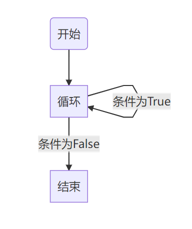

**摘要：分支、循环、推导式、生成器、迭代器**

<!-- more -->

::: warning 警告
**我年纪轻轻就学会了`Python`编程**

**来自：`HanamakiX`**
:::

## **本章目录**

 - **分支**
 - **三元运算**
 - **模式匹配（3.10新用法）**
 - **循环**
 - **海象运算**
 - **推导式**
 - **生成器**
 - **迭代器**


## **一、分支结构**


**Python分支结构即为：条件语句，跟其他语言基本一致的，都是通过一条或多条语句的执行结果（ True 或者 False ）来决定执行的代码块。**

**Python 程序语言指定任何非 0 和非空（None）值为 True，0 或者 None 为 False。**

**执行的流程图如下：**


**Python实现分支结构使用以下关键字实现：**

### **第一种：if else结构表示单个分支**

```python

if 判断条件：

    执行语句……
    
else：

    执行语句……

```

> Python 语言有着严格的缩进要求，因此这里也需要注意缩进，相同缩进表示同一代码块，也不要少写了冒号 `:` 。
> 
> if 语句的判断条件可以用>（大于）、<(小于)、==（等于）、>=（大于等于）、<=（小于等于）来表示其关系，还可以使用：is 、not is等等。


### **第二种：if elif else结构表示多个分支**

```python

if 判断条件1:
    
    执行语句1……
    
elif 判断条件2:
    
    执行语句2……
    
elif 判断条件3:
    
    执行语句3……
    
else:
    
    执行语句4……

```

### **Example**


```python
### 学生分数

score = 80

if score >=60:               ### 表示 大于等于 60 分
    print('及格了')
else:                        ### else表示 小于 60 分，即取上面判断反面
    print('对不起，没有及格')


output:

    及格了
```
    


```python
score = 50

if score >=60:
    print('及格了')
else:
    print('对不起，没有及格')


output:

    对不起，没有及格
```
    


```python
score = 80

score_list = [100,90,80]

if score in score_list:
    print("分数列表存在score")
else:
    print("分数列表不存在score")


output:

    分数列表存在score
```
    

```python
### 学生分数进化版

score = 80

if score >= 90:                           ###  大于等于 90
    print('非常优秀')
elif score >= 80:                         ###  取反上一个 if，表示 大于等于80并且小于90 
    print('虽然不够优秀，但已经非常厉害')
elif score >= 70:                         ### 取反上一个 if，表示 大于等于70并且小于80
    print('再努力一点就会很厉害')
elif score >= 60:                         ### 取反上一个 if，表示 大于等于60并且小于70
    print('刚好及格')
else:                                     ### 取反上面所有判断，表示 小于 60
    print('对不起，没有及格')


output:

    虽然不够优秀，但已经非常厉害
```

    

**需要注意：多个if、elif、else的时候，elif和else取反的是上面 `同一缩进下最近的if判断`，例如：**


```python
score = 80

if score >= 80:
    print('哈哈哈哈')
    
if score >= 90:                           ###  大于等于 90
    print('非常优秀')
elif score >= 80:                         ###  取反上一个 if，表示 大于等于80并且小于90 
    print('虽然不够优秀，但已经非常厉害')
elif score >= 70:                         ### 取反上一个 if，表示 大于等于70并且小于80
    print('再努力一点就会很厉害')
elif score >= 60:                         ### 取反上一个 if，表示 大于等于60并且小于70
    print('刚好及格')
else:                                     ### 取反上面所有判断，表示 小于 60
    print('对不起，没有及格')


output:

    哈哈哈哈
    虽然不够优秀，但已经非常厉害
```
    

**上述判断条件为一个，当判断条件有多个时可以使用：小括号、and、or**

- **or （或）表示两个条件有一个成立时判断条件成功**

- **and （与）表示只有两个条件同时成立的情况下，判断条件才成功。**


**其中：or的取反为and，and取反为or**


```python
shuxue = 80
yuwen = 90
yingyu = 100

    
if (shuxue >= 90) and (yuwen >= 90) and (yingyu >= 90):    ###  表示三门学科都大于等于 90，其中小括号可以去掉
    print('非常优秀')
else:                                                      ### 取反上面所有判断，表示 (shuxue < 90) or (yuwen < 90) or (yingyu < 90)
    print('对不起，语文，数学，英语有不优秀的学科')


output:

    对不起，语文，数学，英语有不优秀的学科
```

    

### **if语句的嵌套**

**if 语句中可以嵌套 if 语句，同一级别的代码块使用同一缩进即可**

**例如，上述例子还可以等价写成：**


```python
shuxue = 80
yuwen = 90
yingyu = 100

    
if shuxue >= 90:                              ###  表示 shuxue 大于等于 90
    print('数学优秀')
    if yuwen >= 90:                           ###  表示 yuwen 大于等于 90
        print('语文优秀')
        if yingyu >= 90:                      ###  表示 yingyu 大于等于 90
            print('英语优秀')
        else:                                 ###  取反同缩进的if，即第三个if，表示 yingyu < 90
            print('对不起，英语不够优秀')
    else:                                     ###  取反同缩进的if，即第二个if，表示 yuwen < 90
        print('对不起，语文不够优秀')
else:                                         ###  取反同缩进的if，即第一个if，表示 shuxue < 90
    print('对不起，数学不够优秀')


output:


    对不起，数学不够优秀
```
    


```python
shuxue = 100
yuwen = 100
yingyu = 80

    
if shuxue >= 90:                              ###  表示 shuxue 大于等于 90
    print('数学优秀')
    if yuwen >= 90:                           ###  表示 yuwen 大于等于 90
        print('语文优秀')
        if yingyu >= 90:                      ###  表示 yingyu 大于等于 90
            print('英语优秀')
        else:                                 ###  取反同缩进的if，即第三个if，表示 yingyu < 90
            print('对不起，英语不够优秀')
    else:                                     ###  取反同缩进的if，即第二个if，表示 yuwen < 90
        print('对不起，语文不够优秀')
else:                                         ###  取反同缩进的if，即第一个if，表示 shuxue < 90
    print('对不起，数学不够优秀')


output:

    数学优秀
    语文优秀
    对不起，英语不够优秀
```
    


## **二、三元运算**


**三元运算符就是在赋值变量的时候，可以直接加判断，然后赋值**

**格式：[on_true] if [expression] else [on_false]**

**result = 值1 if 条件 else 值2**


```python
a = 1
b = 10 if a > 10 else 0
b


output:

    0
```


前面的语句b = 10 if a > 10 else 0的含义是：

- 如果 a > 10 成立，b赋值10；
- 如果 a > 10 不成立，b赋值0。

### **三元运算应用：两个数比较大小**


```python
a = 10
b = 11

max_number = a if a > b else b

max_number


output:

    11
```


### **嵌套三元运算**

**Python允许多层三元运算嵌套**

**格式：[值1] if [条件1] else [值2] if [条件2] else [值3]**


```python
a = 9

b = 10 if a > 10 else 5 if a > 5 else 0

b


output:

    5
```


前面语句：b = 10 if a > 10 else 5 if a > 5 else 0 的含义是：

- 如果 a > 10 成立，则b赋值10
- 如果 a > 10 不成立，则执行下一个if
- 如果 a > 5 成立，则b赋值5
- 如果 a > 5 不成立，则b赋值0


**上述代码等价于**


```python
a = 9

if a > 10:
    b = 10
elif a > 5:
    b = 5
else:
    b = 0

b


output:

    5
```


### **多层三元运算应用：多个数比较大小**


```python
a = 1
b = 5
c = 10

max_number = a if (a > b and a > c) else b if b > c else c

max_number


output:

    10
```


## **三、模式匹配（3.10新用法）**


**Python在3.10中更新了模式匹配功能，也就是大家所熟悉的其他语言的 `switch-case`，而Python使用关键字 `match-case`来实现。**

**格式如下：**

```python

match 匹配值:
    
    case 模式1:
        
        执行代码1
        
    case 模式2:
        
        执行代码2
        
    case _:
        
        执行代码3
```

**上述模式匹配含义是：匹配值匹配模式如果成功则执行该模式下的代码块，最后一个符号 `_` 表示通配符，在这里匹配不包含上述模式的其他所有模式**

**需要注意：case 后面的模式支持 逻辑运算、比较运算、成员运算、身份运算等等，且多个match-case可以嵌套使用，类似于 if else 结构**

### **Example**


```python
score = 80

match score:
    case 90:
        print('非常优秀')
    case 80:
        print('虽然不够优秀，但已经非常厉害')
    case 70:
        print('再努力一点就会很厉害')
    case 60:
        print('刚好及格')
    case _:
        print('对不起，没有及格')
```

**上述代码含义：**

- 匹配 score 是否是90，如果是，则输出，如果不是则进行下面case
- 匹配 score 是否是80，如果是，则输出，如果不是则进行下面case
- 匹配 score 是否是70，如果是，则输出，如果不是则进行下面case
- 匹配 score 是否是60，如果是，则输出，如果不是则进行下面case
- 通配符 `_` 匹配除上面之外的所有情况，如果是，则输出，如果不是则进行下面case

### **模式匹配 或模式：`|`**


```python
score = 80

match score:
    case 90 | 80:
        print('非常优秀')
    case _:
        print('对不起，没有及格')
```

**上述代码含义：**

- 匹配 score 是否是90或者是80，如果是，则输出，如果不是则进行下面case
- 通配符 `_` 匹配除上面之外的所有情况，如果是，则输出，如果不是则进行下面case

**还包含一些高级用法：在后面的课程会说到**


## **四、循环**


**循环语句允许我们执行一个语句或语句组多次，下面是在大多数编程语言中的循环语句的一般形式：。**



**Python 提供了 for 循环和 while 循环（在 Python 中没有 do..while 循环）:**

- **while 循环：在给定的判断条件为 true 时执行循环体，否则退出循环体。**
- **for 循环：重复执行语句**
- **嵌套循环：你可以在while循环体中嵌套for循环**

### **for循环语句**

**格式：for 变量 in 可遍历对象**

```python
for i in [可遍历对象]:
    执行语句块
```

**上述语句含义：**

- `for`让变量`i`遍历`in`后面的可遍历对象（即`i`依次取遍历对象的每一个值），然后执行语句块

**可遍历对象有：**
- 迭代器
- 列表
- 集合
- 字典
- 元祖
- 字符串


```python
### 遍历列表

a = [1,2,3,4]

for x in a:
    print(x)


output:

    1
    2
    3
    4
```
    


```python
### 累加和累乘

a = [1,2,3,4]

b = 0

c = 1

for x in a:
    b += x
    c *= x
    
print(b,c)


output:

    10 24
```
    


```python
### 遍历集合

a = {1,2,3}

for x in a:
    print(x)


output:

    1
    2
    3
```    


```python
### 遍历元祖

a = (1,2,3,4)

for x in a:
    print(x)


output:

    1
    2
    3
    4
``` 


```python
### 遍历字典

a = {'b':1,'c':2,'d':3}

for x in a:
    print(x)


output:

    b
    c
    d
```


```python
for x in a.values():
    print(x)


output:

    1
    2
    3
```
    

```python
for x in a.keys():
    print(x, a[x])


output:

    b 1
    c 2
    d 3
```


```python
for x in a.items():
    print(x)


output:

    ('b', 1)
    ('c', 2)
    ('d', 3)
```
    

**for 循环支持多个变量用逗号分割**

**格式：for 变量1,变量2,... in 可遍历对象**

**前提是：可遍历对象可以打包成多个变量嵌套的形式**


```python
for x,y in a.items():
    print(x,y)


output:


    b 1
    c 2
    d 3
```
    


```python
a = [1,2,3]

for x,y in a:
    print(x,y)


output:

    ---------------------------------------------------------------------------

    TypeError                                 Traceback (most recent call last)

    ~\AppData\Local\Temp/ipykernel_20848/491791568.py in <module>
          1 a = [1,2,3]
          2 
    ----> 3 for x,y in a:
          4     print(x,y)
    

    TypeError: cannot unpack non-iterable int object
```


### **enumerate**

**enumerate() 函数用于将一个可遍历的数据对象(如列表、元组或字符串)组合为一个索引序列，同时列出数据和数据下标，一般用在 for 循环当中。**

**格式：enumerate(sequence, [start=0])**

**上述含义是：**

- **sequence -- 一个序列、迭代器或其他支持迭代对象。**
- **start -- 下标起始位置的值（一般不写：Python下标都是从0开始，定义这个容易混淆）。**


```python
### 更新列表值

a = [1,2,3]

for x,y in enumerate(a):
    print(x,y)


output:

    0 1
    1 2
    2 3
```


```python
a = [1,2,3]

for x,y in enumerate(a,1):
    print(x,y)


output:

    1 1
    2 2
    3 3
```
 


```python
a = [1,2,3]

for x,y in enumerate(a):
    a[x] = y + 1
    
a


output:

    [2, 3, 4]
```


```python
a = 'hello'
for x,y in enumerate(a):
    print(a[x],y)


output:

    h h
    e e
    l l
    l l
    o o
```

    

### **range**

**range() 函数可创建一个可遍历的整数列表，一般用在 for 循环中。。**

**格式：range(start, stop[, step])，且左闭右开**

**上述含义是：**

- **start: 计数从 start 开始。默认是从 0 开始。例如range（5）等价于range（0， 5）;**
- **stop: 计数到 stop 结束，但不包括 stop。例如：range（0， 5） 是[0, 1, 2, 3, 4]没有5**
- **step：步长，默认为1。例如：range（0， 5） 等价于 range(0, 5, 1)**

**需要注意的是：step只支持整数不支持小数，可以为负数**


```python
for x in range(1,5,0.1):
    print(x)


output:

    ---------------------------------------------------------------------------

    TypeError                                 Traceback (most recent call last)

    ~\AppData\Local\Temp/ipykernel_20848/2127495065.py in <module>
    ----> 1 for x in range(1,5,0.1):
          2     print(x)
    

    TypeError: 'float' object cannot be interpreted as an integer
```


```python
for x in range(5):
    print(x)


output:

    0
    1
    2
    3
    4
```
    


```python
for x in range(5,0,-1):
    print(x)


output:

    5
    4
    3
    2
    1
```
    

### **需要注意：range经常和enumerate搭配使用**


```python
for x,y in enumerate(range(5)):
    print(x,y)


output:

    0 0
    1 1
    2 2
    3 3
    4 4
```
    

### **循环可以嵌套循环表示多层循环，以缩进表示包含**


```python
### 计算 从1到3 自己加自己

for i in range(3):
    for j in range(3):
        print(i + j)


output:

    0
    1
    2
    1
    2
    3
    2
    3
    4
``` 


```python
### 打印九九乘法表

for i in range(1, 10):
    for j in range(1, 1 + i):
        print(f'{j}*{i}={i * j}', '', end='\t')
    print()


output:

    1*1=1   
    1*2=2   2*2=4   
    1*3=3   2*3=6   3*3=9   
    1*4=4   2*4=8   3*4=12  4*4=16  
    1*5=5   2*5=10  3*5=15  4*5=20  5*5=25  
    1*6=6   2*6=12  3*6=18  4*6=24  5*6=30  6*6=36  
    1*7=7   2*7=14  3*7=21  4*7=28  5*7=35  6*7=42  7*7=49  
    1*8=8   2*8=16  3*8=24  4*8=32  5*8=40  6*8=48  7*8=56  8*8=64  
    1*9=9   2*9=18  3*9=27  4*9=36  5*9=45  6*9=54  7*9=63  8*9=72  9*9=81 
```	
    

### **while循环语句**

**Python中 while 语句用于循环执行程序，即在某条件下，循环执行某段程序，以处理需要重复处理的相同任务。其基本形式为：**

```python
while 判断条件(condition)：
    执行语句(statements)……
```

**上述语句含义：**

- 当判断条件为True时，执行语句块，否则终止


```python
a = 0

while a < 5:
    print(a)
    a += 1


output:

    0
    1
    2
    3
    4
```

    

### **无限循环：不建议使用很危险**

```python
while True:
    print('hahaha')

```

**当while后面的判断条件永远是True的时候就不会停止**

### **循环搭配条件语句**

**Python中的for和while经常搭配条件语句使用实现更复杂的功能**

**格式：**

```python

for 变量 in 可遍历对象:
    if 判断条件:
        执行语句块
    else:
        执行语句块

```

```python

while 判断条件:
    if 判断条件:
        执行语句块
    else:
        执行语句块

```


```python
### 取双数

for i in range(10):
    if i % 2 == 0:
        print(i)


output:

    0
    2
    4
    6
    8
```
    


```python
### 取双数

a = 0

while a < 10:
    if a % 2 == 0:
        print(a)
    a += 1


output:

    0
    2
    4
    6
    8
```
    

### **循环控制语句**

**循环控制语句可以更改语句执行的顺序。Python支持以下循环控制语句：**

- **break 语句：在语句块执行过程中终止循环，并且跳出整个循环**
- **continue 语句：在语句块执行过程中终止当前循环，跳出该次循环，执行下一次循环。**
- **pass 语句：pass是空语句，是为了保持程序结构的完整性，一般作为占位符**


```python
for i in range(10):
    print(i)
    if i >= 5:
        break


output:

    0
    1
    2
    3
    4
    5
```
    


```python
for i in range(10):
    print(i)
    if i >= 5:
        continue


output:

    0
    1
    2
    3
    4
    5
    6
    7
    8
    9
```
    


```python
a = 0

while a <= 10:
    if a<=5:
        print(a)
    else:
        break
    a += 1


output:

    0
    1
    2
    3
    4
    5
```
    


```python
for i in range(5):
    pass
```

### **for和while搭配else使用**

**for else 中的语句会在循环正常执行完，while else同理**

**格式：**

```python

for 变量 in 可遍历对象:
    执行语句
else:
    执行语句

```

```python

while 判断条件:
    执行语句
else:
    执行语句

```

**需要注意：for else 只有在 for 不是通过 break 跳出而中断的的情况下执行，while else同理**


```python
for i in range(5):
    pass
else:
    print(i)


output:

    4
``` 


```python
for i in range(10):
    if i >= 5:
        break
else:
    print(i)
```


```python
for i in range(10):
    if i >= 5:
        continue
else:
    print(i)


output:

    9
```
    


```python
a = 0
while a <= 10:
    a += 1
else:
    print(a)


output:

    11
```


```python
a = 0
while a <= 10:
    if a >= 5:
        break
    a += 1
else:
    print(a)
```


## **五、海象运算**


**在Python编程中我们经常会遇到一些中间变量或者临时的运算，往往做判断或者计算时需要计算多次，为了避免这种情况，新增了海象运算符，它可以对中间变量赋值，提高运行速度**

**使用：`:=` 表示海象运算符，因为它看起来就是一个海象旋转 90° 而成。**

- **格式：`(variable_name := expression or value)`**

**它经常搭配if 和 while使用**


```python
### 计算两次

a = [1,2,3]

if len(a) > 0:
    print(len(a))


output:

    3
```
    


```python
### 优化计算一次，取中间变量

a = [1,2,3]
b = len(a)
if b > 0:
    print(b)


output:

    3
```

    


```python
### 优化计算一次，海象运算符

a = [1,2,3]

if (b := len(a)) > 0:
    print(b)


output:

    3
```
    


```python
### 搭配 while 使用

a = 0
while a <= 5:
    print(a)
    a += 1


output:

    0
    1
    2
    3
    4
    5
```
    


```python
a = 0
while (a := a + 1) <= 5:
    print(a)


output:

    1
    2
    3
    4
    5
```
    

## **六、推导式**


**Python 推导式是一种独特的数据处理方式，可以从一个数据序列构建另一个新的数据序列的结构体。**

**Python 支持各种数据结构的推导式：**

- **列表(list)推导式：返回列表**
- **字典(dict)推导式：返回字典**
- **集合(set)推导式：返回集合**
- **元组(tuple)推导式：返回生成器**

**推导式可以很大程度上简化代码行数，使你的代码非常Pythonic**

### **列表推导式**

**格式：**

```python
[表达式 for 变量 in 列表] 
[out_exp_res for out_exp in input_list]

或者 

[表达式 for 变量 in 列表 if 条件]
[out_exp_res for out_exp in input_list if condition]

```

**上述含义是：**

- **out_exp_res：列表生成元素表达式，可以是有返回值的函数。**
- **for out_exp in input_list：迭代 input_list 将 out_exp 传入到 out_exp_res 表达式中。**
- **if condition：条件语句，可以过滤列表中不符合条件的值。**

**允许嵌套for循环**


```python
### 计算 10 以内可以被 3 整除的整数：

a = [i for i in range(10) if i % 3 == 0]
a


output:

    [0, 3, 6, 9]
```


```python
### 上述等价于

a = []

for i in range(10):
    if i % 3 == 0:
        a.append(i)
a


output:

    [0, 3, 6, 9]
```


```python
### 列表字母换成大写

a = ['hello','world','python']
a = [x.upper() for x in a]
a


output:

    ['HELLO', 'WORLD', 'PYTHON']
```


```python
a = [x*y for x in range(3) for y in range(3)]
a


output:

    [0, 0, 0, 0, 1, 2, 0, 2, 4]
```


### **集合推导式**

**格式：**

```python
{ expression for item in Sequence }

或

{ expression for item in Sequence if conditional }

```


```python
### 集合字母换成大写

a = {'hello','world','python'}
a = {x.upper() for x in a}
a


output:

    {'HELLO', 'PYTHON', 'WORLD'}
```


### **字典推导式**

**格式：**

```python
{ key_expr: value_expr for value in collection }

或

{ key_expr: value_expr for value in collection if condition }

```


```python
### 通过列表生成字典

a = [1,2,3,4]

a = {str(x):y for x,y in enumerate(a) if y <= 3}

a


output:

    {'0': 1, '1': 2, '2': 3}
```


### **元祖推导式**

**格式：**

```python
(expression for item in Sequence )

或

(expression for item in Sequence if conditional )

```

#### **需要注意：元组推导式返回的结果是一个生成器对象，而不是元祖。**


```python
a = ('hello','world','python')
a = (x.upper() for x in a)
a


output:

    <generator object <genexpr> at 0x000001CD327B1B30>
```


```python
tuple(a)


output:

    ('HELLO', 'WORLD', 'PYTHON')
```


## **七、迭代器**


**迭代是Python最强大的功能之一，是访问集合元素的一种方式，是可以遍历的。**

**迭代器是一个可以记住遍历的位置的对象。**

**<font color="#dd0000">迭代器对象从集合的第一个元素开始访问，直到所有的元素被访问完结束。迭代器只能往前不会后退。</font>**

**迭代器有两个基本的方法：迭代`iter()` 和 取值`next()`。**

**字符串，列表或元组对象都可用于创建迭代器**


```python
a = [1,2,3,4]
print(type(a))
a = iter(a)
print(type(a))


output:


    <class 'list'>
    <class 'list_iterator'>
```


```python
next(a)       # 1

next(a)       # 2

next(a)       # 3
```


### **迭代器可以使用循环遍历**


```python
a = [1,2,3,4]
a = iter(a)
for x in a:
    print(x)


output:

    1
    2
    3
    4
```
    


```python
a=[1,2,3,4]
a = iter(a)    # 创建迭代器对象
 
while True:
    try:
        print(next(a))
    except:
        break


output:

    1
    2
    3
    4
```
    

#### **后面的教程会说到：创建一个迭代器**

**把一个类作为一个迭代器使用需要在类中实现两个方法 __iter__() 与 __next__() 。**

### **可迭代对象**

因为Python的迭代器表示的是一个数据流，迭代器可以被next()函数调用并不断返回下一个数据，直到没有数据时抛出StopIteration错误。

可以把这个数据流看做是一个有序序列，但我们却不能提前知道序列的长度，只能不断通过next()函数实现按需计算下一个数据，所以迭代器的计算是惰性的，

只有在需要返回下一个数据时它才会计算。迭代器甚至可以表示一个无限大的数据流，例如全体自然数。而使用list是永远不可能存储全体自然数的。


- 凡是可作用于for循环的对象都是可迭代的；

- 凡是可作用于next()函数的对象都是迭代器，它们表示一个惰性计算的序列；

- 集合数据类型如list、dict、str等是可迭代的但不是迭代器，不过可以通过iter()函数获得一个迭代器。

- 可迭代对象和迭代器，通过函数iter()转换

- 迭代器：数据流，变长，惰性的

#### **可迭代对象**

- 列表
- 元祖
- 字典
- 集合
- 字符串

#### **不可迭代对象**

- 数字


```python
a = [1,2,3]
for x in a:
    print(x)


output:

    1
    2
    3
```


```python
a = 100
for x in a:
    print(x)


output:

    ---------------------------------------------------------------------------

    TypeError                                 Traceback (most recent call last)

    ~\AppData\Local\Temp/ipykernel_15232/1842059096.py in <module>
          1 a = 100
    ----> 2 for x in a:
          3     print(x)
    

    TypeError: 'int' object is not iterable
```


## **八、生成器**


**通过列表生成式，我们可以直接创建一个列表。但是，受到内存限制，列表容量肯定是有限的。**

**而且，创建一个包含100万个元素的列表，不仅占用很大的存储空间，**

**如果我们仅仅需要访问前面几个元素，那后面绝大多数元素占用的空间都白白浪费了。**

**所以，如果列表元素可以按照某种算法推算出来，那我们是否可以在循环的过程中不断推算出后续的元素呢？**

**这样就不必创建完整的list，从而节省大量的空间。在Python中，这种一边循环一边计算的机制，称为生成器：generator。**

**生成器的本质就是迭代器，唯一的不同就是：迭代器都是Python给你提供的已经写好的工具或者通过数据转化得来的。**

**生成器是需要我们自己用python代码构建的工具（一边循环一边计算的机制）。**

- **生成器一边循环一边计算**

- **生成器只能使用一次**

### **用例：**

**假如我们需要创建一个几百万，几千万甚至更多的元素的列表，由于计算机内存的限制不能创建，这时候就可以先创建一个生成器，当我们循环遍历时才会具体生成，**
**这样很大程度上节省内存**

### **生成器创建方法：**

- **通过生成器函数：yield关键字**　　
- **通过元祖推导式**

**不做扩充，后文详解**


```python
a = (i for i in range(5))
print(a)
type(a)


output:

    <generator object <genexpr> at 0x000001CD327BA900>
    

    generator
```


```python
for x in a:
    print(x)


output:

    0
    1
    2
    3
    4
``` 


## 赞赏

::: tip

**读后若有收获，可以微信请作者喝咖啡：**


:::