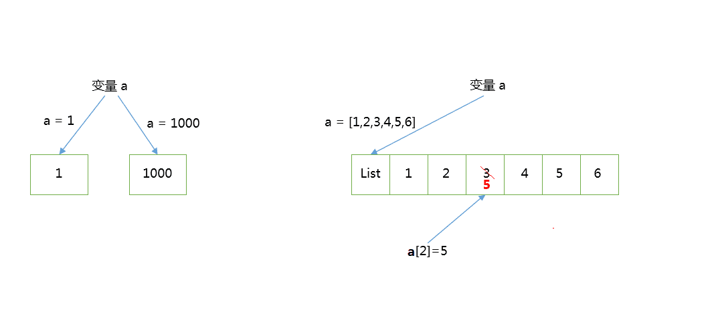

**摘要：函数、装饰器**

<!-- more -->

::: warning 警告
**我年纪轻轻就学会了`Python`编程**

**来自：`HanamakiX`**
:::

## **本章目录**

 - **函数**
 - **return和yield：再看生成器**
 - **局部变量和全局变量**
 - **匿名函数**
 - **内置函数**
 - **装饰器**


## **一、函数**


函数，其实我们一开始学 Python 的时候就接触过。

比如基本每个章节都会出现的 `print()`  函数。

而现在，我们主要学习的是自定义函数。

**各位有没有想过为什么需要函数呢？**

如果要想回答这个问题，我们需要先了解函数是什么？

函数就是组织好的，可重复使用的，用来实现单一，或相关联功能的代码段。

没错，函数其实就是把代码抽象出来的代码段。

那为什么要抽象出来呢？

**方便我们使用，方便我们重复使用。**

**函数的本质就是我们把一些数据喂给函数，让他内部消化，然后吐出你想要的东西，至于他怎么消化的，我们不需要知道，它内部解决。**

怎么理解这句话呢？

举个例子，好比`print()`函数，我们每次可以直接使用是因为已经定义好了，想象一下假如我们每次要打印都要实现一下这个函数，那不是很麻烦很重复嘛。

### **函数定义**

Python通过关键字`def`来定义一个函数，通过return（或者后文的yield）返回结果，格式如下：

```python

def 函数名(参数1，参数2....参数n):
    """函数说明"""
    函数体
    return 语句

```

这就是 Python 函数的组成部分。

所以自定义函数，基本有以下规则步骤：

- 函数代码块以 def 关键词开头，后接函数标识符名称和圆括号()
- 任何传入参数和自变量必须放在圆括号中间。圆括号之间可以用于定义参数
- 函数的第一行语句可以选择性地使用文档字符串（用于存放函数说明）
- 函数内容以冒号起始，并且缩进
- return [表达式] 结束函数，选择性地返回一个值给调用方。不带表达式的 return 相当于返回 None。

### **函数命名规则**

Python的函数名字必须是大小写英文、数字和下划线（\_）的组合，且不能用数字开头。


**一般来说我们遵循以下原则：**

- 函数名一律小写，如有多个单词，用下划线隔开（蛇形命名，增加可读性）。
- 私有函数：以 __ （两个下划线）开头，其余和普通函数保持一致（并且外部导入时不能直接访问）。

### **Example**

**定义一个求两数之和的函数：**

```python

def sum_number(num1,num2):
    """这是函数说明文档：两数之后"""
    return num1 + num2

```

**上述函数的含义：**

* def 定义一个函数，给定一个函数名 sum_number
* 声明两个参数 num1 和 num2
* 函数的第一行语句进行函数说明：两数之和
* 最终 return 语句结束函数，并返回两数之和


**上述定义好我们就可以调用这个函数计算**

**调用函数：使用函数名加传入的参数**

```python

def sum_number(num1,num2):
    return num1 + num2

num1 = 1
num2 = 2

res = sum_number(num1,num2)

print(res)


output:


    3
```
    

### **多个函数可以互相调用**

**假如我们定义两个函数，并且调用**


```python
### 定义两个函数

def sum_number(num1,num2):
    return num1+num2

def mul_number(num1,num2,num3):
    res = sum_number(num1,num2)
    res = res * num3
    return res

num1, num2, num3 = 1, 2, 3

res = mul_number(num1,num2,num3)

print(res)


output:

    9
```
    

### **函数返回值**

通过 return [表达式] 语句用于退出函数，选择性地向调用方返回一个表达式。

**不带参数值的 return 语句返回 None。**

**例如：**

```python

def mul_number(num1,num2,num3):
    res = sum_number(num1,num2)
    res = res * num3
    return res

```

**这个函数的返回值就是：res变量的结果**

**再例如：**

```python

def mul_number(num1,num2,num3):
    res = sum_number(num1,num2)
    res = res * num3

```

**因为这个函数没有return语句返回，所以默认返回None空值**


```python
def sum_number(num1,num2):
    return num1+num2

def mul_number(num1,num2,num3):
    res = sum_number(num1,num2)
    res = res * num3
    return res

num1, num2, num3 = 1, 2, 3

res = mul_number(num1,num2,num3)

print(res)


output:

    9
```
 

```python
def sum_number(num1,num2):
    return num1+num2

def mul_number(num1,num2,num3):
    res = sum_number(num1,num2)
    res = res * num3
    

num1, num2, num3 = 1, 2, 3

res = mul_number(num1,num2,num3)

print(res)


output:

    None
```
    

### **函数可以返回多个值**

**Python 语言中的函数返回值可以是多个，用逗号：`,`分割，其实这种返回就是一个元祖**

**例如：**


```python
def sum_number(num1,num2):
    return num1+num2

def mul_number(num1,num2,num3):
    res1 = sum_number(num1,num2)
    res2 = res1 * num3
    return res1, res2

num1, num2, num3 = 1, 2, 3

res = mul_number(num1,num2,num3)

print(res)


output:

    (3, 9)
```
    

### **这种多个值的返回可以使用相同个数的变量接收返回值**


```python
def sum_number(num1,num2):
    return num1+num2

def mul_number(num1,num2,num3):
    res1 = sum_number(num1,num2)
    res2 = res1 * num3
    return res1, res2

num1, num2, num3 = 1, 2, 3

res1, res2 = mul_number(num1,num2,num3)

print(res1, res2)


output:

    3 9
```
    

### **函数参数**

上面函数定义我们说过：num1和num2就是函数的参数

设置与传递参数是函数的重点，而 Python 的函数对参数的支持非常的灵活。

主要的参数类型有：默认参数、关键字参数（位置参数）、不定长参数。

正常情况下：调用函数传参不指定参数名时都是按照位置顺序赋值的

#### **默认参数**

有时候，我们自定义的函数中，如果调用的时候没有设置参数，需要给个默认值，这时候就需要用到默认值参数了。

默认参数，只要在构造函数参数的时候，给参数赋值就可以了


```python
def sum_number(num1,num2 = 2):
    return num1+num2

num1 = 2

res = sum_number(num1)

print(res)


output:

    4

```
    

从输出结果可以看到，当你设置了默认参数的时候，在调用函数的时候，不传该参数，就会使用默认值。

但是这里需要注意的一点是：**只有在形参表末尾的那些参数可以有默认参数值**，也就是说你不能在声明函数形参的时候，先声明有默认值的形参而后声明没有默认值的形参。

这是因为赋给形参的值是根据位置而赋值的。例如，`def sum_number(num1,num2 = 2)` 是有效的，但是 `def sum_number(num1=2,num2)` 是 无效 的。

**需要注意：默认参数的值原则上最好是不可变的对象，比如None、True、False、数字或字符串等。**

**我们来看一下默认参数是可变对象如：列表 的时候带来的影响：**


```python
def test(a, b = []):
    print(f"b的值是：{b}")
    return b

res = test(1)
res.append(2)


output:

    b的值是：[]
```

```python
res = test(2)
res.append(3)


output:

    b的值是：[2]
```
    

#### **关键字参数（位置参数）**

一般情况下，函数传参，是要按顺序来的，如果不对应顺序，就会传错值。

不过在 Python 中，可以通过参数名来给函数传递参数，而不用关心参数列表定义时的顺序，这被称之为关键字参数。

使用关键参数有两个优势 ：

- 由于我们不必担心参数的顺序，使用函数变得更加简单了。

- 假设其他参数都有默认值，我们可以只给我们想要的那些参数赋值


```python
def test(a,b,c = 10):
    print(f"a = {a}")
    print(f"b = {b}")
    print(f"c = {c}")
    

test(1,2,3)


output:

    a = 1
    b = 2
    c = 3
```

```python
test(a = 1, b = 2, c = 3)


output:

    a = 1
    b = 2
    c = 3
```
    

##### **如果只给函数某几个而不是全部传参就可以通过位置参数实现**


```python
test(a = 1, b = 3)


output:

    a = 1
    b = 3
    c = 10
```
    

#### **不定长参数**

或许有些时候，我们在设计函数的时候，我们有时候无法确定传入的参数个数。

那么我们就可以使用不定长参数。

Python 提供了一种元组的方式来接受没有直接定义的参数。这种方式在参数前边加星号 `*` 。

如果在函数调用时没有指定参数，它就是一个空元组。我们也可以向函数传递未命名的变量。


```python
def test(a,b,*c):
    print(f'a = {a}')
    print(f"b = {b}")
    print(f"c = {c}")
    
    
test(1,2,3,4,5,6,7)


output:

    a = 1
    b = 2
    c = (3, 4, 5, 6, 7)
```
    

##### **这种元祖的方式不能使用参数名传入**


```python
def test(a,b,*c):
    print(f'a = {a}')
    print(f"b = {b}")
    print(f"c = {c}")
    
    
test(1, 2, c1 = 3, c2 = 4, c3 = 5, c4 = 6, c5 = 7)


output:

    ---------------------------------------------------------------------------

    TypeError                                 Traceback (most recent call last)

    ~\AppData\Local\Temp/ipykernel_10624/1286350429.py in <module>
          5 
          6 
    ----> 7 test(1, 2, c1 = 3, c2 = 4, c3 = 5, c4 = 6, c5 = 7)
    

    TypeError: test() got an unexpected keyword argument 'c1'
```


##### **还可以是 `**`，这是以字典的方式传参，没有传入就是一个空字典。**


```python
def test(a,b,**c):
    print(f'a = {a}')
    print(f"b = {b}")
    print(f"c = {c}")
    
    
test(1,2, c1 = 3, c2 = 4, c3 = 5)


output:

    a = 1
    b = 2
    c = {'c1': 3, 'c2': 4, 'c3': 5}
```
    

##### **不同于元祖传参，这种字典的方式必须写参数名字**


```python
def test(a,b,**c):
    print(f'a = {a}')
    print(f"b = {b}")
    print(f"c = {c}")
    
    
test(1,2, 3, 4， 5)


output:

      File "C:\Users\DELL\AppData\Local\Temp/ipykernel_10624/4288104671.py", line 7
        test(1,2, 3, 4， 5)
                      ^
    SyntaxError: invalid character '，' (U+FF0C)
```
    


##### **再看传参：传入可变和不可变的区别**

**先看一个例子**


```python
def chagne_number( b ):
    b = 1000

b = 1
chagne_number(b)
print( b )


output:

    1
```
    


```python
def chagne_number( a ):
    a[2] = 5

a = [1,2,3,4,5,6]
chagne_number(a)
print( a )


output:

    [1, 2, 5, 4, 5, 6]
```
    

想一下为什么打印的结果是 1 ，而不是 1000 ？

其实把问题归根结底就是，为什么通过函数 `chagne_number` 没有更改到 b 的值？

这个问题很多编程语言都会讲到，原理解释也是差不多的。

这里主要是函数参数的传递中，传递的是类型对象，之前也介绍了 Python 中基本的数据类型等。而这些类型对象可以分为可更改类型和不可更改的类型

**在 Python 中，字符串，整形，浮点型，tuple 是不可更改的对象，而 list ， dict 等是可以更改的对象。**

例如：

**不可更改的类型**：变量赋值 `a = 1`，其实就是生成一个整形对象 1 ，然后变量 a 指向 1，当 `a = 1000` 其实就是再生成一个整形对象 1000，然后改变 a 的指向，不再指向整形对象 1 ，而是指向 1000，最后 1 会被丢弃

**可更改的类型**：变量赋值 `a = [1,2,3,4,5,6]` ，就是生成一个对象 list ，list 里面有 6 个元素，而变量 a 指向 list ，`a[2] = 5`则是将 list a 的第三个元素值更改,这里跟上面是不同的，并不是将 a 重新指向，而是直接修改 list 中的元素值。



这也将影响到函数中参数的传递了：

**不可更改的类型**：类似 c++ 的值传递，如 整数、字符串、元组。如fun（a），传递的只是 a 的值，没有影响 a 对象本身。比如在 fun（a）内部修改 a 的值，只是修改另一个复制的对象，不会影响 a 本身。

**可更改的类型**：类似 c++ 的引用传递，如 列表，字典。如 fun（a），则是将 a 真正的传过去，修改后 fun 外部的 a 也会受影响

因此，在一开始的例子中，`b = 1`,创建了一个整形对象 1 ，变量 b 指向了这个对象，然后通过函数 chagne_number 时，按传值的方式复制了变量 b ，传递的只是 b 的值，并没有影响到 b 的本身。具体可以看下修改后的实例，通过打印的结果更好的理解。


```python
def chagne_number( b ):
    print('函数中一开始 b 的值：{}' .format( b ) )
    b = 1000
    print('函数中 b 赋值后的值：{}' .format( b ) )


b = 1
chagne_number( b )
print( '最后输出 b 的值：{}' .format( b )  )


output:

    函数中一开始 b 的值：1
    函数中 b 赋值后的值：1000
    最后输出 b 的值：1
```
    


```python
def chagne_list( b ):
    print('函数中一开始 b 的值：{}' .format( b ) )
    b.append(1000)
    print('函数中 b 赋值后的值：{}' .format( b ) )


b = [1,2,3,4,5]
chagne_list( b )
print( '最后输出 b 的值：{}' .format( b )  )


output:

    函数中一开始 b 的值：[1, 2, 3, 4, 5]
    函数中 b 赋值后的值：[1, 2, 3, 4, 5, 1000]
    最后输出 b 的值：[1, 2, 3, 4, 5, 1000]
```
    

### **嵌套函数**

Python的函数类似于循环这些是可以嵌套的，写法也差不多，多层嵌套使用多个关键字 `def` 定义，且相同缩进表示同一函数块,

在嵌套函数中，下一层函数享受上一层函数的参数值


```python
### 比如我们既要计算两数相加又要计算两数相乘

def test1(a,b):
    def test2(c,d):
        return c+d
    
    def test3(c,d):
        return c*d
    
    res1 = test2(a,b)
    res2 = test3(a,b)
    return res1,res2

a = 1
b = 2

res = test1(a,b)

print(res)


output:

    (3, 2)
```
    

### **递归函数**

在函数内部，可以调用其他函数，如果一个函数在内部调用自身本身，这个函数就是递归函数。

举个例子，我们来计算阶乘 `n! = 1 x 2 x 3 x ... x n`，用函数 `fact(n)`表示，可以看出：

`fact(n)=n!=1 x 2 x 3 x ... x (n-1) x  n = (n-1)! x  n = fact(n-1) x n`

所以，`fact(n)`可以表示为`n x fact(n-1)`，只有`n=1`时需要特殊处理。

于是，`fact(n)`用递归的方式写出来就是：


```python
def fact(n):
    if n==1:
        return 1
    return n * fact(n - 1)


fact(5)      # 120


fact(10)     # 3628800
```


**如果我们计算fact(5)，可以根据函数定义看到计算过程如下：**

```
===> fact(5)
===> 5 * fact(4)
===> 5 * (4 * fact(3))
===> 5 * (4 * (3 * fact(2)))
===> 5 * (4 * (3 * (2 * fact(1))))
===> 5 * (4 * (3 * (2 * 1)))
===> 5 * (4 * (3 * 2))
===> 5 * (4 * 6)
===> 5 * 24
===> 120
```

递归函数的优点是定义简单，逻辑清晰。理论上，所有的递归函数都可以写成循环的方式，但循环的逻辑不如递归清晰。

使用递归函数需要注意防止栈溢出。在计算机中，函数调用是通过栈（stack）这种数据结构实现的，每当进入一个函数调用，栈就会加一层栈帧，每当函数返回，栈就会减一层栈帧。由于栈的大小不是无限的，所以，递归调用的次数过多，会导致栈溢出。可以试试fact(1000)：

```python

>>> fact(1000)
Traceback (most recent call last):
  File "<stdin>", line 1, in <module>
  File "<stdin>", line 4, in fact
  ...
  File "<stdin>", line 4, in fact
RuntimeError: maximum recursion depth exceeded in comparison

```


## **二、return和yield：再看生成器**


前面说到函数return表示函数的终止，可以返回值，这表明return必须写在函数的最后面，

而Python还提供了另一种返回值的关键字就是 `yield`,首先它不必放在函数的最后面，可以放在其它位置，且不影响它后面的代码执行

而如果使用yield的函数，我们就叫做生成器函数，可以通过函数名来进行遍历。


```python
def test(a):
    for x in a:
        yield x
        print(f'x = {x}')
        
a = [1,2,3,4,5]

for x in test(a):
    print(x)


output:

    1
    x = 1
    2
    x = 2
    3
    x = 3
    4
    x = 4
    5
    x = 5
```
    


```python
test(a)


output:

    <generator object test at 0x000001EC9AACB820>
```


#### **生成器也是一种迭代器，所以yield函数可以通过next获取值，生成器的值只能使用一次，前只能向前不能向后**


```python
def test(a):
    for x in a:
        yield x
        
a = [1,2,3]

b = test(a)


next(b)     # 1


next(b)     # 2


next(b)     # 3


next(b)


    ---------------------------------------------------------------------------

    StopIteration                             Traceback (most recent call last)

    ~\AppData\Local\Temp/ipykernel_19208/973617480.py in <module>
    ----> 1 next(b)
    

    StopIteration: 
```


```python
def echo(n):
    while True:
        yield n

g = echo(1)
print(next(g))
print(next(g))
print(next(g))


output:

    1
    1
    1
```
  

## **三、局部变量和全局变量**


- 局部变量：就是在函数内部定义的变量，其作用范围是这个函数内部，即只能在这个函数中使用，在函数的外部是不能使用的

- 全局变量：在函数外边定义的变量，全局变量能够在所有的函数中进行访问


```python
a = 1

def test(b):
    return a +b

test(1)


output:

    2
```


```python
def test1():
    a = 120
    print("我是局部变量a:",a)
    a = 240
    print("修改之后的局部变量a:",a)
def test2():
    a =360
    print("我是test02函数中的局部变量a",a)

test1()
test2()


output:

    我是局部变量a: 120
    修改之后的局部变量a: 240
    我是test02函数中的局部变量a 360
```
    

**注意:局部变量的作用，为了临时保存数据需要在函数中定义变量来进行存储**

**当函数调用时，局部变量被创建，当函数调用完成后这个变量就不能够使用了**

**全局变量和局部变量名字相同的情况下**

**当函数内出现局部变量和全局变量相同名字时，函数内部中的 变量名 = 数据 此时理解为定义了一个局部变量，而不是修改全局变量的值**


```python
a = 10

def test():
    a = 100
    print(f'a = {a}')
    
test()


output:

    a = 100
```


```python
a


output:

    10
```


### **全局变量的修改**

**修改全局变量我们使用 global**

**如果在函数中出现global 全局变量的名字 那么这个函数中即使出现和全局变量名相同的变量名 = 数据 也理解为对全局变量进行修改，而不是定义局部变量**


```python
a = 10

def test():
    global a
    a = 100
    print(f'a = {a}')
    
test()


output:

    a = 100
```
    


```python
a


output:

    100
```


### **可以同时修改多个全局变量：可以分别申明也可以放在一起用逗号分割**


```python
a = 10
b = 11

def test():
    global a,b
    a = 100
    b = 111
    print(f'a = {a}')
    print(f'b = {b}')
    
test()


output:

    a = 100
    b = 111
```
    


```python
print(a,b)


output:

    100 111
```


```python
### 

a = 10
b = 11

def test():
    global a
    global b
    a = 100
    b = 111
    print(f'a = {a}')
    print(f'b = {b}')
    
test()


output:

    a = 100
    b = 111
```
    


```python
print(a,b)


output:

    100 111
```


### **获取全局变量和局部变量**

Python提供两个内置方法获取全局变量和局部变量

- 全局变量获取：globals()
- 局部变量获取：locals()

二者返回的都是一个字典的形式


```python
def test():
    a = 1
    b = 2
    print(f'函数test的局部变量：{locals()}')
test()


output:

    函数test的局部变量：{'a': 1, 'b': 2}
``` 


```python
%run ./examples/test.py
```


## **四、匿名函数**


有没有想过定义一个很短的回调函数，但又不想用 `def` 的形式去写一个那么长的函数，那么有没有快捷方式呢？

答案是有的。

python 使用 lambda 来创建匿名函数，也就是不再使用 def 语句这样标准的形式定义一个函数。

匿名函数主要有以下特点：

- lambda 只是一个表达式，函数体比 def 简单很多，且不需要定义return返回。
- lambda 的主体是一个表达式，而不是一个代码块。仅仅能在 lambda 表达式中封装有限的逻辑进去。
- lambda 函数拥有自己的命名空间，且不能访问自有参数列表之外或全局命名空间里的参数。

**基本语法结构：**

```python
lambda [arg1 [,arg2,.....argn]]:expression
```


```python
sum_number = lambda num1: num1 + 1;

sum_number(1)


output:

    2
```

```python
sum_number = lambda num1 , num2 : num1 + num2;

sum_number(1,2)


output:

    3
```


**等同于：**


```python
### 相较而言非常的简洁

def sum_number(num1,num2):
    return num1 + num2

sum_number(1,2)


output:

    3
```


**注意：尽管 lambda 表达式允许你定义简单函数，但是它的使用是有限制的。 你只能指定单个表达式，它的值就是最后的返回值。也就是说不能包含其他的语言特性了， 包括多个语句、条件表达式、迭代以及异常处理等等。**


## **五、内置函数**


||||||
|---|---|---|---|---|
|abs()|dict()|help()|min()|setattr()|
|all()|dir()|hex()|next()|slice()|
|any()|divmod()|id()|object()|sorted()|
|ascii()|enumerate()|input()|oct()|staticmethod()|
|bin()|eval()|int()|open()|str()|
|bool()|exec()|isinstance()|ord()|sum()|
|bytearray()|filter()|issubclass()|pow()|super()|
|bytes()|float()|iter()|print()|tuple()|
|callable()|format()|len()|property()|type()|
|chr()|frozenset()|list()|range()|vars()|
|classmethod()|getattr()|locals()|repr()|zip()|
|compile()|globals()|map()|reversed()|\_\_import\_\_()|
|complex()|hasattr()|max()|round()|set()|
|delattr()|hash()|memoryview()||

### **1. 输入输出**

- **print()：打印输出**
- **input()：获取用户输出的内容**


```python
# sep:打印出的内容用什么连接,end:以什么为结尾

print("hello", "world", sep="*", end="@")


output:

    hello*world@
```


```python
print(1,2,3)


output:

    1 2 3
```
    


```python
a = input("请输入一个数：")
print(f'a = {a}，a的类型是：{type(a)}')


output:

    请输入一个数： 111
    

    a = 111，a的类型是：<class 'str'>
```
    

### **2. 帮助**

- **help()：函数用于查看函数或模块用途的详细说明**


```python
help(print)


output:

    Help on built-in function print in module builtins:
    
    print(...)
        print(value, ..., sep=' ', end='\n', file=sys.stdout, flush=False)
        
        Prints the values to a stream, or to sys.stdout by default.
        Optional keyword arguments:
        file:  a file-like object (stream); defaults to the current sys.stdout.
        sep:   string inserted between values, default a space.
        end:   string appended after the last value, default a newline.
        flush: whether to forcibly flush the stream.

```
    

```python
def test(a):
    """打印一个数"""
    print(a)

help(test)


output:

    Help on function test in module __main__:
    
    test(a)
        打印一个数
```
    
    

### **3. 查看类型和内置方法**

- **type()：查看变量的类型**
- **isinstance()：判断是否是某种类型**
- **dir()：查看对象的内置属性, 访问的是对象中的__dir__()方法**


```python
a = 1
type(a)              # int


isinstance(a,int)    # True


dir(list)


output:

    ['__add__',
     '__class__',
     '__class_getitem__',
     '__contains__',
     '__delattr__',
     '__delitem__',
     '__dir__',
     '__doc__',
     '__eq__',
     '__format__',
     '__ge__',
     '__getattribute__',
     '__getitem__',
     '__gt__',
     '__hash__',
     '__iadd__',
     '__imul__',
     '__init__',
     '__init_subclass__',
     '__iter__',
     '__le__',
     '__len__',
     '__lt__',
     '__mul__',
     '__ne__',
     '__new__',
     '__reduce__',
     '__reduce_ex__',
     '__repr__',
     '__reversed__',
     '__rmul__',
     '__setattr__',
     '__setitem__',
     '__sizeof__',
     '__str__',
     '__subclasshook__',
     'append',
     'clear',
     'copy',
     'count',
     'extend',
     'index',
     'insert',
     'pop',
     'remove',
     'reverse',
     'sort']
```


### **4. 数据类型**

- **bool：布尔型(True,False)**
- **int：整型(整数)**
- **float：浮点型(小数)**
- **complex：复数**


```python
bool(1)         # True


int('11')       # 11


float('11')     # 11.0


complex(1,2)    # (1+2j)
```


### **5. 进制转换**

- **bin()：将给的参数转换成二进制**
- **otc()：将给的参数转换成八进制**
- **hex()：将给的参数转换成十六进制**


```python
print(bin(10))  # 二进制:0b1010
print(hex(10))  # 十六进制:0xa
print(oct(10))  # 八进制:0o12


output:

    0b1010
    0xa
    0o12
```
    

### **6. 数学运算**

- **abs()：返回绝对值**
- **divmode()：返回商和余数**
- **round()：四舍五入**
- **pow(a, b)：求a的b次幂, 如果有三个参数. 则求完次幂后对第三个数取余**
- **sum()：求和**
- **min()：求最小值**
- **max()：求最大值**


```python
print(abs(-2))  # 绝对值:2
print(divmod(20,3)) # 求商和余数:(6,2)
print(round(4.50))   # 五舍六入:4
print(round(4.51))   #5
print(pow(10,2,3))  # 如果给了第三个参数. 表示最后取余:1
print(sum([1,2,3,4,5,6,7,8,9,10]))  # 求和:55
print(min(5,3,9,12,7,2))  #求最小值:2
print(max(7,3,15,9,4,13))  #求最大值:15


output:

    2
    (6, 2)
    4
    5
    1
    55
    2
    15
```
    

### **7. 数据结构相关：序列**

- **list()：将一个可迭代对象转换成列表**
- **tuple()：将一个可迭代对象转换成元组**
- **dict()：创建一个字典**
- **set()：创建一个集合**
- **frozenset()：创建一个冻结的集合，冻结的集合不能进行添加和删除操作**


```python
print(list((1,2,3,4,5,6)))  #[1, 2, 3, 4, 5, 6]
print(tuple([1,2,3,4,5,6]))  #(1, 2, 3, 4, 5, 6)


output:

    [1, 2, 3, 4, 5, 6]
    (1, 2, 3, 4, 5, 6)
```
    


```python
print(dict(name=1,value=2))
print(set([1,2,3]))
print(frozenset({1,2,3}))


output:

    {'name': 1, 'value': 2}
    {1, 2, 3}
    frozenset({1, 2, 3})
```
    

### **8. 数据结构相关：字符串**

- **str()：将数据转化成字符串**
- **format()：与具体数据相关, 用于计算各种小数, 精算等**
- **repr()：返回一个对象的string形式**


```python
print(str(123)+'456')  #123456


s = "hello world!"
print(format(s, "^20"))  #剧中
print(format(s, "<20"))  #左对齐
print(format(s, ">20"))  #右对齐
#     hello world!    
# hello world!        
#         hello world!


print(format(3, 'b' ))    # 二进制:11
print(format(97, 'c' ))   # 转换成unicode字符:a
print(format(11, 'd' ))   # ⼗进制:11
print(format(11, 'o' ))   # 八进制:13 
print(format(11, 'x' ))   # 十六进制(⼩写字母):b
print(format(11, 'X' ))   # 十六进制(大写字母):B
print(format(11, 'n' ))   # 和d⼀样:11
print(format(11))         # 和d⼀样:11


print(format(123456789, 'e' ))      # 科学计数法. 默认保留6位小数:1.234568e+08
print(format(123456789, '0.2e' ))   # 科学计数法. 保留2位小数(小写):1.23e+08
print(format(123456789, '0.2E' ))   # 科学计数法. 保留2位小数(大写):1.23E+08
print(format(1.23456789, 'f' ))     # 小数点计数法. 保留6位小数:1.234568
print(format(1.23456789, '0.2f' ))  # 小数点计数法. 保留2位小数:1.23
print(format(1.23456789, '0.10f'))  # 小数点计数法. 保留10位小数:1.2345678900
print(format(1.23456789e+3, 'F'))   # 小数点计数法. 很大的时候输出INF:1234.567890


output:

        hello world!    
    hello world!        
            hello world!
    11
    a
    11
    13
    b
    B
    11
    11
    1.234568e+08
    1.23e+08
    1.23E+08
    1.234568
    1.23
    1.2345678900
    1234.567890
``` 


```python
s = "今天\n吃了%s顿\t饭" % 3
print(s)                     #今天# 吃了3顿    饭
print(repr(s))               # 原样输出,过滤掉转义字符 \n \t \r 不管百分号%


output:

    今天
    吃了3顿    饭
    '今天\n吃了3顿\t饭'
```
    

### **9. 数据结构相关：编码**

- **bytes()：把字符串转化成bytes类型**
- **bytearray()：返回一个新字节数组. 这个数字的元素是可变的, 并且每个元素的值得范围是[0,256)**
- **ord()：输入字符找带字符编码的位置**
- **chr()：输入位置数字找出对应的字符**
- **ascii()：ascii码**


```python
bs = bytes("今天吃饭了吗", encoding="utf-8")
print(bs)  #b'\xe4\xbb\x8a\xe5\xa4\xa9\xe5\x90\x83\xe9\xa5\xad\xe4\xba\x86\xe5\x90\x97'


output:

    b'\xe4\xbb\x8a\xe5\xa4\xa9\xe5\x90\x83\xe9\xa5\xad\xe4\xba\x86\xe5\x90\x97'
```
    


```python
ret = bytearray("alex" ,encoding ='utf-8')
print(ret[0])        # 97
print(ret)           # bytearray(b'alex')
ret[0] = 65          # 把65的位置A赋值给ret[0]
print(str(ret))      # bytearray(b'Alex')

print(ord('a'))      # 字母a在编码表中的码位:97
print(ord('中'))     # '中'字在编码表中的位置:20013

print(chr(65))       # 已知码位,求字符是什么:A
print(chr(19999))    # 丟

for i in range(10):  # 打印出0到10的字符
    print(chr(i))

print(ascii("@"))    # '@'
```


### **10. 数据结构相关方法**

- **reversed()：将一个序列翻转, 返回翻转序列的迭代器**
- **slice()：列表的切片**
- **len()：返回一个对象中的元素的个数**
- **sorted()：对可迭代对象进行排序操作 (lamda)**

    - 语法：sorted(Iterable, key=函数(排序规则), reverse=False)
    - Iterable：可迭代对象
    - key：排序规则(排序函数), 在sorted内部会将可迭代对象中的每一个元素传递给这个函数的参数. 根据函数运算的结果进行排序
    - reverse：是否是倒叙. True：倒叙, False：正序


- **all()：可迭代对象中全部是True, 结果才是True**
- **any()：可迭代对象中有一个是True, 结果就是True**
- **enumerate()：获取枚举对象**
- **zip()：函数用于将可迭代的对象作为参数, 将对象中对应的元素打包成一个元组, 然后返回由这些元组组成的列表. 如果各个迭代器的元素个数不一致, 则返回列表长度与最短的对象相同**


```python
lst = "你好啊"
it = reversed(lst)                         # 不会改变原列表. 返回一个迭代器, 设计上的一个规则
print(list(it))                            # ['啊', '好', '你']

lst = [1, 2, 3, 4, 5, 6, 7]
print(lst[1:3:1])                          # [2,3]

s = slice(1, 3, 1)                         # 切片用的
print(lst[s])                              # [2,3]

a = [1,2,3,4]
print(len(a))                              # 4
    


lst = [5,7,6,12,1,13,9,18,5]
lst.sort()                                 # sort是list里面的一个方法
print(lst)                                 # [1, 5, 5, 6, 7, 9, 12, 13, 18]


ll = sorted(lst)                           # 内置函数. 返回给你一个新列表  新列表是被排序的
print(ll)                                  # [1, 5, 5, 6, 7, 9, 12, 13, 18]


l2 = sorted(lst,reverse=True)  #倒序
print(l2)                                  # [18, 13, 12, 9, 7, 6, 5, 5, 1]


#根据字符串长度给列表排序
lst = ['one', 'two', 'three', 'four', 'five', 'six']
l1 = sorted(lst, key=lambda x: len(x))
print(l1)                                  # ['one', 'two', 'six', 'four', 'five', 'three']


print(all([1,'hello',True,9]))             # True

print(any([0,0,0,False,1,'good']))         # True


lst = ['one','two','three','four','five']
for index, el in enumerate(lst,1):         # 把索引和元素一起获取,索引默认从0开始. 可以更改
    print(index,el)


output:

    1 one
    2 two
    3 three
    4 four
    5 five
```
    


```python
lst1 = [1, 2, 3, 4, 5, 6]
lst2 = ['醉乡民谣', '驴得水', '放牛班的春天', '美丽人生', '辩护人', '被嫌弃的松子的一生']
lst3 = ['美国', '中国', '法国', '意大利', '韩国', '日本']
print(zip(lst1, lst1, lst3))  #<zip object at 0x00000256CA6C7A88>

for el in zip(lst1, lst2, lst3):
    print(el)


output:

    <zip object at 0x000001EC9A523FC0>
    (1, '醉乡民谣', '美国')
    (2, '驴得水', '中国')
    (3, '放牛班的春天', '法国')
    (4, '美丽人生', '意大利')
    (5, '辩护人', '韩国')
    (6, '被嫌弃的松子的一生', '日本')
```
    

### **11. 高级处理函数**

- **fiter()：过滤 (lamda)**

   - 语法：fiter(function. Iterable)
   - function：用来筛选的函数. 在filter中会自动的把iterable中的元素传递给function. 然后根据function返回的True或者False来判断是否保留留此项数据
   - Iterable：可迭代对象


- **map()：会根据提供的函数对指定序列列做映射(lamda)**

   - 语法：map(function, iterable)

   - 可以对可迭代对象中的每一个元素进行映射. 分别去执行 function


```python
def func(i):    # 判断奇数
    return i % 2 == 1

lst = [1,2,3,4,5,6,7,8,9]   
l1 = filter(func, lst)  #l1是迭代器
print(l1)  #<filter object at 0x000001CE3CA98AC8>
print(list(l1))  #[1, 3, 5, 7, 9]


output:

    <filter object at 0x000001EC9AAD4160>
    [1, 3, 5, 7, 9]
```
    


```python
lst = [1,2,3,4,5,6,7,8,9]   
l1 = filter(lambda x: x % 2 == 1, lst)  #l1是迭代器
print(l1)  #<filter object at 0x000001CE3CA98AC8>
print(list(l1))  #[1, 3, 5, 7, 9]


output:

    <filter object at 0x000001EC9AAD49D0>
    [1, 3, 5, 7, 9]
```
    


```python
lst = [1,2,3,4,5,6,7,8,9]

lst = map(lambda x: x * x, lst)

print(lst)

print(list(lst))


output:

    <map object at 0x000001EC9AAD4820>
    [1, 4, 9, 16, 25, 36, 49, 64, 81]
```

    

### **12. 和作用域相关**

- **locals()：返回当前作用域中的名字**
- **globals()：返回全局作用域中的名字**


```python
def func():
    a = 10
    print(locals())  # 当前作用域中的内容
func()


output:

    {'a': 10}
```
    

### **13. 和迭代器生成器相关**

- **range()：生成数据**
- **next()：迭代器向下执行一次, 内部实际使⽤用了__ next__()⽅方法返回迭代器的下一个项目**
- **iter()：获取迭代器, 内部实际使用的是__ iter__()⽅方法来获取迭代器**


```python
for i in range(5):
    print(i)


output:

    0
    1
    2
    3
    4
```
    


```python
lst = [1,2,3,4,5]
it = iter(lst)  #  __iter__()获得迭代器
print(it.__next__())  #1
print(next(it)) #2  __next__()  
print(next(it))  #3
print(next(it))  #4


output:

    1
    2
    3
    4
```
    

### **14. 字符串类型代码的执行**

- **eval()：执行字符串类型的代码. 并返回最终结果**
- **exec()：执行字符串类型的代码**
- **compile()：将字符串类型的代码编码. 代码对象能够通过exec语句来执行或者eval()进行求值**


```python
a = '17'
print(eval(a), type(eval(a)))


output:

    17 <class 'int'>
``` 


```python
eval("5+7")


output:

    12
```


```python
eval("[1,2,3,4]")


output:

    [1, 2, 3, 4]
```


```python
eval("{'a':1}")


output:

    {'a': 1}
```


```python
code = "for x in range(3): print(x)"
exec(code)


output:

    0
    1
    2
```
    


```python
exec("""
def func():
    print(" 我是周杰伦")
""" )

func()


output:

     我是周杰伦
```
    


```python
code = "for x in range(3): print(x)"
com = compile(code1, "", mode="exec")   # compile并不会执行你的代码.只是编译
exec(com)   # 执行编译的结果


output:

    0
    1
    2
```
    


```python
code2 = "5+6+7"
com2 = compile(code2, "", mode="eval")
print(eval(com2))  # 18


output:

    18
```
    

### **15. 内存相关**

- **id()：获取到对象的内存地址**
- **hash()：获取到对象的哈希值(int, str, bool, tuple)**
   - **目标是唯一不可变的** 
   - **dict 查找效率非常高, hash表.用空间换的时间 比较耗费内存**


```python
a = '123'


id(a)      # 2115715084400


hash(a)    # -6092352545822229353
```


```python
a = [1,2,3,4]
hash(a)


output:

    ---------------------------------------------------------------------------

    TypeError                                 Traceback (most recent call last)

    ~\AppData\Local\Temp/ipykernel_19208/936472929.py in <module>
          1 a = [1,2,3,4]
    ----> 2 hash(a)
    

    TypeError: unhashable type: 'list'
```


### **16. 文件操作相关**

- **open(file,mode='r',encoding='utf-8')：用于打开一个文件**
   - **file：文件路径**
   - **mode：打开模式，有（读、写、追加、二进制等等）**
   - **encoding：编码，常用utf-8**
   - **内置方法：read（读取）、wirte（写入）、close（关闭文件）**
   


```python
f = open('./examples/1.txt','w',encoding= 'utf-8')
f.write('123')
f.close()
```


```python
f = open('./examples/1.txt','r',encoding= 'utf-8')
line = f.read()
f.close()
print(line)


output:

    123
```
    

### **17. 模块相关**

- **__ import__()：用于动态加载类和函数**


```python
# 让用户输入一个要导入的模块
import os
__import__('os')    # 可以动态导入模块


output:

    <module 'os' from 'D:\\anaconda\\lib\\os.py'>
```


## **六、装饰器**


Python中一切皆对象，由于函数也是一个对象，而且函数对象可以被赋值给变量，所以，通过变量也能调用该函数。

装饰器就是修改其他函数功能的函数。他们有助于让我们的代码更简短，也更Pythonic。


```python
def test():
    print('hello world')
    
func = test

func()


output:

    hello world
```
    

### **函数对象有一个__name__属性，可以拿到函数的名字：**


```python
test.__name__


output:

    'test'
```


```python
func.__name__


output:

    'test'
```


**现在，假设我们要增强`test`函数的功能，比如，在函数调用前后自动打印日志，但又不希望修改`test`函数的定义，这种在代码运行期间动态增加功能的方式就是：`装饰器（Decorator）`**

**本质上，`decorator`就是一个返回函数的高阶函数。所以，我们要定义一个能打印日志的 `decorator`，可以定义如下：**


```python
def log(func):
    def wrapper(*args, **kargs):
        print('call %s():' % func.__name__)
        return func(*args, **kargs)
    return wrapper
```

**观察上面的log，因为它是一个decorator，所以接受一个函数作为参数，并返回一个函数。我们要借助Python的 `@ `语法，把decorator置于函数的定义处：**


```python
@log
def test():
    print('hello world')
    
test()


output:

    call test():
    hello world
```
    

### **把`@log`放到`test()`函数的定义处，相当于执行了语句：**

```python

def test():
    print('hello world')

test = log(test)
test()


output:

    call test():
    hello world
```

    

**由于`log()`是一个`decorator`，返回一个函数，所以，原来的`test()`函数仍然存在，只是现在同名的`test`变量指向了新的函数，于是调用`test()`将执行新函数，即在`log()`函数中返回的`wrapper()`函数。**

**`wrapper()`函数的参数定义是`(\*args, \*\*kw)`，因此，`wrapper()`函数可以接受任意参数的调用。在`wrapper()`函数内，首先打印日志，再紧接着调用原始函数。**

**如果`decorator`本身需要传入参数，那就需要编写一个返回`decorator`的高阶函数，写出来会更复杂。比如，要自定义`log`的文本：**


```python
def log(text):
    def decorator(func):
        def wrapper(*args, **kw):
            print('%s %s():' % (text, func.__name__))
            return func(*args, **kw)
        return wrapper
    return decorator

@log('测试：')
def test():
    print('hello world')
    
test()


output:

    测试： test():
    hello world
```
    

### **和两层嵌套的decorator相比，3层嵌套的效果是这样的：**


```python
def test():
    print('hello world')

test = log('测试：')(test)

test()


output:

    测试： test():
    hello world
```
    

**我们来剖析上面的语句，首先执行`log('测试：')`，返回的是`decorator`函数，再调用返回的函数，参数是`test`函数，返回值最终是`wrapper`函数。**

**以上两种`decorator`的定义都没有问题，但还差最后一步。因为我们讲了函数也是对象，它有`__name__`等属性，但你去看经过`decorator`装饰之后的函数，它们的`__name__`已经从原来的`test`变成了`wrapper`：**


```python
def test():
    print('hello world')
    
test.__name__


output:

    'test'
```

```python
def log(text):
    def decorator(func):
        def wrapper(*args, **kw):
            print('%s %s():' % (text, func.__name__))
            return func(*args, **kw)
        return wrapper
    return decorator

@log('测试：')
def test():
    print('hello world')
    
test.__name__


output:

    'wrapper'
```


**因为返回的那个`wrapper()`函数名字就是`wrapper`，所以，需要把原始函数的`__name__`等属性复制到`wrapper()`函数中，否则，有些依赖函数签名的代码执行就会出错。**

**不需要编写`wrapper.__name__ = func.__name__`这样的代码，`Python`内置的`functools.wraps`就是干这个事的，所以，一个完整的`decorator`的写法如下：**


```python
import functools

def log(func):
    @functools.wraps(func)
    def wrapper(*args, **kw):
        print('call %s():' % func.__name__)
        return func(*args, **kw)
    return wrapper

@log
def test():
    print('hello world')
    
test.__name__


output:

    'test'
```


```python
import functools

def log(text):
    def decorator(func):
        @functools.wraps(func)
        def wrapper(*args, **kw):
            print('%s %s():' % (text, func.__name__))
            return func(*args, **kw)
        return wrapper
    return decorator

@log('测试：')
def test():
    print('hello world')
    
test.__name__


output:

    'test'
```


#### **可能这会让人觉得很鸡肋、很复杂。但是装饰器最大的优点就是：可复用性**

**当你定义好一个装饰器以后，那么他可以被多个函数调用，这样可以很大程度上提高开发效率**


## 赞赏

::: tip

**读后若有收获，可以微信请作者喝咖啡：**


:::